# Capitolul 1 – Java Core & OOP (VERSIUNE EXTINSĂ)
## Q001–Q120 — Nivel Senior

> 📚 Ghid complet pentru interviuri Senior / Lead / Staff  
> 🎯 Focus: Teorie aprofundată + Diagrame + Exemple practice

---

## 🎯 Harta Conceptuală a Capitolului


---

# 📦 SECȚIUNEA 1: OOP FUNDAMENTALS

## Q001-Q010: Bazele OOP

### Ce este OOP și de ce este fundamental în Java?

```mermaid
graph TB
    subgraph "Paradigma OOP"
        A[Obiect] --> B[Stare<br/>fields]
        A --> C[Comportament<br/>methods]
        A --> D[Identitate<br/>referință]
    end
    
    subgraph "Beneficii"
        E[Modelare domeniu]
        F[Extensibilitate]
        G[Reutilizare]
        H[Testabilitate]
    end
    
    A --> E
    A --> F
    A --> G
    A --> H
```



**Definiție completă:**
OOP structurează aplicațiile în jurul obiectelor care combină:
- **Stare** (date/fields)
- **Comportament** (metode)
- **Identitate** (referință unică)

**De ce Java este OOP pur:**
```java
// ❌ Nu există funcții globale în Java
// ✅ Totul este într-o clasă
public class Calculator {
    public int add(int a, int b) {
        return a + b;
    }
}
```

**Anti-pattern: Anemic Domain Model**
```java
// ❌ GREȘIT - doar date, fără comportament
public class User {
    private String email;
    private boolean active;
    
    // doar getters/setters - obiect "mort"
    public String getEmail() { return email; }
    public void setEmail(String email) { this.email = email; }
}

// ✅ CORECT - Rich Domain Model
public class User {
    private String email;
    private boolean active;
    
    public void activate() {
        if (this.active) {
            throw new IllegalStateException("Already active");
        }
        this.active = true;
        // logică de business aici
    }
    
    public void changeEmail(String newEmail) {
        validateEmail(newEmail);
        this.email = newEmail;
    }
}
```

---

### Cele 4 Principii OOP

```mermaid
graph LR
    subgraph "4 Piloni OOP"
        A[🔒 Încapsulare] 
        B[🧬 Moștenire]
        C[🎭 Polimorfism]
        D[🎨 Abstractizare]
    end
    
    A --> A1[Ascunde starea]
    A --> A2[Expune comportament]
    
    B --> B1[Reutilizare cod]
    B --> B2[Ierarhii de tip]
    
    C --> C1[Aceeași interfață]
    C --> C2[Comportament diferit]
    
    D --> D1[Separă CE de CUM]
    D --> D2[Contracte clare]
```



---

### Încapsularea în Profunzime


**Exemplu corect de încapsulare:**

```java
public class BankAccount {
    // Stare privată - INVARIANTA: balance >= 0
    private BigDecimal balance;
    private final String accountNumber;
    private AccountStatus status;
    
    public BankAccount(String accountNumber, BigDecimal initialDeposit) {
        this.accountNumber = accountNumber;
        this.balance = Objects.requireNonNull(initialDeposit);
        this.status = AccountStatus.ACTIVE;
        
        if (initialDeposit.compareTo(BigDecimal.ZERO) < 0) {
            throw new IllegalArgumentException("Initial deposit cannot be negative");
        }
    }
    
    // ✅ Comportament, nu getter/setter
    public void deposit(BigDecimal amount) {
        validateActive();
        validatePositive(amount);
        this.balance = this.balance.add(amount);
    }
    
    public void withdraw(BigDecimal amount) {
        validateActive();
        validatePositive(amount);
        if (this.balance.compareTo(amount) < 0) {
            throw new InsufficientFundsException(this.balance, amount);
        }
        this.balance = this.balance.subtract(amount);
    }
    
    // Query method - OK să returneze valoare
    public BigDecimal getBalance() {
        return this.balance; // BigDecimal e immutable
    }
    
    private void validateActive() {
        if (this.status != AccountStatus.ACTIVE) {
            throw new AccountClosedException();
        }
    }
    
    private void validatePositive(BigDecimal amount) {
        if (amount.compareTo(BigDecimal.ZERO) <= 0) {
            throw new IllegalArgumentException("Amount must be positive");
        }
    }
}
```

---

### Polimorfism: Static vs Dinamic

```mermaid
graph TB
    subgraph "Polimorfism Static (Compile-time)"
        A[Overloading]
        A --> A1["print(int)"]
        A --> A2["print(String)"]
        A --> A3["print(int, String)"]
    end
    
    subgraph "Polimorfism Dinamic (Runtime)"
        B[Overriding]
        B --> B1[Animal.speak]
        B1 --> B2[Dog.speak → 'Woof']
        B1 --> B3[Cat.speak → 'Meow']
    end
    
    style B fill:#90EE90
```



```java
// Polimorfism DINAMIC - baza OOP
public interface PaymentProcessor {
    PaymentResult process(Payment payment);
}

public class CreditCardProcessor implements PaymentProcessor {
    @Override
    public PaymentResult process(Payment payment) {
        // Logică specifică card
        return new PaymentResult(/* ... */);
    }
}

public class PayPalProcessor implements PaymentProcessor {
    @Override
    public PaymentResult process(Payment payment) {
        // Logică specifică PayPal
        return new PaymentResult(/* ... */);
    }
}

// ✅ Codul client NU știe implementarea
public class PaymentService {
    private final PaymentProcessor processor;
    
    public PaymentService(PaymentProcessor processor) {
        this.processor = processor; // Dependency Injection
    }
    
    public void pay(Payment payment) {
        // Polimorfism în acțiune - metoda corectă la runtime
        PaymentResult result = processor.process(payment);
    }
}
```

---

### Liskov Substitution Principle (LSP)


```java
// ❌ ÎNCĂLCARE LSP
public class Bird {
    public void fly() { /* ... */ }
}

public class Penguin extends Bird {
    @Override
    public void fly() {
        throw new UnsupportedOperationException("Penguins can't fly!");
    }
}

// ✅ CORECT - Separare responsabilități
public interface Bird {
    void eat();
    void sleep();
}

public interface FlyingBird extends Bird {
    void fly();
}

public class Sparrow implements FlyingBird {
    @Override public void fly() { /* ... */ }
    @Override public void eat() { /* ... */ }
    @Override public void sleep() { /* ... */ }
}

public class Penguin implements Bird {
    @Override public void eat() { /* ... */ }
    @Override public void sleep() { /* ... */ }
    // Nu are fly() - corect semantic
}
```

---

### Compoziție vs Moștenire


```java
// ✅ Compoziție - flexibilitate maximă
public class Car {
    private final Engine engine;
    private final Transmission transmission;
    private final List<Wheel> wheels;
    
    public Car(Engine engine, Transmission transmission, List<Wheel> wheels) {
        this.engine = engine;
        this.transmission = transmission;
        this.wheels = List.copyOf(wheels);
    }
    
    public void start() {
        engine.start();
        transmission.engage();
    }
}

// Poți schimba componente fără a modifica Car
Engine electricEngine = new ElectricEngine(batteryCapacity);
Engine gasEngine = new GasEngine(fuelType);

Car tesla = new Car(electricEngine, new AutoTransmission(), wheels);
Car mustang = new Car(gasEngine, new ManualTransmission(), wheels);
```

---

# 📦 SECȚIUNEA 2: JAVA TYPE SYSTEM

## Q011-Q040: Tipuri și Memorie

### String Immutability & Pool

```mermaid
graph TB
    subgraph "Heap Memory"
        subgraph "String Pool"
            S1["'hello'"]
            S2["'world'"]
        end
        
        subgraph "Regular Heap"
            S3["new String('hello')"]
        end
    end
    
    R1[s1] --> S1
    R2[s2] --> S1
    R3[s3] --> S3
    
    Note1["s1 == s2 → true<br/>s1 == s3 → false<br/>s1.equals(s3) → true"]
```



```java
// Demonstrație String Pool
String s1 = "hello";           // Pool
String s2 = "hello";           // Aceeași referință din pool
String s3 = new String("hello"); // Obiect nou pe heap
String s4 = s3.intern();       // Forțează în pool

System.out.println(s1 == s2);  // true - aceeași referință
System.out.println(s1 == s3);  // false - obiecte diferite
System.out.println(s1 == s4);  // true - intern() returnează din pool
System.out.println(s1.equals(s3)); // true - aceeași valoare
```

---

### equals() și hashCode() Contract

```mermaid
graph TB
    subgraph "Contract"
        A[equals true] --> B[hashCode TREBUIE egal]
        C[hashCode egal] -. "NU implică" .-> D[equals true]
    end
    
    subgraph "HashMap Lookup"
        E[key.hashCode] --> F[Find bucket]
        F --> G[key.equals pe fiecare element]
        G --> H[Return value]
    end
```



```java
public class Employee {
    private final Long id;
    private final String email;
    private String name; // mutable, NU include în equals/hashCode
    
    @Override
    public boolean equals(Object o) {
        if (this == o) return true;
        if (o == null || getClass() != o.getClass()) return false;
        Employee employee = (Employee) o;
        return Objects.equals(id, employee.id) 
            && Objects.equals(email, employee.email);
    }
    
    @Override
    public int hashCode() {
        return Objects.hash(id, email);
    }
    
    // ⚠️ REGULĂ: Folosește doar câmpuri IMMUTABLE în equals/hashCode
}
```

---

### Wrapper Classes și Autoboxing


```java
// ⚠️ CAPCANĂ CLASICĂ
Integer a = 100;
Integer b = 100;
System.out.println(a == b);  // true (cache)

Integer c = 200;
Integer d = 200;
System.out.println(c == d);  // false! (obiecte diferite)
System.out.println(c.equals(d)); // true

// ✅ REGULĂ: Întotdeauna folosește equals() pentru Wrapper
```

---

### Immutability Pattern

```mermaid
classDiagram
    class ImmutablePerson {
        -String name
        -LocalDate birthDate
        -List~String~ hobbies
        +ImmutablePerson(name, birthDate, hobbies)
        +getName() String
        +getBirthDate() LocalDate
        +getHobbies() List~String~
        +withName(newName) ImmutablePerson
    }
    
    note for ImmutablePerson "✅ All fields final\n✅ No setters\n✅ Defensive copy in constructor\n✅ Return copies for mutable fields\n✅ with* methods return new instance"
```



```java
public final class ImmutablePerson {
    private final String name;
    private final LocalDate birthDate;
    private final List<String> hobbies;
    
    public ImmutablePerson(String name, LocalDate birthDate, List<String> hobbies) {
        this.name = Objects.requireNonNull(name);
        this.birthDate = Objects.requireNonNull(birthDate);
        // Defensive copy - protejează de modificări externe
        this.hobbies = List.copyOf(hobbies);
    }
    
    public String getName() { return name; }
    public LocalDate getBirthDate() { return birthDate; } // LocalDate e immutable
    public List<String> getHobbies() { return hobbies; } // List.copyOf e immutable
    
    // "Wither" pattern pentru modificări
    public ImmutablePerson withName(String newName) {
        return new ImmutablePerson(newName, this.birthDate, this.hobbies);
    }
}
```

---

# 📦 SECȚIUNEA 3: GENERICS & TYPE SAFETY

## Q051-Q060: Generics în Profunzime

### Type Erasure


```java
// Type erasure în acțiune
List<String> strings = new ArrayList<>();
List<Integer> integers = new ArrayList<>();

// La runtime, ambele sunt ArrayList
System.out.println(strings.getClass() == integers.getClass()); // true!

// ❌ Nu poți face
// if (obj instanceof List<String>) { } // Compile error
// new T() // Compile error
// T[] array = new T[10]; // Compile error

// ✅ Workaround cu Class<T>
public class Factory<T> {
    private final Class<T> type;
    
    public Factory(Class<T> type) {
        this.type = type;
    }
    
    public T create() throws Exception {
        return type.getDeclaredConstructor().newInstance();
    }
}
```

---

### PECS: Producer Extends, Consumer Super


```java
// PECS în practică
public class Collections {
    
    // Producer - citești din src
    public static <T> void copy(
        List<? super T> dest,    // Consumer - scrii în dest
        List<? extends T> src    // Producer - citești din src
    ) {
        for (int i = 0; i < src.size(); i++) {
            dest.set(i, src.get(i));
        }
    }
}

// Exemplu utilizare
List<Number> numbers = new ArrayList<>();
List<Integer> integers = List.of(1, 2, 3);

Collections.copy(numbers, integers); // OK!
// numbers (super Integer) primește
// integers (extends Number) oferă
```

---

# 📦 SECȚIUNEA 4: EXCEPTIONS & ERROR HANDLING

## Q043-Q050: Exception Handling

### Exception Hierarchy

```mermaid
classDiagram
    Throwable <|-- Error
    Throwable <|-- Exception
    Exception <|-- RuntimeException
    Exception <|-- IOException
    Exception <|-- SQLException
    RuntimeException <|-- NullPointerException
    RuntimeException <|-- IllegalArgumentException
    RuntimeException <|-- IllegalStateException
    Error <|-- OutOfMemoryError
    Error <|-- StackOverflowError
    
    class Throwable {
        <<abstract>>
    }
    class Error {
        ❌ Nu prinde
    }
    class Exception {
        Checked
    }
    class RuntimeException {
        Unchecked
    }
```



### Exception Strategy Decision Tree

```mermaid
flowchart TD
    A[Eroare detectată] --> B{Este recuperabilă?}
    B -->|Da| C{Caller poate gestiona?}
    B -->|Nu| D[Throw RuntimeException]
    C -->|Da, întotdeauna| E[Checked Exception]
    C -->|Depinde| F[Unchecked + Document]
    
    D --> G[IllegalStateException<br/>IllegalArgumentException]
    E --> H[IOException<br/>Custom checked]
    F --> I[Custom RuntimeException]
```



```java
// ✅ Modern Exception Handling
public class UserService {
    
    public User findById(Long id) {
        // Precondition check - fail fast
        if (id == null || id <= 0) {
            throw new IllegalArgumentException("Invalid user ID: " + id);
        }
        
        return userRepository.findById(id)
            .orElseThrow(() -> new UserNotFoundException(id));
    }
    
    public void updateEmail(Long userId, String newEmail) {
        User user = findById(userId);
        
        if (!user.isActive()) {
            throw new IllegalStateException(
                "Cannot update email for inactive user: " + userId
            );
        }
        
        try {
            emailValidator.validate(newEmail);
            user.setEmail(newEmail);
            userRepository.save(user);
        } catch (ValidationException e) {
            // Exception translation
            throw new InvalidEmailException(newEmail, e);
        }
    }
}

// Custom exception cu context
public class UserNotFoundException extends RuntimeException {
    private final Long userId;
    
    public UserNotFoundException(Long userId) {
        super("User not found with ID: " + userId);
        this.userId = userId;
    }
    
    public Long getUserId() { return userId; }
}
```

---

# 📦 SECȚIUNEA 5: MODERN JAVA FEATURES

## Q063-Q080: Records, Sealed, Pattern Matching

### Records (Java 16+)

```mermaid
classDiagram
    class RecordPoint {
        <<record>>
        -int x
        -int y
        +x() int
        +y() int
        +equals() boolean
        +hashCode() int
        +toString() String
    }
    
    note for RecordPoint "✅ Immutable by default\n✅ Auto-generated methods\n✅ Compact constructors\n❌ Cannot extend classes\n❌ No additional instance fields"
```



```java
// Record simplu
public record Point(int x, int y) {
    // Compact constructor pentru validare
    public Point {
        if (x < 0 || y < 0) {
            throw new IllegalArgumentException("Coordinates must be positive");
        }
    }
    
    // Metode adiționale permise
    public double distanceFromOrigin() {
        return Math.sqrt(x * x + y * y);
    }
}

// Record cu componente complexe
public record Order(
    String orderId,
    List<OrderItem> items,
    LocalDateTime createdAt
) {
    public Order {
        Objects.requireNonNull(orderId);
        items = List.copyOf(items); // Defensive copy
        createdAt = createdAt != null ? createdAt : LocalDateTime.now();
    }
    
    public BigDecimal total() {
        return items.stream()
            .map(OrderItem::subtotal)
            .reduce(BigDecimal.ZERO, BigDecimal::add);
    }
}
```

---

### Sealed Classes (Java 17+)


```java
// Sealed hierarchy pentru expresii
public sealed interface Expression 
    permits Constant, Variable, BinaryOp, UnaryOp {
}

public record Constant(double value) implements Expression {}
public record Variable(String name) implements Expression {}
public record BinaryOp(Expression left, String op, Expression right) implements Expression {}
public record UnaryOp(String op, Expression operand) implements Expression {}

// Pattern matching exhaustiv
public double evaluate(Expression expr, Map<String, Double> env) {
    return switch (expr) {
        case Constant(var value) -> value;
        case Variable(var name) -> env.getOrDefault(name, 0.0);
        case BinaryOp(v
