# Capitolul 2 – Collections Framework (VERSIUNE EXTINSĂ)
## Q121–Q200 — Nivel Senior

> 📚 **Scop:** Interviuri Senior / Lead / Staff  
> 🎯 **Focus:** Performanță, Trade-offs, Diagrame Mermaid  
> 💾 **Encoding:** UTF-8

---

## 🎯 HARTA MENTALĂ COLLECTIONS

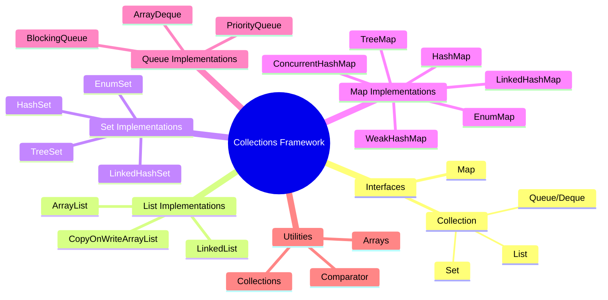

---

## 📊 IERARHIA COMPLETĂ

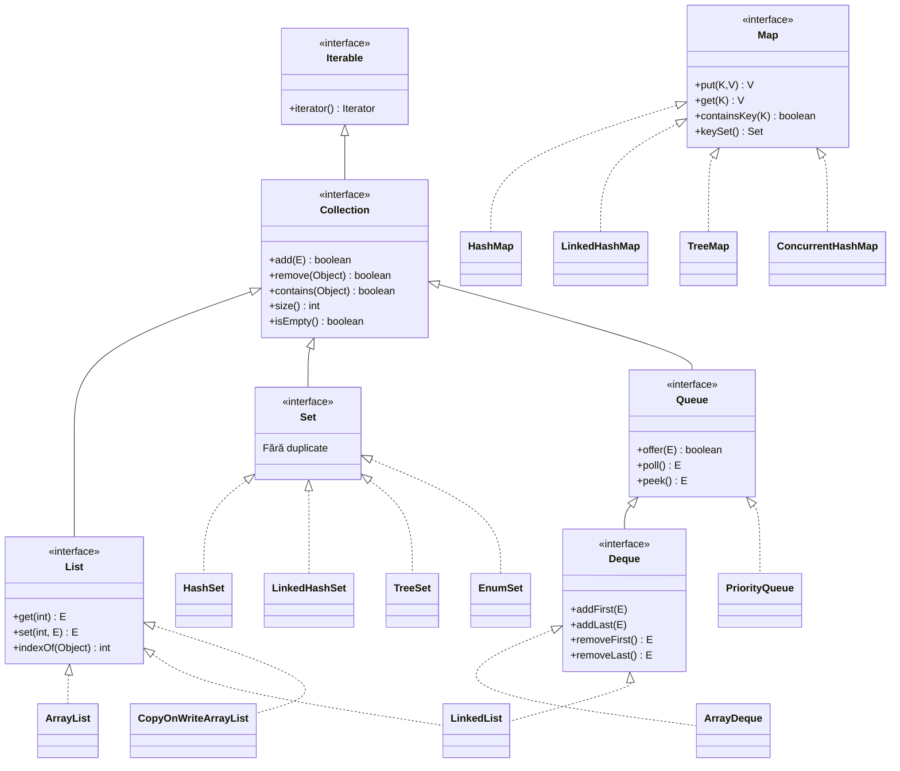

---

# 📦 SECȚIUNEA 1: LIST IMPLEMENTATIONS

## Q124-Q128: ArrayList vs LinkedList

### Structura Internă

```mermaid
graph TB
    subgraph "ArrayList - Array Continuu"
        A[Index 0<br/>Element A] --- B[Index 1<br/>Element B] --- C[Index 2<br/>Element C] --- D[Index 3<br/>Element D]
    end
    
    subgraph "LinkedList - Noduri Înlănțuite"
        N1[◀ prev | A | next ▶] <--> N2[◀ prev | B | next ▶] <--> N3[◀ prev | C | next ▶]
    end
```

### Comparație Vizuală Performanță

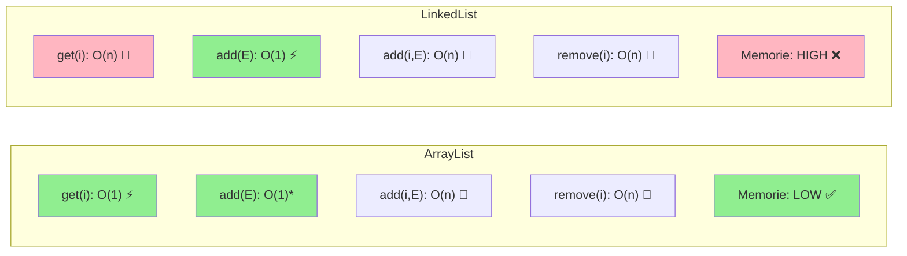

### Tabel Complexitate Completă

| Operație | ArrayList | LinkedList | Câștigător |
|----------|-----------|------------|------------|
| `get(index)` | **O(1)** | O(n) | ArrayList |
| `add(E)` la final | **O(1)** amortizat | O(1) | Egal |
| `add(index, E)` | O(n) | O(n)* | Egal |
| `remove(index)` | O(n) | O(n)* | Egal |
| `contains(E)` | O(n) | O(n) | Egal |
| `iterator.remove()` | O(n) | **O(1)** | LinkedList |
| Memory per element | **~4 bytes** | ~24 bytes | ArrayList |
| Cache locality | **Excelent** | Slab | ArrayList |

> *LinkedList: O(n) pentru a găsi poziția + O(1) pentru operație

### Cod Exemplu

```java
// ✅ ArrayList - alegerea DEFAULT pentru 99% din cazuri
List<String> names = new ArrayList<>();

// ✅ Pre-sizing pentru performanță (evită resize)
List<Order> orders = new ArrayList<>(10_000);

// ❌ LinkedList - RAREORI alegerea corectă
// Folosește DOAR pentru:
// 1. Operații Queue/Deque la capete
// 2. Iterator.remove() frecvent în mijlocul listei
Deque<Task> taskQueue = new LinkedList<>();
```

---

## Q129: ArrayList Resize Mechanism

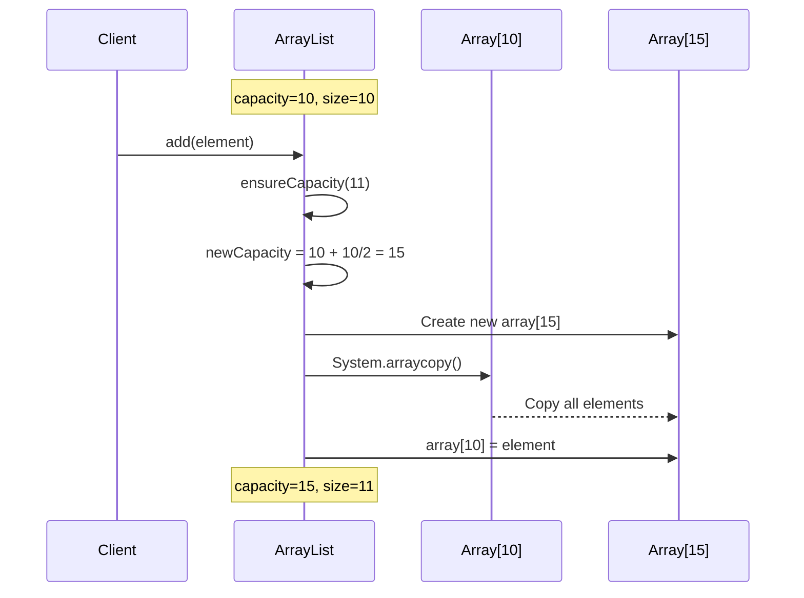

**Formula de creștere:** `newCapacity = oldCapacity + (oldCapacity >> 1)` = **+50%**

---

# 📦 SECȚIUNEA 2: SET IMPLEMENTATIONS

## Q130-Q134: HashSet, LinkedHashSet, TreeSet

### Comparație Vizuală

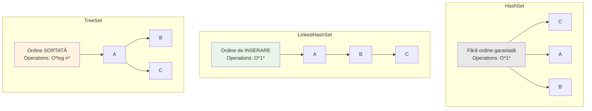

### Structura Internă HashSet

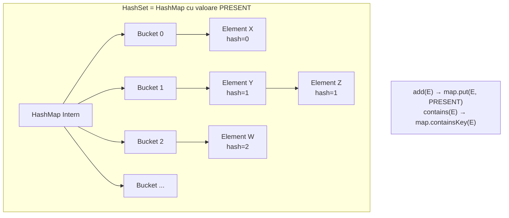

### Cod Exemplu

```java
// HashSet - cel mai rapid, fără ordine
Set<String> emails = new HashSet<>();
emails.add("z@test.com");
emails.add("a@test.com");
emails.add("m@test.com");
// Iterare: ordine IMPREVIZIBILĂ

// LinkedHashSet - păstrează ordinea inserării
Set<String> orderedTags = new LinkedHashSet<>();
orderedTags.add("java");
orderedTags.add("spring");
orderedTags.add("boot");
// Iterare: java → spring → boot (ordine inserare)

// TreeSet - sortat automat
Set<String> sortedNames = new TreeSet<>();
sortedNames.add("Charlie");
sortedNames.add("Alice");
sortedNames.add("Bob");
// Iterare: Alice → Bob → Charlie (ordine alfabetică)

// TreeSet cu Comparator custom
Set<Person> byAge = new TreeSet<>(
    Comparator.comparingInt(Person::getAge)
);

// EnumSet - SUPER eficient pentru enum-uri (bit vector)
enum Permission { READ, WRITE, DELETE, ADMIN }
Set<Permission> perms = EnumSet.of(Permission.READ, Permission.WRITE);
```

---

# 📦 SECȚIUNEA 3: MAP IMPLEMENTATIONS

## Q136-Q144: HashMap Deep Dive

### Structura Internă HashMap (Java 8+)

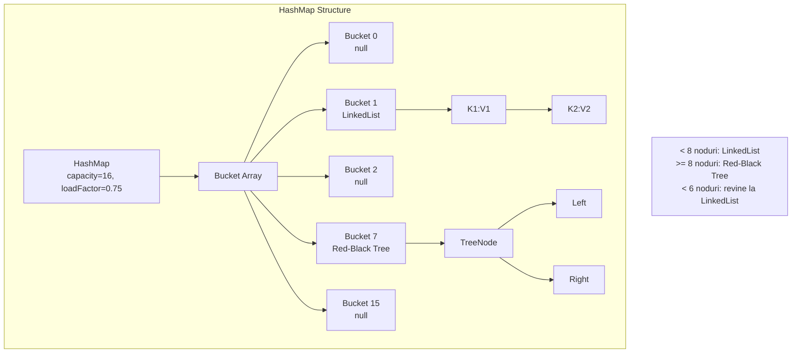

### Flux Put Operation

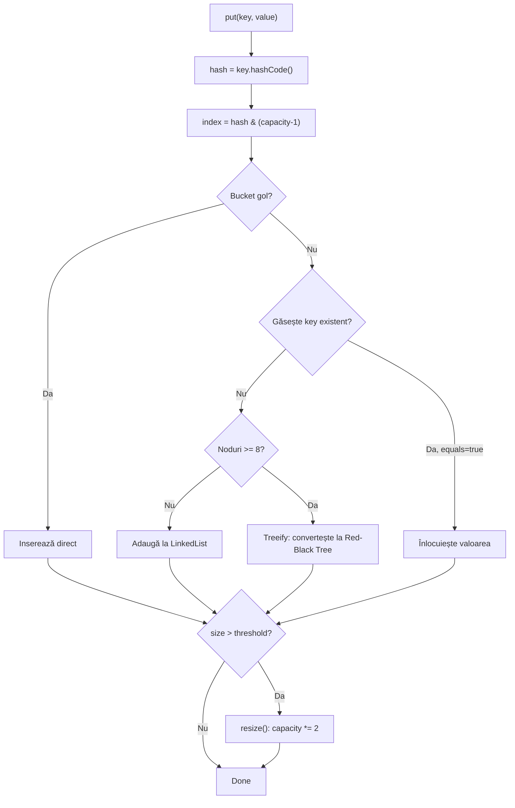

### Load Factor și Rehashing

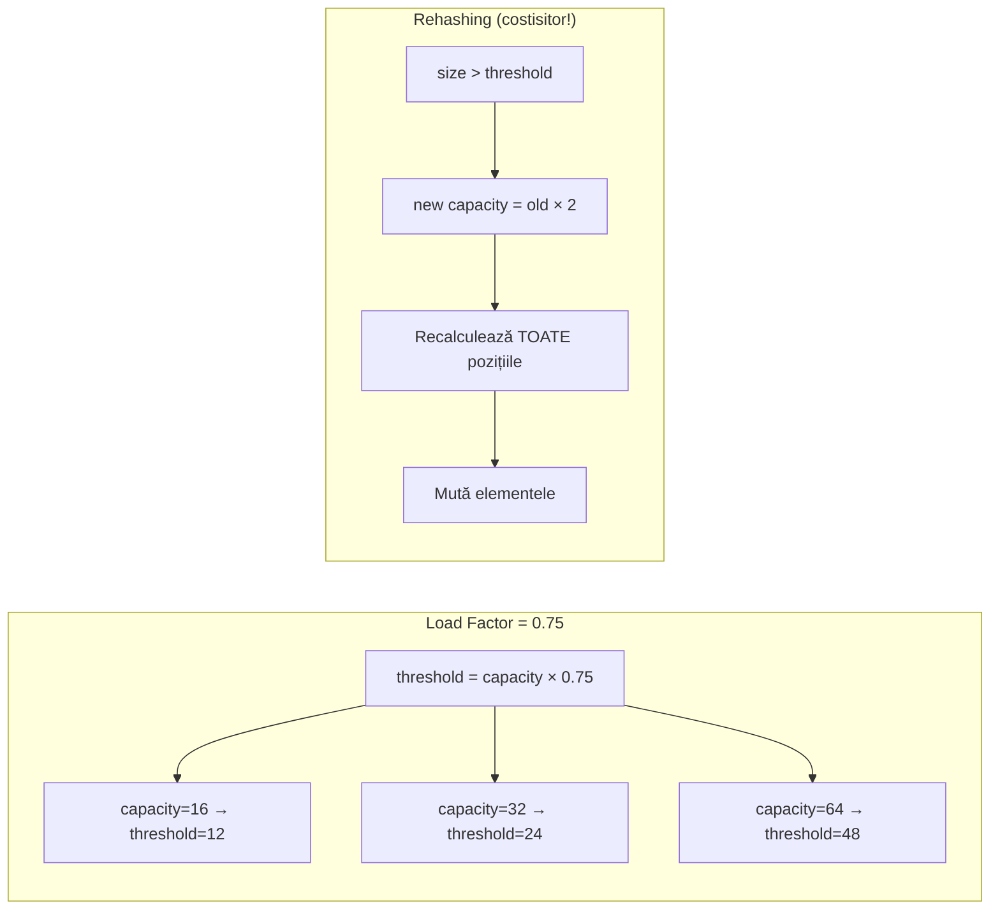

### Cod Exemplu

```java
// HashMap standard
Map<String, User> userMap = new HashMap<>();

// ✅ Pre-sizing pentru a evita rehashing
int expectedSize = 10_000;
Map<String, Order> orders = new HashMap<>(
    (int) (expectedSize / 0.75) + 1
);

// LinkedHashMap - păstrează ordinea inserării
Map<String, Integer> accessOrder = new LinkedHashMap<>(16, 0.75f, true);
// true = access order (pentru LRU cache)

// TreeMap - chei sortate
Map<String, Integer> sorted = new TreeMap<>();
sorted.put("banana", 2);
sorted.put("apple", 1);
sorted.put("cherry", 3);
// Iterare: apple → banana → cherry
```

---

## Q143-Q144: ConcurrentHashMap vs Synchronized

### Comparație Blocking

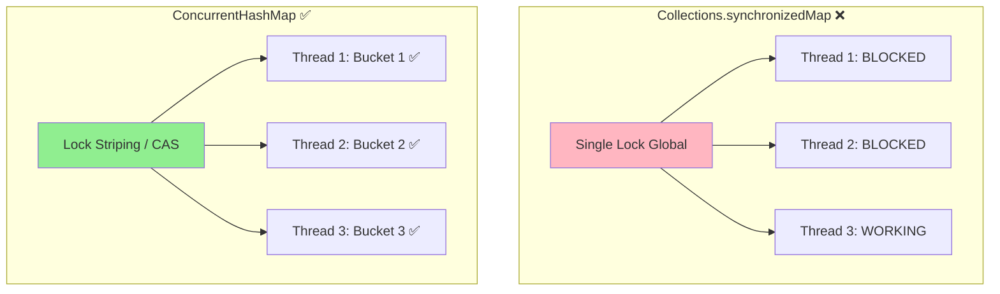

### Operații Atomice ConcurrentHashMap

```java
ConcurrentHashMap<String, Long> counters = new ConcurrentHashMap<>();

// ✅ Atomic compute
counters.computeIfAbsent("views", k -> 0L);
counters.computeIfPresent("views", (k, v) -> v + 1);
counters.merge("views", 1L, Long::sum);

// ⚠️ ConcurrentHashMap NU permite null!
// counters.put("key", null); // NullPointerException!

// Pattern: Counter atomic
counters.compute("pageHits", (k, v) -> v == null ? 1 : v + 1);
```

---

# 📦 SECȚIUNEA 4: QUEUE & DEQUE

## Q148-Q151: Cozi și Stive

### Tipuri de Queue

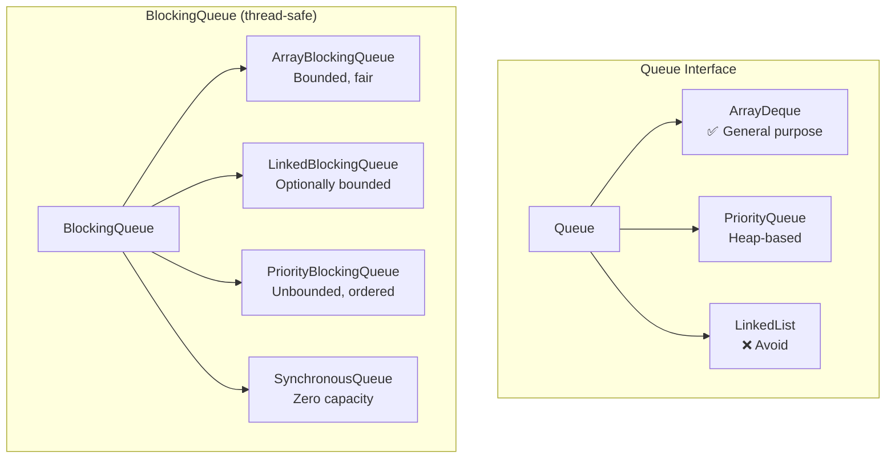

### ArrayDeque ca Stack și Queue

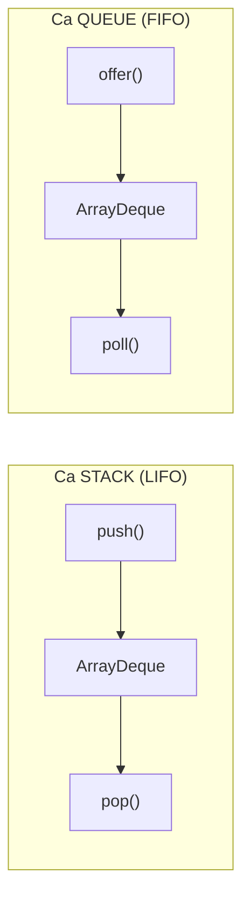

```java
// ✅ ArrayDeque - înlocuiește Stack și LinkedList
Deque<String> stack = new ArrayDeque<>();
stack.push("first");
stack.push("second");
stack.pop(); // "second" (LIFO)

Deque<String> queue = new ArrayDeque<>();
queue.offer("first");
queue.offer("second");
queue.poll(); // "first" (FIFO)

// PriorityQueue - MIN heap by default
PriorityQueue<Integer> minHeap = new PriorityQueue<>();
minHeap.offer(3);
minHeap.offer(1);
minHeap.offer(2);
minHeap.poll(); // 1 (cel mai mic)

// MAX heap
PriorityQueue<Integer> maxHeap = new PriorityQueue<>(
    Comparator.reverseOrder()
);
```

---

# 📦 SECȚIUNEA 5: ITERATORI ȘI FAIL-FAST

## Q152-Q154: Fail-Fast vs Fail-Safe

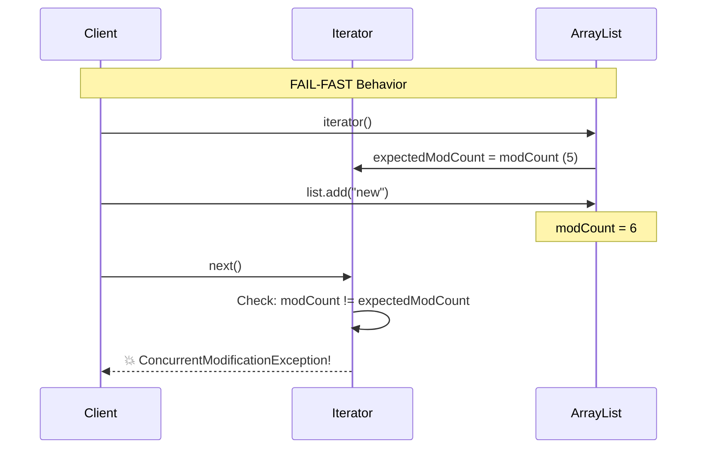

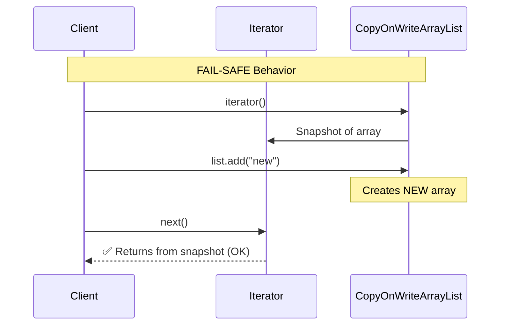

### Cod Exemplu

```java
// ❌ ConcurrentModificationException
List<String> list = new ArrayList<>(List.of("a", "b", "c"));
for (String s : list) {
    if (s.equals("b")) {
        list.remove(s); // 💥 BOOM!
    }
}

// ✅ Soluția 1: Iterator.remove()
Iterator<String> it = list.iterator();
while (it.hasNext()) {
    if (it.next().equals("b")) {
        it.remove(); // ✅ Safe
    }
}

// ✅ Soluția 2: removeIf() (Java 8+)
list.removeIf(s -> s.equals("b"));

// ✅ Soluția 3: CopyOnWriteArrayList (pentru concurrency)
List<String> cowList = new CopyOnWriteArrayList<>();
// Safe pentru iterare cu modificări concurente
// DAR: costisitor pentru multe scrieri
```

---

# 📦 SECȚIUNEA 6: COLECȚII IMUTABILE

## Q156-Q159: Immutable Collections

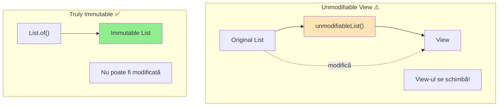

```java
// ⚠️ Unmodifiable ≠ Immutable
List<String> original = new ArrayList<>();
original.add("a");
List<String> unmodifiable = Collections.unmodifiableList(original);
original.add("b"); // ⚠️ Modifică și view-ul!
System.out.println(unmodifiable); // [a, b]

// ✅ Truly Immutable (Java 9+)
List<String> immutable = List.of("a", "b", "c");
Set<Integer> immutableSet = Set.of(1, 2, 3);
Map<String, Integer> immutableMap = Map.of(
    "one", 1,
    "two", 2,
    "three", 3
);

// ⚠️ Null NU e permis în List.of(), Set.of(), Map.of()
// List.of("a", null); // NullPointerException!
```

---

# 📦 SECȚIUNEA 7: ALEGEREA CORECTĂ

## Decision Tree pentru Alegerea Colecției

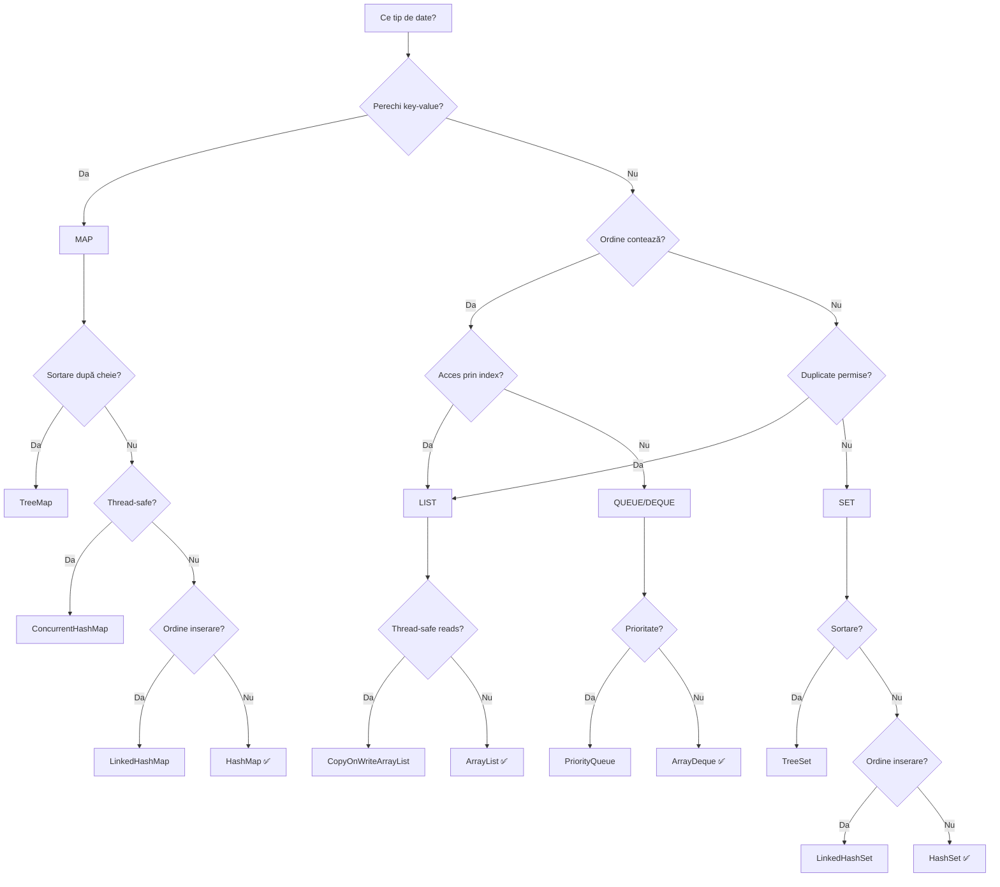

---

# 🎯 COMPLEXITY CHEAT SHEET

| Colecție | add | remove | get | contains | Notă |
|----------|-----|--------|-----|----------|------|
| **ArrayList** | O(1)* | O(n) | **O(1)** | O(n) | Default pentru List |
| **LinkedList** | O(1) | O(1)† | O(n) | O(n) | Evită în general |
| **HashSet** | O(1) | O(1) | - | **O(1)** | Default pentru Set |
| **TreeSet** | O(log n) | O(log n) | - | O(log n) | Când ai nevoie de sortare |
| **HashMap** | O(1) | O(1) | **O(1)** | O(1) | Default pentru Map |
| **TreeMap** | O(log n) | O(log n) | O(log n) | O(log n) | Chei sortate |
| **ArrayDeque** | O(1) | O(1) | - | O(n) | Default pentru Stack/Queue |
| **PriorityQueue** | O(log n) | O(log n) | O(1)‡ | O(n) | Heap |

*Amortizat †La poziția iteratorului ‡Doar peek()

---

# 🎯 ANTI-PATTERNS DE EVITAT

```java
// ❌ Anti-pattern 1: contains() pe List în loop
for (Order order : orders) {
    if (validIds.contains(order.getId())) { // O(n²)!
        process(order);
    }
}

// ✅ Fix: Folosește Set pentru lookup
Set<Long> validIdSet = new HashSet<>(validIds); // O(n)
for (Order order : orders) {
    if (validIdSet.contains(order.getId())) { // O(1)
        process(order);
    }
}

// ❌ Anti-pattern 2: Nested loops pentru join
for (User u : users) {
    for (Order o : orders) {
        if (o.getUserId().equals(u.getId())) { // O(n×m)
            // ...
        }
    }
}

// ✅ Fix: Indexează cu Map
Map<Long, List<Order>> ordersByUser = orders.stream()
    .collect(Collectors.groupingBy(Order::getUserId)); // O(n+m)

for (User u : users) {
    List<Order> userOrders = ordersByUser.get(u.getId());
}
```

---

> 💡 **Regula de Aur:**  
> *"Alege colecția pe baza pattern-ului de ACCES dominant, nu pe baza dimensiunii datelor."*
