# Capitolul 3 – Concurrency & Multithreading (VERSIUNE EXTINSĂ)
## Q181–Q260 — Nivel Senior

> 📚 **Scop:** Interviuri Senior / Lead / Staff  
> 🎯 **Focus:** Thread Safety, Sincronizare, Java Memory Model  
> 💾 **Encoding:** UTF-8

---

## 🎯 HARTA MENTALĂ CONCURRENCY

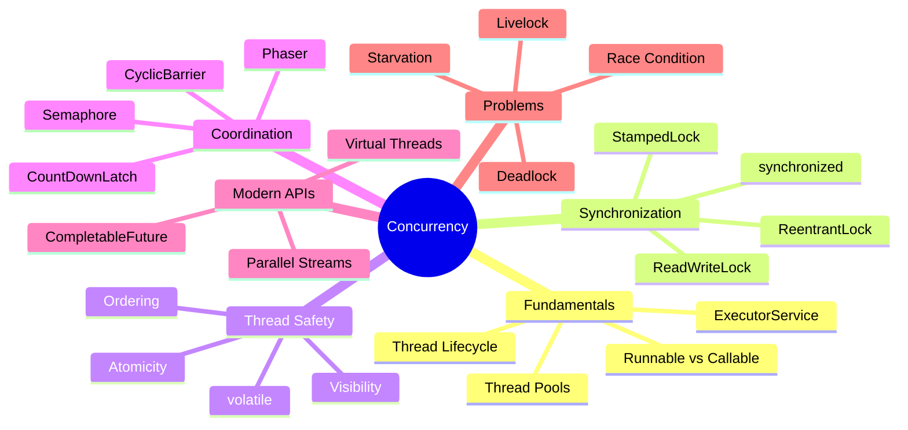

---

# 📦 SECȚIUNEA 1: FUNDAMENTELE THREAD-URILOR

## Q181-Q185: Thread Basics

### Thread Lifecycle

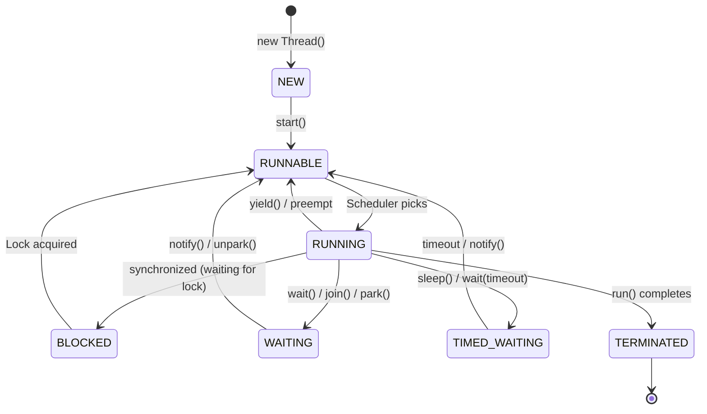

### Thread Creation Patterns

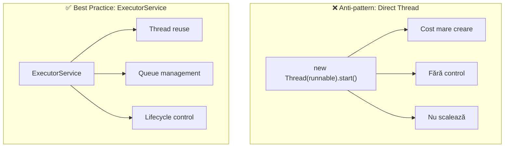

### Runnable vs Callable

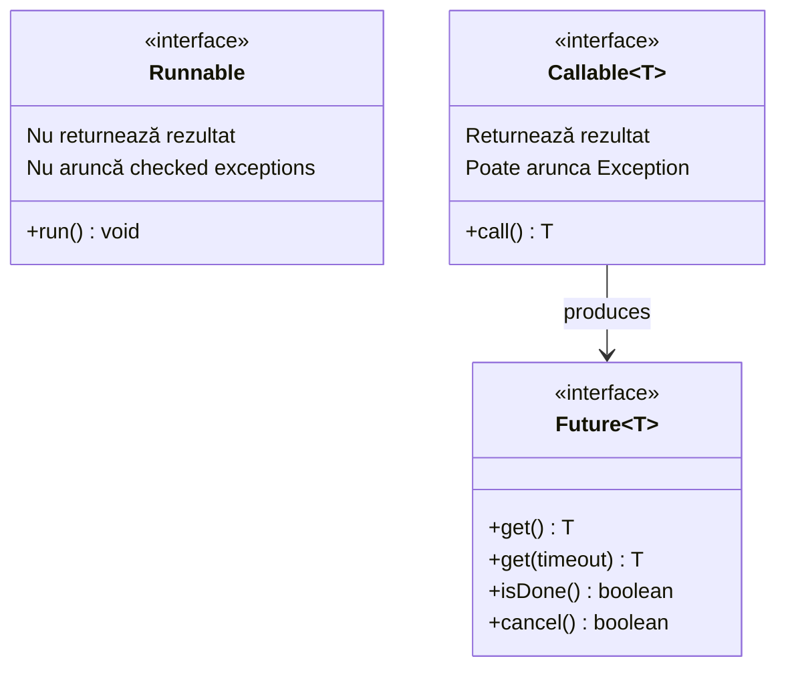

```java
// Runnable - fără rezultat
Runnable task = () -> System.out.println("Running");

// Callable - cu rezultat
Callable<Integer> callable = () -> {
    Thread.sleep(1000);
    return 42;
};

ExecutorService executor = Executors.newFixedThreadPool(4);
Future<Integer> future = executor.submit(callable);
Integer result = future.get(); // Blocking!
```

---

## Q187-Q190: Thread Pools

### Tipuri de Thread Pools

```mermaid
graph TB
    subgraph "Fixed Thread Pool"
        FTP["newFixedThreadPool(n)"]
        FTP --> F1["Exact n threads"]
        FTP --> F2["Unbounded queue"]
        FTP --> F3["Best for: CPU-bound tasks"]
    end
    
    subgraph "Cached Thread Pool"
        CTP["newCachedThreadPool()"]
        CTP --> C1["0 to ∞ threads"]
        CTP --> C2["60s keep-alive"]
        CTP --> C3["Best for: Short async tasks"]
    end
    
    subgraph "Single Thread Executor"
        STE["newSingleThreadExecutor()"]
        STE --> S1["Exactly 1 thread"]
        STE --> S2["Sequential execution"]
        STE --> S3["Best for: Event loop"]
    end
    
    subgraph "Scheduled Thread Pool"
        SCTP["newScheduledThreadPool(n)"]
        SCTP --> SC1["Delayed execution"]
        SCTP --> SC2["Periodic tasks"]
        SCTP --> SC3["Best for: Timers, cron"]
    end
    
    subgraph "Work Stealing Pool"
        WSP["newWorkStealingPool()"]
        WSP --> W1["ForkJoinPool based"]
        WSP --> W2["Work stealing algorithm"]
        WSP --> W3["Best for: Recursive tasks"]
    end
```

### Configurare ThreadPoolExecutor

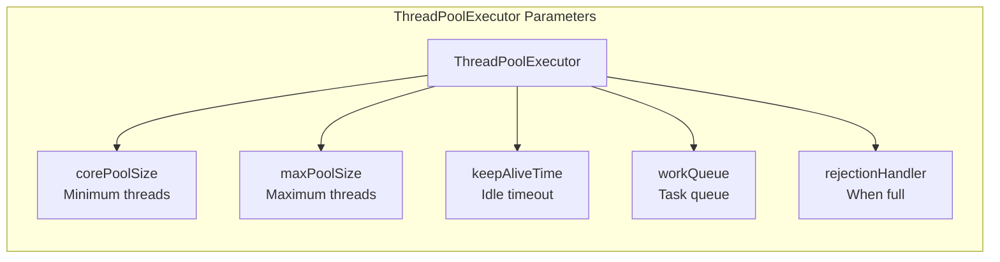

```java
// Custom ThreadPoolExecutor
ThreadPoolExecutor executor = new ThreadPoolExecutor(
    4,                      // corePoolSize
    8,                      // maxPoolSize
    60L, TimeUnit.SECONDS,  // keepAliveTime
    new ArrayBlockingQueue<>(100),  // bounded queue
    new ThreadPoolExecutor.CallerRunsPolicy() // rejection policy
);

// Rejection Policies:
// - AbortPolicy: throw RejectedExecutionException (default)
// - CallerRunsPolicy: caller thread executes task
// - DiscardPolicy: silently discard
// - DiscardOldestPolicy: discard oldest, retry
```

---

# 📦 SECȚIUNEA 2: SINCRONIZARE

## Q191-Q200: Race Conditions și Locks

### Race Condition Visualization

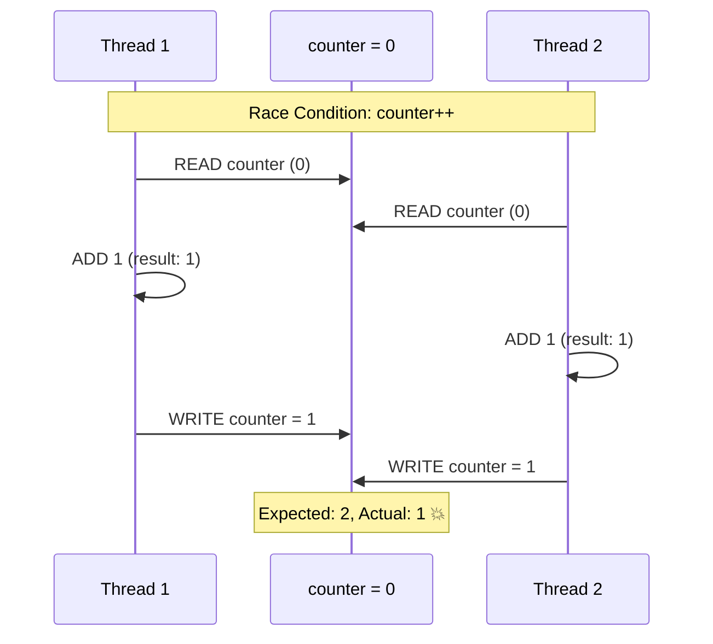

### synchronized Keyword

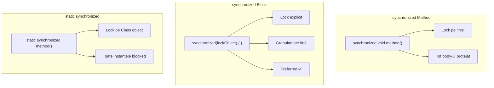

```java
public class Counter {
    private int count = 0;
    private final Object lock = new Object();
    
    // ❌ Synchronized pe metodă - lock pe 'this'
    public synchronized void incrementBad() {
        count++;
    }
    
    // ✅ Synchronized block - granularitate fină
    public void increment() {
        synchronized (lock) {
            count++;
        }
    }
    
    // ✅ Sau folosește AtomicInteger
    private final AtomicInteger atomicCount = new AtomicInteger(0);
    
    public void incrementAtomic() {
        atomicCount.incrementAndGet(); // Lock-free!
    }
}
```

---

## Q196-Q199: Deadlock, Livelock, Starvation

### Deadlock - Cele 4 Condiții Coffman

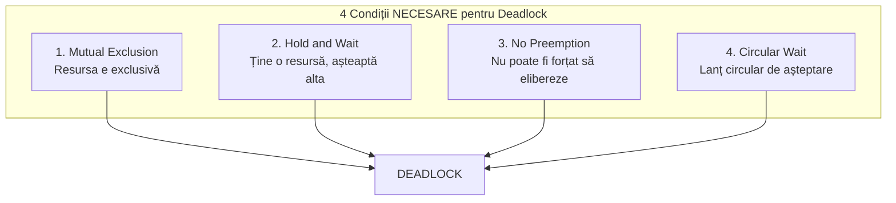

### Deadlock Example

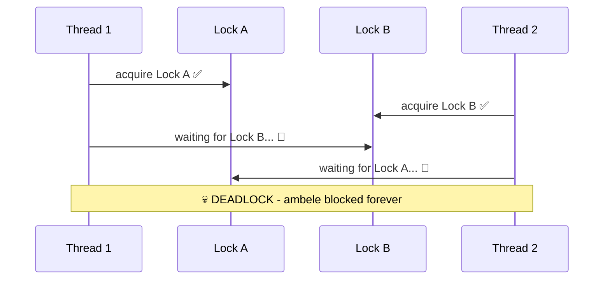

```java
// ❌ Deadlock prone
public void transfer(Account from, Account to, int amount) {
    synchronized (from) {  // Lock 1
        synchronized (to) { // Lock 2 - ordine diferită = deadlock!
            from.debit(amount);
            to.credit(amount);
        }
    }
}

// ✅ Fix: Ordine consistentă a lock-urilor
public void transferSafe(Account from, Account to, int amount) {
    Account first = from.getId() < to.getId() ? from : to;
    Account second = from.getId() < to.getId() ? to : from;
    
    synchronized (first) {
        synchronized (second) {
            from.debit(amount);
            to.credit(amount);
        }
    }
}
```

### Livelock vs Starvation

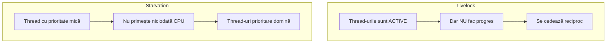

---

# 📦 SECȚIUNEA 3: JAVA MEMORY MODEL

## Q201-Q203: volatile și happens-before

### Java Memory Model

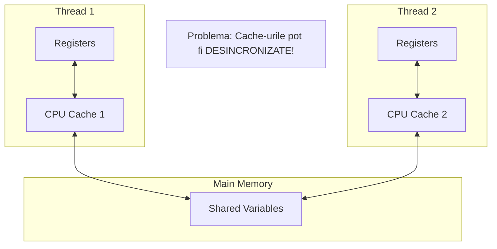

### volatile Guarantees

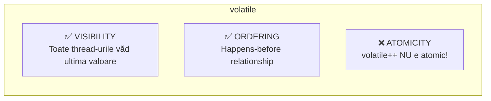

```java
// ❌ Visibility problem fără volatile
class BrokenVisibility {
    private boolean running = true; // Cache-uit local!
    
    public void stop() { running = false; }
    
    public void run() {
        while (running) { // Poate să nu vadă niciodată false!
            // ...
        }
    }
}

// ✅ Cu volatile - visibility garantată
class FixedVisibility {
    private volatile boolean running = true;
    
    public void stop() { running = false; } // Scrie în main memory
    
    public void run() {
        while (running) { // Citește din main memory
            // ...
        }
    }
}

// ⚠️ volatile NU garantează atomicitate!
private volatile int counter = 0;
counter++; // NU E ATOMIC! (read-modify-write)
// Folosește AtomicInteger pentru operații atomice
```

### Happens-Before Relationships

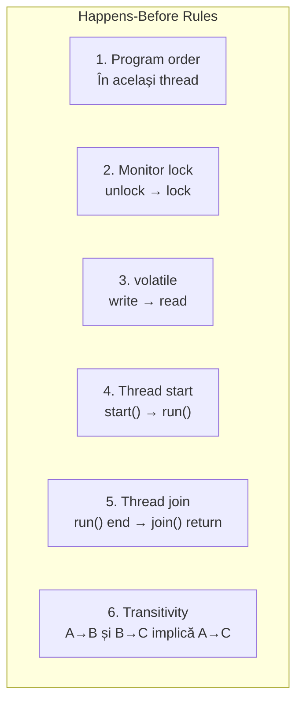

---

# 📦 SECȚIUNEA 4: LOCK-URI AVANSATE

## Q207-Q210: ReentrantLock și variante

### Lock Types Comparison

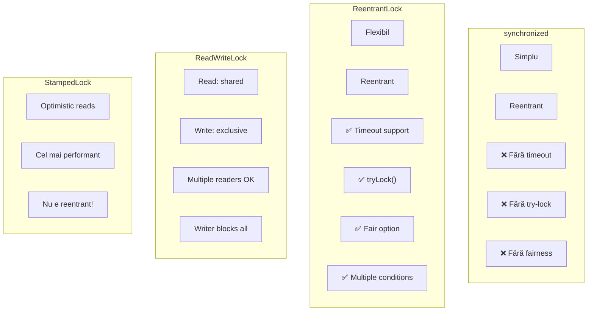

```java
// ReentrantLock usage
private final ReentrantLock lock = new ReentrantLock(true); // fair=true

public void safeMethod() {
    lock.lock();
    try {
        // critical section
    } finally {
        lock.unlock(); // ÎNTOTDEAUNA în finally!
    }
}

// tryLock cu timeout
public boolean tryOperation() {
    try {
        if (lock.tryLock(1, TimeUnit.SECONDS)) {
            try {
                // operație
                return true;
            } finally {
                lock.unlock();
            }
        }
        return false; // Nu am obținut lock-ul
    } catch (InterruptedException e) {
        Thread.currentThread().interrupt();
        return false;
    }
}

// ReadWriteLock pentru read-heavy scenarios
private final ReadWriteLock rwLock = new ReentrantReadWriteLock();
private final Lock readLock = rwLock.readLock();
private final Lock writeLock = rwLock.writeLock();

public Data read() {
    readLock.lock();
    try {
        return data; // Multiple readers simultani
    } finally {
        readLock.unlock();
    }
}

public void write(Data newData) {
    writeLock.lock();
    try {
        data = newData; // Exclusive access
    } finally {
        writeLock.unlock();
    }
}
```

---

# 📦 SECȚIUNEA 5: SYNCHRONIZERS

## Q211-Q213: CountDownLatch, CyclicBarrier, Semaphore

### Synchronizers Comparison

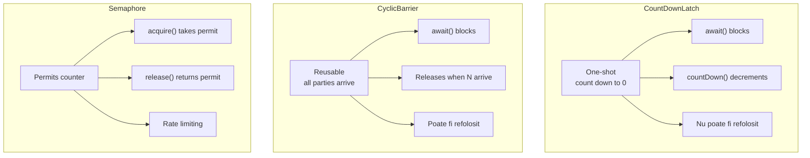

```java
// CountDownLatch - așteptare pentru N evenimente
CountDownLatch latch = new CountDownLatch(3);

// Worker threads
for (int i = 0; i < 3; i++) {
    executor.submit(() -> {
        doWork();
        latch.countDown(); // Decrement
    });
}

latch.await(); // Main thread waits for all 3
System.out.println("All done!");

// CyclicBarrier - sincronizare repetată
CyclicBarrier barrier = new CyclicBarrier(3, () -> {
    System.out.println("All arrived, proceeding!");
});

// Each thread
barrier.await(); // Blocks until 3 threads arrive

// Semaphore - limită de concurrency
Semaphore semaphore = new Semaphore(10); // Max 10 concurrent

public void limitedAccess() {
    try {
        semaphore.acquire();
        // Only 10 threads here at once
        accessResource();
    } finally {
        semaphore.release();
    }
}
```

---

# 📦 SECȚIUNEA 6: COMPLETABLEFUTURE

## Q214-Q215: Async Programming

### CompletableFuture Pipeline

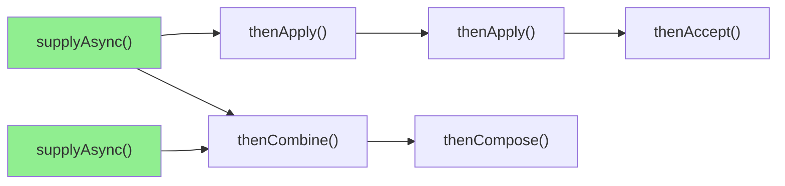

### Composition Methods

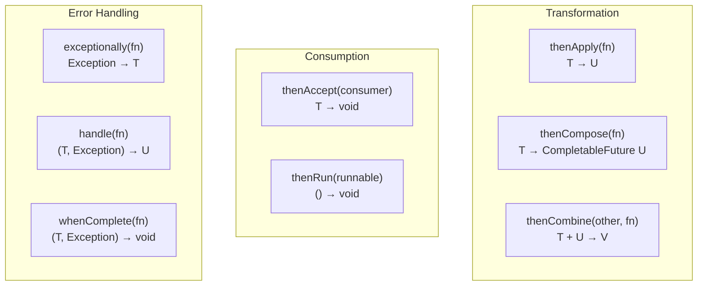

```java
// Pipeline async
CompletableFuture<String> future = CompletableFuture
    .supplyAsync(() -> fetchData())           // Async fetch
    .thenApply(data -> transform(data))       // Transform
    .thenApply(result -> format(result))      // Format
    .exceptionally(ex -> "Error: " + ex);     // Error handling

// Combining futures
CompletableFuture<User> userFuture = fetchUserAsync(userId);
CompletableFuture<List<Order>> ordersFuture = fetchOrdersAsync(userId);

CompletableFuture<UserProfile> profile = userFuture
    .thenCombine(ordersFuture, (user, orders) -> 
        new UserProfile(user, orders)
    );

// Parallel execution cu allOf
CompletableFuture<Void> allDone = CompletableFuture.allOf(
    task1, task2, task3
);
allDone.thenRun(() -> System.out.println("All completed!"));

// anyOf - primul care termină
CompletableFuture<Object> fastest = CompletableFuture.anyOf(
    fetchFromServer1(),
    fetchFromServer2(),
    fetchFromServer3()
);
```

---

# 📦 SECȚIUNEA 7: THREAD SAFETY PATTERNS

## Q218-Q222: Strategii de Thread Safety

### Thread Safety Decision Tree

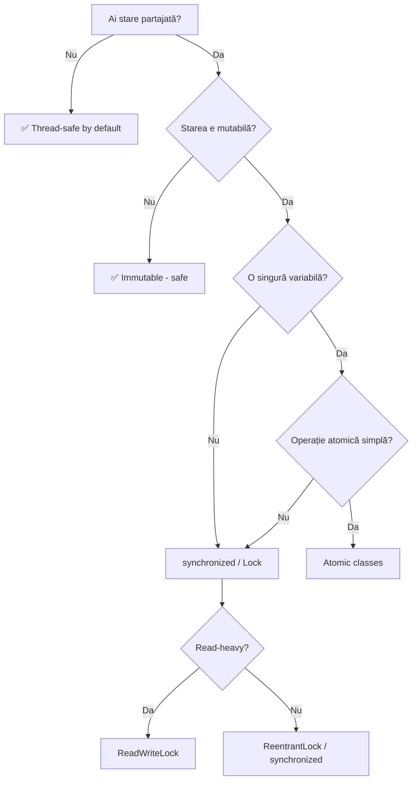

### Thread Safety Strategies

```java
// 1. IMMUTABILITY - cea mai bună strategie
public final class ImmutableUser {
    private final String name;
    private final List<String> roles;
    
    public ImmutableUser(String name, List<String> roles) {
        this.name = name;
        this.roles = List.copyOf(roles); // Defensive copy
    }
    
    public ImmutableUser withName(String newName) {
        return new ImmutableUser(newName, this.roles);
    }
}

// 2. THREAD CONFINEMENT - ThreadLocal
private static final ThreadLocal<DateFormat> dateFormat =
    ThreadLocal.withInitial(() -> new SimpleDateFormat("yyyy-MM-dd"));

public String format(Date date) {
    return dateFormat.get().format(date); // Each thread has its own
}

// 3. ATOMIC CLASSES - pentru contoare simple
private final AtomicLong counter = new AtomicLong();
public long increment() {
    return counter.incrementAndGet();
}

// 4. CONCURRENT COLLECTIONS - pentru colecții partajate
private final ConcurrentHashMap<String, User> cache = new ConcurrentHashMap<>();
public User getOrLoad(String id) {
    return cache.computeIfAbsent(id, this::loadFromDb);
}
```

---

# 🎯 ANTI-PATTERNS & BEST PRACTICES

### Common Mistakes

```java
// ❌ Double-Checked Locking GREȘIT (pre-Java 5)
private static Singleton instance;
public static Singleton getInstance() {
    if (instance == null) {              // Check 1
        synchronized (Singleton.class) {
            if (instance == null) {      // Check 2
                instance = new Singleton(); // NOT SAFE fără volatile!
            }
        }
    }
    return instance;
}

// ✅ Double-Checked Locking CORECT
private static volatile Singleton instance;

// ✅ SAU: Initialization-on-demand holder (preferred)
public class Singleton {
    private Singleton() {}
    
    private static class Holder {
        static final Singleton INSTANCE = new Singleton();
    }
    
    public static Singleton getInstance() {
        return Holder.INSTANCE;
    }
}

// ❌ Synchronized pe String literal
synchronized ("lock") { } // GREȘIT - String pool sharing!

// ✅ Lock object privat
private final Object lock = new Object();
synchronized (lock) { }
```

---

# 🎯 CHEAT SHEET CONCURRENCY

| Problemă | Soluție | Când folosești |
|----------|---------|----------------|
| Counter simplu | `AtomicLong` | Incrementări atomice |
| Flag stop | `volatile boolean` | Un writer, mulți readers |
| Cache thread-safe | `ConcurrentHashMap` | Read-heavy, writes moderate |
| Queue producer-consumer | `BlockingQueue` | Decuplare threads |
| Wait for N tasks | `CountDownLatch` | One-time sync |
| Sync N threads | `CyclicBarrier` | Repeated sync points |
| Limit concurrency | `Semaphore` | Resource pooling |
| Async pipeline | `CompletableFuture` | Non-blocking composition |
| Read-heavy data | `ReadWriteLock` | Mulți readers, puțini writers |

---

> 💡 **Regula de Aur Concurrency:**  
> *"Evită starea partajată dacă poți. Dacă nu poți, fă-o IMMUTABLE. Dacă nu poți, SINCRONIZEAZĂ corect."*
