# Capitolul 7 – Spring MVC & REST
## Q501–Q580 — Nivel Senior

> 📚 Scop: Interviuri Senior / Lead / Staff
> 💾 Encoding: UTF-8

---

## 🎯 HARTA MENTALĂ


---

# 📦 SECȚIUNEA 1: SPRING MVC ARCHITECTURE

## Q501-503: DispatcherServlet și Request Flow


**DispatcherServlet** = Front Controller - punct unic de intrare pentru toate request-urile HTTP.

```java
// Flow-ul intern simplificat:
// 1. DispatcherServlet primește request-ul
// 2. HandlerMapping găsește controller-ul potrivit
// 3. HandlerAdapter invocă metoda controller-ului
// 4. Controller returnează date
// 5. HttpMessageConverter convertește în JSON/XML
// 6. Response trimis clientului
```

---

## Q504-505: HandlerMapping și HandlerAdapter


---

## Q506-507: @Controller vs @RestController

```mermaid
graph TB
    subgraph "@Controller"
        C1["@Controller"]
        C1 --> V1["Returnează View name"]
        C1 --> V2["Model pentru template"]
        C1 --> V3["Thymeleaf/JSP"]
    end
    
    subgraph "@RestController"
        RC["@RestController<br/>= @Controller + @ResponseBody"]
        RC --> J1["Returnează Object"]
        RC --> J2["Serializat ca JSON/XML"]
        RC --> J3["REST APIs"]
    end
```



```java
// @Controller - pentru aplicații web cu views
@Controller
@RequestMapping("/web/users")
public class UserWebController {
    
    @GetMapping
    public String listUsers(Model model) {
        model.addAttribute("users", userService.findAll());
        return "users/list";  // View name: templates/users/list.html
    }
    
    @GetMapping("/{id}")
    public String viewUser(@PathVariable Long id, Model model) {
        model.addAttribute("user", userService.findById(id));
        return "users/view";
    }
}

// @RestController - pentru REST APIs
@RestController
@RequestMapping("/api/users")
public class UserApiController {
    
    private final UserService userService;
    
    public UserApiController(UserService userService) {
        this.userService = userService;
    }
    
    @GetMapping
    public List<UserDto> listUsers() {
        return userService.findAll();  // Serializat automat ca JSON
    }
    
    @GetMapping("/{id}")
    public UserDto getUser(@PathVariable Long id) {
        return userService.findById(id)
            .orElseThrow(() -> new UserNotFoundException(id));
    }
}
```

---

# 📦 SECȚIUNEA 2: REQUEST MAPPING

## Q508-509: @RequestMapping și Specializări


```java
@RestController
@RequestMapping("/api/v1/orders")
public class OrderController {
    
    // GET /api/v1/orders
    @GetMapping
    public List<OrderDto> findAll() { }
    
    // GET /api/v1/orders/123
    @GetMapping("/{id}")
    public OrderDto findById(@PathVariable Long id) { }
    
    // GET /api/v1/orders?status=PENDING&page=0&size=10
    @GetMapping(params = "status")
    public Page<OrderDto> findByStatus(
            @RequestParam OrderStatus status,
            Pageable pageable) { }
    
    // POST /api/v1/orders
    @PostMapping
    @ResponseStatus(HttpStatus.CREATED)
    public OrderDto create(@Valid @RequestBody CreateOrderRequest request) { }
    
    // PUT /api/v1/orders/123
    @PutMapping("/{id}")
    public OrderDto update(
            @PathVariable Long id,
            @Valid @RequestBody UpdateOrderRequest request) { }
    
    // PATCH /api/v1/orders/123
    @PatchMapping("/{id}")
    public OrderDto partialUpdate(
            @PathVariable Long id,
            @RequestBody Map<String, Object> updates) { }
    
    // DELETE /api/v1/orders/123
    @DeleteMapping("/{id}")
    @ResponseStatus(HttpStatus.NO_CONTENT)
    public void delete(@PathVariable Long id) { }
}
```

---

## Q516-518: @PathVariable vs @RequestParam


```java
@RestController
@RequestMapping("/api")
public class SearchController {
    
    // Path variable - identifică resursa
    // GET /api/users/123
    @GetMapping("/users/{id}")
    public UserDto getUser(@PathVariable Long id) { }
    
    // Multiple path variables
    // GET /api/users/123/orders/456
    @GetMapping("/users/{userId}/orders/{orderId}")
    public OrderDto getUserOrder(
            @PathVariable Long userId,
            @PathVariable Long orderId) { }
    
    // Request params - filtrare, paginare
    // GET /api/users?status=ACTIVE&role=ADMIN
    @GetMapping("/users")
    public List<UserDto> findUsers(
            @RequestParam(required = false) UserStatus status,
            @RequestParam(defaultValue = "USER") String role) { }
    
    // Paginare cu Spring Data
    // GET /api/orders?page=0&size=20&sort=createdAt,desc
    @GetMapping("/orders")
    public Page<OrderDto> findOrders(
            @RequestParam(required = false) OrderStatus status,
            Pageable pageable) { }  // Auto-bound from query params
}
```

---

## Q514-515: @RequestBody și @ResponseBody


```java
@RestController
@RequestMapping("/api/users")
public class UserController {
    
    // @RequestBody - deserializare JSON → Object
    @PostMapping
    public ResponseEntity<UserDto> createUser(
            @Valid @RequestBody CreateUserRequest request) {
        
        User user = userService.create(request);
        UserDto dto = mapper.toDto(user);
        
        URI location = URI.create("/api/users/" + user.getId());
        return ResponseEntity.created(location).body(dto);
    }
    
    // Request body example:
    // {
    //   "email": "user@example.com",
    //   "password": "secret123",
    //   "name": "John Doe"
    // }
}

// DTO with validation
public record CreateUserRequest(
    @NotBlank @Email String email,
    @NotBlank @Size(min = 8) String password,
    @NotBlank String name
) {}
```

---

## Q519-520: @RequestHeader și @CookieValue

```java
@RestController
@RequestMapping("/api")
public class HeaderController {
    
    // Acces la headers
    @GetMapping("/info")
    public Map<String, String> getInfo(
            @RequestHeader("User-Agent") String userAgent,
            @RequestHeader(value = "X-Request-Id", required = false) String requestId,
            @RequestHeader HttpHeaders headers) {  // Toate headers
        
        return Map.of(
            "userAgent", userAgent,
            "requestId", requestId != null ? requestId : "N/A",
            "host", headers.getHost().toString()
        );
    }
    
    // Acces la cookies
    @GetMapping("/session")
    public String getSession(
            @CookieValue(value = "sessionId", required = false) String sessionId) {
        return sessionId != null ? "Session: " + sessionId : "No session";
    }
}
```

---

# 📦 SECȚIUNEA 3: VALIDATION

## Q523-527: Bean Validation


```java
// Request DTO cu validare
public record CreateOrderRequest(
    @NotNull(message = "Customer ID is required")
    Long customerId,
    
    @NotEmpty(message = "Order must have at least one item")
    @Size(max = 100, message = "Maximum 100 items per order")
    List<@Valid OrderItemRequest> items,
    
    @Size(max = 500, message = "Notes cannot exceed 500 characters")
    String notes
) {}

public record OrderItemRequest(
    @NotNull Long productId,
    
    @NotNull
    @Min(value = 1, message = "Quantity must be at least 1")
    @Max(value = 999, message = "Quantity cannot exceed 999")
    Integer quantity
) {}

// Controller cu validare
@RestController
@RequestMapping("/api/orders")
public class OrderController {
    
    @PostMapping
    public ResponseEntity<OrderDto> create(
            @Valid @RequestBody CreateOrderRequest request) {
        // Dacă validarea eșuează, MethodArgumentNotValidException
        // Este aruncată ÎNAINTE de a intra în metodă
        Order order = orderService.create(request);
        return ResponseEntity.status(HttpStatus.CREATED).body(toDto(order));
    }
}

// Custom validator
@Target({ElementType.FIELD})
@Retention(RetentionPolicy.RUNTIME)
@Constraint(validatedBy = PhoneNumberValidator.class)
public @interface ValidPhoneNumber {
    String message() default "Invalid phone number";
    Class<?>[] groups() default {};
    Class<? extends Payload>[] payload() default {};
}

public class PhoneNumberValidator implements ConstraintValidator<ValidPhoneNumber, String> {
    
    private static final Pattern PHONE_PATTERN = 
        Pattern.compile("^\\+?[1-9]\\d{1,14}$");
    
    @Override
    public boolean isValid(String value, ConstraintValidatorContext context) {
        if (value == null) return true;  // @NotNull handles null
        return PHONE_PATTERN.matcher(value).matches();
    }
}
```

---

# 📦 SECȚIUNEA 4: ERROR HANDLING

## Q528-530: @ExceptionHandler și @ControllerAdvice


```java
// Global Exception Handler
@RestControllerAdvice
@Slf4j
public class GlobalExceptionHandler {
    
    // Entity not found
    @ExceptionHandler(EntityNotFoundException.class)
    @ResponseStatus(HttpStatus.NOT_FOUND)
    public ProblemDetail handleNotFound(EntityNotFoundException ex) {
        log.warn("Entity not found: {}", ex.getMessage());
        
        ProblemDetail problem = ProblemDetail.forStatus(HttpStatus.NOT_FOUND);
        problem.setTitle("Resource Not Found");
        problem.setDetail(ex.getMessage());
        return problem;
    }
    
    // Validation errors
    @ExceptionHandler(MethodArgumentNotValidException.class)
    @ResponseStatus(HttpStatus.BAD_REQUEST)
    public ProblemDetail handleValidation(MethodArgumentNotValidException ex) {
        ProblemDetail problem = ProblemDetail.forStatus(HttpStatus.BAD_REQUEST);
        problem.setTitle("Validation Failed");
        
        Map<String, String> errors = new HashMap<>();
        ex.getBindingResult().getFieldErrors().forEach(error -> 
            errors.put(error.getField(), error.getDefaultMessage())
        );
        problem.setProperty("errors", errors);
        
        return problem;
    }
    
    // Business logic errors
    @ExceptionHandler(BusinessException.class)
    @ResponseStatus(HttpStatus.UNPROCESSABLE_ENTITY)
    public ProblemDetail handleBusiness(BusinessException ex) {
        ProblemDetail problem = ProblemDetail.forStatus(HttpStatus.UNPROCESSABLE_ENTITY);
        problem.setTitle("Business Rule Violation");
        problem.setDetail(ex.getMessage());
        problem.setProperty("errorCode", ex.getErrorCode());
        return problem;
    }
    
    // Catch-all
    @ExceptionHandler(Exception.class)
    @ResponseStatus(HttpStatus.INTERNAL_SERVER_ERROR)
    public ProblemDetail handleGeneric(Exception ex) {
        log.error("Unexpected error", ex);
        
        ProblemDetail problem = ProblemDetail.forStatus(HttpStatus.INTERNAL_SERVER_ERROR);
        problem.setTitle("Internal Server Error");
        problem.setDetail("An unexpected error occurred");
        return problem;
    }
}
```

---

## Q572-573: RFC 7807 Problem Details (Spring 6+)


```java
// Response example:
// {
//   "type": "https://api.example.com/errors/validation",
//   "title": "Validation Failed",
//   "status": 400,
//   "detail": "Request body contains invalid fields",
//   "instance": "/api/users",
//   "errors": {
//     "email": "must be a valid email address",
//     "password": "size must be between 8 and 100"
//   }
// }

@ExceptionHandler(MethodArgumentNotValidException.class)
public ProblemDetail handleValidation(
        MethodArgumentNotValidException ex, 
        WebRequest request) {
    
    ProblemDetail problem = ProblemDetail.forStatus(HttpStatus.BAD_REQUEST);
    problem.setType(URI.create("https://api.example.com/errors/validation"));
    problem.setTitle("Validation Failed");
    problem.setDetail("Request body contains invalid fields");
    problem.setInstance(URI.create(request.getDescription(false)));
    
    Map<String, String> errors = ex.getBindingResult().getFieldErrors().stream()
        .collect(Collectors.toMap(
            FieldError::getField,
            FieldError::getDefaultMessage,
            (e1, e2) -> e1
        ));
    problem.setProperty("errors", errors);
    
    return problem;
}
```

---

# 📦 SECȚIUNEA 5: RESPONSE ENTITY

## Q531-534: ResponseEntity Control


```java
@RestController
@RequestMapping("/api/users")
public class UserController {
    
    // 201 Created cu Location header
    @PostMapping
    public ResponseEntity<UserDto> create(@Valid @RequestBody CreateUserRequest req) {
        User user = userService.create(req);
        
        URI location = ServletUriComponentsBuilder
            .fromCurrentRequest()
            .path("/{id}")
            .buildAndExpand(user.getId())
            .toUri();
        
        return ResponseEntity
            .created(location)  // 201 + Location header
            .body(toDto(user));
    }
    
    // 200 OK sau 404 Not Found
    @GetMapping("/{id}")
    public ResponseEntity<UserDto> findById(@PathVariable Long id) {
        return userService.findById(id)
            .map(user -> ResponseEntity.ok(toDto(user)))
            .orElse(ResponseEntity.notFound().build());
    }
    
    // 204 No Content
    @DeleteMapping("/{id}")
    public ResponseEntity<Void> delete(@PathVariable Long id) {
        userService.delete(id);
        return ResponseEntity.noContent().build();
    }
    
    // Custom headers
    @GetMapping("/export")
    public ResponseEntity<byte[]> export() {
        byte[] data = exportService.exportUsers();
        
        return ResponseEntity.ok()
            .header(HttpHeaders.CONTENT_DISPOSITION, "attachment; filename=users.csv")
            .contentType(MediaType.parseMediaType("text/csv"))
            .contentLength(data.length)
            .body(data);
    }
    
    // Conditional response
    @GetMapping("/{id}/avatar")
    public ResponseEntity<Resource> getAvatar(
            @PathVariable Long id,
            @RequestHeader(value = "If-None-Match", required = false) String ifNoneMatch) {
        
        Avatar avatar = avatarService.get(id);
        String etag = avatar.getEtag();
        
        if (etag.equals(ifNoneMatch)) {
            return ResponseEntity.status(HttpStatus.NOT_MODIFIED).build();
        }
        
        return ResponseEntity.ok()
            .eTag(etag)
            .cacheControl(CacheControl.maxAge(Duration.ofHours(1)))
            .body(avatar.getResource());
    }
}
```

---

# 📦 SECȚIUNEA 6: HTTP STATUS CODES

## Q533-534: Status Codes Reference


```java
// Status codes best practices
@RestController
@RequestMapping("/api/orders")
public class OrderController {
    
    // 200 OK - pentru GET, PUT, PATCH success
    @GetMapping("/{id}")
    public OrderDto get(@PathVariable Long id) {
        return orderService.findById(id)
            .orElseThrow(() -> new OrderNotFoundException(id));
    }
    
    // 201 Created - resursă nouă creată
    @PostMapping
    @ResponseStatus(HttpStatus.CREATED)
    public OrderDto create(@Valid @RequestBody CreateOrderRequest request) {
        return orderService.create(request);
    }
    
    // 204 No Content - pentru DELETE sau acțiuni fără răspuns
    @DeleteMapping("/{id}")
    @ResponseStatus(HttpStatus.NO_CONTENT)
    public void delete(@PathVariable Long id) {
        orderService.delete(id);
    }
    
    // 202 Accepted - procesare asincronă
    @PostMapping("/{id}/process")
    @ResponseStatus(HttpStatus.ACCEPTED)
    public void processAsync(@PathVariable Long id) {
        orderService.processAsync(id);  // Returnează imediat
    }
}
```

---

# 📦 SECȚIUNEA 7: REST BEST PRACTICES

## Q537-540: REST Principles


### Resource Naming Conventions

```java
// ✅ GOOD - Nouns, plural, hierarchical
GET    /api/users                    // List users
GET    /api/users/{id}               // Get user
POST   /api/users                    // Create user
PUT    /api/users/{id}               // Update user
DELETE /api/users/{id}               // Delete user

GET    /api/users/{id}/orders        // User's orders
GET    /api/users/{id}/orders/{oid}  // Specific order
POST   /api/users/{id}/orders        // Create order for user

// ❌ BAD - Verbs, actions in URL
GET    /api/getUsers
POST   /api/createUser
GET    /api/getUserOrders
POST   /api/user/123/createOrder
```

---

## Q541-542: Pagination și Sorting


```java
@RestController
@RequestMapping("/api/users")
public class UserController {
    
    // GET /api/users?page=0&size=20&sort=createdAt,desc&sort=name,asc
    @GetMapping
    public Page<UserDto> findAll(
            @RequestParam(required = false) String search,
            Pageable pageable) {
        
        if (search != null) {
            return userService.search(search, pageable).map(this::toDto);
        }
        return userService.findAll(pageable).map(this::toDto);
    }
}

// Response:
// {
//   "content": [...],
//   "pageable": {
//     "pageNumber": 0,
//     "pageSize": 20,
//     "sort": {"sorted": true, "orders": [...]}
//   },
//   "totalElements": 150,
//   "totalPages": 8,
//   "first": true,
//   "last": false
// }

// Custom pagination limits
@Configuration
public class WebConfig implements WebMvcConfigurer {
    
    @Override
    public void addArgumentResolvers(List<HandlerMethodArgumentResolver> resolvers) {
        PageableHandlerMethodArgumentResolver resolver = 
            new PageableHandlerMethodArgumentResolver();
        resolver.setMaxPageSize(100);  // Limit max page size
        resolver.setFallbackPageable(PageRequest.of(0, 20));
        resolvers.add(resolver);
    }
}
```

---

## Q543-544: API Versioning


```java
// Strategy 1: URL Path Versioning (RECOMANDAT)
@RestController
@RequestMapping("/api/v1/users")
public class UserControllerV1 {
    @GetMapping("/{id}")
    public UserDtoV1 getUser(@PathVariable Long id) { }
}

@RestController
@RequestMapping("/api/v2/users")
public class UserControllerV2 {
    @GetMapping("/{id}")
    public UserDtoV2 getUser(@PathVariable Long id) { }
}

// Strategy 2: Header Versioning
@RestController
@RequestMapping("/api/users")
public class UserController {
    
    @GetMapping(value = "/{id}", headers = "X-API-Version=1")
    public UserDtoV1 getUserV1(@PathVariable Long id) { }
    
    @GetMapping(value = "/{id}", headers = "X-API-Version=2")
    public UserDtoV2 getUserV2(@PathVariable Long id) { }
}

// Strategy 3: Media Type Versioning
@RestController
@RequestMapping("/api/users")
public class UserController {
    
    @GetMapping(value = "/{id}", produces = "application/vnd.company.v1+json")
    public UserDtoV1 getUserV1(@PathVariable Long id) { }
    
    @GetMapping(value = "/{id}", produces = "application/vnd.company.v2+json")
    public UserDtoV2 getUserV2(@PathVariable Long id) { }
}
```

---

## Q547-548: OpenAPI / Swagger Documentation

```java
// Dependență: springdoc-openapi-starter-webmvc-ui

@Configuration
public class OpenApiConfig {
    
    @Bean
    public OpenAPI customOpenAPI() {
        return new OpenAPI()
            .info(new Info()
                .title("User Management API")
                .version("1.0.0")
                .description("API for managing users")
                .contact(new Contact()
                    .name("API Support")
                    .email("support@example.com")))
            .addSecurityItem(new SecurityRequirement().addList("Bearer"))
            .components(new Components()
                .addSecuritySchemes("Bearer", new SecurityScheme()
                    .type(SecurityScheme.Type.HTTP)
                    .scheme("bearer")
                    .bearerFormat("JWT")));
    }
}

@RestController
@RequestMapping("/api/users")
@Tag(name = "Users", description = "User management operations")
public class UserController {
    
    @Operation(
        summary = "Get user by ID",
        description = "Returns a single user by their unique identifier"
    )
    @ApiResponses({
        @ApiResponse(responseCode = "200", description = "User found"),
        @ApiResponse(responseCode = "404", description = "User not found")
    })
    @GetMapping("/{id}")
    public UserDto getUser(
            @Parameter(description = "User ID", required = true)
            @PathVariable Long id) {
        return userService.findById(id)
            .orElseThrow(() -> new UserNotFoundException(id));
    }
}

// Accesează Swagger UI: http://localhost:8080/swagger-ui.html
// OpenAPI JSON: http://localhost:8080/v3/api-docs
```

---

## Q549-551: DTOs și Mapping


```java
// Entity (internal)
@Entity
public class User {
    @Id @GeneratedValue
    private Long id;
    private String email;
    private String passwordHash;  // NU expune!
    private LocalDateTime createdAt;
    private boolean active;
    
    @OneToMany(mappedBy = "user")
    private List<Order> orders;  // Lazy loaded
}

// Response DTO (external)
public record UserDto(
    Long id,
    String email,
    LocalDateTime createdAt,
    boolean active,
    int orderCount  // Computed field
) {}

// Request DTO
public record CreateUserRequest(
    @NotBlank @Email String email,
    @NotBlank @Size(min = 8) String password
) {}

// Mapper cu MapStruct
@Mapper(componentModel = "spring")
public interface UserMapper {
    
    @Mapping(target = "orderCount", expression = "java(user.getOrders().size())")
    UserDto toDto(User user);
    
    List<UserDto> toDtoList(List<User> users);
    
    @Mapping(target = "id", ignore = true)
    @Mapping(target = "createdAt", ignore = true)
    @Mapping(target = "passwordHash", ignore = true)
    User toEntity(CreateUserRequest request);
}
```

---

## Q556-559: CORS Configuration


```java
// Method-level CORS
@RestController
@RequestMapping("/api/users")
@CrossOrigin(origins = "http://localhost:3000")
public class UserController {
    
    @CrossOrigin(origins = "*", maxAge = 3600)
    @GetMapping("/{id}")
    public UserDto getUser(@PathVariable Long id) { }
}

// Global CORS Configuration
@Configuration
public class CorsConfig implements WebMvcConfigurer {
    
    @Override
    public void addCorsMappings(CorsRegistry registry) {
        registry.addMapping("/api/**")
            .allowedOrigins("http://localhost:3000", "https://myapp.com")
            .allowedMethods("GET", "POST", "PUT", "DELETE", "PATCH")
            .allowedHeaders("*")
            .exposedHeaders("X-Total-Count", "X-Page-Number")
            .allowCredentials(true)
            .maxAge(3600);
    }
}

// Sau cu Spring Security
@Bean
public CorsConfigurationSource corsConfigurationSource() {
    CorsConfiguration config = new CorsConfiguration();
    config.setAllowedOrigins(List.of("http://localhost:3000"));
    config.setAllowedMethods(List.of("GET", "POST", "PUT", "DELETE"));
    config.setAllowedHeaders(List.of("*"));
    config.setAllowCredentials(true);
    
    UrlBasedCorsConfigurationSource source = new UrlBasedCorsConfigurationSource();
    source.registerCorsConfiguration("/api/**", config);
    return source;
}
```

---

# 📦 SECȚIUNEA 8: CONTENT NEGOTIATION

## Q510-513: HttpMessageConverters


```java
// Configurare converters
@Configuration
public class WebConfig implements WebMvcConfigurer {
    
    @Override
    public void configureMessageConverters(List<HttpMessageConverter<?>> converters) {
        // JSON cu Jackson
        MappingJackson2HttpMessageConverter jsonConverter = 
            new MappingJackson2HttpMessageConverter();
        jsonConverter.setObjectMapper(customObjectMapper());
        converters.add(jsonConverter);
        
        // XML support
        converters.add(new MappingJackson2XmlHttpMessageConverter());
    }
    
    @Bean
    public ObjectMapper customObjectMapper() {
        return JsonMapper.builder()
            .addModule(new JavaTimeModule())
            .disable(SerializationFeature.WRITE_DATES_AS_TIMESTAMPS)
            .serializationInclusion(JsonInclude.Include.NON_NULL)
            .build();
    }
}

// Controller cu multiple formats
@RestController
@RequestMapping("/api/users")
public class UserController {
    
    // Suportă JSON și XML
    @GetMapping(value = "/{id}", 
                produces = {MediaType.APPLICATION_JSON_VALUE, 
                           MediaType.APPLICATION_XML_VALUE})
    public UserDto getUser(@PathVariable Long id) {
        return userService.findById(id).orElseThrow();
    }
}
```

---

# 🎯 CHEAT SHEET SPRING MVC & REST

## Annotations Quick Reference

| Annotation | Usage |
|------------|-------|
| `@RestController` | REST API controller |
| `@RequestMapping` | Base path mapping |
| `@GetMapping` | HTTP GET |
| `@PostMapping` | HTTP POST |
| `@PutMapping` | HTTP PUT (full update) |
| `@PatchMapping` | HTTP PATCH (partial) |
| `@DeleteMapping` | HTTP DELETE |
| `@PathVariable` | URL path parameter |
| `@RequestParam` | Query parameter |
| `@RequestBody` | JSON body |
| `@RequestHeader` | HTTP header |
| `@Valid` | Trigger validation |
| `@ResponseStatus` | Set status code |

## HTTP Methods & Status Codes

| Operation | Method | Success | Error |
|-----------|--------|---------|-------|
| List | GET | 200 | 400, 500 |
| Get one | GET | 200 | 404 |
| Create | POST | 201 | 400, 409 |
| Update (full) | PUT | 200 | 400, 404 |
| Update (partial) | PATCH | 200 | 400, 404 |
| Delete | DELETE | 204 | 404 |

## REST URL Patterns

```
GET    /api/users              → List all
GET    /api/users/{id}         → Get one
POST   /api/users              → Create
PUT    /api/users/{id}         → Full update
PATCH  /api/users/{id}         → Partial update
DELETE /api/users/{id}         → Delete

GET    /api/users/{id}/orders  → Nested resource
POST   /api/users/{id}/orders  → Create nested

GET    /api/users?status=active&page=0&size=20  → Filter + paginate
```

---

> 💡 **Regula de Aur REST:**  
> *"API-ul este un CONTRACT, nu o implementare. Design-ul URL-urilor trebuie să fie intuitiv, consistent și să reprezinte RESURSE, nu acțiuni."*
