# Capitolul 8 – Spring Data JPA & Hibernate
## Q581–Q660 — Nivel Senior

> 📚 Scop: Interviuri Senior / Lead / Staff
> 💾 Encoding: UTF-8

---

## 🎯 HARTA MENTALĂ

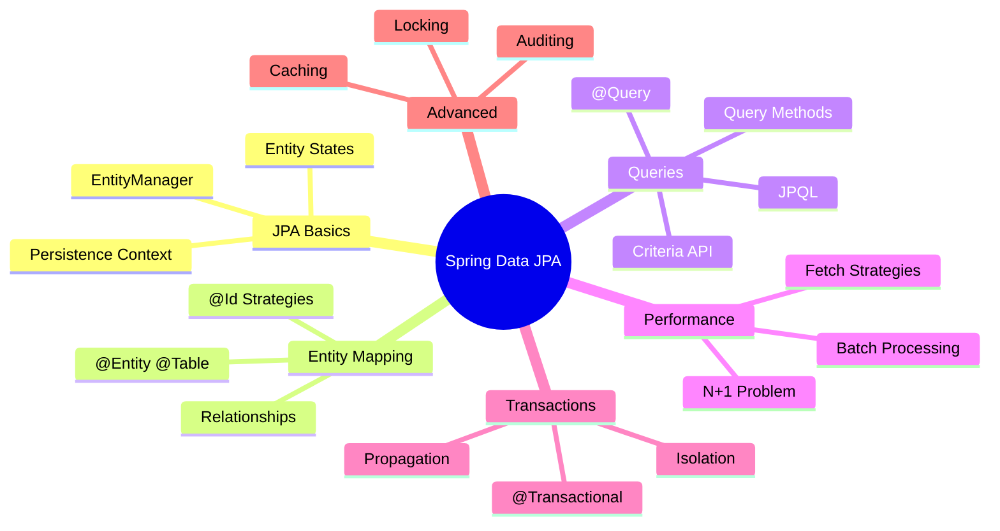

---

# 📦 SECȚIUNEA 1: JPA FUNDAMENTALS

## Q581-583: Ce este JPA și Hibernate?

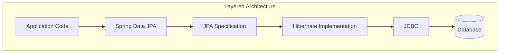

**JPA** (Java Persistence API) = Specificație standard pentru ORM în Java
**Hibernate** = Cea mai populară implementare JPA
**Spring Data JPA** = Abstracție peste JPA care elimină boilerplate-ul

**Probleme rezolvate de ORM:**
- Impedance mismatch (OOP ↔ Relational)
- Boilerplate JDBC
- SQL manual pentru CRUD
- Gestionare manuală tranzacții

---

## Q585-586: EntityManager și Persistence Context

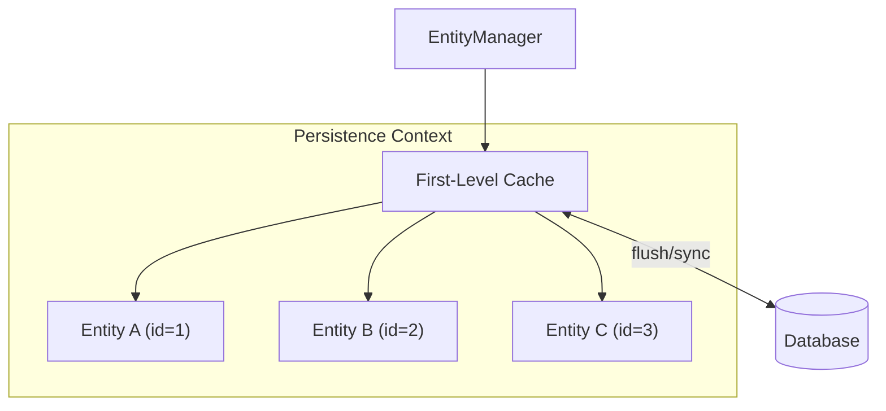

**Persistence Context** = Cache de nivel 1, conține entitățile managed în sesiunea curentă.

```java
@Service
@Transactional
public class UserService {
    
    @PersistenceContext
    private EntityManager em;
    
    public void example() {
        // 1. Find - entity devine MANAGED
        User user = em.find(User.class, 1L);
        
        // 2. Modificare - DETECTATĂ automat (dirty checking)
        user.setName("New Name");
        
        // 3. La commit/flush - UPDATE SQL generat automat
        // NU e nevoie de save() explicit!
    }
}
```

---

## Q587: Entity States (Lifecycle)

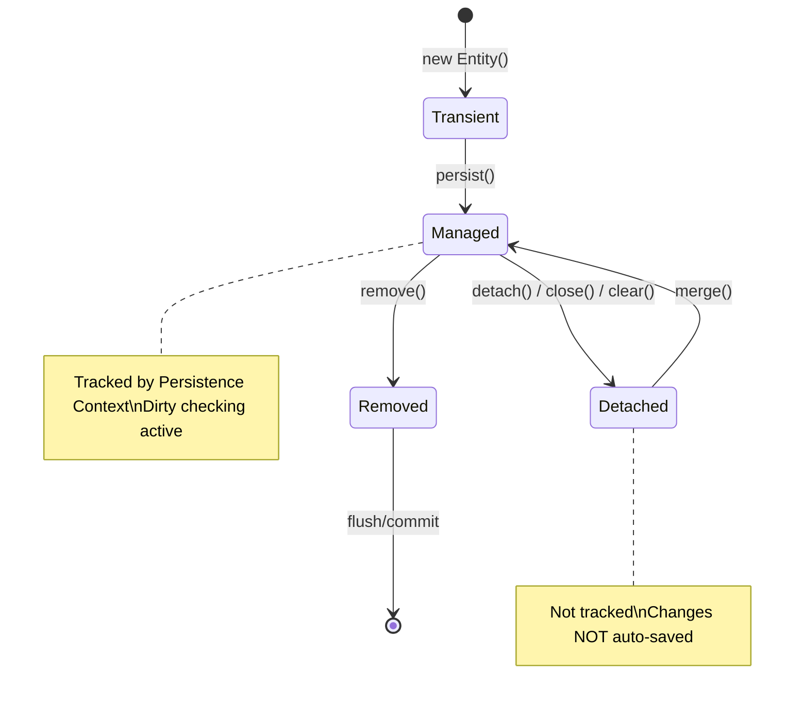

```java
public void entityStatesDemo() {
    // TRANSIENT - nou, necunoscut de JPA
    User user = new User("john@example.com");
    
    // MANAGED - tracked, dirty checking activ
    em.persist(user);  // sau repository.save()
    user.setName("John");  // Auto-detectat!
    
    // DETACHED - nu mai e tracked
    em.detach(user);
    user.setName("Jane");  // NU se salvează!
    
    // Re-attach
    User merged = em.merge(user);  // merged e MANAGED, user rămâne DETACHED
    
    // REMOVED - marcat pentru ștergere
    em.remove(merged);  // DELETE la flush
}
```

---

## Q588-591: Dirty Checking și Flush

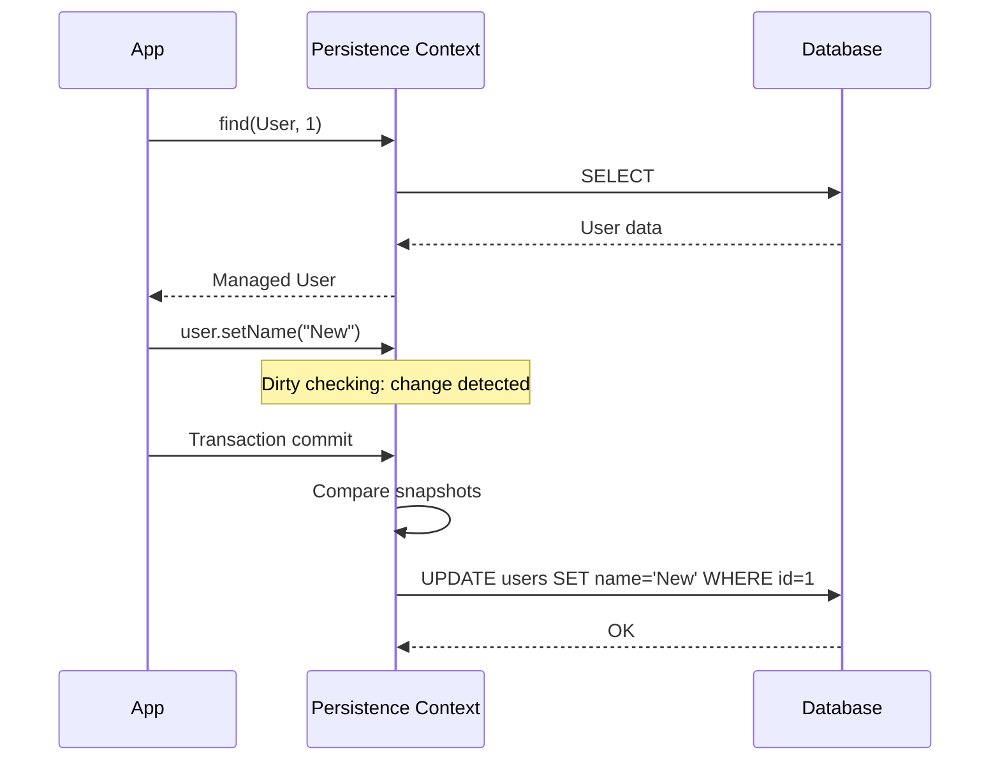

**Flush Modes:**
- `AUTO` (default) - flush înainte de query și la commit
- `COMMIT` - flush doar la commit

```java
// Dirty checking în acțiune
@Transactional
public void updateUser(Long id, String newEmail) {
    User user = userRepository.findById(id).orElseThrow();
    user.setEmail(newEmail);  // MODIFICARE
    // NU e nevoie de save()!
    // La sfârșitul tranzacției, UPDATE se execută automat
}

// Când AI nevoie de save() explicit:
// 1. Entity nou (transient → managed)
// 2. Vrei ID-ul generat imediat
// 3. Folosești merge() pentru detached entity
```

---

# 📦 SECȚIUNEA 2: ENTITY MAPPING

## Q592-596: Basic Mapping

```java
@Entity
@Table(name = "users", indexes = {
    @Index(name = "idx_email", columnList = "email", unique = true)
})
public class User {
    
    @Id
    @GeneratedValue(strategy = GenerationType.IDENTITY)
    private Long id;
    
    @Column(name = "email", nullable = false, unique = true, length = 255)
    private String email;
    
    @Column(name = "password_hash", nullable = false)
    private String passwordHash;
    
    @Column(name = "full_name", length = 100)
    private String fullName;
    
    @Enumerated(EnumType.STRING)  // Salvează ca text, nu ordinal!
    @Column(nullable = false)
    private UserStatus status = UserStatus.ACTIVE;
    
    @Column(name = "created_at", nullable = false, updatable = false)
    private LocalDateTime createdAt;
    
    @Column(name = "updated_at")
    private LocalDateTime updatedAt;
    
    @Transient  // NU se persistă
    private String temporaryToken;
    
    @Version  // Optimistic locking
    private Long version;
    
    @PrePersist
    protected void onCreate() {
        createdAt = LocalDateTime.now();
    }
    
    @PreUpdate
    protected void onUpdate() {
        updatedAt = LocalDateTime.now();
    }
}
```

---

## Q594-595: ID Generation Strategies

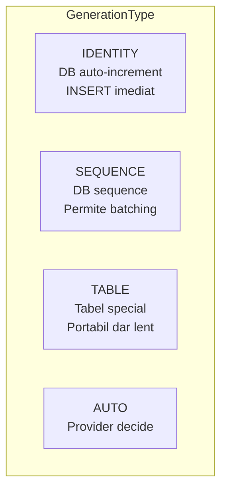

```java
// IDENTITY - simplu, dar NU permite batch insert
@Id
@GeneratedValue(strategy = GenerationType.IDENTITY)
private Long id;
// INSERT se face IMEDIAT pentru a obține ID-ul

// SEQUENCE - RECOMANDAT pentru PostgreSQL/Oracle
@Id
@GeneratedValue(strategy = GenerationType.SEQUENCE, generator = "user_seq")
@SequenceGenerator(name = "user_seq", sequenceName = "user_sequence", allocationSize = 50)
private Long id;
// Permite batch inserts, pre-alocă ID-uri

// UUID - pentru distributed systems
@Id
@GeneratedValue(strategy = GenerationType.UUID)
private UUID id;
```

---

## Q602-607: Relationships

### OneToMany / ManyToOne

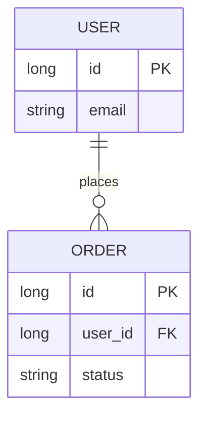

```java
@Entity
public class User {
    @Id @GeneratedValue(strategy = GenerationType.IDENTITY)
    private Long id;
    
    // Partea INVERSĂ (mappedBy)
    @OneToMany(mappedBy = "user", cascade = CascadeType.ALL, orphanRemoval = true)
    private List<Order> orders = new ArrayList<>();
    
    // Helper methods pentru bidirecțional
    public void addOrder(Order order) {
        orders.add(order);
        order.setUser(this);
    }
    
    public void removeOrder(Order order) {
        orders.remove(order);
        order.setUser(null);
    }
}

@Entity
@Table(name = "orders")
public class Order {
    @Id @GeneratedValue(strategy = GenerationType.IDENTITY)
    private Long id;
    
    // Partea OWNING (are FK)
    @ManyToOne(fetch = FetchType.LAZY)  // LAZY pentru @ManyToOne!
    @JoinColumn(name = "user_id", nullable = false)
    private User user;
    
    @Enumerated(EnumType.STRING)
    private OrderStatus status;
}
```

### ManyToMany

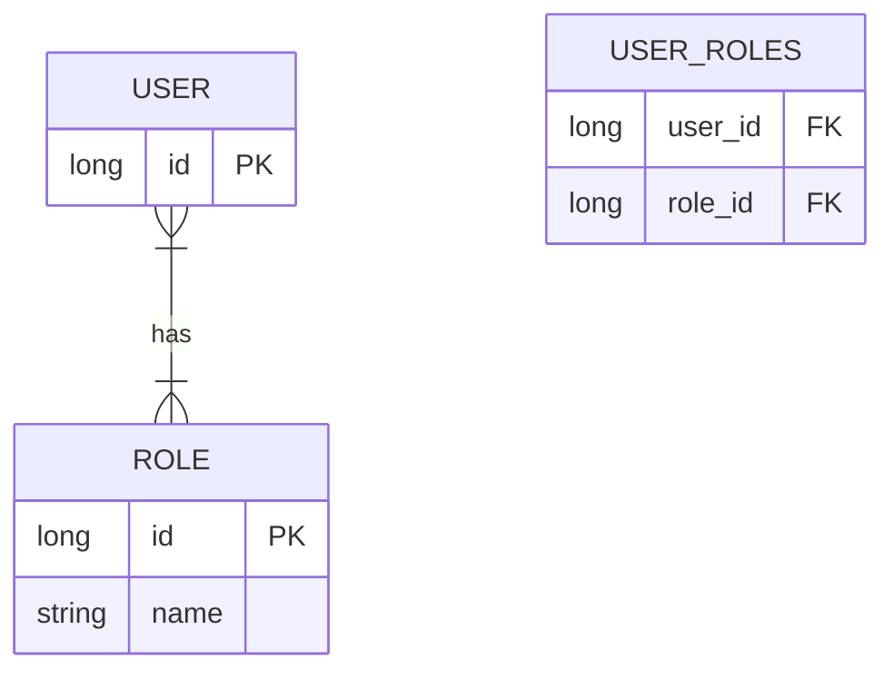

```java
@Entity
public class User {
    @Id @GeneratedValue(strategy = GenerationType.IDENTITY)
    private Long id;
    
    @ManyToMany
    @JoinTable(
        name = "user_roles",
        joinColumns = @JoinColumn(name = "user_id"),
        inverseJoinColumns = @JoinColumn(name = "role_id")
    )
    private Set<Role> roles = new HashSet<>();
}

@Entity
public class Role {
    @Id @GeneratedValue(strategy = GenerationType.IDENTITY)
    private Long id;
    
    @Column(unique = true, nullable = false)
    private String name;
    
    @ManyToMany(mappedBy = "roles")
    private Set<User> users = new HashSet<>();
}
```

### OneToOne

```java
@Entity
public class User {
    @Id @GeneratedValue(strategy = GenerationType.IDENTITY)
    private Long id;
    
    @OneToOne(mappedBy = "user", cascade = CascadeType.ALL, 
              fetch = FetchType.LAZY, orphanRemoval = true)
    private UserProfile profile;
}

@Entity
public class UserProfile {
    @Id
    private Long id;  // Shared PK cu User
    
    @OneToOne(fetch = FetchType.LAZY)
    @MapsId  // Folosește același ID ca User
    @JoinColumn(name = "id")
    private User user;
    
    private String bio;
    private String avatarUrl;
}
```

---

## Q608-610: Fetch Types

```mermaid
graph TB
    subgraph "FetchType.EAGER"
        E1["Încarcă IMEDIAT"]
        E1 --> E2["JOIN sau SELECT separat"]
        E1 --> E3["⚠️ N+1 problem risk"]
    end
    
    subgraph "FetchType.LAZY"
        L1["Încarcă LA ACCES"]
        L1 --> L2["Proxy object inițial"]
        L1 --> L3["✅ Performanță mai bună"]
    end
```

**Defaults:**
- `@OneToMany` → LAZY ✅
- `@ManyToMany` → LAZY ✅
- `@ManyToOne` → EAGER ❌ (schimbă în LAZY!)
- `@OneToOne` → EAGER ❌ (schimbă în LAZY!)

```java
// ✅ CORECT - totul LAZY
@ManyToOne(fetch = FetchType.LAZY)
@JoinColumn(name = "user_id")
private User user;

@OneToMany(mappedBy = "order", fetch = FetchType.LAZY)
private List<OrderItem> items;

// ⚠️ LAZY needs open session!
// LazyInitializationException dacă accesezi în afara tranzacției
```

---

# 📦 SECȚIUNEA 3: N+1 PROBLEM

## Q611-612: N+1 Query Problem

```mermaid
sequenceDiagram
    participant App
    participant DB
    
    Note over App,DB: ❌ N+1 Problem
    App->>DB: SELECT * FROM orders (1 query)
    DB-->>App: 100 orders
    
    loop Pentru fiecare order
        App->>DB: SELECT * FROM users WHERE id = ? (N queries)
    end
    
    Note over App,DB: Total: 1 + 100 = 101 queries! 🐌
```

```java
// ❌ N+1 Problem
@Transactional(readOnly = true)
public void showOrders() {
    List<Order> orders = orderRepository.findAll();  // 1 query
    
    for (Order order : orders) {
        System.out.println(order.getUser().getName());  // N queries!
    }
}
```

### Soluții N+1

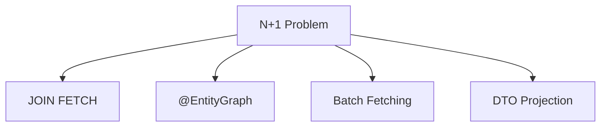

```java
// ✅ SOLUȚIA 1: JOIN FETCH
@Query("SELECT o FROM Order o JOIN FETCH o.user WHERE o.status = :status")
List<Order> findByStatusWithUser(@Param("status") OrderStatus status);

// ✅ SOLUȚIA 2: @EntityGraph
@EntityGraph(attributePaths = {"user", "items"})
@Query("SELECT o FROM Order o WHERE o.status = :status")
List<Order> findByStatusWithGraph(@Param("status") OrderStatus status);

// SAU pe repository method
@EntityGraph(attributePaths = {"user"})
List<Order> findByStatus(OrderStatus status);

// ✅ SOLUȚIA 3: Batch Fetching (în Entity)
@Entity
public class User {
    @OneToMany(mappedBy = "user")
    @BatchSize(size = 25)  // Încarcă 25 colecții per query
    private List<Order> orders;
}

// ✅ SOLUȚIA 4: DTO Projection
@Query("""
    SELECT new com.example.dto.OrderSummary(
        o.id, o.status, o.createdAt, u.name
    )
    FROM Order o JOIN o.user u
    WHERE o.status = :status
    """)
List<OrderSummary> findOrderSummaries(@Param("status") OrderStatus status);
```

---

# 📦 SECȚIUNEA 4: SPRING DATA REPOSITORIES

## Q617-619: Repository Interfaces

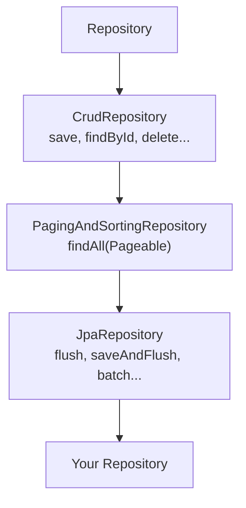

```java
// JpaRepository - cel mai complet
public interface UserRepository extends JpaRepository<User, Long> {
    
    // Query Methods - generare automată din nume
    Optional<User> findByEmail(String email);
    
    List<User> findByStatusAndCreatedAtAfter(UserStatus status, LocalDateTime date);
    
    boolean existsByEmail(String email);
    
    long countByStatus(UserStatus status);
    
    // Paginare și sortare
    Page<User> findByStatus(UserStatus status, Pageable pageable);
    
    List<User> findByStatusOrderByCreatedAtDesc(UserStatus status);
}

// Utilizare
@Service
@Transactional
public class UserService {
    
    private final UserRepository userRepository;
    
    public UserService(UserRepository userRepository) {
        this.userRepository = userRepository;
    }
    
    public Page<User> findActiveUsers(int page, int size) {
        Pageable pageable = PageRequest.of(page, size, Sort.by("createdAt").descending());
        return userRepository.findByStatus(UserStatus.ACTIVE, pageable);
    }
}
```

---

## Q619-623: Query Methods vs @Query

```java
public interface OrderRepository extends JpaRepository<Order, Long> {
    
    // ═══════════════════════════════════════
    // QUERY METHODS (derived from name)
    // ═══════════════════════════════════════
    
    // Simple
    List<Order> findByStatus(OrderStatus status);
    
    // Multiple conditions
    List<Order> findByStatusAndUserIdAndCreatedAtBetween(
        OrderStatus status, Long userId, LocalDateTime start, LocalDateTime end);
    
    // Keywords: And, Or, Between, LessThan, GreaterThan, Like, In, OrderBy...
    List<Order> findByTotalGreaterThanOrderByCreatedAtDesc(BigDecimal minTotal);
    
    // First/Top
    Optional<Order> findFirstByUserIdOrderByCreatedAtDesc(Long userId);
    List<Order> findTop10ByStatusOrderByTotalDesc(OrderStatus status);
    
    // ═══════════════════════════════════════
    // @Query - JPQL (pe entități)
    // ═══════════════════════════════════════
    
    @Query("SELECT o FROM Order o WHERE o.user.email = :email AND o.status = :status")
    List<Order> findByUserEmailAndStatus(
        @Param("email") String email, 
        @Param("status") OrderStatus status);
    
    @Query("""
        SELECT o FROM Order o 
        JOIN FETCH o.user 
        JOIN FETCH o.items 
        WHERE o.id = :id
        """)
    Optional<Order> findByIdWithDetails(@Param("id") Long id);
    
    // Aggregations
    @Query("SELECT SUM(o.total) FROM Order o WHERE o.user.id = :userId")
    BigDecimal sumTotalByUserId(@Param("userId") Long userId);
    
    // ═══════════════════════════════════════
    // @Query - Native SQL
    // ═══════════════════════════════════════
    
    @Query(value = """
        SELECT * FROM orders o 
        WHERE o.created_at >= NOW() - INTERVAL '7 days'
        ORDER BY o.total DESC 
        LIMIT 10
        """, nativeQuery = true)
    List<Order> findTopOrdersLastWeek();
    
    // ═══════════════════════════════════════
    // Modifying Queries
    // ═══════════════════════════════════════
    
    @Modifying
    @Query("UPDATE Order o SET o.status = :status WHERE o.id IN :ids")
    int updateStatusByIds(@Param("status") OrderStatus status, @Param("ids") List<Long> ids);
    
    @Modifying
    @Query("DELETE FROM Order o WHERE o.status = :status AND o.createdAt < :before")
    int deleteOldOrders(@Param("status") OrderStatus status, @Param("before") LocalDateTime before);
}
```

---

## Q624-626: Pagination și Sorting

```java
@RestController
@RequestMapping("/api/orders")
public class OrderController {
    
    private final OrderRepository orderRepository;
    
    // GET /api/orders?page=0&size=20&sort=createdAt,desc&sort=total,asc
    @GetMapping
    public Page<OrderDto> findAll(Pageable pageable) {
        return orderRepository.findAll(pageable).map(this::toDto);
    }
    
    // Custom Pageable
    @GetMapping("/custom")
    public Page<OrderDto> findCustom(
            @RequestParam(defaultValue = "0") int page,
            @RequestParam(defaultValue = "20") int size,
            @RequestParam(defaultValue = "createdAt") String sortBy,
            @RequestParam(defaultValue = "DESC") Sort.Direction direction) {
        
        Pageable pageable = PageRequest.of(page, size, Sort.by(direction, sortBy));
        return orderRepository.findAll(pageable).map(this::toDto);
    }
}

// Page vs Slice
public interface OrderRepository extends JpaRepository<Order, Long> {
    
    // Page - include total count (extra query)
    Page<Order> findByStatus(OrderStatus status, Pageable pageable);
    
    // Slice - NO count query, doar hasNext
    Slice<Order> findSliceByStatus(OrderStatus status, Pageable pageable);
    
    // List - no pagination metadata
    List<Order> findByStatus(OrderStatus status, Sort sort);
}
```

---

# 📦 SECȚIUNEA 5: TRANSACTIONS

## Q627-629: @Transactional

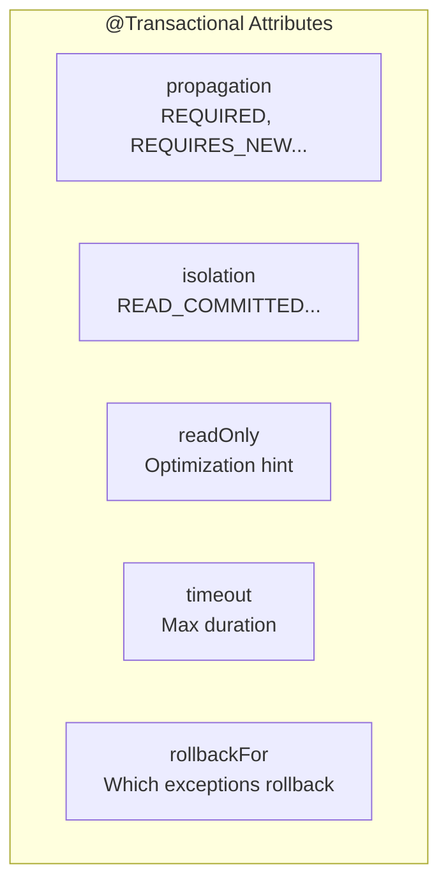

```java
@Service
public class OrderService {
    
    private final OrderRepository orderRepository;
    private final PaymentService paymentService;
    private final NotificationService notificationService;
    
    // ═══════════════════════════════════════
    // BASIC TRANSACTION
    // ═══════════════════════════════════════
    
    @Transactional  // Default: REQUIRED, RuntimeException → rollback
    public Order createOrder(CreateOrderRequest request) {
        Order order = new Order(request);
        order = orderRepository.save(order);
        
        paymentService.processPayment(order);  // În aceeași tranzacție
        
        return order;
        // Commit la sfârșit dacă nu sunt excepții
    }
    
    // ═══════════════════════════════════════
    // READ-ONLY TRANSACTION
    // ═══════════════════════════════════════
    
    @Transactional(readOnly = true)  // Optimizări: no dirty checking, poate folosi replica
    public Order findById(Long id) {
        return orderRepository.findById(id)
            .orElseThrow(() -> new OrderNotFoundException(id));
    }
    
    // ═══════════════════════════════════════
    // REQUIRES_NEW - Tranzacție separată
    // ═══════════════════════════════════════
    
    @Transactional
    public void processOrderWithAudit(Long orderId) {
        Order order = findById(orderId);
        processOrder(order);
        
        // Audit se salvează CHIAR DACĂ restul face rollback
        auditService.logAction(orderId, "PROCESSED");
    }
    
    // În AuditService:
    @Transactional(propagation = Propagation.REQUIRES_NEW)
    public void logAction(Long entityId, String action) {
        auditRepository.save(new AuditLog(entityId, action));
        // Commit independent
    }
    
    // ═══════════════════════════════════════
    // ROLLBACK CONTROL
    // ═══════════════════════════════════════
    
    @Transactional(rollbackFor = Exception.class)  // Rollback și pentru checked exceptions
    public void importData(InputStream data) throws IOException {
        // IOException e checked, normal nu face rollback
        // Cu rollbackFor = Exception.class, face rollback
    }
    
    @Transactional(noRollbackFor = EmailException.class)
    public void createOrderWithNotification(CreateOrderRequest request) {
        Order order = createOrder(request);
        try {
            notificationService.sendConfirmation(order);  // Poate eșua
        } catch (EmailException e) {
            // Log error dar NU face rollback
            log.warn("Failed to send email", e);
        }
    }
}
```

---

## Q628: Propagation Types

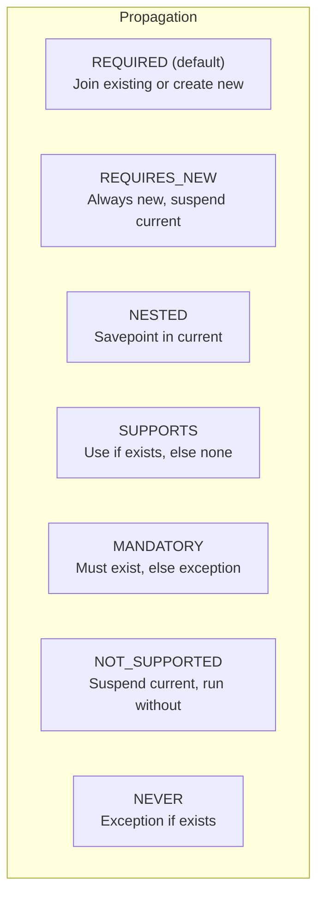

```java
// REQUIRED (default) - cea mai folosită
@Transactional(propagation = Propagation.REQUIRED)
public void methodA() {
    // Dacă există tranzacție, o folosește
    // Dacă nu, creează una nouă
}

// REQUIRES_NEW - pentru operații independente
@Transactional(propagation = Propagation.REQUIRES_NEW)
public void audit(String action) {
    // ÎNTOTDEAUNA creează tranzacție nouă
    // Commit independent de tranzacția părinte
}

// MANDATORY - pentru metode care TREBUIE să fie în tranzacție
@Transactional(propagation = Propagation.MANDATORY)
public void updateBalance(Long accountId, BigDecimal amount) {
    // Aruncă excepție dacă nu există tranzacție activă
}
```

---

## Q629: Isolation Levels

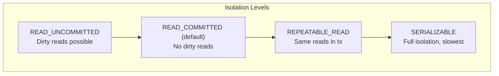

```java
// READ_COMMITTED - default, suficient pentru majoritatea cazurilor
@Transactional(isolation = Isolation.READ_COMMITTED)
public void normalOperation() { }

// REPEATABLE_READ - când citești aceleași date de mai multe ori
@Transactional(isolation = Isolation.REPEATABLE_READ)
public void generateReport() {
    // Date consistente pe toată durata raportului
}

// SERIALIZABLE - pentru operații financiare critice
@Transactional(isolation = Isolation.SERIALIZABLE)
public void transferMoney(Long fromId, Long toId, BigDecimal amount) {
    // Cel mai sigur, dar cel mai lent
}
```

---

# 📦 SECȚIUNEA 6: LOCKING

## Q598-601: Optimistic vs Pessimistic Locking

```mermaid
graph TB
    subgraph "Optimistic Locking"
        OL1["@Version field"]
        OL1 --> OL2["Check version at UPDATE"]
        OL2 --> OL3["OptimisticLockException if changed"]
        OL1 --> OL4["✅ Scalabil, no DB locks"]
    end
    
    subgraph "Pessimistic Locking"
        PL1["SELECT FOR UPDATE"]
        PL1 --> PL2["DB lock pe rows"]
        PL2 --> PL3["Alte tranzacții așteaptă"]
        PL1 --> PL4["⚠️ Poate cauza deadlocks"]
    end
```

### Optimistic Locking

```java
@Entity
public class Product {
    @Id @GeneratedValue
    private Long id;
    
    private String name;
    private int stock;
    
    @Version  // Incrementat automat la fiecare UPDATE
    private Long version;
}

// Usage
@Transactional
public void updateStock(Long productId, int quantity) {
    Product product = productRepository.findById(productId).orElseThrow();
    product.setStock(product.getStock() - quantity);
    // La save, verifică: WHERE id = ? AND version = ?
    // Dacă version s-a schimbat → OptimisticLockException
}

// Handle conflict
@Transactional
public void updateStockWithRetry(Long productId, int quantity) {
    int maxRetries = 3;
    for (int i = 0; i < maxRetries; i++) {
        try {
            updateStock(productId, quantity);
            return;
        } catch (OptimisticLockException e) {
            if (i == maxRetries - 1) throw e;
            // Retry cu date fresh
        }
    }
}
```

### Pessimistic Locking

```java
public interface ProductRepository extends JpaRepository<Product, Long> {
    
    // PESSIMISTIC_WRITE - exclusive lock
    @Lock(LockModeType.PESSIMISTIC_WRITE)
    @Query("SELECT p FROM Product p WHERE p.id = :id")
    Optional<Product> findByIdForUpdate(@Param("id") Long id);
    
    // PESSIMISTIC_READ - shared lock
    @Lock(LockModeType.PESSIMISTIC_READ)
    @Query("SELECT p FROM Product p WHERE p.id = :id")
    Optional<Product> findByIdWithReadLock(@Param("id") Long id);
}

// Usage
@Transactional
public void reserveStock(Long productId, int quantity) {
    // SELECT ... FOR UPDATE - alte tranzacții așteaptă
    Product product = productRepository.findByIdForUpdate(productId)
        .orElseThrow();
    
    if (product.getStock() < quantity) {
        throw new InsufficientStockException();
    }
    
    product.setStock(product.getStock() - quantity);
}
```

---

# 📦 SECȚIUNEA 7: PERFORMANCE

## Q633-637: Caching

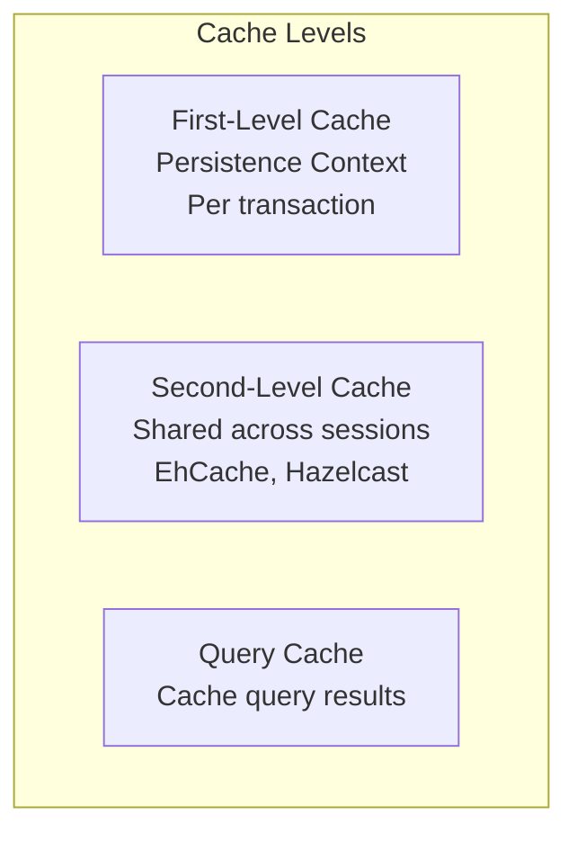

```java
// Second-Level Cache config
@Entity
@Cacheable
@Cache(usage = CacheConcurrencyStrategy.READ_WRITE)
public class Product {
    @Id
    private Long id;
    private String name;
    
    @Cache(usage = CacheConcurrencyStrategy.READ_WRITE)
    @OneToMany(mappedBy = "product")
    private List<Review> reviews;
}

// application.yml
spring:
  jpa:
    properties:
      hibernate:
        cache:
          use_second_level_cache: true
          use_query_cache: true
          region.factory_class: org.hibernate.cache.jcache.JCacheRegionFactory
        javax.cache.provider: org.ehcache.jsr107.EhcacheCachingProvider
```

---

## Q636-637: Batch Processing

```java
// application.yml pentru batching
spring:
  jpa:
    properties:
      hibernate:
        jdbc:
          batch_size: 50
          batch_versioned_data: true
        order_inserts: true
        order_updates: true

// Batch insert
@Transactional
public void batchInsert(List<Product> products) {
    int batchSize = 50;
    for (int i = 0; i < products.size(); i++) {
        entityManager.persist(products.get(i));
        
        if (i > 0 && i % batchSize == 0) {
            entityManager.flush();
            entityManager.clear();  // Eliberează memoria
        }
    }
}

// Sau cu saveAll (Spring Data)
@Transactional
public void batchInsertSimple(List<Product> products) {
    // saveAll face batch automat dacă e configurat corect
    productRepository.saveAll(products);
}
```

---

## Q646-647: Projections (DTO)

```java
// ═══════════════════════════════════════
// Interface Projection
// ═══════════════════════════════════════
public interface OrderSummary {
    Long getId();
    String getStatus();
    BigDecimal getTotal();
    String getUserEmail();  // Nested: user.email
}

public interface OrderRepository extends JpaRepository<Order, Long> {
    List<OrderSummary> findByStatus(OrderStatus status);
}

// ═══════════════════════════════════════
// Class/Record Projection (JPQL)
// ═══════════════════════════════════════
public record OrderDto(Long id, OrderStatus status, BigDecimal total, String userEmail) {}

@Query("""
    SELECT new com.example.dto.OrderDto(o.id, o.status, o.total, u.email)
    FROM Order o JOIN o.user u
    WHERE o.status = :status
    """)
List<OrderDto> findDtosByStatus(@Param("status") OrderStatus status);

// ═══════════════════════════════════════
// Tuple Projection
// ═══════════════════════════════════════
@Query("SELECT o.id as id, o.total as total FROM Order o WHERE o.status = :status")
List<Tuple> findTuplesByStatus(@Param("status") OrderStatus status);

// Usage
List<Tuple> tuples = repository.findTuplesByStatus(OrderStatus.COMPLETED);
for (Tuple t : tuples) {
    Long id = t.get("id", Long.class);
    BigDecimal total = t.get("total", BigDecimal.class);
}
```

---

## Q653-656: Schema Migration (Flyway/Liquibase)

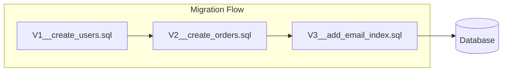

```sql
-- src/main/resources/db/migration/V1__create_users.sql
CREATE TABLE users (
    id BIGSERIAL PRIMARY KEY,
    email VARCHAR(255) NOT NULL UNIQUE,
    password_hash VARCHAR(255) NOT NULL,
    status VARCHAR(50) NOT NULL DEFAULT 'ACTIVE',
    created_at TIMESTAMP NOT NULL DEFAULT NOW(),
    version BIGINT NOT NULL DEFAULT 0
);

CREATE INDEX idx_users_email ON users(email);
CREATE INDEX idx_users_status ON users(status);

-- V2__create_orders.sql
CREATE TABLE orders (
    id BIGSERIAL PRIMARY KEY,
    user_id BIGINT NOT NULL REFERENCES users(id),
    status VARCHAR(50) NOT NULL,
    total DECIMAL(19,2) NOT NULL,
    created_at TIMESTAMP NOT NULL DEFAULT NOW()
);

CREATE INDEX idx_orders_user_id ON orders(user_id);
CREATE INDEX idx_orders_status ON orders(status);
```

```yaml
# application.yml
spring:
  flyway:
    enabled: true
    locations: classpath:db/migration
    baseline-on-migrate: true
  jpa:
    hibernate:
      ddl-auto: validate  # NICIODATĂ create/update în prod!
```

---

# 🎯 CHEAT SHEET JPA & HIBERNATE

## Entity Checklist

```java
@Entity
@Table(name = "table_name")
public class MyEntity {
    
    @Id
    @GeneratedValue(strategy = GenerationType.IDENTITY)
    private Long id;
    
    @Column(nullable = false, unique = true)
    private String uniqueField;
    
    @Enumerated(EnumType.STRING)  // NOT ORDINAL!
    private Status status;
    
    @ManyToOne(fetch = FetchType.LAZY)  // ALWAYS LAZY
    @JoinColumn(name = "parent_id")
    private Parent parent;
    
    @OneToMany(mappedBy = "parent", cascade = CascadeType.ALL, orphanRemoval = true)
    private List<Child> children = new ArrayList<>();
    
    @Version
    private Long version;
    
    // equals/hashCode pe business key sau ID
}
```

## Query Method Keywords

| Keyword | Sample |
|---------|--------|
| `findBy` | `findByEmail(String email)` |
| `And` | `findByNameAndStatus(...)` |
| `Or` | `findByNameOrEmail(...)` |
| `Between` | `findByCreatedAtBetween(...)` |
| `LessThan/GreaterThan` | `findByAgeLessThan(int age)` |
| `Like` | `findByNameLike(String pattern)` |
| `In` | `findByStatusIn(List<Status>)` |
| `OrderBy` | `findByStatusOrderByNameAsc(...)` |
| `First/Top` | `findFirstByOrderByCreatedAtDesc()` |
| `Count` | `countByStatus(Status status)` |
| `Exists` | `existsByEmail(String email)` |

## Performance Checklist

- [ ] `@ManyToOne` și `@OneToOne` sunt LAZY
- [ ] N+1 rezolvat cu JOIN FETCH sau @EntityGraph
- [ ] Folosești projections pentru queries read-only
- [ ] Batch size configurat pentru bulk operations
- [ ] `@Transactional(readOnly = true)` pentru queries
- [ ] Flyway/Liquibase pentru migrări (nu ddl-auto)
- [ ] Indexuri pe coloanele folosite în WHERE/JOIN

---

> 💡 **Regula de Aur JPA:**  
> *"Controlează EXPLICIT ce și când încarci. LAZY by default, EAGER only when needed, și întotdeauna verifică query-urile generate în log!"*
