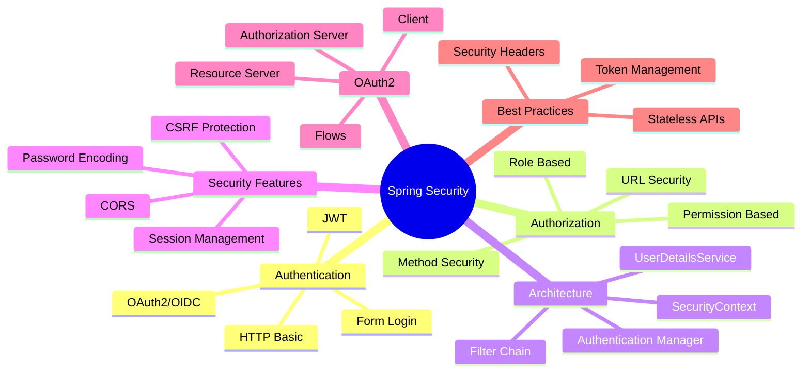
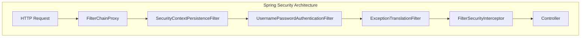
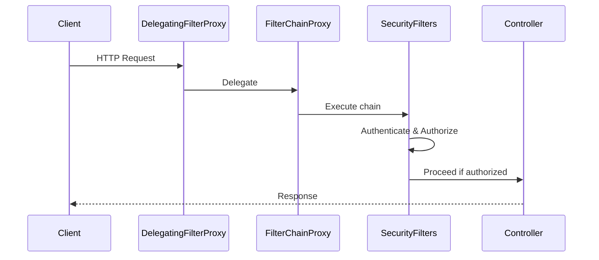
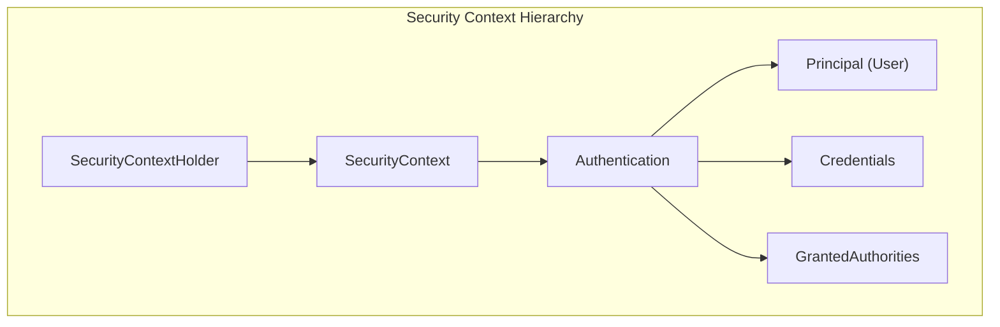
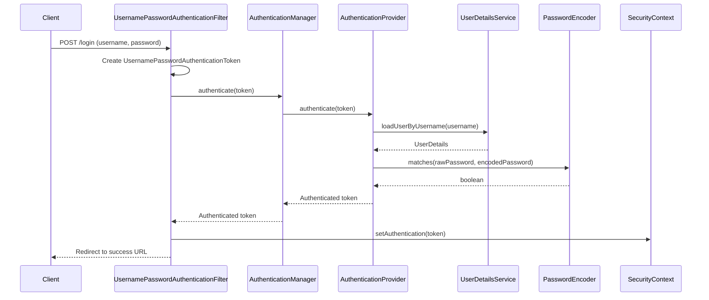
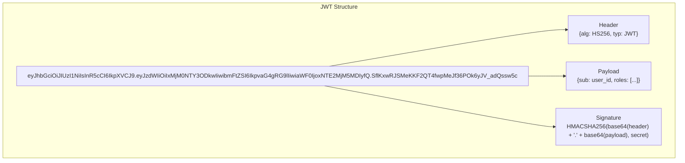
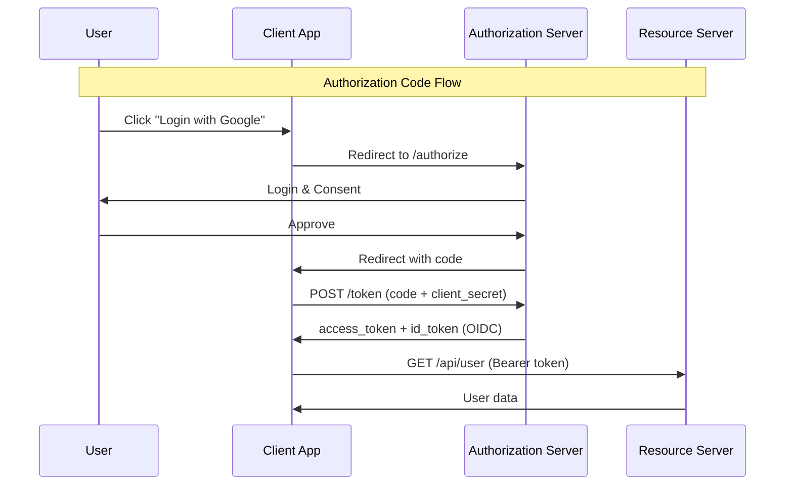

# Capitolul 9 – Spring Security
## Q661–Q740 – Nivel Senior

> 📚 Scop: Interviuri Senior / Lead / Staff
> 💾 Encoding: UTF-8

---

## 🎯 HARTĂ MENTALĂ



---

# 📦 SECȚIUNEA 1: FUNDAMENTALS

## Q661-664: Ce este Spring Security?



**Spring Security** = Framework complet pentru autentificare și autorizare în aplicații Spring.

**Probleme rezolvate:**
- Autentificare centralizată
- Control granular al accesului
- Protecție împotriva atacurilor comune (CSRF, XSS, etc.)
- Integrare cu standarde moderne (OAuth2, JWT, OIDC)

---

## Q665-668: Security Filter Chain



```java
@Configuration
@EnableWebSecurity
public class SecurityConfig {
    
    @Bean
    public SecurityFilterChain filterChain(HttpSecurity http) throws Exception {
        http
            .authorizeHttpRequests(auth -> auth
                .requestMatchers("/public/**").permitAll()
                .requestMatchers("/admin/**").hasRole("ADMIN")
                .anyRequest().authenticated()
            )
            .formLogin(form -> form
                .loginPage("/login")
                .defaultSuccessUrl("/dashboard")
            )
            .logout(logout -> logout
                .logoutUrl("/logout")
                .logoutSuccessUrl("/login?logout")
            );
        
        return http.build();
    }
}
```

**DelegatingFilterProxy** = Legătura dintre Servlet Container și Spring Security

**FilterChainProxy** = Dispatcher intern care gestionează lanțul de filtre de securitate

---

## Q669-674: SecurityContext și Authentication



```java
// Obținerea utilizatorului curent
@Service
public class UserService {
    
    public String getCurrentUsername() {
        Authentication auth = SecurityContextHolder.getContext().getAuthentication();
        return auth.getName();
    }
    
    public boolean hasRole(String role) {
        Authentication auth = SecurityContextHolder.getContext().getAuthentication();
        return auth.getAuthorities().stream()
            .anyMatch(a -> a.getAuthority().equals("ROLE_" + role));
    }
    
    // Sau în Controller cu @AuthenticationPrincipal
    @GetMapping("/profile")
    public UserProfile getProfile(@AuthenticationPrincipal UserDetails user) {
        return userService.getProfile(user.getUsername());
    }
}

// Custom UserDetails
public class CustomUserDetails implements UserDetails {
    
    private final User user;
    
    public CustomUserDetails(User user) {
        this.user = user;
    }
    
    @Override
    public Collection<? extends GrantedAuthority> getAuthorities() {
        return user.getRoles().stream()
            .map(role -> new SimpleGrantedAuthority("ROLE_" + role.getName()))
            .collect(Collectors.toList());
    }
    
    @Override
    public String getPassword() {
        return user.getPassword();
    }
    
    @Override
    public String getUsername() {
        return user.getEmail();
    }
    
    @Override
    public boolean isAccountNonExpired() {
        return true;
    }
    
    @Override
    public boolean isAccountNonLocked() {
        return !user.isLocked();
    }
    
    @Override
    public boolean isCredentialsNonExpired() {
        return true;
    }
    
    @Override
    public boolean isEnabled() {
        return user.isActive();
    }
    
    // Getter pentru entitatea User completă
    public User getUser() {
        return user;
    }
}
```

**SecurityContextHolder Strategies:**
- `MODE_THREADLOCAL` (default) - Context per thread
- `MODE_INHERITABLETHREADLOCAL` - Moștenit de child threads
- `MODE_GLOBAL` - Un singur context pentru toată aplicația

---

## Q675-677: Authentication Flow



```java
// Custom AuthenticationProvider
@Component
public class CustomAuthenticationProvider implements AuthenticationProvider {
    
    private final UserDetailsService userDetailsService;
    private final PasswordEncoder passwordEncoder;
    
    @Override
    public Authentication authenticate(Authentication authentication) 
            throws AuthenticationException {
        
        String username = authentication.getName();
        String password = authentication.getCredentials().toString();
        
        // 1. Încarcă utilizatorul
        UserDetails user = userDetailsService.loadUserByUsername(username);
        
        // 2. Verifică parola
        if (!passwordEncoder.matches(password, user.getPassword())) {
            throw new BadCredentialsException("Invalid credentials");
        }
        
        // 3. Verificări suplimentare
        if (!user.isEnabled()) {
            throw new DisabledException("User is disabled");
        }
        
        if (!user.isAccountNonLocked()) {
            throw new LockedException("User account is locked");
        }
        
        // 4. Returnează token autentificat
        return new UsernamePasswordAuthenticationToken(
            user, 
            password, 
            user.getAuthorities()
        );
    }
    
    @Override
    public boolean supports(Class<?> authentication) {
        return UsernamePasswordAuthenticationToken.class.isAssignableFrom(authentication);
    }
}

// UserDetailsService implementation
@Service
public class CustomUserDetailsService implements UserDetailsService {
    
    private final UserRepository userRepository;
    
    @Override
    public UserDetails loadUserByUsername(String username) throws UsernameNotFoundException {
        User user = userRepository.findByEmail(username)
            .orElseThrow(() -> new UsernameNotFoundException("User not found: " + username));
        
        return new CustomUserDetails(user);
    }
}
```

---

# 📦 SECȚIUNEA 2: AUTHENTICATION METHODS

## Q678-682: Form Login & HTTP Basic

```java
@Configuration
@EnableWebSecurity
public class SecurityConfig {
    
    // ══════════════════════════════════════════════════════
    // FORM LOGIN - pentru aplicații web tradiționale
    // ══════════════════════════════════════════════════════
    @Bean
    public SecurityFilterChain webSecurityFilterChain(HttpSecurity http) throws Exception {
        http
            .authorizeHttpRequests(auth -> auth
                .requestMatchers("/login", "/css/**", "/js/**").permitAll()
                .anyRequest().authenticated()
            )
            .formLogin(form -> form
                .loginPage("/login")                    // Custom login page
                .loginProcessingUrl("/perform_login")   // URL pentru POST
                .defaultSuccessUrl("/dashboard", true)  // Redirect după login
                .failureUrl("/login?error=true")        // Redirect la eroare
                .usernameParameter("email")             // Nume field username
                .passwordParameter("pass")              // Nume field password
            )
            .sessionManagement(session -> session
                .sessionCreationPolicy(SessionCreationPolicy.IF_REQUIRED)
                .maximumSessions(1)                     // Max o sesiune per user
                .maxSessionsPreventsLogin(true)         // Blochează login duplicate
            );
        
        return http.build();
    }
    
    // ══════════════════════════════════════════════════════
    // HTTP BASIC - pentru API-uri simple
    // ══════════════════════════════════════════════════════
    @Bean
    public SecurityFilterChain apiSecurityFilterChain(HttpSecurity http) throws Exception {
        http
            .securityMatcher("/api/**")
            .authorizeHttpRequests(auth -> auth
                .anyRequest().authenticated()
            )
            .httpBasic(Customizer.withDefaults())
            .sessionManagement(session -> session
                .sessionCreationPolicy(SessionCreationPolicy.STATELESS)
            )
            .csrf(csrf -> csrf.disable());  // CSRF disabled pentru API stateless
        
        return http.build();
    }
}
```

**⚠️ Riscuri HTTP Basic:**
- Credențiale în header la fiecare request
- Fără protecție împotriva replay attacks
- Trebuie folosit DOAR cu HTTPS

---

## Q683-686: JWT (JSON Web Token)



```java
// JWT Utility Class
@Component
public class JwtTokenProvider {
    
    @Value("${jwt.secret}")
    private String jwtSecret;
    
    @Value("${jwt.expiration:3600000}") // 1 oră default
    private long jwtExpirationMs;
    
    // Generare token
    public String generateToken(Authentication authentication) {
        UserDetails userDetails = (UserDetails) authentication.getPrincipal();
        
        Date now = new Date();
        Date expiryDate = new Date(now.getTime() + jwtExpirationMs);
        
        return Jwts.builder()
            .setSubject(userDetails.getUsername())
            .setIssuedAt(now)
            .setExpiration(expiryDate)
            .claim("roles", userDetails.getAuthorities().stream()
                .map(GrantedAuthority::getAuthority)
                .collect(Collectors.toList()))
            .signWith(SignatureAlgorithm.HS512, jwtSecret)
            .compact();
    }
    
    // Validare token
    public boolean validateToken(String token) {
        try {
            Jwts.parser()
                .setSigningKey(jwtSecret)
                .parseClaimsJws(token);
            return true;
        } catch (SignatureException ex) {
            log.error("Invalid JWT signature");
        } catch (MalformedJwtException ex) {
            log.error("Invalid JWT token");
        } catch (ExpiredJwtException ex) {
            log.error("Expired JWT token");
        } catch (UnsupportedJwtException ex) {
            log.error("Unsupported JWT token");
        } catch (IllegalArgumentException ex) {
            log.error("JWT claims string is empty");
        }
        return false;
    }
    
    // Extragere username din token
    public String getUsernameFromToken(String token) {
        Claims claims = Jwts.parser()
            .setSigningKey(jwtSecret)
            .parseClaimsJws(token)
            .getBody();
        
        return claims.getSubject();
    }
    
    // Extragere roluri
    @SuppressWarnings("unchecked")
    public List<String> getRolesFromToken(String token) {
        Claims claims = Jwts.parser()
            .setSigningKey(jwtSecret)
            .parseClaimsJws(token)
            .getBody();
        
        return (List<String>) claims.get("roles");
    }
}

// JWT Authentication Filter
@Component
public class JwtAuthenticationFilter extends OncePerRequestFilter {
    
    private final JwtTokenProvider tokenProvider;
    private final UserDetailsService userDetailsService;
    
    @Override
    protected void doFilterInternal(HttpServletRequest request, 
                                    HttpServletResponse response, 
                                    FilterChain filterChain) 
            throws ServletException, IOException {
        
        try {
            // 1. Extrage token din header
            String jwt = getJwtFromRequest(request);
            
            if (StringUtils.hasText(jwt) && tokenProvider.validateToken(jwt)) {
                // 2. Obține username din token
                String username = tokenProvider.getUsernameFromToken(jwt);
                
                // 3. Încarcă user details
                UserDetails userDetails = userDetailsService.loadUserByUsername(username);
                
                // 4. Creează Authentication object
                UsernamePasswordAuthenticationToken authentication = 
                    new UsernamePasswordAuthenticationToken(
                        userDetails, 
                        null, 
                        userDetails.getAuthorities()
                    );
                
                authentication.setDetails(
                    new WebAuthenticationDetailsSource().buildDetails(request)
                );
                
                // 5. Setează în SecurityContext
                SecurityContextHolder.getContext().setAuthentication(authentication);
            }
        } catch (Exception ex) {
            log.error("Could not set user authentication in security context", ex);
        }
        
        filterChain.doFilter(request, response);
    }
    
    private String getJwtFromRequest(HttpServletRequest request) {
        String bearerToken = request.getHeader("Authorization");
        if (StringUtils.hasText(bearerToken) && bearerToken.startsWith("Bearer ")) {
            return bearerToken.substring(7);
        }
        return null;
    }
}

// Authentication Controller
@RestController
@RequestMapping("/api/auth")
public class AuthController {
    
    private final AuthenticationManager authenticationManager;
    private final JwtTokenProvider tokenProvider;
    
    @PostMapping("/login")
    public ResponseEntity<JwtResponse> authenticateUser(@RequestBody LoginRequest loginRequest) {
        
        // Autentificare
        Authentication authentication = authenticationManager.authenticate(
            new UsernamePasswordAuthenticationToken(
                loginRequest.getEmail(),
                loginRequest.getPassword()
            )
        );
        
        // Setează în context
        SecurityContextHolder.getContext().setAuthentication(authentication);
        
        // Generează JWT
        String jwt = tokenProvider.generateToken(authentication);
        
        return ResponseEntity.ok(new JwtResponse(jwt));
    }
}
```

**✅ Avantaje JWT:**
- Stateless - nu necesită server-side storage
- Scalabil - fără sesiuni server
- Cross-domain - funcționează peste multiple servicii

**⚠️ Riscuri JWT:**
- Imposibil de revocat (fără blacklist)
- Token leakage - dacă e furat, e valid până expiră
- Payload vizibil - nu stoca date sensibile

---

## Q687-695: OAuth 2.0 & OpenID Connect



```java
// ══════════════════════════════════════════════════════
// OAUTH2 CLIENT - Aplicația ta ca OAuth2 client
// ══════════════════════════════════════════════════════

// application.yml
spring:
  security:
    oauth2:
      client:
        registration:
          google:
            client-id: ${GOOGLE_CLIENT_ID}
            client-secret: ${GOOGLE_CLIENT_SECRET}
            scope:
              - email
              - profile
          github:
            client-id: ${GITHUB_CLIENT_ID}
            client-secret: ${GITHUB_CLIENT_SECRET}
            scope:
              - user:email
              - read:user

// Security Config pentru OAuth2 Login
@Configuration
@EnableWebSecurity
public class OAuth2SecurityConfig {
    
    @Bean
    public SecurityFilterChain filterChain(HttpSecurity http) throws Exception {
        http
            .authorizeHttpRequests(auth -> auth
                .requestMatchers("/", "/login**", "/error").permitAll()
                .anyRequest().authenticated()
            )
            .oauth2Login(oauth2 -> oauth2
                .loginPage("/login")
                .defaultSuccessUrl("/dashboard")
                .failureUrl("/login?error=true")
                .userInfoEndpoint(userInfo -> userInfo
                    .userService(customOAuth2UserService())
                )
            );
        
        return http.build();
    }
    
    @Bean
    public OAuth2UserService<OAuth2UserRequest, OAuth2User> customOAuth2UserService() {
        return new CustomOAuth2UserService();
    }
}

// Custom OAuth2UserService
@Service
public class CustomOAuth2UserService 
        extends DefaultOAuth2UserService {
    
    private final UserRepository userRepository;
    
    @Override
    public OAuth2User loadUser(OAuth2UserRequest userRequest) 
            throws OAuth2AuthenticationException {
        
        // 1. Obține user info de la provider
        OAuth2User oauth2User = super.loadUser(userRequest);
        
        // 2. Procesează user info
        String email = oauth2User.getAttribute("email");
        String name = oauth2User.getAttribute("name");
        String provider = userRequest.getClientRegistration().getRegistrationId();
        
        // 3. Găsește sau creează user local
        User user = userRepository.findByEmail(email)
            .orElseGet(() -> {
                User newUser = new User();
                newUser.setEmail(email);
                newUser.setName(name);
                newUser.setProvider(provider);
                newUser.setActive(true);
                return userRepository.save(newUser);
            });
        
        // 4. Returnează custom principal
        return new CustomOAuth2User(oauth2User, user);
    }
}

// ══════════════════════════════════════════════════════
// RESOURCE SERVER - API-ul tău protejat cu JWT
// ══════════════════════════════════════════════════════

// application.yml
spring:
  security:
    oauth2:
      resourceserver:
        jwt:
          issuer-uri: https://your-auth-server.com
          # SAU
          jwk-set-uri: https://your-auth-server.com/.well-known/jwks.json

// Security Config
@Configuration
@EnableWebSecurity
public class ResourceServerConfig {
    
    @Bean
    public SecurityFilterChain filterChain(HttpSecurity http) throws Exception {
        http
            .authorizeHttpRequests(auth -> auth
                .requestMatchers("/api/public/**").permitAll()
                .requestMatchers("/api/admin/**").hasRole("ADMIN")
                .anyRequest().authenticated()
            )
            .oauth2ResourceServer(oauth2 -> oauth2
                .jwt(jwt -> jwt
                    .jwtAuthenticationConverter(jwtAuthenticationConverter())
                )
            )
            .sessionManagement(session -> session
                .sessionCreationPolicy(SessionCreationPolicy.STATELESS)
            )
            .csrf(csrf -> csrf.disable());
        
        return http.build();
    }
    
    @Bean
    public JwtAuthenticationConverter jwtAuthenticationConverter() {
        JwtGrantedAuthoritiesConverter grantedAuthoritiesConverter = 
            new JwtGrantedAuthoritiesConverter();
        grantedAuthoritiesConverter.setAuthoritiesClaimName("roles");
        grantedAuthoritiesConverter.setAuthorityPrefix("ROLE_");
        
        JwtAuthenticationConverter jwtAuthenticationConverter = 
            new JwtAuthenticationConverter();
        jwtAuthenticationConverter.setJwtGrantedAuthoritiesConverter(
            grantedAuthoritiesConverter
        );
        
        return jwtAuthenticationConverter;
    }
}

// Controller cu OAuth2 token
@RestController
@RequestMapping("/api/user")
public class UserController {
    
    // Extrage info din JWT
    @GetMapping("/me")
    public UserInfo getCurrentUser(@AuthenticationPrincipal Jwt jwt) {
        String username = jwt.getClaimAsString("sub");
        List<String> roles = jwt.getClaimAsStringList("roles");
        
        return new UserInfo(username, roles);
    }
    
    // Sau folosește Authentication direct
    @GetMapping("/profile")
    public UserProfile getProfile(Authentication authentication) {
        Jwt jwt = (Jwt) authentication.getPrincipal();
        String email = jwt.getClaimAsString("email");
        
        return userService.getProfileByEmail(email);
    }
}
```

**OAuth 2.0 Flows:**
- **Authorization Code** - cel mai sigur, pentru server-side apps
- **PKCE** - Authorization Code + protecție pentru mobile/SPA
- **Client Credentials** - service-to-service
- **Implicit** ❌ deprecated
- **Password** ❌ deprecated

---

# 📦 SECȚIUNEA 3: AUTHORIZATION

## Q696-700: Method Security

```java
@Configuration
@EnableMethodSecurity(
    prePostEnabled = true,        // @PreAuthorize, @PostAuthorize
    securedEnabled = true,        // @Secured
    jsr250Enabled = true          // @RolesAllowed
)
public class MethodSecurityConfig {
    
    // Custom security expressions
    @Bean
    public MethodSecurityExpressionHandler methodSecurityExpressionHandler() {
        DefaultMethodSecurityExpressionHandler handler = 
            new DefaultMethodSecurityExpressionHandler();
        handler.setPermissionEvaluator(new CustomPermissionEvaluator());
        return handler;
    }
}

@Service
public class OrderService {
    
    // ══════════════════════════════════════════════════════
    // @PreAuthorize - verifică ÎNAINTE de execuție
    // ══════════════════════════════════════════════════════
    
    // Role-based
    @PreAuthorize("hasRole('ADMIN')")
    public void deleteOrder(Long orderId) {
        orderRepository.deleteById(orderId);
    }
    
    // Multiple roles (OR)
    @PreAuthorize("hasAnyRole('ADMIN', 'MANAGER')")
    public List<Order> getAllOrders() {
        return orderRepository.findAll();
    }
    
    // Custom expression
    @PreAuthorize("hasRole('USER') and #userId == authentication.principal.id")
    public Order getOrder(Long orderId, Long userId) {
        return orderRepository.findById(orderId).orElseThrow();
    }
    
    // Permission-based (custom evaluator)
    @PreAuthorize("hasPermission(#orderId, 'Order', 'READ')")
    public Order viewOrder(Long orderId) {
        return orderRepository.findById(orderId).orElseThrow();
    }
    
    // Complex expression
    @PreAuthorize("""
        hasRole('MANAGER') or 
        (hasRole('USER') and @orderSecurityService.isOwner(#orderId, authentication.principal.id))
    """)
    public void updateOrder(Long orderId, OrderUpdateRequest request) {
        Order order = orderRepository.findById(orderId).orElseThrow();
        // update logic
    }
    
    // ══════════════════════════════════════════════════════
    // @PostAuthorize - verifică DUPĂ execuție
    // ══════════════════════════════════════════════════════
    
    @PostAuthorize("returnObject.userId == authentication.principal.id")
    public Order findById(Long orderId) {
        return orderRepository.findById(orderId).orElseThrow();
    }
    
    // Filtrare listă - păstrează doar elementele autorizate
    @PostFilter("filterObject.userId == authentication.principal.id")
    public List<Order> findAll() {
        return orderRepository.findAll();
    }
    
    // ══════════════════════════════════════════════════════
    // @PreFilter - filtrează parametrii ÎNAINTE
    // ══════════════════════════════════════════════════════
    
    @PreFilter("filterObject.userId == authentication.principal.id")
    public void processBatch(List<Order> orders) {
        orders.forEach(this::process);
    }
    
    // ══════════════════════════════════════════════════════
    // @Secured - simplu, doar role-based
    // ══════════════════════════════════════════════════════
    
    @Secured({"ROLE_ADMIN", "ROLE_MANAGER"})
    public void approveOrder(Long orderId) {
        // logic
    }
    
    // ══════════════════════════════════════════════════════
    // @RolesAllowed - JSR-250 standard
    // ══════════════════════════════════════════════════════
    
    @RolesAllowed({"ADMIN", "MANAGER"})
    public void rejectOrder(Long orderId) {
        // logic
    }
}

// Custom Permission Evaluator
@Component
public class CustomPermissionEvaluator implements PermissionEvaluator {
    
    private final OrderRepository orderRepository;
    
    @Override
    public boolean hasPermission(Authentication authentication, 
                                Object targetDomainObject, 
                                Object permission) {
        // Logic pentru verificare permisiune
        return false;
    }
    
    @Override
    public boolean hasPermission(Authentication authentication, 
                                Serializable targetId, 
                                String targetType, 
                                Object permission) {
        
        if (targetType.equals("Order") && permission.equals("READ")) {
            Long userId = getCurrentUserId(authentication);
            Order order = orderRepository.findById((Long) targetId).orElse(null);
            
            return order != null && 
                   (order.getUserId().equals(userId) || isAdmin(authentication));
        }
        
        return false;
    }
    
    private Long getCurrentUserId(Authentication authentication) {
        UserDetails user = (UserDetails) authentication.getPrincipal();
        return ((CustomUserDetails) user).getUser().getId();
    }
    
    private boolean isAdmin(Authentication authentication) {
        return authentication.getAuthorities().stream()
            .anyMatch(a -> a.getAuthority().equals("ROLE_ADMIN"));
    }
}

// Security Service pentru business logic
@Service
public class OrderSecurityService {
    
    private final OrderRepository orderRepository;
    
    public boolean isOwner(Long orderId, Long userId) {
        return orderRepository.findById(orderId)
            .map(order -> order.getUserId().equals(userId))
            .orElse(false);
    }
    
    public boolean canApprove(Long orderId, Authentication authentication) {
        // Complex business logic
        return true;
    }
}
```

**SpEL Expressions în Spring Security:**
- `hasRole('ROLE')` - verifică rol
- `hasAnyRole('ROLE1', 'ROLE2')` - OR între roluri
- `hasAuthority('PERMISSION')` - verifică autoritate
- `authentication.principal` - utilizatorul curent
- `returnObject` - rezultatul metodei (@PostAuthorize)
- `filterObject` - element din colecție (@PreFilter/@PostFilter)
- `#paramName` - parametru al metodei
- `@beanName.method()` - apel custom bean

---

## Q701-705: CSRF & CORS

```java
// ══════════════════════════════════════════════════════
// CSRF (Cross-Site Request Forgery)
// ══════════════════════════════════════════════════════

@Configuration
@EnableWebSecurity
public class CsrfConfig {
    
    @Bean
    public SecurityFilterChain filterChain(HttpSecurity http) throws Exception {
        http
            .csrf(csrf -> csrf
                // Pentru aplicații web tradiționale - ACTIVAT
                .csrfTokenRepository(CookieCsrfTokenRepository.withHttpOnlyFalse())
                .csrfTokenRequestHandler(new CsrfTokenRequestAttributeHandler())
            );
        
        // Pentru API-uri stateless - DEZACTIVAT
        http
            .csrf(csrf -> csrf.disable())
            .sessionManagement(session -> session
                .sessionCreationPolicy(SessionCreationPolicy.STATELESS)
            );
        
        return http.build();
    }
}

// În HTML form (Thymeleaf)
// <form th:action="@{/transfer}" method="post">
//     <input type="hidden" th:name="${_csrf.parameterName}" th:value="${_csrf.token}"/>
// </form>

// În JavaScript (SPA)
@RestController
public class CsrfController {
    
    @GetMapping("/api/csrf")
    public CsrfToken getCsrfToken(CsrfToken token) {
        return token;  // Spring injectează automat
    }
}

// Client-side (fetch)
// fetch('/api/data', {
//     method: 'POST',
//     headers: {
//         'X-XSRF-TOKEN': getCookie('XSRF-TOKEN')
//     }
// })

// ══════════════════════════════════════════════════════
// CORS (Cross-Origin Resource Sharing)
// ══════════════════════════════════════════════════════

@Configuration
public class CorsConfig {
    
    // Nivel global - WebMvcConfigurer
    @Bean
    public WebMvcConfigurer corsConfigurer() {
        return new WebMvcConfigurer() {
            @Override
            public void addCorsMappings(CorsRegistry registry) {
                registry.addMapping("/api/**")
                    .allowedOrigins("http://localhost:3000", "https://app.example.com")
                    .allowedMethods("GET", "POST", "PUT", "DELETE", "OPTIONS")
                    .allowedHeaders("*")
                    .allowCredentials(true)
                    .maxAge(3600);
            }
        };
    }
    
    // Nivel Spring Security
    @Bean
    public SecurityFilterChain filterChain(HttpSecurity http) throws Exception {
        http
            .cors(cors -> cors
                .configurationSource(corsConfigurationSource())
            );
        
        return http.build();
    }
    
    @Bean
    public CorsConfigurationSource corsConfigurationSource() {
        CorsConfiguration configuration = new CorsConfiguration();
        configuration.setAllowedOrigins(Arrays.asList(
            "http://localhost:3000",
            "https://app.example.com"
        ));
        configuration.setAllowedMethods(Arrays.asList("GET", "POST", "PUT", "DELETE", "OPTIONS"));
        configuration.setAllowedHeaders(Arrays.asList("*"));
        configuration.setAllowCredentials(true);
        configuration.setMaxAge(3600L);
        
        UrlBasedCorsConfigurationSource source = new UrlBasedCorsConfigurationSource();
        source.registerCorsConfiguration("/api/**", configuration);
        return source;
    }
}

// Nivel Controller (fine-grained)
@RestController
@RequestMapping("/api")
@CrossOrigin(
    origins = "http://localhost:3000",
    methods = {RequestMethod.GET, RequestMethod.POST},
    allowedHeaders = "*",
    allowCredentials = "true",
    maxAge = 3600
)
public class ApiController {
    
    @GetMapping("/data")
    public List<Data> getData() {
        return dataService.getAll();
    }
}
```

**Când să dezactivezi CSRF:**
- ✅ API-uri stateless cu JWT
- ✅ Service-to-service communication
- ❌ Form-based applications
- ❌ Session-based authentication

---

## Q706-708: Password Encoding

```java
@Configuration
public class PasswordConfig {
    
    // ══════════════════════════════════════════════════════
    // BCrypt - RECOMANDAT (adaptive hashing)
    // ══════════════════════════════════════════════════════
    
    @Bean
    public PasswordEncoder passwordEncoder() {
        return new BCryptPasswordEncoder(12);  // strength 10-12 recomandat
    }
    
    // ══════════════════════════════════════════════════════
    // DelegatingPasswordEncoder - suportă multiple encoders
    // ══════════════════════════════════════════════════════
    
    @Bean
    public PasswordEncoder delegatingPasswordEncoder() {
        String encodingId = "bcrypt";
        Map<String, PasswordEncoder> encoders = new HashMap<>();
        encoders.put(encodingId, new BCryptPasswordEncoder());
        encoders.put("pbkdf2", Pbkdf2PasswordEncoder.defaultsForSpringSecurity_v5_8());
        encoders.put("scrypt", SCryptPasswordEncoder.defaultsForSpringSecurity_v5_8());
        encoders.put("argon2", Argon2PasswordEncoder.defaultsForSpringSecurity_v5_8());
        
        return new DelegatingPasswordEncoder(encodingId, encoders);
        // Format stocat: {bcrypt}$2a$10$...
    }
}

@Service
public class UserRegistrationService {
    
    private final UserRepository userRepository;
    private final PasswordEncoder passwordEncoder;
    
    public User registerUser(UserRegistrationRequest request) {
        // Validare
        if (userRepository.existsByEmail(request.getEmail())) {
            throw new UserAlreadyExistsException("Email already registered");
        }
        
        // Hash parola
        String encodedPassword = passwordEncoder.encode(request.getPassword());
        
        // Creează user
        User user = new User();
        user.setEmail(request.getEmail());
        user.setPassword(encodedPassword);  // {bcrypt}$2a$10$hash...
        user.setActive(true);
        
        return userRepository.save(user);
    }
    
    public void changePassword(Long userId, String oldPassword, String newPassword) {
        User user = userRepository.findById(userId).orElseThrow();
        
        // Verifică parola curentă
        if (!passwordEncoder.matches(oldPassword, user.getPassword())) {
            throw new BadCredentialsException("Current password is incorrect");
        }
        
        // Actualizează parola
        user.setPassword(passwordEncoder.encode(newPassword));
        userRepository.save(user);
    }
}
```

**❌ NU folosi niciodată:**
- Plain text passwords
- MD5 / SHA-1 (sunt compromise)
- Encoders simple fără salt

**✅ Folosește:**
- BCrypt (recomandat pentru majoritatea cazurilor)
- Argon2 (cel mai sigur, dar mai lent)
- PBKDF2 sau SCrypt (alternative bune)

---

# 📦 SECȚIUNEA 4: ADVANCED TOPICS

## Q712-716: Custom Filters

```java
// Custom JWT Authentication Filter
@Component
public class JwtAuthenticationFilter extends OncePerRequestFilter {
    
    private final JwtTokenProvider tokenProvider;
    private final UserDetailsService userDetailsService;
    
    @Override
    protected void doFilterInternal(HttpServletRequest request, 
                                    HttpServletResponse response, 
                                    FilterChain filterChain) 
            throws ServletException, IOException {
        
        try {
            String jwt = extractJwtFromRequest(request);
            
            if (jwt != null && tokenProvider.validateToken(jwt)) {
                String username = tokenProvider.getUsernameFromToken(jwt);
                UserDetails userDetails = userDetailsService.loadUserByUsername(username);
                
                UsernamePasswordAuthenticationToken authentication = 
                    new UsernamePasswordAuthenticationToken(
                        userDetails, null, userDetails.getAuthorities()
                    );
                
                SecurityContextHolder.getContext().setAuthentication(authentication);
            }
        } catch (Exception ex) {
            logger.error("Could not set user authentication", ex);
        }
        
        filterChain.doFilter(request, response);
    }
    
    private String extractJwtFromRequest(HttpServletRequest request) {
        String bearerToken = request.getHeader("Authorization");
        if (StringUtils.hasText(bearerToken) && bearerToken.startsWith("Bearer ")) {
            return bearerToken.substring(7);
        }
        return null;
    }
}

// Înregistrare filter în Security Config
@Configuration
@EnableWebSecurity
public class SecurityConfig {
    
    private final JwtAuthenticationFilter jwtAuthenticationFilter;
    
    @Bean
    public SecurityFilterChain filterChain(HttpSecurity http) throws Exception {
        http
            .addFilterBefore(jwtAuthenticationFilter, 
                           UsernamePasswordAuthenticationFilter.class);
        
        return http.build();
    }
}

// Custom Rate Limiting Filter
@Component
public class RateLimitFilter extends OncePerRequestFilter {
    
    private final Map<String, RateLimiter> limiters = new ConcurrentHashMap<>();
    
    @Override
    protected void doFilterInternal(HttpServletRequest request, 
                                    HttpServletResponse response, 
                                    FilterChain filterChain) 
            throws ServletException, IOException {
        
        String clientId = getClientIdentifier(request);
        RateLimiter limiter = limiters.computeIfAbsent(
            clientId, 
            k -> RateLimiter.create(10.0)  // 10 requests/sec
        );
        
        if (!limiter.tryAcquire()) {
            response.setStatus(HttpStatus.TOO_MANY_REQUESTS.value());
            response.getWriter().write("Too many requests");
            return;
        }
        
        filterChain.doFilter(request, response);
    }
    
    private String getClientIdentifier(HttpServletRequest request) {
        // Poate fi IP, user ID, API key, etc.
        return request.getRemoteAddr();
    }
}
```

---

## Q718-721: Session Management & Logout

```java
@Configuration
@EnableWebSecurity
public class SessionConfig {
    
    @Bean
    public SecurityFilterChain filterChain(HttpSecurity http) throws Exception {
        http
            .sessionManagement(session -> session
                // Session creation policy
                .sessionCreationPolicy(SessionCreationPolicy.IF_REQUIRED)
                
                // Concurrency control
                .maximumSessions(1)
                .maxSessionsPreventsLogin(true)  // Blochează login nou
                .expiredUrl("/login?expired")
                .sessionRegistry(sessionRegistry())
            )
            .logout(logout -> logout
                .logoutUrl("/logout")
                .logoutSuccessUrl("/login?logout")
                .deleteCookies("JSESSIONID")
                .invalidateHttpSession(true)
                .clearAuthentication(true)
                .addLogoutHandler(customLogoutHandler())
                .logoutSuccessHandler((request, response, authentication) -> {
                    // Custom logic după logout
                    response.sendRedirect("/login?logout");
                })
            );
        
        return http.build();
    }
    
    @Bean
    public SessionRegistry sessionRegistry() {
        return new SessionRegistryImpl();
    }
    
    @Bean
    public HttpSessionEventPublisher httpSessionEventPublisher() {
        return new HttpSessionEventPublisher();
    }
    
    @Bean
    public LogoutHandler customLogoutHandler() {
        return (request, response, authentication) -> {
            // Audit logging
            if (authentication != null) {
                logger.info("User {} logged out", authentication.getName());
            }
        };
    }
}

// Service pentru gestionare sesiuni
@Service
public class SessionManagementService {
    
    private final SessionRegistry sessionRegistry;
    
    // Forțează logout pentru un user
    public void expireUserSessions(String username) {
        List<SessionInformation> sessions = sessionRegistry
            .getAllSessions(username, false);
        
        sessions.forEach(SessionInformation::expireNow);
    }
    
    // Obține toate sesiunile active
    public List<Object> getAllActivePrincipals() {
        return sessionRegistry.getAllPrincipals();
    }
    
    // Obține sesiunile pentru un user
    public int getActiveSessionCount(String username) {
        return sessionRegistry.getAllSessions(username, false).size();
    }
}
```

---

## Q730-736: Security Best Practices

```java
// ══════════════════════════════════════════════════════
// Security Headers
// ══════════════════════════════════════════════════════

@Configuration
public class SecurityHeadersConfig {
    
    @Bean
    public SecurityFilterChain filterChain(HttpSecurity http) throws Exception {
        http
            .headers(headers -> headers
                // Content Security Policy
                .contentSecurityPolicy(csp -> csp
                    .policyDirectives("default-src 'self'; script-src 'self' 'unsafe-inline'; style-src 'self' 'unsafe-inline'")
                )
                
                // HTTP Strict Transport Security
                .httpStrictTransportSecurity(hsts -> hsts
                    .maxAgeInSeconds(31536000)
                    .includeSubDomains(true)
                    .preload(true)
                )
                
                // X-Frame-Options (Clickjacking protection)
                .frameOptions(frame -> frame.deny())
                
                // X-Content-Type-Options
                .contentTypeOptions(Customizer.withDefaults())
                
                // X-XSS-Protection
                .xssProtection(xss -> xss.block(true))
                
                // Referrer Policy
                .referrerPolicy(referrer -> referrer
                    .policy(ReferrerPolicy.STRICT_ORIGIN_WHEN_CROSS_ORIGIN)
                )
                
                // Permissions Policy
                .permissionsPolicy(permissions -> permissions
                    .policy("geolocation=(self), microphone=()")
                )
            );
        
        return http.build();
    }
}

// ══════════════════════════════════════════════════════
// Audit Logging
// ══════════════════════════════════════════════════════

@Component
public class SecurityAuditListener {
    
    @EventListener
    public void onAuthenticationSuccess(AuthenticationSuccessEvent event) {
        String username = event.getAuthentication().getName();
        logger.info("Successful login: {}", username);
        auditService.logSecurityEvent("LOGIN_SUCCESS", username);
    }
    
    @EventListener
    public void onAuthenticationFailure(AbstractAuthenticationFailureEvent event) {
        String username = event.getAuthentication().getName();
        logger.warn("Failed login attempt: {}", username);
        auditService.logSecurityEvent("LOGIN_FAILED", username);
    }
    
    @EventListener
    public void onAuthorizationFailure(AuthorizationDeniedEvent event) {
        String username = event.getAuthentication().get().getName();
        logger.warn("Authorization denied for user: {}", username);
        auditService.logSecurityEvent("ACCESS_DENIED", username);
    }
}

// ══════════════════════════════════════════════════════
// Input Validation & Sanitization
// ══════════════════════════════════════════════════════

@RestController
@RequestMapping("/api")
@Validated
public class SecureController {
    
    @PostMapping("/users")
    public ResponseEntity<User> createUser(
            @Valid @RequestBody UserCreateRequest request) {
        
        // Spring Boot Validation (@Valid) verifică automat
        User user = userService.createUser(request);
        return ResponseEntity.ok(user);
    }
}

public record UserCreateRequest(
    @NotBlank(message = "Email is required")
    @Email(message = "Invalid email format")
    @Size(max = 255)
    String email,
    
    @NotBlank(message = "Password is required")
    @Size(min = 8, max = 100, message = "Password must be 8-100 characters")
    @Pattern(
        regexp = "^(?=.*[a-z])(?=.*[A-Z])(?=.*\\d)(?=.*[@$!%*?&])[A-Za-z\\d@$!%*?&]+$",
        message = "Password must contain uppercase, lowercase, digit and special character"
    )
    String password,
    
    @NotBlank
    @Size(min = 2, max = 100)
    String name
) {}

// ══════════════════════════════════════════════════════
// Secure Error Handling
// ══════════════════════════════════════════════════════

@RestControllerAdvice
public class SecurityExceptionHandler {
    
    @ExceptionHandler(AccessDeniedException.class)
    public ResponseEntity<ErrorResponse> handleAccessDenied(AccessDeniedException ex) {
        // NU dezvălui detalii despre structura aplicației
        return ResponseEntity
            .status(HttpStatus.FORBIDDEN)
            .body(new ErrorResponse("Access denied"));
    }
    
    @ExceptionHandler(AuthenticationException.class)
    public ResponseEntity<ErrorResponse> handleAuthenticationException(
            AuthenticationException ex) {
        
        // Mesaj generic pentru a nu dezvălui dacă user-ul există
        return ResponseEntity
            .status(HttpStatus.UNAUTHORIZED)
            .body(new ErrorResponse("Authentication failed"));
    }
}
```

---

# 🎯 CHEAT SHEET SPRING SECURITY

## Security Filter Chain Order

```
1. ChannelProcessingFilter
2. SecurityContextPersistenceFilter
3. ConcurrentSessionFilter
4. LogoutFilter
5. UsernamePasswordAuthenticationFilter
6. BasicAuthenticationFilter
7. RequestCacheAwareFilter
8. SecurityContextHolderAwareRequestFilter
9. AnonymousAuthenticationFilter
10. SessionManagementFilter
11. ExceptionTranslationFilter
12. FilterSecurityInterceptor
```

## Common Annotations

| Annotation | Usage |
|-----------|-------|
| `@EnableWebSecurity` | Activează Spring Security |
| `@EnableMethodSecurity` | Activează method-level security |
| `@PreAuthorize` | Verifică acces înainte de metodă |
| `@PostAuthorize` | Verifică acces după metodă |
| `@Secured` | Role-based, simplu |
| `@RolesAllowed` | JSR-250 standard |
| `@AuthenticationPrincipal` | Injectează user-ul curent |

## SpEL Expressions

```java
// Roles
hasRole('ADMIN')
hasAnyRole('ADMIN', 'MANAGER')

// Authorities
hasAuthority('WRITE_PRIVILEGE')
hasAnyAuthority('READ', 'WRITE')

// Authentication
isAuthenticated()
isAnonymous()
isFullyAuthenticated()

// Principal
authentication.principal.username
principal.id

// Custom
@securityService.hasAccess(#id, principal)
```

## Password Encoders

```java
// BCrypt (recomandat)
new BCryptPasswordEncoder(12)

// Argon2 (cel mai sigur)
Argon2PasswordEncoder.defaultsForSpringSecurity_v5_8()

// PBKDF2
Pbkdf2PasswordEncoder.defaultsForSpringSecurity_v5_8()

// SCrypt
SCryptPasswordEncoder.defaultsForSpringSecurity_v5_8()
```

## Security Checklist

- [ ] HTTPS activat în producție
- [ ] Parole hash-uite cu BCrypt/Argon2
- [ ] CSRF activat pentru form-based apps
- [ ] CORS configurat corect
- [ ] Security headers configurate
- [ ] Rate limiting implementat
- [ ] Input validation pe toate endpoint-urile
- [ ] Audit logging pentru evenimente de securitate
- [ ] Token expiration configurat
- [ ] Session timeout configurat
- [ ] Error messages nu dezvăluie info sensibile

---

> 💡 **Regula de Aur Spring Security:**  
> *"Securitatea trebuie să fie explicită, nu implicită. Activează doar ce ai nevoie, verifică tot ce intră, și logează tot ce contează!"*
