# Capitolul 12 – Testing, Performance, DevOps & Best Practices
## Q901–Q1000 – Nivel Senior

> 📚 Scop: Interviuri Senior / Lead / Staff
> 💾 Encoding: UTF-8

---

## 🎯 HARTĂ MENTALĂ


---

# 📦 SECȚIUNEA 1: TESTING FUNDAMENTALS

## Q901-908: Test Pyramid & Strategies

```mermaid
graph TB
    subgraph "Test Pyramid"
        E2E[End-to-End Tests<br/>Puține, lente, fragile<br/>~5%]
        INT[Integration Tests<br/>Mediu, mai rapide<br/>~20%]
        UNIT[Unit Tests<br/>Multe, rapide, izolate<br/>~75%]
    end
    
    E2E --> INT --> UNIT
    
    style E2E fill:#ff6b6b
    style INT fill:#ffd93d
    style UNIT fill:#6bcf7f
```



```java
// ══════════════════════════════════════════════════════
// UNIT TESTS - izolate, rapide, fără dependențe externe
// ══════════════════════════════════════════════════════

@ExtendWith(MockitoExtension.class)
class OrderServiceUnitTest {
    
    @Mock
    private OrderRepository orderRepository;
    
    @Mock
    private PaymentServiceClient paymentServiceClient;
    
    @Mock
    private EventPublisher eventPublisher;
    
    @InjectMocks
    private OrderService orderService;
    
    @Test
    @DisplayName("Should create order when payment is successful")
    void shouldCreateOrderWhenPaymentSuccessful() {
        // Given
        CreateOrderRequest request = CreateOrderRequest.builder()
            .customerId(1L)
            .items(List.of(
                new OrderItem("PROD-1", 2),
                new OrderItem("PROD-2", 1)
            ))
            .build();
        
        Order expectedOrder = new Order(request);
        expectedOrder.setId(100L);
        
        when(paymentServiceClient.processPayment(any()))
            .thenReturn(PaymentResult.success("PAY-123"));
        
        when(orderRepository.save(any(Order.class)))
            .thenReturn(expectedOrder);
        
        // When
        Order result = orderService.createOrder(request);
        
        // Then
        assertThat(result).isNotNull();
        assertThat(result.getId()).isEqualTo(100L);
        assertThat(result.getStatus()).isEqualTo(OrderStatus.CONFIRMED);
        
        // Verify interactions
        verify(paymentServiceClient).processPayment(any());
        verify(orderRepository).save(any(Order.class));
        verify(eventPublisher).publish(any(OrderCreatedEvent.class));
    }
    
    @Test
    @DisplayName("Should throw exception when payment fails")
    void shouldThrowExceptionWhenPaymentFails() {
        // Given
        CreateOrderRequest request = createValidRequest();
        
        when(paymentServiceClient.processPayment(any()))
            .thenThrow(new PaymentFailedException("Insufficient funds"));
        
        // When & Then
        assertThatThrownBy(() -> orderService.createOrder(request))
            .isInstanceOf(OrderCreationException.class)
            .hasMessageContaining("Payment failed");
        
        // Verify NO order was saved
        verify(orderRepository, never()).save(any());
        verify(eventPublisher, never()).publish(any());
    }
    
    @ParameterizedTest
    @DisplayName("Should validate order total correctly")
    @CsvSource({
        "100.00, 10.00, 110.00",
        "50.50, 5.05, 55.55",
        "0.00, 0.00, 0.00"
    })
    void shouldCalculateOrderTotalCorrectly(
            BigDecimal itemsTotal, 
            BigDecimal tax, 
            BigDecimal expectedTotal) {
        
        // Given
        Order order = new Order();
        order.setItemsTotal(itemsTotal);
        order.setTax(tax);
        
        // When
        order.calculateTotal();
        
        // Then
        assertThat(order.getTotal()).isEqualByComparingTo(expectedTotal);
    }
}

// ══════════════════════════════════════════════════════
// INTEGRATION TESTS - cu dependențe reale (DB, Kafka)
// ══════════════════════════════════════════════════════

@SpringBootTest
@Testcontainers
@AutoConfigureTestDatabase(replace = AutoConfigureTestDatabase.Replace.NONE)
class OrderServiceIntegrationTest {
    
    @Container
    static PostgreSQLContainer<?> postgres = new PostgreSQLContainer<>("postgres:15")
        .withDatabaseName("testdb")
        .withUsername("test")
        .withPassword("test");
    
    @Container
    static KafkaContainer kafka = new KafkaContainer(
        DockerImageName.parse("confluentinc/cp-kafka:7.4.0")
    );
    
    @DynamicPropertySource
    static void configureProperties(DynamicPropertyRegistry registry) {
        registry.add("spring.datasource.url", postgres::getJdbcUrl);
        registry.add("spring.datasource.username", postgres::getUsername);
        registry.add("spring.datasource.password", postgres::getPassword);
        registry.add("spring.kafka.bootstrap-servers", kafka::getBootstrapServers);
    }
    
    @Autowired
    private OrderService orderService;
    
    @Autowired
    private OrderRepository orderRepository;
    
    @Autowired
    private KafkaTemplate<String, OrderEvent> kafkaTemplate;
    
    @BeforeEach
    void setUp() {
        orderRepository.deleteAll();
    }
    
    @Test
    @DisplayName("Should persist order to database")
    void shouldPersistOrderToDatabase() {
        // Given
        CreateOrderRequest request = createValidRequest();
        
        // When
        Order order = orderService.createOrder(request);
        
        // Then
        Optional<Order> savedOrder = orderRepository.findById(order.getId());
        assertThat(savedOrder).isPresent();
        assertThat(savedOrder.get().getCustomerId()).isEqualTo(request.getCustomerId());
        assertThat(savedOrder.get().getItems()).hasSize(2);
    }
    
    @Test
    @DisplayName("Should publish event to Kafka")
    void shouldPublishEventToKafka() throws Exception {
        // Given
        CreateOrderRequest request = createValidRequest();
        
        // Setup Kafka consumer pentru test
        Map<String, Object> consumerProps = new HashMap<>();
        consumerProps.put(ConsumerConfig.BOOTSTRAP_SERVERS_CONFIG, 
                         kafka.getBootstrapServers());
        consumerProps.put(ConsumerConfig.GROUP_ID_CONFIG, "test-group");
        consumerProps.put(ConsumerConfig.AUTO_OFFSET_RESET_CONFIG, "earliest");
        
        Consumer<String, OrderEvent> consumer = new KafkaConsumer<>(
            consumerProps,
            new StringDeserializer(),
            new JsonDeserializer<>(OrderEvent.class)
        );
        consumer.subscribe(Collections.singletonList("orders"));
        
        // When
        Order order = orderService.createOrder(request);
        
        // Then - verifică că event-ul a ajuns în Kafka
        ConsumerRecords<String, OrderEvent> records = consumer.poll(Duration.ofSeconds(10));
        assertThat(records).isNotEmpty();
        
        OrderEvent event = records.iterator().next().value();
        assertThat(event.getOrderId()).isEqualTo(order.getId());
        assertThat(event.getEventType()).isEqualTo("ORDER_CREATED");
        
        consumer.close();
    }
    
    @Test
    @DisplayName("Should rollback transaction on failure")
    @Transactional
    void shouldRollbackTransactionOnFailure() {
        // Given
        CreateOrderRequest request = createValidRequest();
        
        // Simulează failure în procesare
        doThrow(new RuntimeException("DB error"))
            .when(orderRepository).save(any());
        
        // When
        assertThatThrownBy(() -> orderService.createOrder(request))
            .isInstanceOf(RuntimeException.class);
        
        // Then - verifică rollback
        List<Order> orders = orderRepository.findAll();
        assertThat(orders).isEmpty();
    }
}

// ══════════════════════════════════════════════════════
// REST API TESTS - cu MockMvc
// ══════════════════════════════════════════════════════

@WebMvcTest(OrderController.class)
class OrderControllerTest {
    
    @Autowired
    private MockMvc mockMvc;
    
    @MockBean
    private OrderService orderService;
    
    @Autowired
    private ObjectMapper objectMapper;
    
    @Test
    @WithMockUser(roles = "USER")
    @DisplayName("Should create order via REST API")
    void shouldCreateOrderViaRestApi() throws Exception {
        // Given
        CreateOrderRequest request = createValidRequest();
        Order expectedOrder = new Order(request);
        expectedOrder.setId(100L);
        
        when(orderService.createOrder(any())).thenReturn(expectedOrder);
        
        // When & Then
        mockMvc.perform(post("/api/orders")
                .contentType(MediaType.APPLICATION_JSON)
                .content(objectMapper.writeValueAsString(request)))
            .andExpect(status().isCreated())
            .andExpect(jsonPath("$.id").value(100))
            .andExpect(jsonPath("$.status").value("CONFIRMED"))
            .andExpect(header().exists("Location"));
        
        verify(orderService).createOrder(any());
    }
    
    @Test
    @DisplayName("Should return 401 when not authenticated")
    void shouldReturn401WhenNotAuthenticated() throws Exception {
        mockMvc.perform(post("/api/orders")
                .contentType(MediaType.APPLICATION_JSON)
                .content("{}"))
            .andExpect(status().isUnauthorized());
    }
    
    @Test
    @WithMockUser(roles = "USER")
    @DisplayName("Should return 400 for invalid request")
    void shouldReturn400ForInvalidRequest() throws Exception {
        // Given - request invalid (fără items)
        CreateOrderRequest request = CreateOrderRequest.builder()
            .customerId(1L)
            .items(Collections.emptyList())  // Invalid!
            .build();
        
        // When & Then
        mockMvc.perform(post("/api/orders")
                .contentType(MediaType.APPLICATION_JSON)
                .content(objectMapper.writeValueAsString(request)))
            .andExpect(status().isBadRequest())
            .andExpect(jsonPath("$.errors").isArray());
    }
}

// ══════════════════════════════════════════════════════
// E2E TESTS - cu REST Assured
// ══════════════════════════════════════════════════════

@SpringBootTest(webEnvironment = SpringBootTest.WebEnvironment.RANDOM_PORT)
@Testcontainers
class OrderE2ETest {
    
    @LocalServerPort
    private int port;
    
    @Container
    static PostgreSQLContainer<?> postgres = new PostgreSQLContainer<>("postgres:15");
    
    @BeforeEach
    void setUp() {
        RestAssured.port = port;
        RestAssured.baseURI = "http://localhost";
    }
    
    @Test
    @DisplayName("Complete order flow - create, pay, confirm")
    void completeOrderFlow() {
        // 1. Create order
        CreateOrderRequest request = createValidRequest();
        
        ValidatableResponse createResponse = given()
            .contentType(ContentType.JSON)
            .body(request)
            .when()
            .post("/api/orders")
            .then()
            .statusCode(201)
            .body("status", equalTo("PENDING"));
        
        Long orderId = createResponse.extract().path("id");
        
        // 2. Process payment
        given()
            .contentType(ContentType.JSON)
            .body(Map.of("orderId", orderId, "amount", 100.0))
            .when()
            .post("/api/payments")
            .then()
            .statusCode(200);
        
        // 3. Verify order status changed
        given()
            .when()
            .get("/api/orders/" + orderId)
            .then()
            .statusCode(200)
            .body("status", equalTo("CONFIRMED"));
        
        // 4. Verify order appears in list
        given()
            .when()
            .get("/api/orders")
            .then()
            .statusCode(200)
            .body("content", hasSize(greaterThan(0)))
            .body("content[0].id", equalTo(orderId.intValue()));
    }
}
```

---

## Q909-915: Mocking & Testcontainers

```java
// ══════════════════════════════════════════════════════
// MOCKITO - Mocking, Stubbing, Verification
// ══════════════════════════════════════════════════════

@ExtendWith(MockitoExtension.class)
class PaymentServiceTest {
    
    @Mock
    private PaymentGateway paymentGateway;
    
    @Mock
    private FraudDetectionService fraudDetectionService;
    
    @Captor
    private ArgumentCaptor<PaymentRequest> paymentRequestCaptor;
    
    @InjectMocks
    private PaymentService paymentService;
    
    @Test
    void shouldProcessPaymentWithCorrectAmount() {
        // Given
        Order order = createOrder(new BigDecimal("100.00"));
        
        when(fraudDetectionService.checkFraud(any())).thenReturn(false);
        when(paymentGateway.charge(any())).thenReturn(PaymentResult.success());
        
        // When
        paymentService.processPayment(order);
        
        // Then - capture și verifică argument
        verify(paymentGateway).charge(paymentRequestCaptor.capture());
        PaymentRequest captured = paymentRequestCaptor.getValue();
        
        assertThat(captured.getAmount()).isEqualByComparingTo(new BigDecimal("100.00"));
        assertThat(captured.getCustomerId()).isEqualTo(order.getCustomerId());
    }
    
    @Test
    void shouldRetryOnTransientFailure() {
        // Given
        Order order = createOrder(new BigDecimal("50.00"));
        
        when(fraudDetectionService.checkFraud(any())).thenReturn(false);
        when(paymentGateway.charge(any()))
            .thenThrow(new TransientException("Network timeout"))
            .thenThrow(new TransientException("Network timeout"))
            .thenReturn(PaymentResult.success());
        
        // When
        PaymentResult result = paymentService.processPayment(order);
        
        // Then
        assertThat(result.isSuccessful()).isTrue();
        verify(paymentGateway, times(3)).charge(any());
    }
    
    @Test
    void shouldNotRetryOnPermanentFailure() {
        // Given
        Order order = createOrder(new BigDecimal("50.00"));
        
        when(fraudDetectionService.checkFraud(any())).thenReturn(false);
        when(paymentGateway.charge(any()))
            .thenThrow(new InvalidCardException("Card expired"));
        
        // When & Then
        assertThatThrownBy(() -> paymentService.processPayment(order))
            .isInstanceOf(PaymentFailedException.class);
        
        verify(paymentGateway, times(1)).charge(any());  // NO retry
    }
    
    // Spy - partial mock (mix de comportament real și mock)
    @Test
    void shouldUseSpyForPartialMocking() {
        PaymentService realService = new PaymentService(paymentGateway, fraudDetectionService);
        PaymentService spyService = spy(realService);
        
        // Mock doar o metodă
        doReturn(true).when(spyService).validatePaymentMethod(any());
        
        // Restul metodelor folosesc implementarea reală
        Order order = createOrder(new BigDecimal("50.00"));
        when(paymentGateway.charge(any())).thenReturn(PaymentResult.success());
        
        spyService.processPayment(order);
        
        verify(spyService).validatePaymentMethod(any());
    }
}

// ══════════════════════════════════════════════════════
// TESTCONTAINERS - dependențe reale în Docker
// ══════════════════════════════════════════════════════

@SpringBootTest
@Testcontainers
class OrderRepositoryIntegrationTest {
    
    // PostgreSQL container
    @Container
    static PostgreSQLContainer<?> postgres = new PostgreSQLContainer<>("postgres:15")
        .withDatabaseName("testdb")
        .withUsername("test")
        .withPassword("test")
        .withInitScript("schema.sql");
    
    // Redis container
    @Container
    static GenericContainer<?> redis = new GenericContainer<>("redis:7")
        .withExposedPorts(6379);
    
    // Kafka container
    @Container
    static KafkaContainer kafka = new KafkaContainer(
        DockerImageName.parse("confluentinc/cp-kafka:7.4.0")
    );
    
    @DynamicPropertySource
    static void configureProperties(DynamicPropertyRegistry registry) {
        // PostgreSQL
        registry.add("spring.datasource.url", postgres::getJdbcUrl);
        registry.add("spring.datasource.username", postgres::getUsername);
        registry.add("spring.datasource.password", postgres::getPassword);
        
        // Redis
        registry.add("spring.redis.host", redis::getHost);
        registry.add("spring.redis.port", redis::getFirstMappedPort);
        
        // Kafka
        registry.add("spring.kafka.bootstrap-servers", kafka::getBootstrapServers);
    }
    
    @Autowired
    private OrderRepository orderRepository;
    
    @Test
    void shouldPersistAndRetrieveOrder() {
        // Given
        Order order = new Order();
        order.setCustomerId(1L);
        order.setStatus(OrderStatus.PENDING);
        
        // When
        Order saved = orderRepository.save(order);
        Order retrieved = orderRepository.findById(saved.getId()).orElseThrow();
        
        // Then
        assertThat(retrieved.getId()).isEqualTo(saved.getId());
        assertThat(retrieved.getCustomerId()).isEqualTo(1L);
    }
}

// ══════════════════════════════════════════════════════
// WIREMOCK - Mock HTTP services
// ══════════════════════════════════════════════════════

@SpringBootTest
@AutoConfigureWireMock(port = 0)
class ExternalApiClientTest {
    
    @Autowired
    private ExternalApiClient apiClient;
    
    @Test
    void shouldHandleSuccessfulResponse() {
        // Given - stub HTTP response
        stubFor(get(urlEqualTo("/api/users/123"))
            .willReturn(aResponse()
                .withStatus(200)
                .withHeader("Content-Type", "application/json")
                .withBody("""
                    {
                        "id": 123,
                        "name": "John Doe",
                        "email": "john@example.com"
                    }
                    """)));
        
        // When
        User user = apiClient.getUser(123L);
        
        // Then
        assertThat(user.getName()).isEqualTo("John Doe");
        
        // Verify request
        verify(getRequestedFor(urlEqualTo("/api/users/123"))
            .withHeader("Accept", equalTo("application/json")));
    }
    
    @Test
    void shouldHandleTimeout() {
        // Given - stub delayed response
        stubFor(get(urlEqualTo("/api/users/123"))
            .willReturn(aResponse()
                .withFixedDelay(5000)  // 5 second delay
                .withStatus(200)));
        
        // When & Then
        assertThatThrownBy(() -> apiClient.getUser(123L))
            .isInstanceOf(TimeoutException.class);
    }
    
    @Test
    void shouldRetryOn500Error() {
        // Given - first call fails, second succeeds
        stubFor(get(urlEqualTo("/api/users/123"))
            .inScenario("Retry")
            .whenScenarioStateIs(STARTED)
            .willReturn(aResponse().withStatus(500))
            .willSetStateTo("First attempt failed"));
        
        stubFor(get(urlEqualTo("/api/users/123"))
            .inScenario("Retry")
            .whenScenarioStateIs("First attempt failed")
            .willReturn(aResponse()
                .withStatus(200)
                .withBody("{\"id\": 123, \"name\": \"John\"}")));
        
        // When
        User user = apiClient.getUser(123L);
        
        // Then
        assertThat(user).isNotNull();
        verify(2, getRequestedFor(urlEqualTo("/api/users/123")));
    }
}
```

---

# 📦 SECȚIUNEA 2: PERFORMANCE TESTING & TUNING

## Q924-935: Load Testing, Profiling, JVM Tuning

```java
// ══════════════════════════════════════════════════════
// GATLING - Load Testing
// ══════════════════════════════════════════════════════

import io.gatling.javaapi.core.*;
import io.gatling.javaapi.http.*;
import static io.gatling.javaapi.core.CoreDsl.*;
import static io.gatling.javaapi.http.HttpDsl.*;

public class OrderApiLoadTest extends Simulation {
    
    HttpProtocolBuilder httpProtocol = http
        .baseUrl("http://localhost:8080")
        .acceptHeader("application/json")
        .contentTypeHeader("application/json");
    
    // Scenario 1: Create orders
    ScenarioBuilder createOrders = scenario("Create Orders")
        .exec(http("Create Order")
            .post("/api/orders")
            .body(StringBody("""
                {
                    "customerId": #{customerId},
                    "items": [
                        {"productId": "PROD-1", "quantity": 2}
                    ]
                }
                """))
            .check(status().is(201))
            .check(jsonPath("$.id").saveAs("orderId")))
        .pause(1)
        .exec(http("Get Order")
            .get("/api/orders/#{orderId}")
            .check(status().is(200)));
    
    // Scenario 2: Browse orders
    ScenarioBuilder browseOrders = scenario("Browse Orders")
        .exec(http("List Orders")
            .get("/api/orders")
            .queryParam("page", "0")
            .queryParam("size", "20")
            .check(status().is(200)))
        .pause(2)
        .exec(http("Get Order Details")
            .get("/api/orders/#{randomOrderId}")
            .check(status().in(200, 404)));
    
    // Load Profile
    {
        setUp(
            // Ramp up: 0 → 100 users în 60 sec
            createOrders.injectOpen(
                rampUsersPerSec(0).to(100).during(60),
                constantUsersPerSec(100).during(300)  // Steady 100 req/sec for 5 min
            ),
            
            // Constant load
            browseOrders.injectOpen(
                constantUsersPerSec(50).during(360)  // 50 req/sec for 6 min
            )
        )
        .protocols(httpProtocol)
        .assertions(
            global().responseTime().percentile3().lt(1000),  // p95 < 1s
            global().responseTime().percentile4().lt(2000),  // p99 < 2s
            global().successfulRequests().percent().gt(95.0)  // 95% success rate
        );
    }
}

// ══════════════════════════════════════════════════════
// JMH - Micro-benchmarking
// ══════════════════════════════════════════════════════

@BenchmarkMode(Mode.Throughput)
@OutputTimeUnit(TimeUnit.SECONDS)
@State(Scope.Benchmark)
@Fork(value = 1, warmups = 1)
@Warmup(iterations = 3, time = 5)
@Measurement(iterations = 5, time = 10)
public class OrderProcessingBenchmark {
    
    private OrderService orderService;
    private CreateOrderRequest request;
    
    @Setup
    public void setup() {
        // Initialize services
        orderService = createOrderService();
        request = createValidRequest();
    }
    
    @Benchmark
    public Order benchmarkOrderCreation() {
        return orderService.createOrder(request);
    }
    
    @Benchmark
    public void benchmarkOrderValidation() {
        orderService.validateOrder(request);
    }
    
    // Compare implementations
    @Benchmark
    public BigDecimal calculateTotalLoop() {
        BigDecimal total = BigDecimal.ZERO;
        for (OrderItem item : request.getItems()) {
            total = total.add(item.getPrice().multiply(
                BigDecimal.valueOf(item.getQuantity())
            ));
        }
        return total;
    }
    
    @Benchmark
    public BigDecimal calculateTotalStream() {
        return request.getItems().stream()
            .map(item -> item.getPrice().multiply(
                BigDecimal.valueOf(item.getQuantity())))
            .reduce(BigDecimal.ZERO, BigDecimal::add);
    }
    
    public static void main(String[] args) throws Exception {
        Options opt = new OptionsBuilder()
            .include(OrderProcessingBenchmark.class.getSimpleName())
            .build();
        new Runner(opt).run();
    }
}

// ══════════════════════════════════════════════════════
// PROFILING cu Micrometer
// ══════════════════════════════════════════════════════

@Service
public class OrderService {
    
    private final MeterRegistry meterRegistry;
    private final Timer orderCreationTimer;
    private final Counter orderCreationCounter;
    
    public OrderService(MeterRegistry meterRegistry) {
        this.meterRegistry = meterRegistry;
        
        // Timer pentru latență
        this.orderCreationTimer = Timer.builder("order.creation.time")
            .description("Time to create an order")
            .tag("service", "order")
            .register(meterRegistry);
        
        // Counter pentru throughput
        this.orderCreationCounter = Counter.builder("order.creation.count")
            .description("Number of orders created")
            .tag("service", "order")
            .register(meterRegistry);
    }
    
    public Order createOrder(CreateOrderRequest request) {
        return orderCreationTimer.record(() -> {
            try {
                Order order = processOrder(request);
                orderCreationCounter.increment();
                
                // Track order value distribution
                meterRegistry.summary("order.value")
                    .record(order.getTotal().doubleValue());
                
                return order;
                
            } catch (Exception ex) {
                // Track errors
                meterRegistry.counter("order.creation.errors", 
                    "error_type", ex.getClass().getSimpleName())
                    .increment();
                throw ex;
            }
        });
    }
    
    // Gauge pentru active orders
    @PostConstruct
    public void registerGauges() {
        Gauge.builder("orders.active", orderRepository, 
                     repo -> repo.countByStatus(OrderStatus.PENDING))
            .description("Number of pending orders")
            .register(meterRegistry);
    }
}
```

### JVM Tuning

```bash
# ══════════════════════════════════════════════════════
# JVM FLAGS pentru production
# ══════════════════════════════════════════════════════

# Heap settings
-Xms4g                    # Initial heap
-Xmx4g                    # Max heap (same as Xms to prevent resizing)
-XX:MaxMetaspaceSize=512m # Metaspace limit

# GC settings - G1GC (default în Java 11+)
-XX:+UseG1GC
-XX:MaxGCPauseMillis=200  # Target max pause time
-XX:G1HeapRegionSize=16m
-XX:InitiatingHeapOccupancyPercent=45

# GC Logging
-Xlog:gc*:file=/var/log/app/gc.log:time,uptime,level,tags
-XX:+HeapDumpOnOutOfMemoryError
-XX:HeapDumpPath=/var/log/app/heap_dump.hprof

# Performance tuning
-XX:+UseStringDeduplication
-XX:+OptimizeStringConcat
-XX:+UseCompressedOops

# JIT Compiler
-XX:+TieredCompilation
-XX:ReservedCodeCacheSize=256m

# Diagnostics
-XX:+UnlockDiagnosticVMOptions
-XX:+PrintFlagsFinal
```

---

# 📦 SECȚIUNEA 3: CI/CD & DEVOPS

## Q937-955: Docker, Kubernetes, CI/CD Pipelines

```dockerfile
# ══════════════════════════════════════════════════════
# DOCKERFILE - Multi-stage build
# ══════════════════════════════════════════════════════

# Stage 1: Build
FROM maven:3.9-eclipse-temurin-17 AS build
WORKDIR /app

# Copy only pom.xml first (cache layer)
COPY pom.xml .
RUN mvn dependency:go-offline

# Copy source și build
COPY src ./src
RUN mvn clean package -DskipTests

# Stage 2: Runtime
FROM eclipse-temurin:17-jre-alpine
WORKDIR /app

# Create non-root user
RUN addgroup -S spring && adduser -S spring -G spring
USER spring:spring

# Copy artifact from build stage
COPY --from=build /app/target/*.jar app.jar

# Health check
HEALTHCHECK --interval=30s --timeout=3s --start-period=60s \
  CMD wget --no-verbose --tries=1 --spider http://localhost:8080/actuator/health || exit 1

# Expose port
EXPOSE 8080

# JVM settings
ENV JAVA_OPTS="-Xms512m -Xmx512m -XX:+UseG1GC"

# Entry point
ENTRYPOINT ["sh", "-c", "java $JAVA_OPTS -jar app.jar"]
```

```yaml
# ══════════════════════════════════════════════════════
# KUBERNETES - Deployment & Service
# ══════════════════════════════════════════════════════

apiVersion: apps/v1
kind: Deployment
metadata:
  name: order-service
  namespace: production
  labels:
    app: order-service
spec:
  replicas: 3
  strategy:
    type: RollingUpdate
    rollingUpdate:
      maxSurge: 1
      maxUnavailable: 0
  selector:
    matchLabels:
      app: order-service
  template:
    metadata:
      labels:
        app: order-service
        version: v1.2.0
    spec:
      containers:
      - name: order-service
        image: myregistry.io/order-service:1.2.0
        imagePullPolicy: Always
        
        ports:
        - containerPort: 8080
          name: http
          protocol: TCP
        
        env:
        - name: SPRING_PROFILES_ACTIVE
          value: "production"
        - name: SPRING_DATASOURCE_URL
          valueFrom:
            secretKeyRef:
              name: db-credentials
              key: url
        - name: SPRING_DATASOURCE_PASSWORD
          valueFrom:
            secretKeyRef:
              name: db-credentials
              key: password
        
        resources:
          requests:
            memory: "512Mi"
            cpu: "500m"
          limits:
            memory: "1Gi"
            cpu: "1000m"
        
        livenessProbe:
          httpGet:
            path: /actuator/health/liveness
            port: 8080
          initialDelaySeconds: 60
          periodSeconds: 10
          timeoutSeconds: 3
          failureThreshold: 3
        
        readinessProbe:
          httpGet:
            path: /actuator/health/readiness
            port: 8080
          initialDelaySeconds: 30
          periodSeconds: 5
          timeoutSeconds: 3
          failureThreshold: 3
        
        volumeMounts:
        - name: config
          mountPath: /app/config
          readOnly: true
      
      volumes:
      - name: config
        configMap:
          name: order-service-config

---
apiVersion: v1
kind: Service
metadata:
  name: order-service
  namespace: production
spec:
  type: ClusterIP
  selector:
    app: order-service
  ports:
  - port: 80
    targetPort: 8080
    protocol: TCP
    name: http

---
apiVersion: autoscaling/v2
kind: HorizontalPodAutoscaler
metadata:
  name: order-service-hpa
  namespace: production
spec:
  scaleTargetRef:
    apiVersion: apps/v1
    kind: Deployment
    name: order-service
  minReplicas: 3
  maxReplicas: 10
  metrics:
  - type: Resource
    resource:
      name: cpu
      target:
        type: Utilization
        averageUtilization: 70
  - type: Resource
    resource:
      name: memory
      target:
        type: Utilization
        averageUtilization: 80
```

```yaml
# ══════════════════════════════════════════════════════
# GITHUB ACTIONS - CI/CD Pipeline
# ══════════════════════════════════════════════════════

name: CI/CD Pipeline

on:
  push:
    branches: [main, develop]
  pull_request:
    branches: [main]

env:
  REGISTRY: ghcr.io
  IMAGE_NAME: ${{ github.repository }}

jobs:
  test:
    runs-on: ubuntu-latest
    
    services:
      postgres:
        image: postgres:15
        env:
          POSTGRES_PASSWORD: test
        options: >-
          --health-cmd pg_isready
          --health-interval 10s
          --health-timeout 5s
          --health-retries 5
    
    steps:
    - uses: actions/checkout@v3
    
    - name: Set up JDK 17
      uses: actions/setup-java@v3
      with:
        java-version: '17'
        distribution: 'temurin'
        cache: maven
    
    - name: Run tests
      run: mvn clean verify
    
    - name: Upload coverage to Codecov
      uses: codecov/codecov-action@v3
      with:
        files: ./target/site/jacoco/jacoco.xml
    
    - name: SonarQube Scan
      env:
        SONAR_TOKEN: ${{ secrets.SONAR_TOKEN }}
      run: |
        mvn sonar:sonar \
          -Dsonar.projectKey=order-service \
          -Dsonar.host.url=https://sonarcloud.io
  
  build:
    needs: test
    runs-on: ubuntu-latest
    if: github.ref == 'refs/heads/main'
    
    permissions:
      contents: read
      packages: write
    
    steps:
    - uses: actions/checkout@v3
    
    - name: Set up JDK 17
      uses: actions/setup-java@v3
      with:
        java-version: '17'
        distribution: 'temurin'
        cache: maven
    
    - name: Build with Maven
      run: mvn clean package -DskipTests
    
    - name: Log in to Container Registry
      uses: docker/login-action@v2
      with:
        registry: ${{ env.REGISTRY }}
        username: ${{ github.actor }}
        password: ${{ secrets.GITHUB_TOKEN }}
    
    - name: Extract metadata
      id: meta
      uses: docker/metadata-action@v4
      with:
        images: ${{ env.REGISTRY }}/${{ env.IMAGE_NAME }}
        tags: |
          type=sha
          type=semver,pattern={{version}}
    
    - name: Build and push Docker image
      uses: docker/build-push-action@v4
      with:
        context: .
        push: true
        tags: ${{ steps.meta.outputs.tags }}
        labels: ${{ steps.meta.outputs.labels }}
  
  deploy:
    needs: build
    runs-on: ubuntu-latest
    if: github.ref == 'refs/heads/main'
    
    steps:
    - uses: actions/checkout@v3
    
    - name: Configure kubectl
      uses: azure/k8s-set-context@v3
      with:
        method: kubeconfig
        kubeconfig: ${{ secrets.KUBE_CONFIG }}
    
    - name: Deploy to Kubernetes
      run: |
        kubectl set image deployment/order-service \
          order-service=${{ env.REGISTRY }}/${{ env.IMAGE_NAME }}:sha-${{ github.sha }} \
          -n production
        
        kubectl rollout status deployment/order-service -n production
    
    - name: Verify deployment
      run: |
        kubectl get pods -n production -l app=order-service
```

---

# 📦 SECȚIUNEA 4: OBSERVABILITY & MONITORING

```java
// ══════════════════════════════════════════════════════
// DISTRIBUTED TRACING cu Spring Cloud Sleuth
// ══════════════════════════════════════════════════════

@Configuration
public class TracingConfig {
    
    @Bean
    public Sampler defaultSampler() {
        return Sampler.probability(0.1);  // Sample 10% of traces
    }
}

@Service
@Slf4j
public class OrderService {
    
    private final Tracer tracer;
    
    public Order createOrder(CreateOrderRequest request) {
        Span span = tracer.nextSpan().name("order.create").start();
        
        try (Tracer.SpanInScope ws = tracer.withSpan(span)) {
            span.tag("customer.id", request.getCustomerId().toString());
            span.tag("order.items", String.valueOf(request.getItems().size()));
            
            // Business logic
            Order order = processOrder(request);
            
            span.tag("order.id", order.getId().toString());
            span.tag("order.total", order.getTotal().toString());
            
            return order;
            
        } catch (Exception ex) {
            span.error(ex);
            throw ex;
        } finally {
            span.end();
        }
    }
}

// ══════════════════════════════════════════════════════
// STRUCTURED LOGGING
// ══════════════════════════════════════════════════════

@Slf4j
@Service
public class OrderService {
    
    public Order createOrder(CreateOrderRequest request) {
        log.info("Creating order for customer {}", 
            request.getCustomerId(),
            kv("customerId", request.getCustomerId()),
            kv("itemCount", request.getItems().size()),
            kv("totalAmount", request.getTotalAmount())
        );
        
        try {
            Order order = processOrder(request);
            
            log.info("Order created successfully",
                kv("orderId", order.getId()),
                kv("status", order.getStatus()),
                kv("processingTime", calculateProcessingTime())
            );
            
            return order;
            
        } catch (Exception ex) {
            log.error("Order creation failed",
                kv("customerId", request.getCustomerId()),
                kv("error", ex.getMessage()),
                ex
            );
            throw ex;
        }
    }
}

// ══════════════════════════════════════════════════════
// ALERTING RULES (Prometheus)
// ══════════════════════════════════════════════════════
```

```yaml
# prometheus-alerts.yml
groups:
- name: order-service-alerts
  interval: 30s
  rules:
  
  # High error rate
  - alert: HighErrorRate
    expr: |
      sum(rate(http_server_requests_seconds_count{status=~"5..", application="order-service"}[5m]))
      / 
      sum(rate(http_server_requests_seconds_count{application="order-service"}[5m]))
      > 0.05
    for: 5m
    labels:
      severity: warning
      service: order-service
    annotations:
      summary: "High error rate detected"
      description: "Error rate is {{ $value | humanizePercentage }} for 5 minutes"
  
  # High latency
  - alert: HighLatency
    expr: |
      histogram_quantile(0.95, 
        sum(rate(http_server_requests_seconds_bucket{application="order-service"}[5m])) by (le)
      ) > 2
    for: 10m
    labels:
      severity: warning
      service: order-service
    annotations:
      summary: "High latency detected"
      description: "P95 latency is {{ $value }}s"
  
  # Service down
  - alert: ServiceDown
    expr: up{job="order-service"} == 0
    for: 2m
    labels:
      severity: critical
      service: order-service
    annotations:
      summary: "Service is down"
      description: "order-service has been down for 2 minutes"
  
  # High memory usage
  - alert: HighMemoryUsage
    expr: |
      (jvm_memory_used_bytes{area="heap", application="order-service"} 
      / 
      jvm_memory_max_bytes{area="heap", application="order-service"}) 
      > 0.9
    for: 5m
    labels:
      severity: warning
      service: order-service
    annotations:
      summary: "High memory usage"
      description: "Heap usage is {{ $value | humanizePercentage }}"
```

---

# 🎯 CHEAT SHEET TESTING & DEVOPS

## Test Pyramid Guidelines

```
E2E Tests (5%)
├── Complete user flows
├── Critical business paths
└── Smoke tests

Integration Tests (20%)
├── Database interactions
├── External service calls
├── Message queue consumers
└── REST API endpoints

Unit Tests (75%)
├── Business logic
├── Validation
├── Edge cases
└── Error handling
```

## Testcontainers Template

```java
@SpringBootTest
@Testcontainers
class IntegrationTest {
    
    @Container
    static PostgreSQLContainer<?> postgres = 
        new PostgreSQLContainer<>("postgres:15");
    
    @Container
    static KafkaContainer kafka = 
        new KafkaContainer(DockerImageName.parse("confluentinc/cp-kafka:7.4.0"));
    
    @DynamicPropertySource
    static void props(DynamicPropertyRegistry registry) {
        registry.add("spring.datasource.url", postgres::getJdbcUrl);
        registry.add("spring.kafka.bootstrap-servers", kafka::getBootstrapServers);
    }
}
```

## JVM Production Flags

```bash
-Xms4g -Xmx4g                           # Fixed heap
-XX:+UseG1GC                            # G1 collector
-XX:MaxGCPauseMillis=200                # Max pause target
-Xlog:gc*:file=gc.log                   # GC logging
-XX:+HeapDumpOnOutOfMemoryError         # Debug OOM
-XX:HeapDumpPath=/logs/heap.hprof       # Dump location
```

## Docker Best Practices

- ✅ Multi-stage builds pentru imagini mici
- ✅ Non-root user în container
- ✅ Health checks configurate
- ✅ .dockerignore pentru build rapid
- ✅ Cache layer-urile corect
- ❌ Nu include secrets în image
- ❌ Nu rula ca root
- ❌ Nu folosi :latest în production

## Kubernetes Deployment Checklist

- [ ] Resource requests & limits setate
- [ ] Liveness & readiness probes configurate
- [ ] Rolling update strategy
- [ ] HPA pentru autoscaling
- [ ] ConfigMaps pentru configurare
- [ ] Secrets pentru credențiale
- [ ] Network policies pentru securitate
- [ ] Service mesh (Istio/Linkerd) optional

## Monitoring Metrics Essentials

```yaml
# Golden Signals
Latency:    http_request_duration_seconds
Traffic:    http_requests_total
Errors:     http_requests_total{status=~"5.."}
Saturation: jvm_memory_used_bytes / jvm_memory_max_bytes

# JVM Metrics
- jvm_gc_pause_seconds
- jvm_threads_live
- process_cpu_usage
- hikaricp_connections_active

# Business Metrics
- orders_created_total
- payment_processing_seconds
- inventory_stock_level
```

## CI/CD Pipeline Stages

```
1. Checkout code
2. Run unit tests
3. Run integration tests
4. Static code analysis (SonarQube)
5. Build artifact (JAR)
6. Build Docker image
7. Push to registry
8. Deploy to staging
9. Run smoke tests
10. Deploy to production (if main branch)
11. Verify deployment
```

---

# 📚 BEST PRACTICES FINALE

## SOLID Principles

```java
// S - Single Responsibility
class OrderRepository { }  // Only data access
class OrderService { }     // Only business logic
class OrderController { }  // Only HTTP handling

// O - Open/Closed
interface PaymentProcessor { }
class StripePaymentProcessor implements PaymentProcessor { }
class PayPalPaymentProcessor implements PaymentProcessor { }

// L - Liskov Substitution
PaymentProcessor processor = new StripePaymentProcessor();
processor = new PayPalPaymentProcessor();  // Works seamlessly

// I - Interface Segregation
interface Readable { void read(); }
interface Writable { void write(); }
class File implements Readable, Writable { }

// D - Dependency Inversion
class OrderService {
    private final PaymentProcessor processor;  // Depend on abstraction
    // NOT: private final StripePaymentProcessor processor;
}
```

## Code Review Checklist

- [ ] Testele acoperă edge cases?
- [ ] Există memory leaks sau resource leaks?
- [ ] Sunt handle-uite toate excepțiile?
- [ ] Logging-ul e adecvat (nu prea mult, nu prea puțin)?
- [ ] Performanța e acceptabilă (N+1 queries)?
- [ ] Security vulnerabilities (SQL injection, XSS)?
- [ ] Documentație pentru logică complexă?
- [ ] Breaking changes sunt documentate?

## Production Readiness Checklist

- [ ] Health checks implement
- [ ] Metrics exportate
- [ ] Distributed tracing configurat
- [ ] Graceful shutdown implementat
- [ ] Rate limiting pentru API-uri publice
- [ ] Circuit breakers pentru dependențe externe
- [ ] Database indexes create
- [ ] Connection pools tuned
- [ ] Secrets în vault/secret manager
- [ ] Backup & recovery testat

---

> 💡 **Regula de Aur Engineering:**  
> *"Măsoară înainte să optimizezi. Testează înainte să deploy-ezi. Monitorizează după ce ai deployment. Și documentează tot ce faci!