# Capitolul 4 – JVM, Garbage Collection & Performance
## Q261–Q340 — Nivel Senior

> 📚 **Scop:** Interviuri Senior / Lead / Staff  
> 🎯 **Focus:** JVM Internals, GC Tuning, Performance  
> 💾 **Encoding:** UTF-8

---

## 🎯 HARTA MENTALĂ JVM

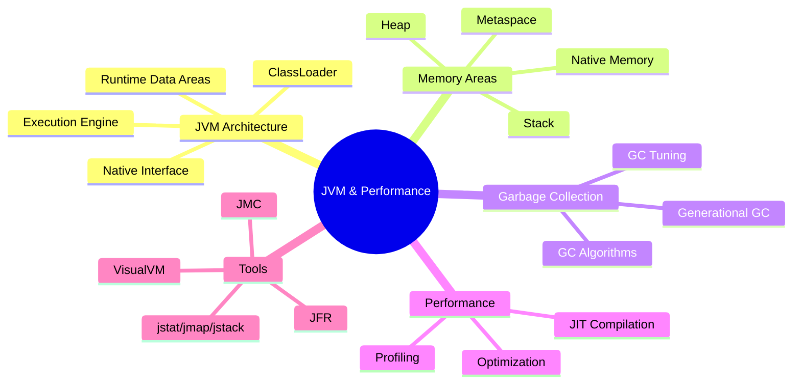

---

# 📦 SECȚIUNEA 1: JVM ARCHITECTURE

## Q261: Ce este JVM și care este rolul ei?

### JVM Architecture Overview

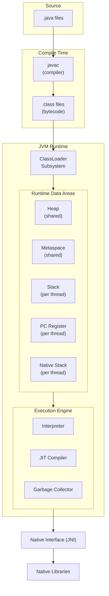

**Răspuns Complet:**
JVM (Java Virtual Machine) este motorul de execuție care:
- **Abstractizează hardware-ul** - "Write once, run anywhere"
- **Gestionează memoria** - Alocare automată + Garbage Collection
- **Execută bytecode** - Interpretare + JIT compilation
- **Oferă securitate** - Sandboxing, verificare bytecode

---

## Q264-Q265: ClassLoader System

### ClassLoader Hierarchy (Delegation Model)

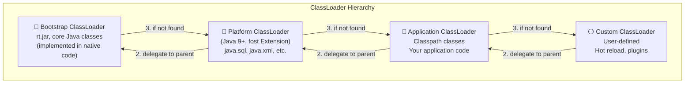

**Parent-First Delegation:**
1. ClassLoader primește cerere de încărcare
2. Delegă la parent (recursiv până la Bootstrap)
3. Dacă parent-ul nu găsește, încearcă singur

```java
// Verificare ClassLoader
public class ClassLoaderDemo {
    public static void main(String[] args) {
        // Bootstrap - returnează null (e nativ)
        System.out.println(String.class.getClassLoader()); 
        // null
        
        // Platform ClassLoader
        System.out.println(java.sql.Driver.class.getClassLoader());
        // jdk.internal.loader.ClassLoaders$PlatformClassLoader
        
        // Application ClassLoader  
        System.out.println(ClassLoaderDemo.class.getClassLoader());
        // jdk.internal.loader.ClassLoaders$AppClassLoader
    }
}
```

---

## Q266-Q267: Metaspace (înlocuiește PermGen)

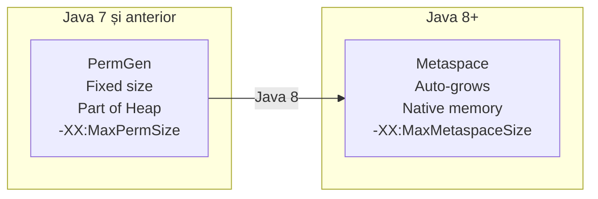

**De ce PermGen a fost eliminat:**
- Dimensiune fixă → OutOfMemoryError frecvent
- Greu de tunat corect
- Hot deploy problematic

**Metaspace conține:**
- Class metadata
- Method metadata  
- Constant pool
- Annotations

---

## Q268-Q271: Memory Structure

### JVM Memory Layout Detaliat

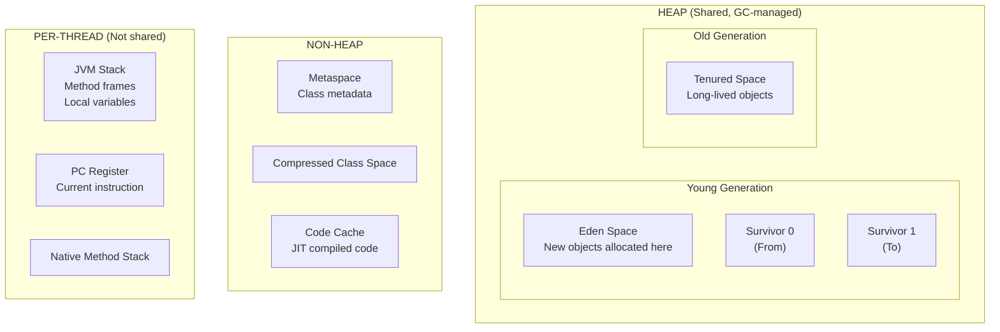

### Heap vs Stack Comparison

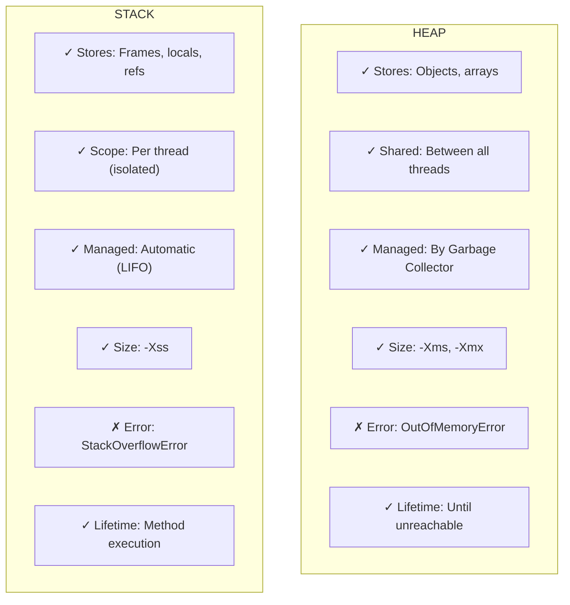

```java
public void memoryDemo() {
    // STACK: primitive locală
    int counter = 10;
    
    // STACK: referință (8 bytes pe 64-bit)
    // HEAP: obiectul String
    String name = "Alexandru";
    
    // STACK: referință
    // HEAP: obiectul User + toate field-urile sale
    User user = new User("Alex", 30);
    
    // STACK: referință
    // HEAP: array object + 100 Integer objects
    List<Integer> numbers = new ArrayList<>(100);
}

// Stack frame pentru metodă conține:
// 1. Local Variable Array (counter, name ref, user ref, numbers ref)
// 2. Operand Stack (pentru calcule)
// 3. Frame Data (return address, exception table ref)
```

---

# 📦 SECȚIUNEA 2: GARBAGE COLLECTION

## Q272-Q275: GC Fundamentals

### Ce este Garbage Collection?

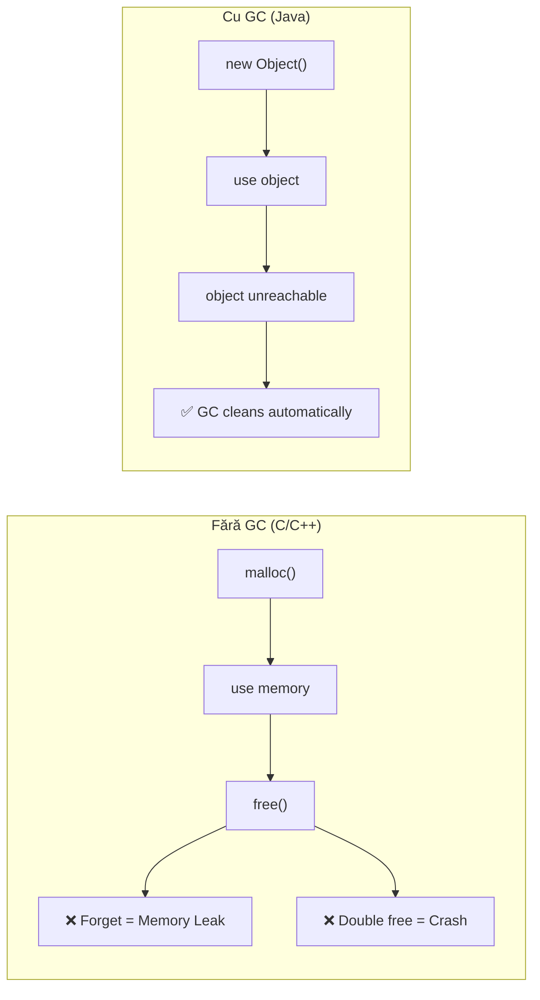

### Object Reachability (GC Roots)

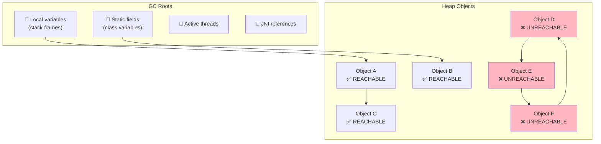

**Regula:** Un obiect este LIVE dacă este accesibil (direct sau indirect) din orice GC Root.

---

## Q276-Q277: Reference Types

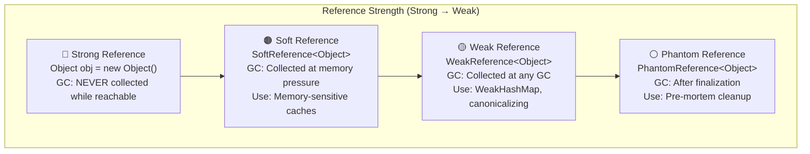

```java
// Strong Reference - normal
Object strong = new Object(); // Nu se colectează cât strong != null

// Soft Reference - cache memory-sensitive
SoftReference<byte[]> cache = new SoftReference<>(new byte[1024*1024]);
byte[] data = cache.get(); // poate fi null dacă GC a curățat

// Weak Reference - nu previne GC
WeakReference<Object> weak = new WeakReference<>(new Object());
// Obiectul poate fi colectat la orice GC

// WeakHashMap - cheile sunt weak references
Map<Key, Value> cache = new WeakHashMap<>();
// Entry-urile dispar când cheia nu mai e referențiată altundeva
```

---

## Q278-Q282: Generational GC

### Generational Hypothesis

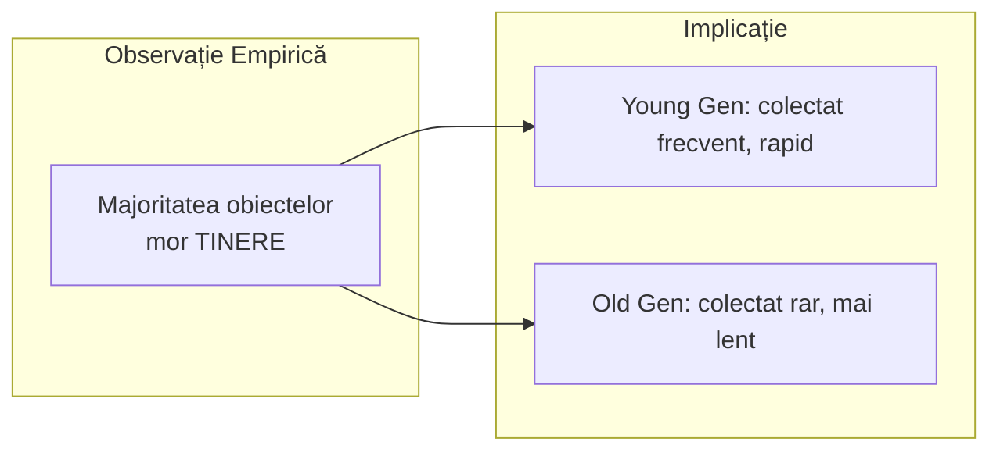

### Object Lifecycle în Generational GC

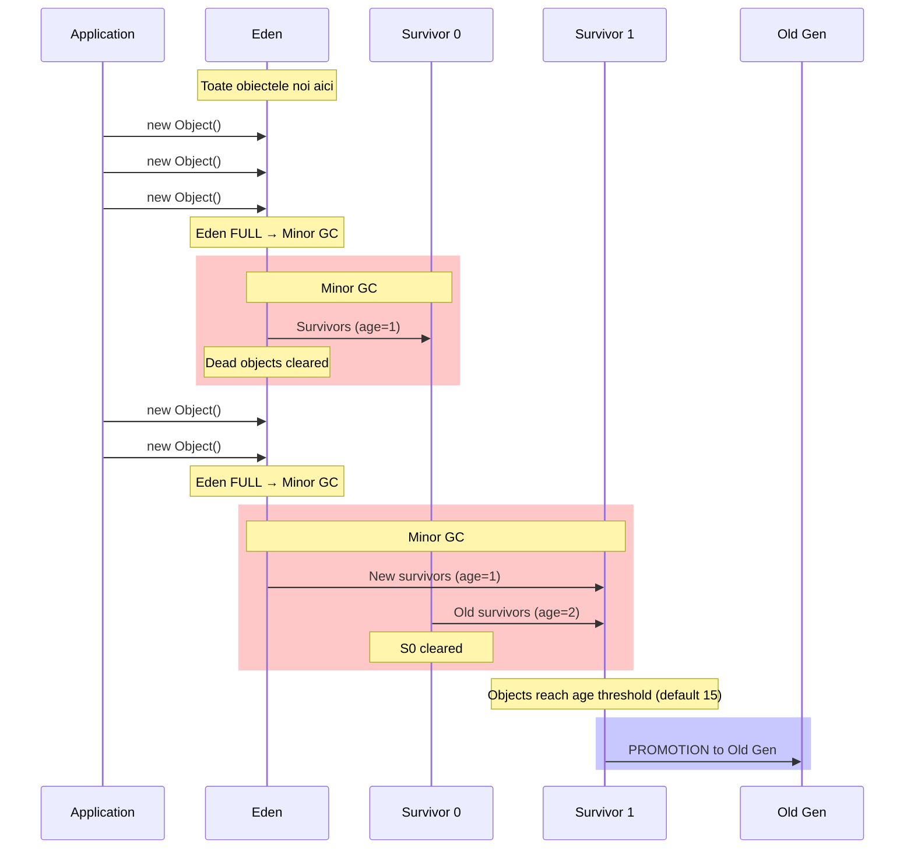

### Minor GC vs Major GC vs Full GC

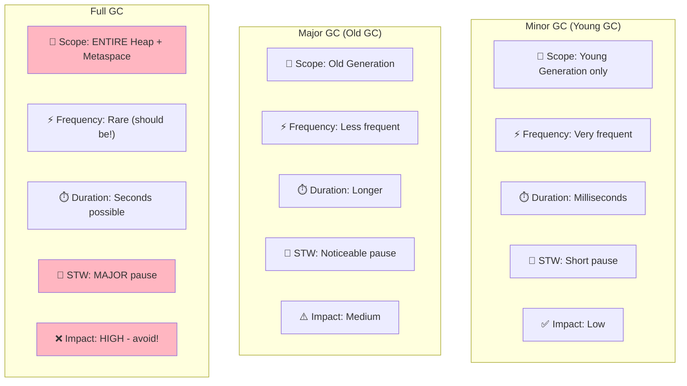

---

## Q286-Q292: GC Algorithms

### GC Algorithms Comparison

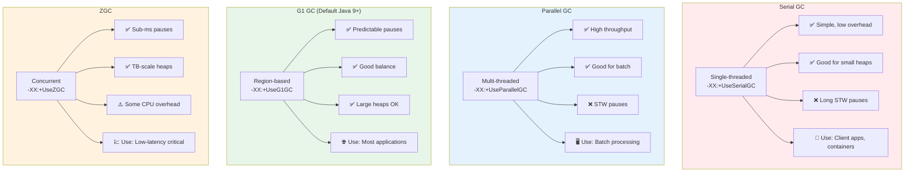

### G1 GC Region-Based Architecture

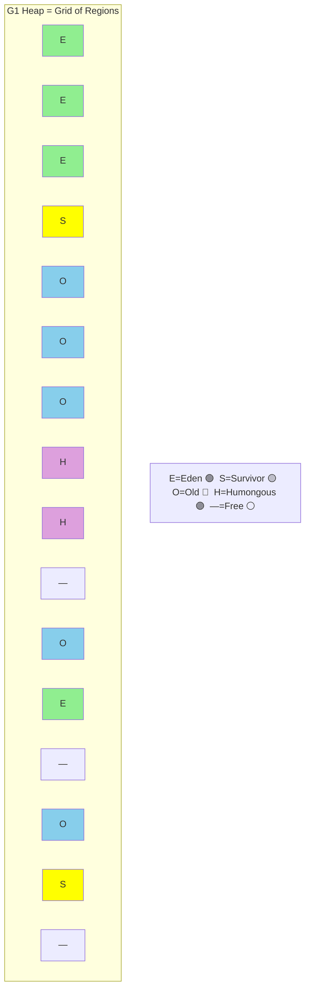

**G1 Key Features:**
- Heap împărțit în regiuni egale (1-32MB)
- Colectează regiunile cu cel mai mult "garbage" first
- Target pause time: `-XX:MaxGCPauseMillis=200`

### When to Use Which GC

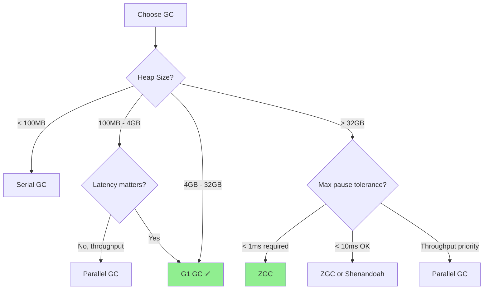

---

# 📦 SECȚIUNEA 3: MEMORY ISSUES

## Q294-Q297: OutOfMemoryError Types

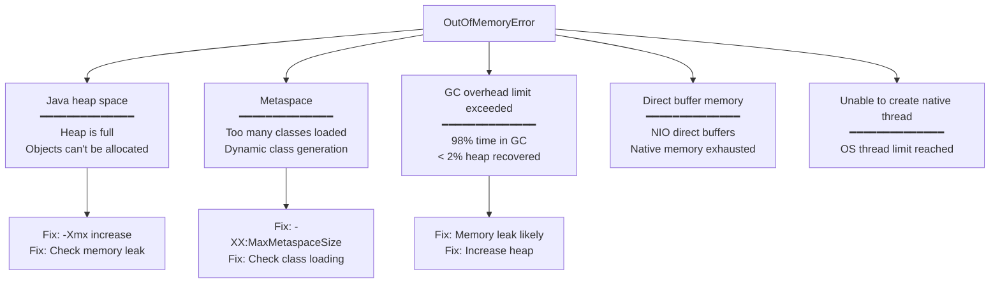

## Q294-Q295: Memory Leak Patterns

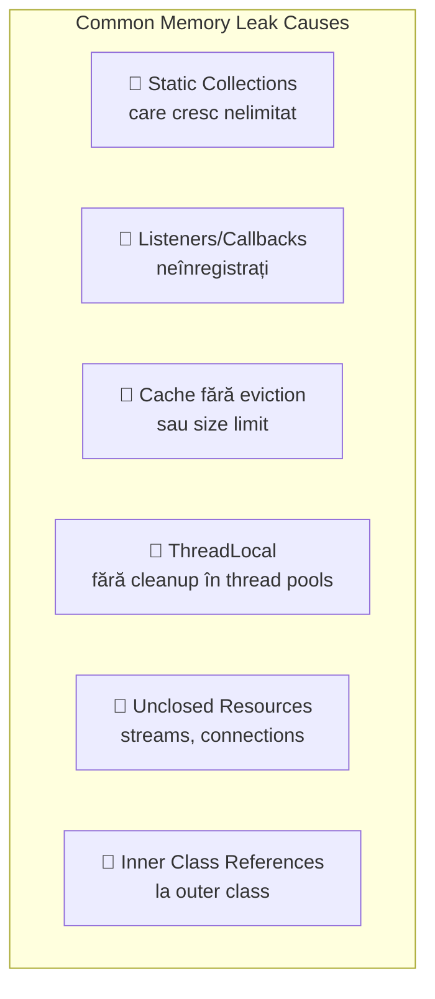

```java
// ❌ MEMORY LEAK: Static collection grows forever
public class LeakyService {
    // Crește la infinit!
    private static final List<Event> eventLog = new ArrayList<>();
    
    public void logEvent(Event e) {
        eventLog.add(e); // Never removed!
    }
}

// ✅ FIX: Bounded cache
public class FixedService {
    private static final int MAX_SIZE = 1000;
    private static final Queue<Event> eventLog = new LinkedBlockingQueue<>(MAX_SIZE);
    
    public void logEvent(Event e) {
        if (!eventLog.offer(e)) {
            eventLog.poll(); // Remove oldest
            eventLog.offer(e);
        }
    }
}

// ❌ MEMORY LEAK: ThreadLocal in thread pool
public class LeakyThreadLocal {
    private static final ThreadLocal<HeavyObject> context = new ThreadLocal<>();
    
    public void process() {
        context.set(new HeavyObject());
        doWork();
        // FORGOT context.remove()!
        // Thread goes back to pool with HeavyObject still attached
    }
}

// ✅ FIX: Always remove in finally
public void processSafe() {
    try {
        context.set(new HeavyObject());
        doWork();
    } finally {
        context.remove(); // CRITICAL in thread pools!
    }
}

// ❌ MEMORY LEAK: Listener not removed
public class LeakyObserver {
    public void init() {
        eventBus.register(this); // Registered
    }
    // No unregister on destroy → this object never GC'd
}

// ✅ FIX: Proper lifecycle
public class FixedObserver implements AutoCloseable {
    public void init() {
        eventBus.register(this);
    }
    
    @Override
    public void close() {
        eventBus.unregister(this); // Clean up!
    }
}
```

---

# 📦 SECȚIUNEA 4: JIT COMPILATION

## Q299-Q305: JIT Compiler

### Tiered Compilation

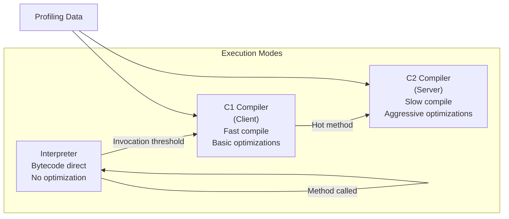

### JIT Optimization Techniques

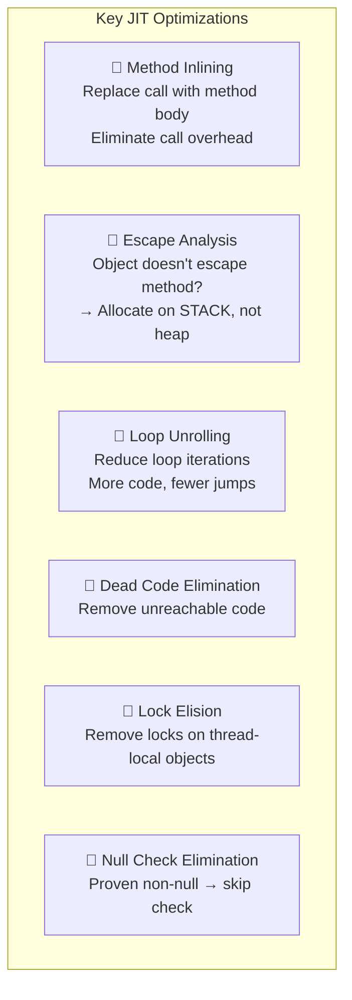

```java
// Escape Analysis Example
public long sumPoints() {
    long sum = 0;
    for (int i = 0; i < 1000; i++) {
        // Point nu "scapă" din metodă
        // JIT poate aloca pe STACK (nu heap)
        // → No GC pressure!
        Point p = new Point(i, i * 2);
        sum += p.x + p.y;
    }
    return sum;
}

// Lock Elision Example
public void processLocal() {
    // Lock object e local, nu e partajat
    Object lock = new Object();
    synchronized (lock) {
        // JIT elimină lock-ul complet
        // pentru că lock nu e partajat
        doWork();
    }
}

// Method Inlining Example
public int calculate(int x) {
    return double(x) + 1; // Call to double()
}
private int double(int x) {
    return x * 2;
}
// After inlining:
// public int calculate(int x) {
//     return (x * 2) + 1;  // No method call
// }
```

---

# 📦 SECȚIUNEA 5: PROFILING & TOOLS

## Q306-Q311: Diagnostic Tools

### JVM Diagnostic Tools Overview

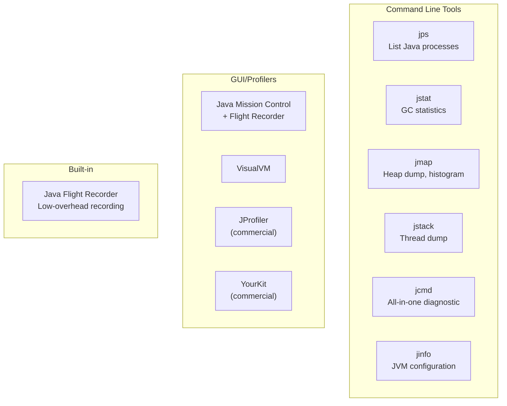

### Essential Commands

```bash
# List all Java processes
jps -l
# Output: 12345 com.example.MyApp

# GC statistics (every 1 second, 10 samples)
jstat -gcutil <pid> 1000 10
#  S0     S1     E      O      M     CCS    YGC   YGCT   FGC  FGCT   CGC  CGCT   GCT
# 45.23   0.00  67.89  34.56  95.12  91.23   145  1.234    3  0.567    -     -  1.801

# Heap histogram (quick memory check)
jmap -histo <pid> | head -30
# Shows top memory consumers by class

# Heap dump (for detailed analysis)
jmap -dump:format=b,file=heap.hprof <pid>

# Thread dump (for deadlock analysis)
jstack <pid> > threads.txt

# Flight Recording (low overhead profiling)
jcmd <pid> JFR.start duration=60s filename=recording.jfr

# View JVM flags
jcmd <pid> VM.flags
```

### Reading jstat Output

```
jstat -gcutil <pid> 1000

 S0     S1     E      O      M     CCS    YGC    YGCT   FGC   FGCT   CGC  CGCT    GCT
 0.00  45.23  78.56  34.12  95.45  92.34   234   2.345    5   1.234    12  0.123  3.702
 │      │      │      │      │      │       │      │      │     │      │    │      │
 │      │      │      │      │      │       │      │      │     │      │    │      └─ Total GC time
 │      │      │      │      │      │       │      │      │     │      │    └─ Concurrent GC time  
 │      │      │      │      │      │       │      │      │     │      └─ Concurrent GC count
 │      │      │      │      │      │       │      │      │     └─ Full GC time
 │      │      │      │      │      │       │      │      └─ Full GC count (should be LOW!)
 │      │      │      │      │      │       │      └─ Young GC time
 │      │      │      │      │      │       └─ Young GC count
 │      │      │      │      │      └─ Compressed Class Space %
 │      │      │      │      └─ Metaspace %
 │      │      │      └─ Old Gen % (watch this!)
 │      │      └─ Eden %
 │      └─ Survivor 1 %
 └─ Survivor 0 %
```

---

# 📦 SECȚIUNEA 6: JVM TUNING

## Q329-Q332: GC Tuning

### Tuning Decision Flowchart

```mermaid
flowchart TD
    A["Performance Problem?"] --> B{"High GC Pause?"}
    
    B -->|Yes| C{"Current GC?"}
    B -->|No| D{"High GC Frequency?"}
    
    C -->|"Parallel/Serial"| E["Switch to G1 or ZGC"]
    C -->|"G1"| F["Tune -XX:MaxGCPauseMillis<br/>Increase heap"]
    C -->|"ZGC"| G["Already optimal for latency"]
    
    D -->|Yes| H{"Allocation rate high?"}
    D -->|No| I["Check application logic"]
    
    H -->|Yes| J["Increase Young Gen<br/>-XX:NewRatio=2"]
    H -->|"Normal"| K["Possible memory leak!<br/>Heap dump analysis"]
```

### Key JVM Parameters

```java
// ═══════════════════════════════════════
// MEMORY SIZING
// ═══════════════════════════════════════

-Xms4g                    // Initial heap size
-Xmx4g                    // Maximum heap size
                          // TIP: Set equal for predictability

-XX:NewRatio=2            // Old:Young = 2:1
-XX:SurvivorRatio=8       // Eden:Survivor = 8:1

-XX:MaxMetaspaceSize=256m // Limit metaspace

-Xss256k                  // Thread stack size

// ═══════════════════════════════════════
// GC SELECTION
// ═══════════════════════════════════════

-XX:+UseG1GC              // G1 (default Java 9+)
-XX:+UseZGC               // ZGC (Java 15+)
-XX:+UseParallelGC        // Parallel (throughput)
-XX:+UseShenandoahGC      // Shenandoah

// ═══════════════════════════════════════
// G1 TUNING
// ═══════════════════════════════════════

-XX:MaxGCPauseMillis=200  // Target pause (default 200ms)
-XX:G1HeapRegionSize=16m  // Region size (1-32MB, auto)
-XX:InitiatingHeapOccupancyPercent=45  // Start concurrent GC

// ═══════════════════════════════════════
// GC LOGGING (Java 9+ Unified Logging)
// ═══════════════════════════════════════

-Xlog:gc*:file=gc.log:time,uptime,level:filecount=5,filesize=20m

// ═══════════════════════════════════════
// DIAGNOSTICS
// ═══════════════════════════════════════

-XX:+HeapDumpOnOutOfMemoryError
-XX:HeapDumpPath=/var/log/myapp/
-XX:+ExitOnOutOfMemoryError      // Restart container

-XX:NativeMemoryTracking=summary // Track native memory
```

### Production-Ready JVM Configuration

```bash
#!/bin/bash
# Production JVM flags for a typical web service

java \
  -Xms4g \
  -Xmx4g \
  -XX:+UseG1GC \
  -XX:MaxGCPauseMillis=200 \
  -XX:+UseStringDeduplication \
  -XX:+HeapDumpOnOutOfMemoryError \
  -XX:HeapDumpPath=/var/log/app/heap-dump.hprof \
  -XX:+ExitOnOutOfMemoryError \
  -Xlog:gc*:file=/var/log/app/gc.log:time,uptime:filecount=5,filesize=20m \
  -jar myapp.jar
```

---

# 📦 SECȚIUNEA 7: PERFORMANCE BEST PRACTICES

## Q326-Q340: Optimization Guidelines

### Performance Anti-Patterns

```mermaid
graph TB
    subgraph "❌ ANTI-PATTERNS"
        AP1["Premature Optimization<br/>Optimizing without measuring"]
        AP2["Object Pooling (usually)<br/>GC is very efficient"]
        AP3["Naive Microbenchmarks<br/>JIT not warmed up"]
        AP4["String += in loops<br/>Creates many objects"]
        AP5["Autoboxing in hot paths<br/>Integer vs int overhead"]
    end
    
    subgraph "✅ BEST PRACTICES"
        BP1["Measure First<br/>Profile before optimizing"]
        BP2["Trust the GC<br/>Let it manage memory"]
        BP3["Use JMH<br/>Proper benchmarking"]
        BP4["StringBuilder in loops<br/>Single buffer"]
        BP5["Primitive streams<br/>IntStream, LongStream"]
    end
```

```java
// ❌ String concatenation in loop
String result = "";
for (String item : items) {
    result += item;  // New String object each iteration!
}

// ✅ StringBuilder
StringBuilder sb = new StringBuilder();
for (String item : items) {
    sb.append(item);  // Single buffer
}
String result = sb.toString();

// ❌ Autoboxing overhead
List<Integer> numbers = getNumbers();
long sum = 0;
for (Integer n : numbers) {
    sum += n;  // Unboxing on every iteration!
}

// ✅ Primitive stream
long sum = numbers.stream()
    .mapToLong(Integer::longValue)
    .sum();

// ❌ Naive benchmark (WRONG!)
long start = System.currentTimeMillis();
for (int i = 0; i < 1000; i++) {
    doSomething();  // JIT hasn't optimized yet!
}
System.out.println("Time: " + (System.currentTimeMillis() - start));

// ✅ Use JMH (Java Microbenchmark Harness)
@Benchmark
@BenchmarkMode(Mode.AverageTime)
@OutputTimeUnit(TimeUnit.NANOSECONDS)
public void properBenchmark(Blackhole bh) {
    bh.consume(doSomething());
}
```

---

# 🎯 CHEAT SHEET - JVM & GC

## Quick Reference Table

| Problemă | Simptom | Diagnostic | Soluție |
|----------|---------|------------|---------|
| **OOM Heap** | "Java heap space" | `jmap -histo` | Crește -Xmx, fix leak |
| **OOM Metaspace** | "Metaspace" | Class histogram | -XX:MaxMetaspaceSize |
| **GC Overhead** | "GC overhead limit" | `jstat -gcutil` | Fix memory leak |
| **Long GC Pauses** | Latency spikes | GC logs | G1/ZGC, tune pause |
| **Frequent GC** | High CPU | `jstat -gcutil` | Increase heap |
| **Memory Leak** | Heap grows | Heap dump | MAT analysis |
| **Deadlock** | App frozen | `jstack` | Thread dump |

## GC Selection Quick Guide

```
┌─────────────────────────────────────────────────────────┐
│                   CHOOSE YOUR GC                        │
├─────────────────────────────────────────────────────────┤
│                                                         │
│  Heap < 4GB, simple app?     →  Serial GC              │
│                                                         │
│  Throughput priority?        →  Parallel GC            │
│  (batch, offline processing)                            │
│                                                         │
│  Balanced, general purpose?  →  G1 GC ✅ (default)     │
│  (most applications)                                    │
│                                                         │
│  Ultra-low latency?          →  ZGC                    │
│  (< 1ms pause required)                                 │
│                                                         │
│  Large heap, low latency?    →  Shenandoah             │
│                                                         │
└─────────────────────────────────────────────────────────┘
```

## Essential Flags Template

```bash
# Development
java -Xms512m -Xmx512m -XX:+UseG1GC -jar app.jar

# Production
java -Xms4g -Xmx4g \
     -XX:+UseG1GC \
     -XX:MaxGCPauseMillis=200 \
     -XX:+HeapDumpOnOutOfMemoryError \
     -Xlog:gc*:file=gc.log:time \
     -jar app.jar

# Low-latency
java -Xms8g -Xmx8g \
     -XX:+UseZGC \
     -jar app.jar
```

---

> 💡 **Regula de Aur JVM Performance:**  
> *"Măsoară înainte să optimizezi. Profilează în producție. Lasă GC-ul să-și facă treaba. Optimizează algoritmii, nu micro-detaliile."*
