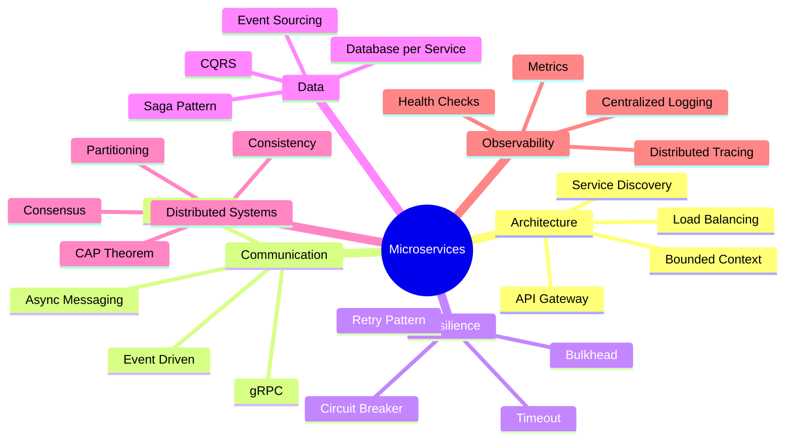
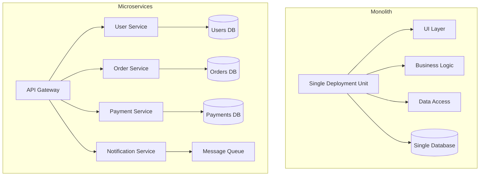
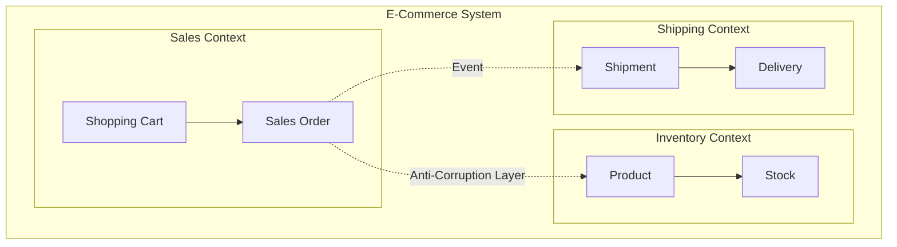
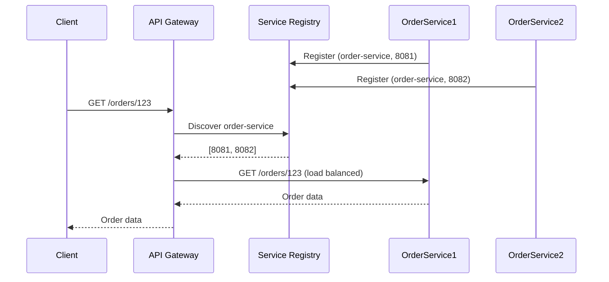
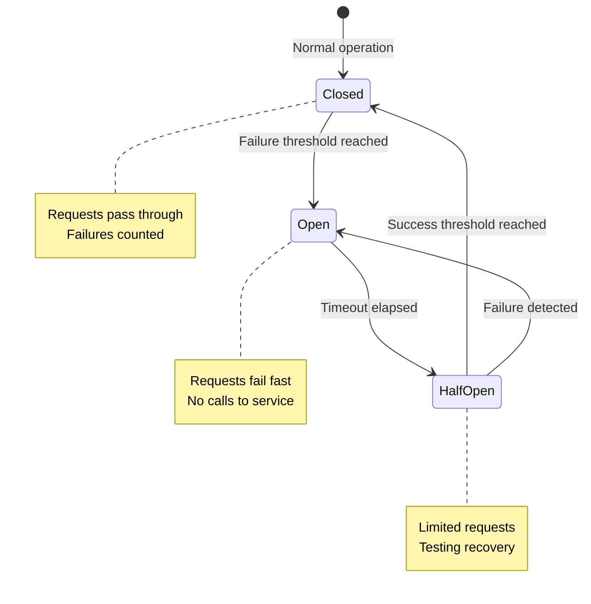
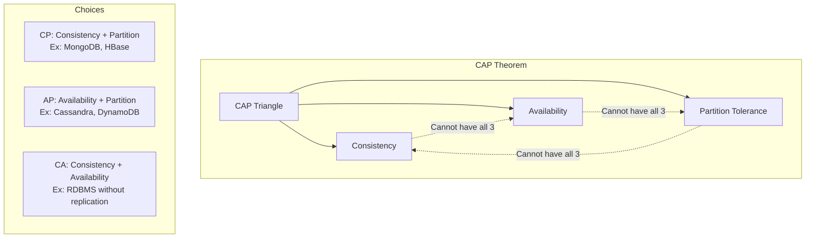
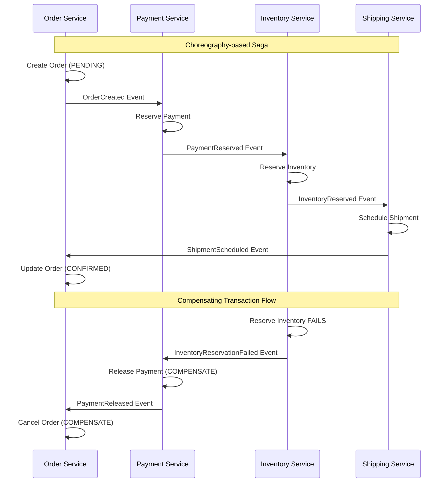

# Capitolul 10 – Microservicii & Distributed Systems
## Q741–Q820 – Nivel Senior

> 📚 Scop: Interviuri Senior / Lead / Staff
> 💾 Encoding: UTF-8

---

## 🎯 HARTĂ MENTALĂ



---

# 📦 SECȚIUNEA 1: MICROSERVICES FUNDAMENTALS

## Q741-746: Ce sunt Microserviciile?



**Microservicii** = Stil arhitectural unde o aplicație este compusă din servicii mici, independente, care comunică prin rețea.

**Caracteristici:**
- **Independently Deployable** - fiecare serviciu se poate deploya separat
- **Loosely Coupled** - schimbări într-un serviciu nu afectează altele
- **Organized around Business Capabilities** - aliniați la domeniul business
- **Owned by Small Teams** - autonomie și ownership clar

**Probleme rezolvate:**
- Monolith greu de scalat
- Deploy-uri riscante (all-or-nothing)
- Cuplare excesivă între componente
- Dificultate în adoptarea de tehnologii noi

---

## Q743-746: Bounded Context & DDD



**Bounded Context** (DDD) = Limită clară a unui model de domeniu, cu propriul limbaj ubiquu.

```java
// ══════════════════════════════════════════════════════
// SALES CONTEXT - "Order" înseamnă comandă de vânzare
// ══════════════════════════════════════════════════════
@Entity
@Table(name = "sales_orders")
public class Order {
    @Id
    private UUID id;
    
    private UUID customerId;
    private OrderStatus status;
    private Money totalAmount;
    
    @OneToMany(cascade = CascadeType.ALL)
    private List<OrderLine> orderLines;
    
    // Business logic specific Sales
    public void placeOrder() {
        if (orderLines.isEmpty()) {
            throw new DomainException("Cannot place empty order");
        }
        this.status = OrderStatus.PLACED;
        // Publish OrderPlaced event
    }
}

// ══════════════════════════════════════════════════════
// SHIPPING CONTEXT - "Order" înseamnă comandă de livrare
// ══════════════════════════════════════════════════════
@Entity
@Table(name = "shipping_orders")
public class ShippingOrder {
    @Id
    private UUID id;
    
    private UUID salesOrderId;  // Referință la Sales Context
    private Address deliveryAddress;
    private ShippingStatus status;
    
    @OneToMany(cascade = CascadeType.ALL)
    private List<Shipment> shipments;
    
    // Business logic specific Shipping
    public void scheduleDelivery(LocalDate date) {
        if (status != ShippingStatus.READY) {
            throw new DomainException("Order not ready for delivery");
        }
        // Schedule delivery logic
    }
}

// ══════════════════════════════════════════════════════
// Anti-Corruption Layer pentru comunicare între contexte
// ══════════════════════════════════════════════════════
@Service
public class ShippingOrderAdapter {
    
    private final SalesServiceClient salesServiceClient;
    
    // Traduce concepte din Sales Context în Shipping Context
    public ShippingOrder createFromSalesOrder(UUID salesOrderId) {
        SalesOrderDto salesOrder = salesServiceClient.getOrder(salesOrderId);
        
        // Mapare cu traducere conceptuală
        ShippingOrder shippingOrder = new ShippingOrder();
        shippingOrder.setSalesOrderId(salesOrderId);
        shippingOrder.setDeliveryAddress(
            translateAddress(salesOrder.getCustomerAddress())
        );
        shippingOrder.setStatus(ShippingStatus.READY);
        
        return shippingOrder;
    }
    
    private Address translateAddress(CustomerAddress customerAddress) {
        // Logica de traducere între modele
        return new Address(
            customerAddress.getStreet(),
            customerAddress.getCity(),
            customerAddress.getCountry()
        );
    }
}
```

**Principii DDD în Microservicii:**
- **Loose Coupling** - serviciile comunică prin interfețe bine definite
- **High Cohesion** - tot ce ține de un domeniu e într-un singur serviciu
- **Ubiquitous Language** - același vocabular între devs și business

---

# 📦 SECȚIUNEA 2: SERVICE DISCOVERY & COMMUNICATION

## Q747-750: Service Discovery & API Gateway



### Service Discovery cu Spring Cloud

```java
// ══════════════════════════════════════════════════════
// EUREKA SERVER - Service Registry
// ══════════════════════════════════════════════════════
@SpringBootApplication
@EnableEurekaServer
public class EurekaServerApplication {
    public static void main(String[] args) {
        SpringApplication.run(EurekaServerApplication.class, args);
    }
}

// application.yml
server:
  port: 8761

eureka:
  client:
    register-with-eureka: false
    fetch-registry: false
  server:
    enable-self-preservation: false

// ══════════════════════════════════════════════════════
// ORDER SERVICE - Eureka Client
// ══════════════════════════════════════════════════════
@SpringBootApplication
@EnableDiscoveryClient
public class OrderServiceApplication {
    public static void main(String[] args) {
        SpringApplication.run(OrderServiceApplication.class, args);
    }
}

// application.yml
spring:
  application:
    name: order-service

eureka:
  client:
    service-url:
      defaultZone: http://localhost:8761/eureka/
  instance:
    prefer-ip-address: true
    lease-renewal-interval-in-seconds: 30

// ══════════════════════════════════════════════════════
// SERVICE-TO-SERVICE COMMUNICATION
// ══════════════════════════════════════════════════════

// 1. RestTemplate cu Load Balancing
@Configuration
public class RestTemplateConfig {
    
    @Bean
    @LoadBalanced  // Activează client-side load balancing
    public RestTemplate restTemplate() {
        return new RestTemplate();
    }
}

@Service
public class OrderService {
    
    private final RestTemplate restTemplate;
    
    public Order getOrderWithUser(Long orderId) {
        Order order = orderRepository.findById(orderId).orElseThrow();
        
        // Folosește numele serviciului în loc de host:port
        String url = "http://user-service/api/users/" + order.getUserId();
        User user = restTemplate.getForObject(url, User.class);
        
        order.setUser(user);
        return order;
    }
}

// 2. OpenFeign - Declarative REST Client
@FeignClient(name = "user-service", fallback = UserServiceFallback.class)
public interface UserServiceClient {
    
    @GetMapping("/api/users/{id}")
    UserDto getUser(@PathVariable("id") Long id);
    
    @GetMapping("/api/users/email/{email}")
    UserDto getUserByEmail(@PathVariable("email") String email);
}

@Service
public class OrderService {
    
    private final UserServiceClient userServiceClient;
    
    public Order getOrderWithUser(Long orderId) {
        Order order = orderRepository.findById(orderId).orElseThrow();
        
        // Simplu și clean
        UserDto user = userServiceClient.getUser(order.getUserId());
        order.setUser(user);
        
        return order;
    }
}

// Fallback pentru resilience
@Component
public class UserServiceFallback implements UserServiceClient {
    
    @Override
    public UserDto getUser(Long id) {
        // Returnează date default sau din cache
        return UserDto.builder()
            .id(id)
            .name("Unknown User")
            .build();
    }
    
    @Override
    public UserDto getUserByEmail(String email) {
        return UserDto.builder()
            .email(email)
            .name("Unknown User")
            .build();
    }
}

// ══════════════════════════════════════════════════════
// API GATEWAY cu Spring Cloud Gateway
// ══════════════════════════════════════════════════════
@SpringBootApplication
public class ApiGatewayApplication {
    public static void main(String[] args) {
        SpringApplication.run(ApiGatewayApplication.class, args);
    }
}

// application.yml
spring:
  cloud:
    gateway:
      routes:
        - id: user-service
          uri: lb://user-service  # lb = load balanced via service discovery
          predicates:
            - Path=/api/users/**
          filters:
            - RewritePath=/api/users/(?<segment>.*), /${segment}
            - AddRequestHeader=X-Request-Source, gateway
            
        - id: order-service
          uri: lb://order-service
          predicates:
            - Path=/api/orders/**
          filters:
            - CircuitBreaker=orderServiceCircuitBreaker
            
      default-filters:
        - DedupeResponseHeader=Access-Control-Allow-Credentials Access-Control-Allow-Origin
        - AddResponseHeader=X-Response-Time, ${responseTime}

// Custom Gateway Filter
@Component
public class AuthenticationFilter implements GlobalFilter, Ordered {
    
    @Override
    public Mono<Void> filter(ServerWebExchange exchange, GatewayFilterChain chain) {
        ServerHttpRequest request = exchange.getRequest();
        
        // Verifică JWT token
        if (!request.getHeaders().containsKey("Authorization")) {
            exchange.getResponse().setStatusCode(HttpStatus.UNAUTHORIZED);
            return exchange.getResponse().setComplete();
        }
        
        String token = request.getHeaders().getFirst("Authorization");
        if (!jwtTokenProvider.validateToken(token)) {
            exchange.getResponse().setStatusCode(HttpStatus.UNAUTHORIZED);
            return exchange.getResponse().setComplete();
        }
        
        // Adaugă user info în header pentru downstream services
        String userId = jwtTokenProvider.getUserIdFromToken(token);
        ServerHttpRequest modifiedRequest = request.mutate()
            .header("X-User-Id", userId)
            .build();
        
        return chain.filter(exchange.mutate().request(modifiedRequest).build());
    }
    
    @Override
    public int getOrder() {
        return -1;  // Execută primul
    }
}
```

**Beneficii API Gateway:**
- **Single Entry Point** - un singur punct de acces pentru clienți
- **Cross-Cutting Concerns** - autentificare, rate limiting, logging centralizat
- **Protocol Translation** - REST → gRPC, HTTP → WebSocket
- **Request/Response Transformation** - adaptare la nevoi client

---

# 📦 SECȚIUNEA 3: RESILIENCE PATTERNS

## Q751-756: Circuit Breaker, Retry, Bulkhead



### Resilience4j Implementation

```java
// ══════════════════════════════════════════════════════
// CIRCUIT BREAKER
// ══════════════════════════════════════════════════════

// application.yml
resilience4j:
  circuitbreaker:
    instances:
      paymentService:
        register-health-indicator: true
        sliding-window-size: 10
        minimum-number-of-calls: 5
        failure-rate-threshold: 50
        wait-duration-in-open-state: 30s
        permitted-number-of-calls-in-half-open-state: 3
        automatic-transition-from-open-to-half-open-enabled: true

@Service
public class OrderService {
    
    private final PaymentServiceClient paymentServiceClient;
    private final CircuitBreakerRegistry circuitBreakerRegistry;
    
    @CircuitBreaker(name = "paymentService", fallbackMethod = "processPaymentFallback")
    public PaymentResult processPayment(Order order) {
        // Apel către Payment Service
        return paymentServiceClient.processPayment(
            new PaymentRequest(order.getId(), order.getTotalAmount())
        );
    }
    
    // Fallback method - TREBUIE să aibă aceeași semnătură + Exception
    private PaymentResult processPaymentFallback(Order order, Exception ex) {
        log.error("Payment service unavailable, using fallback", ex);
        
        // Opțiuni:
        // 1. Returnează rezultat din cache
        // 2. Pune în queue pentru procesare ulterioară
        // 3. Returnează rezultat parțial
        
        return PaymentResult.builder()
            .status(PaymentStatus.PENDING)
            .message("Payment queued for processing")
            .build();
    }
}

// ══════════════════════════════════════════════════════
// RETRY PATTERN
// ══════════════════════════════════════════════════════

// application.yml
resilience4j:
  retry:
    instances:
      inventoryService:
        max-attempts: 3
        wait-duration: 500ms
        retry-exceptions:
          - org.springframework.web.client.ResourceAccessException
          - java.util.concurrent.TimeoutException
        ignore-exceptions:
          - com.example.exception.BusinessException

@Service
public class OrderService {
    
    @Retry(name = "inventoryService", fallbackMethod = "checkStockFallback")
    public boolean checkStock(Long productId, int quantity) {
        return inventoryServiceClient.checkAvailability(productId, quantity);
    }
    
    private boolean checkStockFallback(Long productId, int quantity, Exception ex) {
        log.warn("Failed to check stock after retries", ex);
        // Conservativ: presupunem că nu e în stoc
        return false;
    }
}

// ══════════════════════════════════════════════════════
// BULKHEAD PATTERN - Izolare resurse
// ══════════════════════════════════════════════════════

// application.yml
resilience4j:
  bulkhead:
    instances:
      reportingService:
        max-concurrent-calls: 5
        max-wait-duration: 10s
  thread-pool-bulkhead:
    instances:
      heavyComputationService:
        max-thread-pool-size: 4
        core-thread-pool-size: 2
        queue-capacity: 100

@Service
public class ReportingService {
    
    // Semaphore-based bulkhead (pentru operații sincrone)
    @Bulkhead(name = "reportingService", fallbackMethod = "generateReportFallback")
    public Report generateReport(ReportRequest request) {
        // Operație costisitoare
        return heavyReportGeneration(request);
    }
    
    // Thread pool bulkhead (pentru operații asincrone)
    @Bulkhead(name = "heavyComputationService", type = Bulkhead.Type.THREADPOOL)
    @CompletableFuture
    public CompletableFuture<AnalysisResult> analyzeData(AnalysisRequest request) {
        return CompletableFuture.supplyAsync(() -> {
            // Analiză complexă
            return performAnalysis(request);
        });
    }
    
    private Report generateReportFallback(ReportRequest request, Exception ex) {
        return Report.placeholder("Report generation overloaded, try again later");
    }
}

// ══════════════════════════════════════════════════════
// TIMEOUT MANAGEMENT
// ══════════════════════════════════════════════════════

// application.yml
resilience4j:
  timelimiter:
    instances:
      externalService:
        timeout-duration: 3s
        cancel-running-future: true

@Service
public class ExternalApiService {
    
    @TimeLimiter(name = "externalService", fallbackMethod = "getDataFallback")
    public CompletableFuture<DataResponse> getDataAsync(String requestId) {
        return CompletableFuture.supplyAsync(() -> 
            externalApiClient.getData(requestId)
        );
    }
    
    private CompletableFuture<DataResponse> getDataFallback(String requestId, Exception ex) {
        return CompletableFuture.completedFuture(
            DataResponse.cached(requestId)
        );
    }
}

// ══════════════════════════════════════════════════════
// RATE LIMITER
// ══════════════════════════════════════════════════════

// application.yml
resilience4j:
  ratelimiter:
    instances:
      thirdPartyApi:
        limit-for-period: 10
        limit-refresh-period: 1s
        timeout-duration: 500ms

@Service
public class ThirdPartyIntegrationService {
    
    @RateLimiter(name = "thirdPartyApi", fallbackMethod = "callApiFallback")
    public ApiResponse callExternalApi(ApiRequest request) {
        return thirdPartyApiClient.call(request);
    }
    
    private ApiResponse callApiFallback(ApiRequest request, Exception ex) {
        if (ex instanceof RequestNotPermitted) {
            return ApiResponse.rateLimited();
        }
        return ApiResponse.error("Service temporarily unavailable");
    }
}

// ══════════════════════════════════════════════════════
// COMBINED PATTERNS
// ══════════════════════════════════════════════════════

@Service
public class ResilientOrderService {
    
    // Combină toate pattern-urile pentru maximă reziliență
    @CircuitBreaker(name = "paymentService")
    @Retry(name = "paymentService")
    @Bulkhead(name = "paymentService")
    @TimeLimiter(name = "paymentService")
    public CompletableFuture<PaymentResult> processPaymentResilient(Order order) {
        return CompletableFuture.supplyAsync(() -> 
            paymentServiceClient.processPayment(order)
        );
    }
}
```

**Anti-Patterns și Pitfalls:**
- ❌ **Retry Storm** - toate instanțele retry-uiesc simultan
- ❌ **Cascading Failures** - un serviciu lent blochează tot sistemul
- ❌ **Timeout Chains** - timeout-uri prea lungi în lanț
- ✅ **Solution:** Exponential backoff + jitter pentru retry
- ✅ **Solution:** Circuit breaker pentru fail-fast
- ✅ **Solution:** Timeout hierarchy (15s → 10s → 5s)

---

# 📦 SECȚIUNEA 4: DATA MANAGEMENT

## Q757-764: CAP Theorem, Eventual Consistency, Saga Pattern



### CAP Theorem & Consistency Models

```java
// ══════════════════════════════════════════════════════
// STRONG CONSISTENCY - toate nodurile văd aceleași date
// ══════════════════════════════════════════════════════

@Service
@Transactional  // ACID transaction
public class BankTransferService {
    
    private final AccountRepository accountRepository;
    
    // Strong consistency - sau totul, sau nimic
    public void transferMoney(Long fromAccountId, Long toAccountId, BigDecimal amount) {
        Account fromAccount = accountRepository.findById(fromAccountId).orElseThrow();
        Account toAccount = accountRepository.findById(toAccountId).orElseThrow();
        
        if (fromAccount.getBalance().compareTo(amount) < 0) {
            throw new InsufficientFundsException();
        }
        
        fromAccount.debit(amount);
        toAccount.credit(amount);
        
        accountRepository.save(fromAccount);
        accountRepository.save(toAccount);
        
        // Commit automat - ambele update-uri sau rollback
    }
}

// ══════════════════════════════════════════════════════
// EVENTUAL CONSISTENCY - datele converg în timp
// ══════════════════════════════════════════════════════

@Service
public class OrderService {
    
    private final OrderRepository orderRepository;
    private final EventPublisher eventPublisher;
    
    // Eventual consistency prin events
    public Order placeOrder(CreateOrderRequest request) {
        // 1. Creează comanda local
        Order order = new Order(request);
        order.setStatus(OrderStatus.PENDING);
        order = orderRepository.save(order);
        
        // 2. Publică event - alte servicii vor reacționa ASINCRON
        eventPublisher.publish(new OrderPlacedEvent(
            order.getId(),
            order.getCustomerId(),
            order.getItems()
        ));
        
        // 3. Returnează imediat - starea finală se va propaga eventual
        return order;
    }
}

// Inventory Service reacționează la event
@Service
public class InventoryEventHandler {
    
    @EventListener
    public void handleOrderPlaced(OrderPlacedEvent event) {
        try {
            // Rezervă stoc
            inventoryService.reserveItems(event.getOrderId(), event.getItems());
            
            // Publică success event
            eventPublisher.publish(new InventoryReservedEvent(event.getOrderId()));
            
        } catch (InsufficientStockException ex) {
            // Publică failure event
            eventPublisher.publish(new InventoryReservationFailedEvent(
                event.getOrderId(), 
                ex.getMessage()
            ));
        }
    }
}

// Order Service reacționează la răspuns
@Service
public class OrderEventHandler {
    
    @EventListener
    public void handleInventoryReserved(InventoryReservedEvent event) {
        Order order = orderRepository.findById(event.getOrderId()).orElseThrow();
        order.setStatus(OrderStatus.CONFIRMED);
        orderRepository.save(order);
    }
    
    @EventListener
    public void handleInventoryReservationFailed(InventoryReservationFailedEvent event) {
        Order order = orderRepository.findById(event.getOrderId()).orElseThrow();
        order.setStatus(OrderStatus.CANCELLED);
        order.setCancellationReason(event.getReason());
        orderRepository.save(order);
    }
}
```

### Saga Pattern - Distributed Transactions



```java
// ══════════════════════════════════════════════════════
// CHOREOGRAPHY-BASED SAGA - serviciile comunică prin events
// ══════════════════════════════════════════════════════

// Order Service - inițiază saga
@Service
public class OrderSagaService {
    
    private final OrderRepository orderRepository;
    private final EventPublisher eventPublisher;
    
    public Order createOrder(CreateOrderRequest request) {
        // Step 1: Creează comanda
        Order order = new Order(request);
        order.setSagaStatus(SagaStatus.STARTED);
        order = orderRepository.save(order);
        
        // Step 2: Publică event pentru următorul pas
        eventPublisher.publish(new OrderCreatedEvent(
            order.getId(),
            order.getCustomerId(),
            order.getTotalAmount(),
            order.getItems()
        ));
        
        return order;
    }
    
    // Handler pentru success final
    @EventListener
    public void handleShipmentScheduled(ShipmentScheduledEvent event) {
        Order order = orderRepository.findById(event.getOrderId()).orElseThrow();
        order.setStatus(OrderStatus.CONFIRMED);
        order.setSagaStatus(SagaStatus.COMPLETED);
        orderRepository.save(order);
    }
    
    // Compensating transaction
    @EventListener
    public void handlePaymentFailed(PaymentFailedEvent event) {
        Order order = orderRepository.findById(event.getOrderId()).orElseThrow();
        order.setStatus(OrderStatus.CANCELLED);
        order.setSagaStatus(SagaStatus.COMPENSATED);
        order.setCancellationReason(event.getReason());
        orderRepository.save(order);
    }
}

// Payment Service - pasul 2
@Service
public class PaymentSagaHandler {
    
    @EventListener
    public void handleOrderCreated(OrderCreatedEvent event) {
        try {
            // Rezervă bani
            PaymentReservation reservation = paymentService.reservePayment(
                event.getCustomerId(),
                event.getTotalAmount()
            );
            
            // Success - continuă saga
            eventPublisher.publish(new PaymentReservedEvent(
                event.getOrderId(),
                reservation.getId()
            ));
            
        } catch (InsufficientFundsException ex) {
            // Failure - inițiază compensare
            eventPublisher.publish(new PaymentFailedEvent(
                event.getOrderId(),
                "Insufficient funds"
            ));
        }
    }
    
    // Compensating transaction - eliberează banii
    @EventListener
    public void handleInventoryFailed(InventoryReservationFailedEvent event) {
        // Găsește rezervarea
        PaymentReservation reservation = paymentRepository
            .findByOrderId(event.getOrderId())
            .orElseThrow();
        
        // Eliberează banii
        paymentService.releaseReservation(reservation.getId());
        
        // Notifică
        eventPublisher.publish(new PaymentReleasedEvent(event.getOrderId()));
    }
}

// Inventory Service - pasul 3
@Service
public class InventorySagaHandler {
    
    @EventListener
    public void handlePaymentReserved(PaymentReservedEvent event) {
        try {
            // Rezervă produse
            inventoryService.reserveItems(event.getOrderId(), event.getItems());
            
            // Success
            eventPublisher.publish(new InventoryReservedEvent(event.getOrderId()));
            
        } catch (InsufficientStockException ex) {
            // Failure - trigger compensare upstream
            eventPublisher.publish(new InventoryReservationFailedEvent(
                event.getOrderId(),
                ex.getMessage()
            ));
        }
    }
}

// ══════════════════════════════════════════════════════
// ORCHESTRATION-BASED SAGA - orchestrator central
// ══════════════════════════════════════════════════════

@Service
public class OrderSagaOrchestrator {
    
    private final OrderRepository orderRepository;
    private final PaymentServiceClient paymentService;
    private final InventoryServiceClient inventoryService;
    private final ShippingServiceClient shippingService;
    
    public Order executeOrderSaga(CreateOrderRequest request) {
        // Creează order
        Order order = new Order(request);
        order = orderRepository.save(order);
        
        SagaState state = new SagaState(order.getId());
        
        try {
            // Step 1: Payment
            state.setCurrentStep(SagaStep.PAYMENT);
            PaymentResult payment = paymentService.reservePayment(
                order.getCustomerId(), 
                order.getTotalAmount()
            );
            state.setPaymentId(payment.getId());
            
            // Step 2: Inventory
            state.setCurrentStep(SagaStep.INVENTORY);
            InventoryResult inventory = inventoryService.reserveItems(
                order.getId(), 
                order.getItems()
            );
            state.setInventoryReservationId(inventory.getId());
            
            // Step 3: Shipping
            state.setCurrentStep(SagaStep.SHIPPING);
            ShippingResult shipping = shippingService.scheduleDelivery(
                order.getId(),
                order.getDeliveryAddress()
            );
            state.setShipmentId(shipping.getId());
            
            // Success - commit
            order.setStatus(OrderStatus.CONFIRMED);
            orderRepository.save(order);
            
            return order;
            
        } catch (Exception ex) {
            // Failure - compensate în ordine inversă
            compensate(state, ex);
            throw new SagaCompensationException("Order saga failed", ex);
        }
    }
    
    private void compensate(SagaState state, Exception originalException) {
        try {
            // Compensate în ordine inversă
            switch (state.getCurrentStep()) {
                case SHIPPING:
                    shippingService.cancelShipment(state.getShipmentId());
                    // fall through
                case INVENTORY:
                    inventoryService.releaseReservation(state.getInventoryReservationId());
                    // fall through
                case PAYMENT:
                    paymentService.releasePayment(state.getPaymentId());
                    break;
            }
        } catch (Exception compensationEx) {
            log.error("Compensation failed", compensationEx);
            // Poate fi nevoie de intervenție manuală
        }
    }
}
```

**Choreography vs Orchestration:**

| Aspect | Choreography | Orchestration |
|--------|-------------|---------------|
| Control | Descentralizat | Centralizat |
| Coupling | Loose | Tighter |
| Complexity | Crește cu nr. de servicii | Liniară |
| Debugging | Mai greu | Mai ușor |
| Use Case | Fluxuri simple, 2-3 servicii | Fluxuri complexe, multe servicii |

---

## Q789-794: Database per Service & CQRS

```java
// ══════════════════════════════════════════════════════
// DATABASE PER SERVICE - fiecare serviciu are DB proprie
// ══════════════════════════════════════════════════════

// Order Service - PostgreSQL
@Entity
@Table(name = "orders")
public class Order {
    @Id @GeneratedValue
    private Long id;
    
    private Long userId;  // NU foreign key către User Service!
    private OrderStatus status;
    private BigDecimal total;
}

// User Service - MySQL
@Entity
@Table(name = "users")
public class User {
    @Id @GeneratedValue
    private Long id;
    
    private String email;
    private String name;
}

// Problema: cum obținem date din ambele servicii?
// Soluție 1: API Composition
@Service
public class OrderQueryService {
    
    private final OrderRepository orderRepository;
    private final UserServiceClient userServiceClient;
    
    public OrderWithUserDto getOrderWithUser(Long orderId) {
        Order order = orderRepository.findById(orderId).orElseThrow();
        UserDto user = userServiceClient.getUser(order.getUserId());
        
        return new OrderWithUserDto(order, user);
    }
}

// Soluție 2: Data Replication prin Events
@Service
public class OrderUserCache {
    
    // Păstrează o copie locală a datelor user (denormalizat)
    @EventListener
    public void handleUserUpdated(UserUpdatedEvent event) {
        // Actualizează cache-ul local
        userCacheRepository.save(new UserCache(
            event.getUserId(),
            event.getEmail(),
            event.getName()
        ));
    }
}

// ══════════════════════════════════════════════════════
// CQRS (Command Query Responsibility Segregation)
// ══════════════════════════════════════════════════════

// Write Model (Command Side) - normalizat, business logic
@Entity
@Table(name = "orders")
public class Order {
    @Id @GeneratedValue
    private Long id;
    
    @ManyToOne
    private User user;
    
    @OneToMany(mappedBy = "order", cascade = CascadeType.ALL)
    private List<OrderItem> items = new ArrayList<>();
    
    // Business methods
    public void addItem(Product product, int quantity) {
        OrderItem item = new OrderItem(this, product, quantity);
        items.add(item);
        recalculateTotal();
    }
}

// Read Model (Query Side) - denormalizat, optimizat pentru citire
@Entity
@Table(name = "order_view")
@Immutable  // Hibernate optimization
public class OrderView {
    @Id
    private Long id;
    
    // Toate datele flatten pentru query rapid
    private Long userId;
    private String userName;
    private String userEmail;
    private OrderStatus status;
    private BigDecimal total;
    private int itemCount;
    private LocalDateTime createdAt;
    
    // Fără relații, fără lazy loading
}

// Command Handler - scrie în Write Model
@Service
public class OrderCommandHandler {
    
    private final OrderRepository orderRepository;
    private final EventPublisher eventPublisher;
    
    @Transactional
    public void handleCreateOrder(CreateOrderCommand command) {
        Order order = new Order(command);
        order = orderRepository.save(order);
        
        // Publică event pentru Read Model
        eventPublisher.publish(new OrderCreatedEvent(
            order.getId(),
            order.getUser().getId(),
            order.getUser().getName(),
            order.getItems(),
            order.getTotal()
        ));
    }
}

// Query Handler - citește din Read Model
@Service
public class OrderQueryHandler {
    
    private final OrderViewRepository orderViewRepository;
    
    @Transactional(readOnly = true)
    public Page<OrderView> handleGetOrders(GetOrdersQuery query) {
        // Query simplu și rapid pe view
        return orderViewRepository.findByUserId(
            query.getUserId(),
            PageRequest.of(query.getPage(), query.getSize())
        );
    }
}

// Read Model Updater - sincronizează Read Model
@Service
public class OrderViewUpdater {
    
    private final OrderViewRepository orderViewRepository;
    
    @Async
    @EventListener
    public void handleOrderCreated(OrderCreatedEvent event) {
        OrderView view = new OrderView();
        view.setId(event.getOrderId());
        view.setUserId(event.getUserId());
        view.setUserName(event.getUserName());
        view.setTotal(event.getTotal());
        view.setItemCount(event.getItems().size());
        view.setCreatedAt(LocalDateTime.now());
        
        orderViewRepository.save(view);
    }
    
    @Async
    @EventListener
    public void handleOrderStatusChanged(OrderStatusChangedEvent event) {
        OrderView view = orderViewRepository.findById(event.getOrderId())
            .orElseThrow();
        view.setStatus(event.getNewStatus());
        orderViewRepository.save(view);
    }
}
```

**Când să folosești CQRS:**
- ✅ Query-uri complexe cu multe JOIN-uri
- ✅ Performance-ul citirii e critic
- ✅ Modele diferite pentru citire/scriere
- ❌ Aplicații CRUD simple
- ❌ Strong consistency e absolut necesară

---

# 📦 SECȚIUNEA 5: OBSERVABILITY

## Q778-783: Distributed Tracing, Logging, Metrics

```java
// ══════════════════════════════════════════════════════
// DISTRIBUTED TRACING cu Spring Cloud Sleuth + Zipkin
// ══════════════════════════════════════════════════════

// application.yml
spring:
  sleuth:
    sampler:
      probability: 1.0  # 100% sampling pentru dev
  zipkin:
    base-url: http://localhost:9411

// Sleuth adaugă automat trace ID și span ID în log-uri
// [order-service,a1b2c3d4,e5f6g7h8,true]
//  ^service     ^traceId ^spanId  ^exportable

@Slf4j
@Service
public class OrderService {
    
    private final UserServiceClient userServiceClient;
    
    public Order createOrder(CreateOrderRequest request) {
        // Sleuth propagă automat trace ID la toate serviciile
        log.info("Creating order for user {}", request.getUserId());
        
        // Acest apel va avea același trace ID
        User user = userServiceClient.getUser(request.getUserId());
        
        Order order = new Order(user, request.getItems());
        order = orderRepository.save(order);
        
        log.info("Order created with ID {}", order.getId());
        return order;
    }
}

// Custom Span pentru operații importante
@Service
public class PaymentService {
    
    private final Tracer tracer;
    
    public PaymentResult processPayment(PaymentRequest request) {
        // Creează un span nou pentru operația de procesare
        Span span = tracer.nextSpan().name("payment.process").start();
        
        try (Tracer.SpanInScope ws = tracer.withSpan(span)) {
            span.tag("payment.amount", request.getAmount().toString());
            span.tag("payment.method", request.getMethod());
            
            // Business logic
            PaymentResult result = externalPaymentGateway.process(request);
            
            span.tag("payment.status", result.getStatus().toString());
            return result;
            
        } catch (Exception ex) {
            span.error(ex);
            throw ex;
        } finally {
            span.end();
        }
    }
}

// ══════════════════════════════════════════════════════
// CENTRALIZED LOGGING cu ELK Stack
// ══════════════════════════════════════════════════════

// logback-spring.xml
<?xml version="1.0" encoding="UTF-8"?>
<configuration>
    <include resource="org/springframework/boot/logging/logback/defaults.xml"/>
    
    <springProperty scope="context" name="serviceName" source="spring.application.name"/>
    
    <!-- JSON format pentru Logstash -->
    <appender name="LOGSTASH" class="net.logstash.logback.appender.LogstashTcpSocketAppender">
        <destination>localhost:5000</destination>
        <encoder class="net.logstash.logback.encoder.LogstashEncoder">
            <customFields>{"service":"${serviceName}"}</customFields>
        </encoder>
    </appender>
    
    <root level="INFO">
        <appender-ref ref="LOGSTASH"/>
    </root>
</configuration>

// Structured Logging
@Slf4j
@Service
public class OrderService {
    
    public Order createOrder(CreateOrderRequest request) {
        // Structured logging cu Logstash
        log.info("Creating order", 
            kv("userId", request.getUserId()),
            kv("itemCount", request.getItems().size()),
            kv("totalAmount", request.getTotalAmount())
        );
        
        // ...
    }
}

// ══════════════════════════════════════════════════════
// METRICS cu Micrometer + Prometheus
// ══════════════════════════════════════════════════════

// application.yml
management:
  endpoints:
    web:
      exposure:
        include: health,info,metrics,prometheus
  metrics:
    export:
      prometheus:
        enabled: true
    tags:
      application: ${spring.application.name}

@Configuration
public class MetricsConfig {
    
    @Bean
    public MeterRegistryCustomizer<MeterRegistry> metricsCommonTags() {
        return registry -> registry.config()
            .commonTags("service", "order-service")
            .commonTags("environment", "production");
    }
}

@Service
public class OrderService {
    
    private final MeterRegistry meterRegistry;
    private final Counter orderCreatedCounter;
    private final Timer orderProcessingTimer;
    
    public OrderService(MeterRegistry meterRegistry) {
        this.meterRegistry = meterRegistry;
        
        // Counter pentru ordere create
        this.orderCreatedCounter = Counter.builder("orders.created")
            .description("Total orders created")
            .tag("service", "order")
            .register(meterRegistry);
        
        // Timer pentru durata procesării
        this.orderProcessingTimer = Timer.builder("orders.processing.time")
            .description("Order processing duration")
            .tag("service", "order")
            .register(meterRegistry);
    }
    
    public Order createOrder(CreateOrderRequest request) {
        return orderProcessingTimer.record(() -> {
            try {
                Order order = processOrder(request);
                
                // Incrementează counter
                orderCreatedCounter.increment();
                
                // Gauge pentru valoare curentă
                meterRegistry.gauge("orders.total.amount", order.getTotalAmount());
                
                return order;
                
            } catch (Exception ex) {
                // Metric pentru erori
                meterRegistry.counter("orders.errors", "type", ex.getClass().getSimpleName())
                    .increment();
                throw ex;
            }
        });
    }
}

// ══════════════════════════════════════════════════════
// HEALTH CHECKS
// ══════════════════════════════════════════════════════

@Component
public class DatabaseHealthIndicator implements HealthIndicator {
    
    private final DataSource dataSource;
    
    @Override
    public Health health() {
        try (Connection conn = dataSource.getConnection()) {
            if (conn.isValid(1)) {
                return Health.up()
                    .withDetail("database", "PostgreSQL")
                    .withDetail("validationQuery", "SELECT 1")
                    .build();
            }
        } catch (Exception ex) {
            return Health.down()
                .withException(ex)
                .build();
        }
        return Health.down().build();
    }
}

@Component
public class ExternalApiHealthIndicator implements HealthIndicator {
    
    private final RestTemplate restTemplate;
    
    @Override
    public Health health() {
        try {
            ResponseEntity<String> response = restTemplate.getForEntity(
                "https://api.external.com/health", 
                String.class
            );
            
            if (response.getStatusCode().is2xxSuccessful()) {
                return Health.up()
                    .withDetail("api", "external-api")
                    .withDetail("status", response.getStatusCode())
                    .build();
            }
        } catch (Exception ex) {
            return Health.down()
                .withDetail("api", "external-api")
                .withException(ex)
                .build();
        }
        return Health.down().build();
    }
}
```

---

# 🎯 CHEAT SHEET MICROSERVICES

## Design Principles

| Principle | Description |
|-----------|-------------|
| **Single Responsibility** | Un serviciu = un business capability |
| **Autonomy** | Deploy independent, fără coordonare |
| **Resilience** | Design pentru failure |
| **Observability** | Metrics, logs, traces pentru toate |
| **Automation** | CI/CD, infrastructure as code |
| **Decentralization** | Date, governance, technology |

## Communication Patterns

```java
// Sync (REST)
UserDto user = restTemplate.getForObject("http://user-service/api/users/{id}", UserDto.class, userId);

// Sync (gRPC) - mai rapid, type-safe
UserResponse user = userServiceStub.getUser(GetUserRequest.newBuilder().setId(userId).build());

// Async (Message Queue)
rabbitTemplate.convertAndSend("orders.exchange", "order.created", orderEvent);

// Async (Kafka)
kafkaTemplate.send("orders-topic", orderId, orderEvent);

// Event-Driven
eventPublisher.publish(new OrderCreatedEvent(order));
```

## Resilience Patterns

| Pattern | Purpose | Implementation |
|---------|---------|----------------|
| Circuit Breaker | Fail fast când downstream e jos | Resilience4j |
| Retry | Reîncearcă la erori tranzitorii | Resilience4j |
| Timeout | Limitează durata wait-ului | Resilience4j |
| Bulkhead | Izolează resurse | Thread pools |
| Rate Limiter | Previne overload | Bucket4j |

## Data Patterns

| Pattern | Use Case |
|---------|----------|
| Database per Service | Autonomie maximă |
| Shared Database | ❌ Anti-pattern |
| Saga | Distributed transactions |
| CQRS | Separate read/write models |
| Event Sourcing | Audit trail complet |
| API Composition | Join data la runtime |
| Data Replication | Denormalizare pentru performance |

## Observability Stack

```
Metrics:     Prometheus + Grafana
Logs:        ELK Stack (Elasticsearch, Logstash, Kibana)
Tracing:     Zipkin / Jaeger
APM:         New Relic / Datadog / Dynatrace
```

## Common Pitfalls

- ❌ **Distributed Monolith** - microservicii strâns cuplate
- ❌ **Data Coupling** - shared database între servicii
- ❌ **Chatty Services** - prea multe apeluri sync
- ❌ **Lack of Automation** - deploy manual
- ❌ **Insufficient Monitoring** - blind spots
- ❌ **No Circuit Breakers** - cascading failures
- ❌ **Ignoring Network Latency** - presupuneri optimiste

---

> 💡 **Regula de Aur Microservicii:**  
> *"Rețeaua NU este fiabilă. Design pentru failure, nu pentru success. Monitorizează tot, automatizează tot, și pregătește-te pentru dezastre!"*
