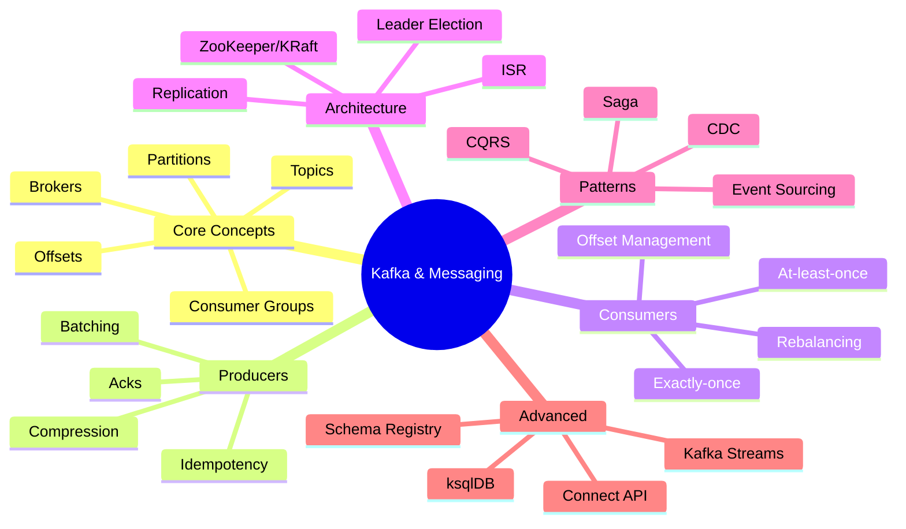
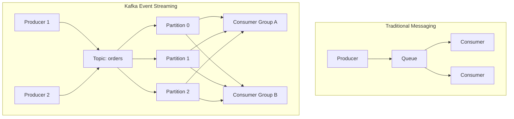
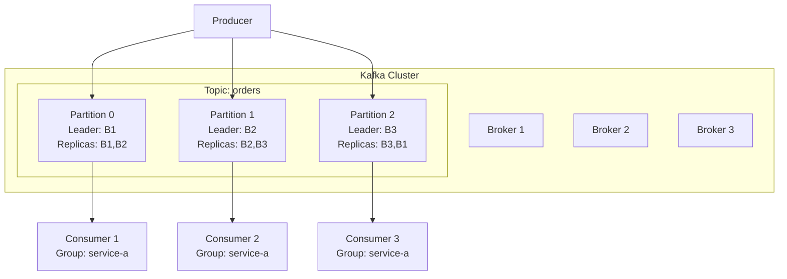
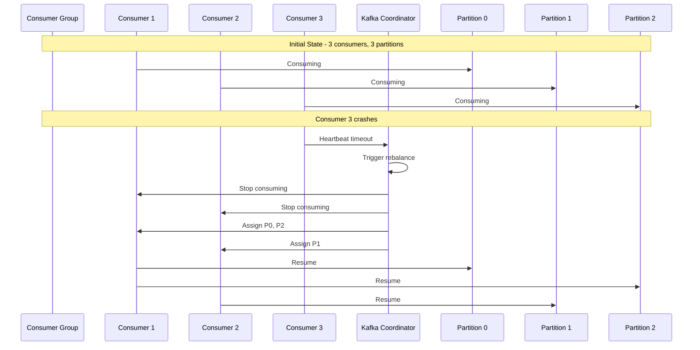
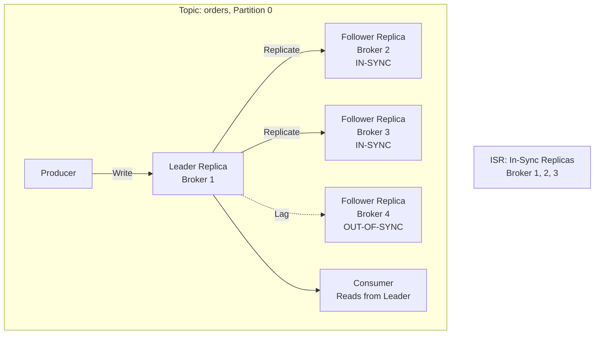

# Capitolul 11 – Messaging, Kafka & Event Streaming
## Q821–Q900 – Nivel Senior

> 📚 Scop: Interviuri Senior / Lead / Staff
> 💾 Encoding: UTF-8

---

## 🎯 HARTĂ MENTALĂ



---

# 📦 SECȚIUNEA 1: KAFKA FUNDAMENTALS

## Q821-825: Ce este Kafka și de ce există?



**Apache Kafka** = Platformă distribuită de event streaming, proiectată pentru throughput mare și persistență.

**Probleme rezolvate:**
- **High Throughput** - milioane de mesaje/secundă
- **Scalability** - creștere orizontală prin partitioning
- **Durability** - persistență pe disk, replicare
- **Replay** - consumatori pot reciti istoricul
- **Decoupling** - producători și consumatori independenți

**Diferențe față de messaging tradițional (RabbitMQ):**

| Aspect | Kafka | RabbitMQ |
|--------|-------|----------|
| Model | Log distribuit | Message broker |
| Persistență | Da, implicit | Opțional |
| Throughput | Foarte mare | Mediu |
| Ordering | Per partition | Per queue |
| Replay | Da | Nu |
| Use Case | Event streaming | Task queues |

---

## Q826-833: Core Concepts



### Topic, Partition, Offset

```java
// ══════════════════════════════════════════════════════
// PRODUCER - scrie în topic
// ══════════════════════════════════════════════════════

@Configuration
public class KafkaProducerConfig {
    
    @Bean
    public ProducerFactory<String, OrderEvent> producerFactory() {
        Map<String, Object> config = new HashMap<>();
        config.put(ProducerConfig.BOOTSTRAP_SERVERS_CONFIG, "localhost:9092");
        config.put(ProducerConfig.KEY_SERIALIZER_CLASS_CONFIG, StringSerializer.class);
        config.put(ProducerConfig.VALUE_SERIALIZER_CLASS_CONFIG, JsonSerializer.class);
        
        // Performance & Reliability
        config.put(ProducerConfig.ACKS_CONFIG, "all");  // Așteaptă toate replicile
        config.put(ProducerConfig.RETRIES_CONFIG, 3);
        config.put(ProducerConfig.ENABLE_IDEMPOTENCE_CONFIG, true);  // Evită duplicate
        
        // Batching pentru throughput
        config.put(ProducerConfig.BATCH_SIZE_CONFIG, 16384);
        config.put(ProducerConfig.LINGER_MS_CONFIG, 10);
        config.put(ProducerConfig.COMPRESSION_TYPE_CONFIG, "snappy");
        
        return new DefaultKafkaProducerFactory<>(config);
    }
    
    @Bean
    public KafkaTemplate<String, OrderEvent> kafkaTemplate() {
        return new KafkaTemplate<>(producerFactory());
    }
}

@Service
@Slf4j
public class OrderEventProducer {
    
    private final KafkaTemplate<String, OrderEvent> kafkaTemplate;
    
    private static final String TOPIC = "orders";
    
    public void publishOrderCreated(Order order) {
        OrderEvent event = OrderEvent.builder()
            .eventId(UUID.randomUUID().toString())
            .eventType("ORDER_CREATED")
            .orderId(order.getId())
            .customerId(order.getCustomerId())
            .totalAmount(order.getTotalAmount())
            .timestamp(Instant.now())
            .build();
        
        // KEY determină partiția! Mesaje cu aceeași key merg în aceeași partiție
        String key = order.getCustomerId().toString();
        
        // Send async cu callback
        kafkaTemplate.send(TOPIC, key, event)
            .addCallback(
                result -> log.info("Order event sent: {}, partition: {}, offset: {}", 
                    event.getOrderId(),
                    result.getRecordMetadata().partition(),
                    result.getRecordMetadata().offset()),
                    
                ex -> log.error("Failed to send order event: {}", event.getOrderId(), ex)
            );
    }
    
    // Send sync (blochează până la confirmare)
    public void publishOrderCreatedSync(Order order) throws InterruptedException, ExecutionException {
        OrderEvent event = createEvent(order);
        
        SendResult<String, OrderEvent> result = kafkaTemplate
            .send(TOPIC, order.getCustomerId().toString(), event)
            .get();  // Blochează!
        
        log.info("Event sent to partition {} at offset {}", 
            result.getRecordMetadata().partition(),
            result.getRecordMetadata().offset());
    }
    
    // Custom partitioning
    public void publishWithCustomPartition(Order order) {
        ProducerRecord<String, OrderEvent> record = new ProducerRecord<>(
            TOPIC,
            calculatePartition(order),  // Specificăm partiția
            order.getCustomerId().toString(),
            createEvent(order)
        );
        
        kafkaTemplate.send(record);
    }
    
    private Integer calculatePartition(Order order) {
        // Business logic pentru alegere partiție
        // Ex: VIP customers pe partiția 0, restul round-robin
        if (order.getCustomer().isVip()) {
            return 0;
        }
        return Math.abs(order.getCustomerId().hashCode()) % 3;
    }
}

// ══════════════════════════════════════════════════════
// CONSUMER - citește din topic
// ══════════════════════════════════════════════════════

@Configuration
public class KafkaConsumerConfig {
    
    @Bean
    public ConsumerFactory<String, OrderEvent> consumerFactory() {
        Map<String, Object> config = new HashMap<>();
        config.put(ConsumerConfig.BOOTSTRAP_SERVERS_CONFIG, "localhost:9092");
        config.put(ConsumerConfig.GROUP_ID_CONFIG, "order-processing-service");
        config.put(ConsumerConfig.KEY_DESERIALIZER_CLASS_CONFIG, StringDeserializer.class);
        config.put(ConsumerConfig.VALUE_DESERIALIZER_CLASS_CONFIG, JsonDeserializer.class);
        config.put(JsonDeserializer.TRUSTED_PACKAGES, "com.example.events");
        
        // Offset management
        config.put(ConsumerConfig.ENABLE_AUTO_COMMIT_CONFIG, false);  // Manual commit
        config.put(ConsumerConfig.AUTO_OFFSET_RESET_CONFIG, "earliest");  // Pornește de la început
        
        // Performance
        config.put(ConsumerConfig.MAX_POLL_RECORDS_CONFIG, 500);
        config.put(ConsumerConfig.FETCH_MIN_BYTES_CONFIG, 1024);
        config.put(ConsumerConfig.FETCH_MAX_WAIT_MS_CONFIG, 500);
        
        return new DefaultKafkaConsumerFactory<>(config);
    }
    
    @Bean
    public ConcurrentKafkaListenerContainerFactory<String, OrderEvent> kafkaListenerContainerFactory() {
        ConcurrentKafkaListenerContainerFactory<String, OrderEvent> factory = 
            new ConcurrentKafkaListenerContainerFactory<>();
        factory.setConsumerFactory(consumerFactory());
        factory.setConcurrency(3);  // 3 thread-uri pentru paralelism
        factory.getContainerProperties().setAckMode(AckMode.MANUAL);  // Manual commit
        return factory;
    }
}

@Service
@Slf4j
public class OrderEventConsumer {
    
    private final OrderService orderService;
    
    // ══════════════════════════════════════════════════════
    // AUTO COMMIT - simplu, dar risc de pierdere/duplicate
    // ══════════════════════════════════════════════════════
    
    @KafkaListener(
        topics = "orders",
        groupId = "order-processing-service"
    )
    public void consumeAutoCommit(OrderEvent event) {
        log.info("Received order event: {}", event.getOrderId());
        
        try {
            orderService.processOrderEvent(event);
            // Kafka face commit automat după return
        } catch (Exception ex) {
            log.error("Failed to process order event", ex);
            // Mesajul e deja committed! Posibilă pierdere de date
            throw ex;  // Retry via error handler
        }
    }
    
    // ══════════════════════════════════════════════════════
    // MANUAL COMMIT - control fin, mai sigur
    // ══════════════════════════════════════════════════════
    
    @KafkaListener(
        topics = "orders",
        groupId = "order-processing-service"
    )
    public void consumeManualCommit(
            OrderEvent event,
            Acknowledgment acknowledgment,
            @Header(KafkaHeaders.RECEIVED_PARTITION_ID) int partition,
            @Header(KafkaHeaders.OFFSET) long offset) {
        
        log.info("Received event from partition {} at offset {}", partition, offset);
        
        try {
            // Procesare
            orderService.processOrderEvent(event);
            
            // Commit manual DOAR dacă procesarea a reușit
            acknowledgment.acknowledge();
            
        } catch (Exception ex) {
            log.error("Failed to process, will retry", ex);
            // NU face acknowledge - va reciti mesajul
            throw ex;
        }
    }
    
    // ══════════════════════════════════════════════════════
    // BATCH PROCESSING - mai eficient pentru throughput mare
    // ══════════════════════════════════════════════════════
    
    @KafkaListener(
        topics = "orders",
        groupId = "order-batch-processor"
    )
    public void consumeBatch(
            List<OrderEvent> events,
            Acknowledgment acknowledgment) {
        
        log.info("Received batch of {} events", events.size());
        
        try {
            // Procesare în batch
            orderService.processBatch(events);
            
            // Commit tot batch-ul
            acknowledgment.acknowledge();
            
        } catch (Exception ex) {
            log.error("Batch processing failed, will retry entire batch", ex);
            throw ex;
        }
    }
    
    // ══════════════════════════════════════════════════════
    // ERROR HANDLING
    // ══════════════════════════════════════════════════════
    
    @KafkaListener(
        topics = "orders",
        groupId = "order-processor-with-dlt"
    )
    public void consumeWithErrorHandling(
            OrderEvent event,
            Acknowledgment acknowledgment) {
        
        try {
            orderService.processOrderEvent(event);
            acknowledgment.acknowledge();
            
        } catch (RecoverableException ex) {
            // Poate fi reîncercat
            log.warn("Recoverable error, will retry", ex);
            throw ex;
            
        } catch (NonRecoverableException ex) {
            // Nu are sens să reîncerci
            log.error("Non-recoverable error, sending to DLT", ex);
            acknowledgment.acknowledge();  // Commit pentru a avansa
            sendToDeadLetterTopic(event, ex);
        }
    }
    
    private void sendToDeadLetterTopic(OrderEvent event, Exception ex) {
        DeadLetterEvent dlEvent = DeadLetterEvent.builder()
            .originalEvent(event)
            .errorMessage(ex.getMessage())
            .timestamp(Instant.now())
            .build();
        
        kafkaTemplate.send("orders-dlt", dlEvent);
    }
}
```

**Key Concepts:**
- **Partition** = Unitate de paralelism și ordering. Mesaje în aceeași partition sunt ORDERED.
- **Offset** = Poziția unui mesaj în partition. Incrementat secvențial: 0, 1, 2...
- **Consumer Group** = Grup de consumatori care împart load-ul. Fiecare partition e citită de UN SINGUR consumer din grup.
- **Replication** = Fiecare partition are copii (replicas) pe mai mulți brokeri.

---

## Q837-841: Consumer Groups & Rebalancing



```java
// ══════════════════════════════════════════════════════
// REBALANCING - redistribuirea partițiilor
// ══════════════════════════════════════════════════════

@Configuration
public class KafkaConsumerConfig {
    
    @Bean
    public ConsumerFactory<String, OrderEvent> consumerFactory() {
        Map<String, Object> config = new HashMap<>();
        
        // Heartbeat configuration - previne rebalancing inutil
        config.put(ConsumerConfig.HEARTBEAT_INTERVAL_MS_CONFIG, 3000);
        config.put(ConsumerConfig.SESSION_TIMEOUT_MS_CONFIG, 10000);
        config.put(ConsumerConfig.MAX_POLL_INTERVAL_MS_CONFIG, 300000);  // 5 min
        
        // Rebalance strategy
        config.put(ConsumerConfig.PARTITION_ASSIGNMENT_STRATEGY_CONFIG,
            Arrays.asList(
                CooperativeStickyAssignor.class,  // Minimizează mișcarea partițiilor
                RangeAssignor.class
            )
        );
        
        return new DefaultKafkaConsumerFactory<>(config);
    }
}

@Service
@Slf4j
public class OrderEventConsumer {
    
    // Listener pentru rebalance events
    @KafkaListener(
        topics = "orders",
        groupId = "order-processor"
    )
    public void consume(
            OrderEvent event,
            @Header(KafkaHeaders.RECEIVED_PARTITION_ID) int partition,
            ConsumerRebalanceListener rebalanceListener) {
        
        // Procesare normală
        processOrder(event);
    }
}

// Custom Rebalance Listener
public class CustomRebalanceListener implements ConsumerRebalanceListener {
    
    private final Consumer<String, OrderEvent> consumer;
    private final Map<TopicPartition, OffsetAndMetadata> currentOffsets = new HashMap<>();
    
    @Override
    public void onPartitionsRevoked(Collection<TopicPartition> partitions) {
        log.info("Partitions revoked: {}", partitions);
        
        // Salvează offset-urile curente ÎNAINTE de rebalance
        // IMPORTANT: previne pierderea de mesaje
        consumer.commitSync(currentOffsets);
        currentOffsets.clear();
    }
    
    @Override
    public void onPartitionsAssigned(Collection<TopicPartition> partitions) {
        log.info("Partitions assigned: {}", partitions);
        
        // Inițializare pentru noile partiții
        for (TopicPartition partition : partitions) {
            // Opțional: citește offset-ul de unde să continue
            long offset = getOffsetFromDatabase(partition);
            if (offset >= 0) {
                consumer.seek(partition, offset);
            }
        }
    }
    
    @Override
    public void onPartitionsLost(Collection<TopicPartition> partitions) {
        log.warn("Partitions lost (aggressive rebalance): {}", partitions);
        // Cleanup fără commit
        currentOffsets.clear();
    }
}

// ══════════════════════════════════════════════════════
// OFFSET MANAGEMENT - manual și precis
// ══════════════════════════════════════════════════════

@Service
@Slf4j
public class OrderProcessorWithOffsetTracking {
    
    private final KafkaTemplate<String, OrderEvent> kafkaTemplate;
    private final OrderRepository orderRepository;
    
    @Transactional
    @KafkaListener(topics = "orders", groupId = "order-processor")
    public void processWithOffsetTracking(
            ConsumerRecord<String, OrderEvent> record,
            Acknowledgment acknowledgment) {
        
        String key = record.key();
        OrderEvent event = record.value();
        long offset = record.offset();
        int partition = record.partition();
        
        try {
            // 1. Verifică dacă am mai procesat mesajul (idempotency)
            if (isDuplicate(event.getEventId(), partition, offset)) {
                log.info("Duplicate event detected, skipping: {}", event.getEventId());
                acknowledgment.acknowledge();
                return;
            }
            
            // 2. Procesare business logic
            Order order = orderService.createOrder(event);
            
            // 3. Salvează offset-ul în DB împreună cu datele (atomic!)
            saveOffsetWithData(order, partition, offset, event.getEventId());
            
            // 4. Commit Kafka offset
            acknowledgment.acknowledge();
            
            log.info("Processed order {} from partition {} at offset {}", 
                order.getId(), partition, offset);
            
        } catch (Exception ex) {
            log.error("Failed to process order event", ex);
            // NU face acknowledge - va reciti
            throw ex;
        }
    }
    
    @Transactional
    protected void saveOffsetWithData(Order order, int partition, long offset, String eventId) {
        // Salvează totul într-o singură tranzacție DB
        orderRepository.save(order);
        
        ProcessedEvent processedEvent = new ProcessedEvent();
        processedEvent.setEventId(eventId);
        processedEvent.setPartition(partition);
        processedEvent.setOffset(offset);
        processedEvent.setProcessedAt(Instant.now());
        processedEventRepository.save(processedEvent);
    }
    
    private boolean isDuplicate(String eventId, int partition, long offset) {
        // Verifică în DB dacă am mai procesat
        return processedEventRepository.existsByEventIdOrPartitionAndOffset(
            eventId, partition, offset
        );
    }
}
```

**Probleme cauzate de Rebalancing:**
- ❌ Stop-the-world - consumatorii opresc procesarea
- ❌ Duplicate processing - dacă offset-urile nu sunt committed corect
- ❌ Lag spikes - acumulare temporară de mesaje

**Soluții:**
- ✅ Cooperative Sticky Assignor - rebalancing incremental
- ✅ Commit offsets ÎNAINTE de rebalance (onPartitionsRevoked)
- ✅ Heartbeat corect configurat
- ✅ Procesare rapidă (max.poll.interval.ms)

---

# 📦 SECȚIUNEA 2: DELIVERY SEMANTICS

## Q842-847: At-least-once vs Exactly-once

```mermaid
graph TB
    subgraph "At-Most-Once"
        AM1[Commit offset ÎNAINTE de procesare]
        AM1 --> AM2[Dacă procesarea eșuează]
        AM2 --> AM3[Mesajul e pierdut ❌]
    end
    
    subgraph "At-Least-Once"
        AL1[Procesare → apoi Commit]
        AL1 --> AL2[Dacă crash între procesare și commit]
        AL2 --> AL3[Mesajul e procesat de 2 ori ⚠️]
    end
    
    subgraph "Exactly-Once"
        EO1[Transactional Producer + Consumer]
        EO1 --> EO2[Offset commit + output în aceeași tranzacție]
        EO2 --> EO3[Garantie exactly-once ✅]
    end
```



```java
// ══════════════════════════════════════════════════════
// AT-LEAST-ONCE - default, cel mai comun
// ══════════════════════════════════════════════════════

@Service
@Slf4j
public class AtLeastOnceConsumer {
    
    @KafkaListener(topics = "orders", groupId = "order-processor")
    public void consume(OrderEvent event, Acknowledgment ack) {
        
        // 1. Procesare
        processOrder(event);
        
        // 2. Commit offset DUPĂ procesare
        ack.acknowledge();
        
        // Dacă se crashează între 1 și 2 → reprocessing
        // TREBUIE să fie IDEMPOTENT!
    }
    
    @Transactional
    protected void processOrder(OrderEvent event) {
        // Idempotency check - prevenire duplicate
        if (orderRepository.existsByExternalId(event.getEventId())) {
            log.info("Order already exists, skipping: {}", event.getEventId());
            return;
        }
        
        Order order = new Order(event);
        orderRepository.save(order);
    }
}

// ══════════════════════════════════════════════════════
// EXACTLY-ONCE SEMANTICS (EOS)
// ══════════════════════════════════════════════════════

// Producer cu EOS
@Configuration
public class ExactlyOnceProducerConfig {
    
    @Bean
    public ProducerFactory<String, OrderEvent> exactlyOnceProducerFactory() {
        Map<String, Object> config = new HashMap<>();
        config.put(ProducerConfig.BOOTSTRAP_SERVERS_CONFIG, "localhost:9092");
        
        // EOS configuration
        config.put(ProducerConfig.ENABLE_IDEMPOTENCE_CONFIG, true);  // MANDATORY
        config.put(ProducerConfig.TRANSACTIONAL_ID_CONFIG, "order-producer-1");  // MANDATORY
        config.put(ProducerConfig.ACKS_CONFIG, "all");
        config.put(ProducerConfig.RETRIES_CONFIG, Integer.MAX_VALUE);
        config.put(ProducerConfig.MAX_IN_FLIGHT_REQUESTS_PER_CONNECTION, 5);
        
        return new DefaultKafkaProducerFactory<>(config);
    }
    
    @Bean
    public KafkaTemplate<String, OrderEvent> exactlyOnceKafkaTemplate() {
        KafkaTemplate<String, OrderEvent> template = 
            new KafkaTemplate<>(exactlyOnceProducerFactory());
        return template;
    }
}

@Service
@Slf4j
public class ExactlyOnceProducer {
    
    private final KafkaTemplate<String, OrderEvent> kafkaTemplate;
    
    // Transactional write
    public void publishInTransaction(List<OrderEvent> events) {
        kafkaTemplate.executeInTransaction(operations -> {
            for (OrderEvent event : events) {
                operations.send("orders", event.getOrderId(), event);
            }
            return true;
        });
    }
    
    // Manual transaction control
    public void publishWithManualTransaction(OrderEvent event1, OrderEvent event2) {
        kafkaTemplate.executeInTransaction(operations -> {
            try {
                operations.send("orders", event1);
                
                // Operație care poate eșua
                if (shouldFail()) {
                    throw new RuntimeException("Simulated failure");
                }
                
                operations.send("orders", event2);
                return true;
                
            } catch (Exception ex) {
                log.error("Transaction failed, rolling back", ex);
                throw ex;  // Rollback automat
            }
        });
    }
}

// Consumer cu EOS
@Configuration
public class ExactlyOnceConsumerConfig {
    
    @Bean
    public ConsumerFactory<String, OrderEvent> exactlyOnceConsumerFactory() {
        Map<String, Object> config = new HashMap<>();
        config.put(ConsumerConfig.BOOTSTRAP_SERVERS_CONFIG, "localhost:9092");
        config.put(ConsumerConfig.GROUP_ID_CONFIG, "order-processor-eos");
        
        // EOS configuration
        config.put(ConsumerConfig.ISOLATION_LEVEL_CONFIG, "read_committed");  // MANDATORY
        config.put(ConsumerConfig.ENABLE_AUTO_COMMIT_CONFIG, false);
        
        return new DefaultKafkaConsumerFactory<>(config);
    }
}

@Service
@Slf4j
public class ExactlyOnceConsumer {
    
    private final KafkaTemplate<String, ProcessedOrderEvent> kafkaTemplate;
    private final OrderRepository orderRepository;
    
    @Transactional
    @KafkaListener(
        topics = "orders",
        groupId = "order-processor-eos",
        containerFactory = "exactlyOnceKafkaListenerContainerFactory"
    )
    public void consumeExactlyOnce(
            OrderEvent event,
            Acknowledgment ack,
            Consumer<String, OrderEvent> consumer) {
        
        // Procesare + Producere + Commit offset - toate în tranzacție
        kafkaTemplate.executeInTransaction(operations -> {
            
            // 1. Procesare business logic
            Order order = processOrder(event);
            
            // 2. Produce rezultat (dacă e nevoie)
            ProcessedOrderEvent processedEvent = new ProcessedOrderEvent(order);
            operations.send("processed-orders", processedEvent);
            
            // 3. Commit offset (în aceeași tranzacție Kafka!)
            Map<TopicPartition, OffsetAndMetadata> offsets = new HashMap<>();
            // Note: în practică, Spring face asta automat cu @Transactional
            
            return true;
        });
        
        ack.acknowledge();
    }
    
    @Transactional
    protected Order processOrder(OrderEvent event) {
        Order order = new Order(event);
        return orderRepository.save(order);
    }
}

// ══════════════════════════════════════════════════════
// EXACTLY-ONCE END-TO-END (cu DB)
// ══════════════════════════════════════════════════════

@Service
@Slf4j
public class ExactlyOnceEndToEnd {
    
    private final OrderRepository orderRepository;
    private final KafkaTemplate<String, OrderConfirmedEvent> kafkaTemplate;
    private final KafkaTransactionManager<String, OrderEvent> transactionManager;
    
    @Transactional("kafkaTransactionManager")
    public void processOrderExactlyOnce(ConsumerRecord<String, OrderEvent> record) {
        
        OrderEvent event = record.value();
        
        // Verificare idempotency la nivel de DB
        String idempotencyKey = record.topic() + "-" + 
                               record.partition() + "-" + 
                               record.offset();
        
        if (processedRecordRepository.existsByIdempotencyKey(idempotencyKey)) {
            log.info("Already processed, skipping: {}", idempotencyKey);
            return;
        }
        
        // 1. Salvare în DB
        Order order = new Order(event);
        orderRepository.save(order);
        
        // 2. Salvare idempotency record
        ProcessedRecord processed = new ProcessedRecord();
        processed.setIdempotencyKey(idempotencyKey);
        processed.setProcessedAt(Instant.now());
        processedRecordRepository.save(processed);
        
        // 3. Produce downstream event (în aceeași tranzacție Kafka)
        OrderConfirmedEvent confirmedEvent = new OrderConfirmedEvent(order);
        kafkaTemplate.send("order-confirmations", confirmedEvent);
        
        // Tranzacția Kafka + DB rollback dacă ceva eșuează
    }
}
```

**Trade-offs:**

| Semantic | Garantie | Performance | Complexity | Use Case |
|----------|----------|------------|-----------|----------|
| At-most-once | Poate pierde mesaje | Foarte rapid | Simplu | Metrics, logs |
| At-least-once | Poate duplica | Rapid | Mediu | Majoritatea cazurilor + idempotency |
| Exactly-once | Perfect (în Kafka) | Mai lent | Complex | Financial, critical business |

**Exactly-once REALITY CHECK:**
- ✅ Exactly-once în Kafka = Producer → Kafka → Consumer
- ❌ Exactly-once end-to-end (cu DB, API-uri externe) = IMPOSIBIL fără idempotency
- ✅ Soluție practică: At-least-once + Idempotent operations

---

# 📦 SECȚIUNEA 3: KAFKA ARCHITECTURE

## Q848-853: Replication, ISR, Leader Election



```java
// ══════════════════════════════════════════════════════
// TOPIC CREATION cu Replication
// ══════════════════════════════════════════════════════

@Configuration
public class KafkaTopicConfig {
    
    @Bean
    public NewTopic ordersTopic() {
        return TopicBuilder.name("orders")
            .partitions(6)           // 6 partiții pentru paralelism
            .replicas(3)             // 3 copii pentru durability
            .config(TopicConfig.MIN_IN_SYNC_REPLICAS_CONFIG, "2")  // Minim 2 ISR
            .config(TopicConfig.RETENTION_MS_CONFIG, "604800000")  // 7 zile
            .config(TopicConfig.CLEANUP_POLICY_CONFIG, TopicConfig.CLEANUP_POLICY_DELETE)
            .build();
    }
    
    @Bean
    public NewTopic compactedTopic() {
        return TopicBuilder.name("user-profiles")
            .partitions(3)
            .replicas(3)
            .config(TopicConfig.CLEANUP_POLICY_CONFIG, TopicConfig.CLEANUP_POLICY_COMPACT)  // Log compaction
            .config(TopicConfig.MIN_COMPACTION_LAG_MS_CONFIG, "3600000")  // 1 oră
            .build();
    }
}

// ══════════════════════════════════════════════════════
// PRODUCER ACKS - cum verifică replicarea
// ══════════════════════════════════════════════════════

@Configuration
public class ProducerAcksConfig {
    
    @Bean
    public ProducerFactory<String, OrderEvent> highDurabilityProducer() {
        Map<String, Object> config = new HashMap<>();
        
        // acks=all (sau -1) - CELE MAI SIGURE
        // Așteaptă confirmarea de la TOATE replicile din ISR
        config.put(ProducerConfig.ACKS_CONFIG, "all");
        
        // Combinat cu min.insync.replicas=2
        // Garantează că mesajul e pe minim 2 brokeri înainte de confirmare
        
        return new DefaultKafkaProducerFactory<>(config);
    }
    
    @Bean
    public ProducerFactory<String, MetricEvent> lowLatencyProducer() {
        Map<String, Object> config = new HashMap<>();
        
        // acks=1 - doar leader-ul confirmă
        // Mai rapid, dar risc de pierdere dacă leader-ul moare
        config.put(ProducerConfig.ACKS_CONFIG, "1");
        
        return new DefaultKafkaProducerFactory<>(config);
    }
    
    @Bean
    public ProducerFactory<String, LogEvent> fireAndForgetProducer() {
        Map<String, Object> config = new HashMap<>();
        
        // acks=0 - nu așteaptă confirmare
        // Cel mai rapid, dar poate pierde mesaje
        config.put(ProducerConfig.ACKS_CONFIG, "0");
        
        return new DefaultKafkaProducerFactory<>(config);
    }
}

// ══════════════════════════════════════════════════════
// MONITORING REPLICATION STATUS
// ══════════════════════════════════════════════════════

@Service
@Slf4j
public class KafkaMonitoringService {
    
    private final AdminClient adminClient;
    
    public void checkTopicHealth(String topicName) {
        try {
            DescribeTopicsResult result = adminClient.describeTopics(
                Collections.singleton(topicName)
            );
            
            TopicDescription description = result.all().get().get(topicName);
            
            for (TopicPartitionInfo partition : description.partitions()) {
                log.info("Partition {}: Leader={}, ISR={}, Replicas={}", 
                    partition.partition(),
                    partition.leader().id(),
                    partition.isr().stream().map(Node::id).collect(Collectors.toList()),
                    partition.replicas().stream().map(Node::id).collect(Collectors.toList())
                );
                
                // Check under-replicated
                if (partition.isr().size() < partition.replicas().size()) {
                    log.warn("Partition {} is under-replicated! ISR: {}, Replicas: {}", 
                        partition.partition(),
                        partition.isr().size(),
                        partition.replicas().size()
                    );
                }
            }
            
        } catch (Exception ex) {
            log.error("Failed to check topic health", ex);
        }
    }
    
    public Map<TopicPartition, Long> getConsumerLag(String groupId, String topic) {
        Map<TopicPartition, Long> lagMap = new HashMap<>();
        
        try {
            // Obține offset-urile consumer-ului
            ListConsumerGroupOffsetsResult groupOffsets = adminClient
                .listConsumerGroupOffsets(groupId);
            
            Map<TopicPartition, OffsetAndMetadata> offsets = groupOffsets
                .partitionsToOffsetAndMetadata()
                .get();
            
            // Obține end offsets (ultimul mesaj)
            Consumer<String, String> consumer = createConsumer();
            Map<TopicPartition, Long> endOffsets = consumer.endOffsets(offsets.keySet());
            
            // Calculează lag-ul
            for (Map.Entry<TopicPartition, OffsetAndMetadata> entry : offsets.entrySet()) {
                TopicPartition partition = entry.getKey();
                long committed = entry.getValue().offset();
                long end = endOffsets.get(partition);
                long lag = end - committed;
                
                lagMap.put(partition, lag);
                
                if (lag > 10000) {
                    log.warn("High lag detected on {}: {} messages behind", 
                        partition, lag);
                }
            }
            
        } catch (Exception ex) {
            log.error("Failed to get consumer lag", ex);
        }
        
        return lagMap;
    }
}
```

**ISR (In-Sync Replicas):**
- Leader + followers care sunt "la zi" (lag sub replica.lag.time.max.ms)
- Producer cu acks=all așteaptă confirmarea de la TOATE replicile din ISR
- Dacă ISR scade sub min.insync.replicas → producer primește eroare

**Leader Election:**
1. Leader-ul cade
2. Controller-ul (un broker special) detectează
3. Alege un nou leader din ISR
4. Actualizează metadata
5. Producerii și consumatorii switch la noul leader

---

# 📦 SECȚIUNEA 4: ADVANCED PATTERNS

## Q867-873: Kafka Streams

```java
// ══════════════════════════════════════════════════════
// KAFKA STREAMS - stream processing în Kafka
// ══════════════════════════════════════════════════════

@Configuration
@EnableKafkaStreams
public class KafkaStreamsConfig {
    
    @Bean(name = KafkaStreamsDefaultConfiguration.DEFAULT_STREAMS_CONFIG_BEAN_NAME)
    public KafkaStreamsConfiguration kStreamsConfig() {
        Map<String, Object> props = new HashMap<>();
        props.put(StreamsConfig.APPLICATION_ID_CONFIG, "order-analytics");
        props.put(StreamsConfig.BOOTSTRAP_SERVERS_CONFIG, "localhost:9092");
        props.put(StreamsConfig.DEFAULT_KEY_SERDE_CLASS_CONFIG, Serdes.String().getClass());
        props.put(StreamsConfig.DEFAULT_VALUE_SERDE_CLASS_CONFIG, Serdes.String().getClass());
        
        // State store location
        props.put(StreamsConfig.STATE_DIR_CONFIG, "/tmp/kafka-streams");
        
        // Processing guarantee
        props.put(StreamsConfig.PROCESSING_GUARANTEE_CONFIG, 
                 StreamsConfig.EXACTLY_ONCE_V2);
        
        return new KafkaStreamsConfiguration(props);
    }
}

@Component
@Slf4j
public class OrderAnalyticsStream {
    
    @Autowired
    public void buildPipeline(StreamsBuilder streamsBuilder) {
        
        // ══════════════════════════════════════════════════════
        // 1. SIMPLE TRANSFORMATION - filter și map
        // ══════════════════════════════════════════════════════
        
        KStream<String, OrderEvent> orders = streamsBuilder.stream("orders");
        
        KStream<String, OrderEvent> highValueOrders = orders
            .filter((key, order) -> order.getTotalAmount().compareTo(new BigDecimal("1000")) > 0)
            .peek((key, order) -> log.info("High value order: {}", order.getOrderId()));
        
        highValueOrders.to("high-value-orders");
        
        // ══════════════════════════════════════════════════════
        // 2. AGGREGATION - count orders per customer
        // ══════════════════════════════════════════════════════
        
        KTable<String, Long> orderCountPerCustomer = orders
            .groupBy((key, order) -> order.getCustomerId().toString())
            .count(Materialized.as("order-count-store"));
        
        orderCountPerCustomer
            .toStream()
            .to("customer-order-counts");
        
        // ══════════════════════════════════════════════════════
        // 3. WINDOWING - sales per hour
        // ══════════════════════════════════════════════════════
        
        KTable<Windowed<String>, BigDecimal> hourlySales = orders
            .groupByKey()
            .windowedBy(TimeWindows.of(Duration.ofHours(1)))
            .aggregate(
                () -> BigDecimal.ZERO,  // Initializer
                (key, order, total) -> total.add(order.getTotalAmount()),  // Aggregator
                Materialized.with(Serdes.String(), new BigDecimalSerde())
            );
        
        hourlySales
            .toStream()
            .map((windowedKey, total) -> {
                String key = windowedKey.key() + "@" + windowedKey.window().start();
                return KeyValue.pair(key, total);
            })
            .to("hourly-sales");
        
        // ══════════════════════════════════════════════════════
        // 4. JOIN - orders cu customer info
        // ══════════════════════════════════════════════════════
        
        KTable<String, CustomerEvent> customers = streamsBuilder.table("customers");
        
        KStream<String, EnrichedOrder> enrichedOrders = orders
            .selectKey((key, order) -> order.getCustomerId().toString())
            .join(
                customers,
                (order, customer) -> new EnrichedOrder(order, customer),
                Joined.with(Serdes.String(), orderSerde, customerSerde)
            );
        
        enrichedOrders.to("enriched-orders");
        
        // ══════════════════════════════════════════════════════
        // 5. STATE STORE QUERY - citire din state
        // ══════════════════════════════════════════════════════
        
        // State store se poate query direct
        // Exemplu în controller mai jos
    }
}

// REST API pentru query state stores
@RestController
@RequestMapping("/api/analytics")
public class AnalyticsController {
    
    private final KafkaStreams kafkaStreams;
    
    @GetMapping("/orders/count/{customerId}")
    public ResponseEntity<Long> getOrderCount(@PathVariable String customerId) {
        
        ReadOnlyKeyValueStore<String, Long> store = kafkaStreams.store(
            StoreQueryParameters.fromNameAndType(
                "order-count-store",
                QueryableStoreTypes.keyValueStore()
            )
        );
        
        Long count = store.get(customerId);
        return ResponseEntity.ok(count != null ? count : 0L);
    }
    
    @GetMapping("/sales/hourly")
    public ResponseEntity<List<HourlySales>> getHourlySales() {
        
        ReadOnlyWindowStore<String, BigDecimal> store = kafkaStreams.store(
            StoreQueryParameters.fromNameAndType(
                "hourly-sales-store",
                QueryableStoreTypes.windowStore()
            )
        );
        
        List<HourlySales> results = new ArrayList<>();
        
        Instant now = Instant.now();
        Instant yesterday = now.minus(Duration.ofDays(1));
        
        try (KeyValueIterator<Windowed<String>, BigDecimal> iterator = 
                store.fetchAll(yesterday, now)) {
            
            while (iterator.hasNext()) {
                KeyValue<Windowed<String>, BigDecimal> entry = iterator.next();
                results.add(new HourlySales(
                    entry.key.key(),
                    entry.key.window().start(),
                    entry.key.window().end(),
                    entry.value
                ));
            }
        }
        
        return ResponseEntity.ok(results);
    }
}

// ══════════════════════════════════════════════════════
// COMPLEX STREAM PROCESSING - fraud detection
// ══════════════════════════════════════════════════════

@Component
public class FraudDetectionStream {
    
    @Autowired
    public void buildPipeline(StreamsBuilder streamsBuilder) {
        
        KStream<String, TransactionEvent> transactions = 
            streamsBuilder.stream("transactions");
        
        // Detectează multiple tranzacții rapid în succes
        KStream<String, List<TransactionEvent>> suspiciousActivity = transactions
            .groupByKey()
            .windowedBy(TimeWindows.of(Duration.ofMinutes(5)))
            .aggregate(
                ArrayList::new,
                (key, transaction, list) -> {
                    list.add(transaction);
                    return list;
                },
                Materialized.with(Serdes.String(), new ListSerde<>())
            )
            .toStream()
            .filter((windowedKey, transactions) -> transactions.size() > 10)  // >10 în 5 min
            .map((windowedKey, txList) -> KeyValue.pair(windowedKey.key(), txList));
        
        // Calculează spending velocity
        KTable<Windowed<String>, BigDecimal> spendingVelocity = transactions
            .groupByKey()
            .windowedBy(TimeWindows.of(Duration.ofMinutes(10)))
            .aggregate(
                () -> BigDecimal.ZERO,
                (key, tx, total) -> total.add(tx.getAmount()),
                Materialized.with(Serdes.String(), new BigDecimalSerde())
            );
        
        // Alert pentru valori mari
        spendingVelocity
            .toStream()
            .filter((window, amount) -> amount.compareTo(new BigDecimal("5000")) > 0)
            .map((window, amount) -> {
                FraudAlert alert = new FraudAlert(
                    window.key(),
                    "HIGH_SPENDING_VELOCITY",
                    amount,
                    window.window().start()
                );
                return KeyValue.pair(window.key(), alert);
            })
            .to("fraud-alerts");
    }
}
```

**Kafka Streams Features:**
- ✅ Exactly-once processing
- ✅ Stateful operations (aggregations, joins, windowing)
- ✅ Fault-tolerant state stores
- ✅ Interactive queries (REST API pentru state)
- ✅ Embedded library (nu necesită cluster separat)

---

# 🎯 CHEAT SHEET KAFKA

## Core Concepts

| Concept | Description |
|---------|-------------|
| **Topic** | Stream logic de evenimente |
| **Partition** | Unitate de paralelism și ordering |
| **Offset** | Poziția unică a mesajului în partition |
| **Producer** | Publică mesaje în topic |
| **Consumer** | Citește mesaje din topic |
| **Consumer Group** | Grup de consumatori care împart load-ul |
| **Broker** | Server Kafka |
| **Leader** | Broker responsabil pentru o partition |
| **Replica** | Copie a unei partition |
| **ISR** | In-Sync Replicas - replici la zi |

## Producer Configuration

```yaml
# High Throughput
acks: 1
compression.type: snappy
batch.size: 32768
linger.ms: 10
buffer.memory: 67108864

# High Durability
acks: all
enable.idempotence: true
max.in.flight.requests.per.connection: 5
retries: 2147483647
min.insync.replicas: 2

# Low Latency
acks: 1
compression.type: none
batch.size: 0
linger.ms: 0
```

## Consumer Configuration

```yaml
# Manual Commit (control fin)
enable.auto.commit: false
auto.offset.reset: earliest
max.poll.records: 500

# Auto Commit (simplu)
enable.auto.commit: true
auto.commit.interval.ms: 5000

# Rebalancing
heartbeat.interval.ms: 3000
session.timeout.ms: 10000
max.poll.interval.ms: 300000
```

## Delivery Semantics

| Semantic | Config | Use Case |
|----------|--------|----------|
| At-most-once | auto.commit + commit înainte | Logs, metrics |
| At-least-once | manual commit + idempotency | Majoritatea aplicațiilor |
| Exactly-once | transactions + isolation.level=read_committed | Financial, critical |

## Common Patterns

```java
// Fire-and-forget
kafkaTemplate.send(topic, message);

// Sync send
kafkaTemplate.send(topic, message).get();

// Async with callback
kafkaTemplate.send(topic, message)
    .addCallback(success -> log.info("Sent"), 
                 failure -> log.error("Failed"));

// Transactional
kafkaTemplate.executeInTransaction(ops -> {
    ops.send(topic1, msg1);
    ops.send(topic2, msg2);
    return true;
});

// Batch processing
@KafkaListener(topics = "orders")
public void consume(List<OrderEvent> batch) {
    processBatch(batch);
}
```

## Monitoring Metrics

- **Producer**: record-send-rate, record-error-rate, request-latency-avg
- **Consumer**: records-lag-max, records-consumed-rate, fetch-latency-avg
- **Broker**: under-replicated-partitions, active-controller-count, bytes-in/out-per-sec

## Best Practices

- ✅ Use keys pentru mesaje cu ordering requirements
- ✅ Configurează retention policy pe business needs
- ✅ Monitorizează consumer lag constant
- ✅ Implementează idempotency pentru at-least-once
- ✅ Folosește log compaction pentru state snapshots
- ✅ Tune batch.size și linger.ms pentru throughput
- ✅ Set min.insync.replicas=2 pentru producție
- ❌ Nu crea mii de topics (Kafka nu e DB)
- ❌ Nu folosi transactions dacă nu e absolut necesar
- ❌ Nu ignora rebalancing events

---

> 💡 **Regula de Aur Kafka:**  
> *"Design-ul consumer-ului e mai important decât producer-ul. Consumer-ul TREBUIE să fie idempotent, rapid, și să gestioneze rebalancing corect!"*
