# Design Patterns – Diagrame & Fluxuri

## 📋 Cuprins
- [Introducere](#introducere)
- [Creational Patterns](#creational-patterns)
  - [Singleton](#singleton-diagrams)
  - [Factory Method](#factory-method-diagrams)
  - [Abstract Factory](#abstract-factory-diagrams)
  - [Builder](#builder-diagrams)
  - [Prototype](#prototype-diagrams)
- [Structural Patterns](#structural-patterns)
  - [Adapter](#adapter-diagrams)
  - [Decorator](#decorator-diagrams)
  - [Proxy](#proxy-diagrams)
  - [Facade](#facade-diagrams)
  - [Composite](#composite-diagrams)
- [Behavioral Patterns](#behavioral-patterns)
  - [Strategy](#strategy-diagrams)
  - [Observer](#observer-diagrams)
  - [Command](#command-diagrams)
  - [Template Method](#template-method-diagrams)
  - [Chain of Responsibility](#chain-of-responsibility-diagrams)
  - [State](#state-diagrams)
- [Patterns în Spring](#spring-patterns-diagrams)

---

## Introducere

### Design Patterns - Taxonomie


---

## Creational Patterns

### Singleton Diagrams

#### Singleton - Class Diagram

```mermaid
classDiagram
    class Singleton {
        -static instance: Singleton
        -Singleton()
        +static getInstance(): Singleton
        +businessMethod()
    }
    
    note for Singleton "Constructor privat\nO singură instanță\nAcces global prin getInstance()"
```



#### Singleton - Secvența de creare


#### Singleton Thread-Safe - Double-Checked Locking


#### Singleton în Spring - Bean Scope


---

### Factory Method Diagrams

#### Factory Method - Class Diagram


#### Factory Method - Flux de execuție


#### Factory vs Factory Method vs Abstract Factory

```mermaid
graph TB
    subgraph "Simple Factory (nu e GoF)"
        SF[Factory Class]
        SF -->|creates| P1[Product A]
        SF -->|creates| P2[Product B]
        SF -->|creates| P3[Product C]
    end
    
    subgraph "Factory Method (GoF)"
        FM[Creator<br/>abstract]
        FM -->|delegează| C1[ConcreteCreator A]
        FM -->|delegează| C2[ConcreteCreator B]
        C1 -->|creates| P4[Product A]
        C2 -->|creates| P5[Product B]
    end
    
    subgraph "Abstract Factory (GoF)"
        AF[AbstractFactory]
        AF -->|familie 1| CF1[ConcreteFactory 1]
        AF -->|familie 2| CF2[ConcreteFactory 2]
        CF1 -->|creates| PA1[Product A1]
        CF1 -->|creates| PB1[Product B1]
        CF2 -->|creates| PA2[Product A2]
        CF2 -->|creates| PB2[Product B2]
    end
    
    style SF fill:#ffe1e1
    style FM fill:#e1f5e1
    style AF fill:#e1e8f5
```



---

### Abstract Factory Diagrams

#### Abstract Factory - Class Diagram


#### Abstract Factory - Exemplu UI Components


---

### Builder Diagrams

#### Builder - Class Diagram


#### Builder - Flux de construcție


#### Builder vs Constructor - Comparație


---

### Prototype Diagrams

#### Prototype - Class Diagram


#### Prototype - Shallow vs Deep Copy


---

## Structural Patterns

### Adapter Diagrams

#### Adapter - Class Diagram


#### Adapter - Flux de execuție

```mermaid
sequenceDiagram
    participant Client
    participant Adapter
    participant Adaptee
    
    Client->>+Adapter: request()
    Note over Adapter: Convertește apelul
    Adapter->>+Adaptee: specificRequest()
    Adaptee-->>-Adapter: result
    Note over Adapter: Convertește rezultatul
    Adapter-->>-Client: adapted result
```



#### Adapter Pattern - Use Case Real


---

### Decorator Diagrams

#### Decorator - Class Diagram


#### Decorator - Wrapping Flow


#### Decorator vs Inheritance

```mermaid
graph TB
    subgraph "With Inheritance (rigid)"
        B[Beverage]
        B --> BC[BeverageWithCheese]
        B --> BS[BeverageWithSugar]
        B --> BCS[BeverageWithCheeseAndSugar]
        B --> BM[BeverageWithMilk]
        B --> BMC[BeverageWithMilkAndCheese]
        B --> BMS[BeverageWithMilkAndSugar]
        B --> BMCS[BeverageWithMilkCheeseAndSugar]
        
        Note1[With 3 add-ons<br/>= 2^3 = 8 classes]
    end
    
    subgraph "With Decorator (flexible)"
        Bev[Beverage]
        
        D1[Cheese<br/>Decorator]
        D2[Sugar<br/>Decorator]
        D3[Milk<br/>Decorator]
        
        Note2[With 3 decorators<br/>= 3 classes<br/>infinite combinations]
    end
    
    style B fill:#ffe1e1
    style Bev fill:#e1f5e1
    style D1 fill:#e1f5e1
    style D2 fill:#e1f5e1
    style D3 fill:#e1f5e1
```

---

### Proxy Diagrams

#### Proxy - Class Diagram

```mermaid
classDiagram
    class Subject {
        <<interface>>
        +request() void
    }
    
    class RealSubject {
        +request() void
    }
    
    class Proxy {
        -realSubject: RealSubject
        +request() void
    }
    
    class Client
    
    Subject <|.. RealSubject
    Subject <|.. Proxy
    Proxy o-- RealSubject
    Client --> Subject
```

#### Proxy Types - Flow Diagram

```mermaid
graph TB
    subgraph "Virtual Proxy (Lazy Loading)"
        VP[Proxy]
        VP -->|first access| Load[Load real object]
        Load --> Real1[Real Subject]
        VP -->|subsequent| Real1
    end
    
    subgraph "Protection Proxy (Access Control)"
        PP[Proxy]
        PP -->|check permissions| Auth{Authorized?}
        Auth -->|Yes| Real2[Real Subject]
        Auth -->|No| Error[Access Denied]
    end
    
    subgraph "Cache Proxy"
        CP[Proxy]
        CP -->|check| Cache{In cache?}
        Cache -->|Yes| Return[Return cached]
        Cache -->|No| Fetch[Fetch from Real]
        Fetch --> Store[Store in cache]
        Store --> Return
    end
    
    style VP fill:#e1f5e1
    style PP fill:#ffe1e1
    style CP fill:#e1e8f5
```

#### Spring AOP Proxy

```mermaid
sequenceDiagram
    participant Client
    participant Proxy
    participant Advisor
    participant Target
    
    Client->>+Proxy: method()
    
    Proxy->>+Advisor: @Before advice
    Note over Advisor: Logging, security, etc.
    Advisor-->>-Proxy: proceed
    
    Proxy->>+Target: method()
    Target-->>-Proxy: result
    
    Proxy->>+Advisor: @AfterReturning advice
    Advisor-->>-Proxy: proceed
    
    Proxy-->>-Client: result
    
    Note over Client,Target: Proxy intercepts și adaugă behavior
```

---

### Facade Diagrams

#### Facade - Class Diagram

```mermaid
classDiagram
    class Facade {
        -subsystem1: Subsystem1
        -subsystem2: Subsystem2
        -subsystem3: Subsystem3
        +simpleOperation()
    }
    
    class Subsystem1 {
        +operation1()
        +operation2()
    }
    
    class Subsystem2 {
        +operation3()
        +operation4()
    }
    
    class Subsystem3 {
        +operation5()
    }
    
    class Client
    
    Facade o-- Subsystem1
    Facade o-- Subsystem2
    Facade o-- Subsystem3
    Client --> Facade
```

#### Facade - Simplification Example

```mermaid
graph TB
    subgraph "Without Facade"
        C1[Client]
        C1 --> CPU1[CPU.freeze]
        C1 --> MEM1[Memory.load]
        C1 --> HD1[HardDrive.read]
        C1 --> CPU2[CPU.jump]
        C1 --> CPU3[CPU.execute]
        
        Note1[Complex: Client knows all subsystems]
    end
    
    subgraph "With Facade"
        C2[Client]
        C2 --> F[ComputerFacade.start]
        
        F --> CPU[CPU subsystem]
        F --> MEM[Memory subsystem]
        F --> HD[HardDrive subsystem]
        
        Note2[Simple: One method call]
    end
    
    style C1 fill:#ffe1e1
    style F fill:#e1f5e1
```

---

### Composite Diagrams

#### Composite - Class Diagram

```mermaid
classDiagram
    class Component {
        <<interface>>
        +operation() void
        +add(Component) void
        +remove(Component) void
        +getChild(int) Component
    }
    
    class Leaf {
        +operation() void
    }
    
    class Composite {
        -children: List~Component~
        +operation() void
        +add(Component) void
        +remove(Component) void
        +getChild(int) Component
    }
    
    Component <|.. Leaf
    Component <|.. Composite
    Composite o-- Component
```

#### Composite - Tree Structure

```mermaid
graph TB
    Root[Root Directory<br/>Composite]
    
    Root --> Home[Home Directory<br/>Composite]
    Root --> Usr[Usr Directory<br/>Composite]
    
    Home --> User[User Directory<br/>Composite]
    Home --> FileA[readme.txt<br/>Leaf]
    
    User --> FileB[doc.txt<br/>Leaf]
    User --> FileC[image.jpg<br/>Leaf]
    
    Usr --> Bin[Bin Directory<br/>Composite]
    Usr --> FileD[config<br/>Leaf]
    
    Bin --> FileE[bash<br/>Leaf]
    Bin --> FileF[python<br/>Leaf]
    
    style Root fill:#e1f5e1
    style Home fill:#e1f5e1
    style User fill:#e1f5e1
    style Usr fill:#e1f5e1
    style Bin fill:#e1f5e1
    style FileA fill:#fff4e1
    style FileB fill:#fff4e1
    style FileC fill:#fff4e1
    style FileD fill:#fff4e1
    style FileE fill:#fff4e1
    style FileF fill:#fff4e1
```

#### Composite - Operation Propagation

```mermaid
sequenceDiagram
    participant Client
    participant Root
    participant Child1
    participant Leaf1
    participant Child2
    participant Leaf2
    
    Client->>+Root: operation()
    
    Root->>+Child1: operation()
    Child1->>+Leaf1: operation()
    Leaf1-->>-Child1: result
    Child1-->>-Root: result
    
    Root->>+Child2: operation()
    Child2->>+Leaf2: operation()
    Leaf2-->>-Child2: result
    Child2-->>-Root: result
    
    Root-->>-Client: aggregated result
    
    Note over Client,Leaf2: Operation propagates through tree
```

---

## Behavioral Patterns

### Strategy Diagrams

#### Strategy - Class Diagram

```mermaid
classDiagram
    class Context {
        -strategy: Strategy
        +setStrategy(Strategy) void
        +executeStrategy() void
    }
    
    class Strategy {
        <<interface>>
        +execute() void
    }
    
    class ConcreteStrategyA {
        +execute() void
    }
    
    class ConcreteStrategyB {
        +execute() void
    }
    
    class ConcreteStrategyC {
        +execute() void
    }
    
    Context o-- Strategy
    Strategy <|.. ConcreteStrategyA
    Strategy <|.. ConcreteStrategyB
    Strategy <|.. ConcreteStrategyC
```

#### Strategy - Runtime Selection

```mermaid
flowchart TD
    Start([Client Request]) --> Select{Select Payment<br/>Method}
    Select -->|Credit Card| CC[CreditCardStrategy]
    Select -->|PayPal| PP[PayPalStrategy]
    Select -->|Bitcoin| BTC[BitcoinStrategy]
    
    CC --> Pay1[processPayment]
    PP --> Pay2[processPayment]
    BTC --> Pay3[processPayment]
    
    Pay1 --> End([Payment Complete])
    Pay2 --> End
    Pay3 --> End
    
    style CC fill:#e1f5e1
    style PP fill:#e1f5e1
    style BTC fill:#e1f5e1
```

#### Strategy vs If/Switch

```mermaid
graph TB
    subgraph "Without Strategy (Anti-pattern)"
        C1[PaymentProcessor]
        C1 -->|if type == 'card'| CC1[Credit card logic]
        C1 -->|else if type == 'paypal'| PP1[PayPal logic]
        C1 -->|else if type == 'bitcoin'| BTC1[Bitcoin logic]
        
        Note1[Violates Open-Closed<br/>Hard to extend]
    end
    
    subgraph "With Strategy"
        C2[Context]
        S[Strategy Interface]
        
        S <-.->|implements| CC2[CreditCardStrategy]
        S <-.->|implements| PP2[PayPalStrategy]
        S <-.->|implements| BTC2[BitcoinStrategy]
        
        C2 -->|uses| S
        
        Note2[Open for extension<br/>Easy to add new strategies]
    end
    
    style C1 fill:#ffe1e1
    style C2 fill:#e1f5e1
```

---

### Observer Diagrams

#### Observer - Class Diagram

```mermaid
classDiagram
    class Subject {
        -observers: List~Observer~
        +attach(Observer) void
        +detach(Observer) void
        +notify() void
    }
    
    class ConcreteSubject {
        -state: State
        +getState() State
        +setState(State) void
    }
    
    class Observer {
        <<interface>>
        +update() void
    }
    
    class ConcreteObserverA {
        -subject: Subject
        +update() void
    }
    
    class ConcreteObserverB {
        -subject: Subject
        +update() void
    }
    
    Subject <|-- ConcreteSubject
    Observer <|.. ConcreteObserverA
    Observer <|.. ConcreteObserverB
    Subject o-- Observer
```

#### Observer - Notification Flow

```mermaid
sequenceDiagram
    participant Subject
    participant ObserverA
    participant ObserverB
    participant ObserverC
    
    Note over Subject: State changes
    Subject->>Subject: setState(newState)
    
    Subject->>Subject: notify()
    
    Subject->>+ObserverA: update()
    ObserverA->>Subject: getState()
    Subject-->>ObserverA: state
    ObserverA-->>-Subject: acknowledged
    
    Subject->>+ObserverB: update()
    ObserverB->>Subject: getState()
    Subject-->>ObserverB: state
    ObserverB-->>-Subject: acknowledged
    
    Subject->>+ObserverC: update()
    ObserverC->>Subject: getState()
    Subject-->>ObserverC: state
    ObserverC-->>-Subject: acknowledged
    
    Note over Subject,ObserverC: All observers notified
```

#### Observer - Spring Events

```mermaid
graph LR
    subgraph "Event Publisher"
        Service[UserService]
        Pub[ApplicationEventPublisher]
    end
    
    subgraph "Event Bus"
        EB[Spring Event Bus]
    end
    
    subgraph "Event Listeners"
        L1[EmailListener]
        L2[AnalyticsListener]
        L3[NotificationListener]
    end
    
    Service -->|publishEvent| Pub
    Pub -->|broadcast| EB
    
    EB -->|notify| L1
    EB -->|notify| L2
    EB -->|notify| L3
    
    style Service fill:#e1f5e1
    style EB fill:#fff4e1
```

---

### Command Diagrams

#### Command - Class Diagram

```mermaid
classDiagram
    class Command {
        <<interface>>
        +execute() void
        +undo() void
    }
    
    class ConcreteCommand {
        -receiver: Receiver
        -state: State
        +execute() void
        +undo() void
    }
    
    class Receiver {
        +action() void
    }
    
    class Invoker {
        -command: Command
        -history: Stack~Command~
        +setCommand(Command) void
        +executeCommand() void
        +undo() void
    }
    
    class Client
    
    Command <|.. ConcreteCommand
    ConcreteCommand o-- Receiver
    Invoker o-- Command
    Client ..> ConcreteCommand : creates
    Client ..> Receiver : creates
```

#### Command - Execution Flow

```mermaid
sequenceDiagram
    participant Client
    participant Invoker
    participant Command
    participant Receiver
    
    Client->>+Command: new Command(receiver)
    Command-->>-Client: command
    
    Client->>+Invoker: setCommand(command)
    Invoker-->>-Client: ok
    
    Client->>+Invoker: executeCommand()
    Invoker->>Invoker: history.push(command)
    Invoker->>+Command: execute()
    Command->>+Receiver: action()
    Receiver-->>-Command: done
    Command-->>-Invoker: done
    Invoker-->>-Client: done
    
    Client->>+Invoker: undo()
    Invoker->>Invoker: command = history.pop()
    Invoker->>+Command: undo()
    Command->>+Receiver: reverseAction()
    Receiver-->>-Command: done
    Command-->>-Invoker: done
    Invoker-->>-Client: done
```

#### Command - Undo/Redo Stack

```mermaid
graph TB
    subgraph "Command History"
        direction TB
        S[Command Stack]
        S --> C1[WriteCommand 'Hello']
        C1 --> C2[WriteCommand ' World']
        C2 --> C3[DeleteCommand 5 chars]
        C3 --> C4[WriteCommand '!']
    end
    
    subgraph "Text State"
        T1[Text: '']
        T2[Text: 'Hello']
        T3[Text: 'Hello World']
        T4[Text: 'Hello ']
        T5[Text: 'Hello !']
    end
    
    C1 -.->|execute| T2
    C2 -.->|execute| T3
    C3 -.->|execute| T4
    C4 -.->|execute| T5
    
    C4 -.->|undo| T4
    C3 -.->|undo| T3
    
    style S fill:#e1f5e1
    style T5 fill:#fff4e1
```

---

### Template Method Diagrams

#### Template Method - Class Diagram

```mermaid
classDiagram
    class AbstractClass {
        <<abstract>>
        +templateMethod() void
        #step1()* void
        #step2()* void
        #hook() void
    }
    
    class ConcreteClassA {
        #step1() void
        #step2() void
    }
    
    class ConcreteClassB {
        #step1() void
        #step2() void
        #hook() void
    }
    
    AbstractClass <|-- ConcreteClassA
    AbstractClass <|-- ConcreteClassB
    
    note for AbstractClass "templateMethod() {\n  step1();\n  step2();\n  hook();\n}"
```

#### Template Method - Execution Flow

```mermaid
flowchart TD
    Start([Client calls templateMethod]) --> Step1[Call step1<br/>abstract method]
    Step1 --> Step2[Call step2<br/>abstract method]
    Step2 --> Hook{Hook method<br/>overridden?}
    Hook -->|Yes| CallHook[Call hook]
    Hook -->|No| Default[Use default<br/>implementation]
    CallHook --> End
    Default --> End([Return])
    
    style Start fill:#e1f5e1
    style Step1 fill:#fff4e1
    style Step2 fill:#fff4e1
    style Hook fill:#ffe1e1
```

#### Template Method - Spring JdbcTemplate

```mermaid
sequenceDiagram
    participant Client
    participant JdbcTemplate
    participant Connection
    participant ResultSet
    participant RowMapper
    
    Client->>+JdbcTemplate: query(sql, rowMapper)
    
    Note over JdbcTemplate: Template controls flow
    JdbcTemplate->>+Connection: getConnection()
    Connection-->>-JdbcTemplate: connection
    
    JdbcTemplate->>Connection: prepareStatement(sql)
    Connection-->>JdbcTemplate: statement
    
    JdbcTemplate->>+ResultSet: executeQuery()
    ResultSet-->>-JdbcTemplate: resultSet
    
    loop For each row
        Note over JdbcTemplate: Hook - your code
        JdbcTemplate->>+RowMapper: mapRow(rs, rowNum)
        RowMapper-->>-JdbcTemplate: object
    end
    
    JdbcTemplate->>Connection: close()
    
    JdbcTemplate-->>-Client: List<Object>
    
    Note over Client,RowMapper: Template manages resources<br/>Hook handles domain logic
```

---

### Chain of Responsibility Diagrams

#### Chain of Responsibility - Class Diagram

```mermaid
classDiagram
    class Handler {
        <<abstract>>
        #next: Handler
        +setNext(Handler) Handler
        +handle(Request) void
    }
    
    class ConcreteHandlerA {
        +handle(Request) void
    }
    
    class ConcreteHandlerB {
        +handle(Request) void
    }
    
    class ConcreteHandlerC {
        +handle(Request) void
    }
    
    Handler <|-- ConcreteHandlerA
    Handler <|-- ConcreteHandlerB
    Handler <|-- ConcreteHandlerC
    Handler o-- Handler : next
```

#### Chain of Responsibility - Request Flow

```mermaid
flowchart LR
    Client[Client] --> H1[Handler 1]
    
    H1 -->|Can handle?| D1{Decision}
    D1 -->|Yes| Process1[Process request<br/>STOP]
    D1 -->|No| H2[Handler 2]
    
    H2 -->|Can handle?| D2{Decision}
    D2 -->|Yes| Process2[Process request<br/>STOP]
    D2 -->|No| H3[Handler 3]
    
    H3 -->|Can handle?| D3{Decision}
    D3 -->|Yes| Process3[Process request<br/>STOP]
    D3 -->|No| Fallback[No handler found]
    
    style Process1 fill:#e1f5e1
    style Process2 fill:#e1f5e1
    style Process3 fill:#e1f5e1
    style Fallback fill:#ffe1e1
```

#### Chain of Responsibility - Spring Security Filter Chain

```mermaid
graph LR
    Request[HTTP Request] --> F1[SecurityContextPersistenceFilter]
    F1 --> F2[LogoutFilter]
    F2 --> F3[UsernamePasswordAuthenticationFilter]
    F3 --> F4[BasicAuthenticationFilter]
    F4 --> F5[RequestCacheAwareFilter]
    F5 --> F6[SecurityContextHolderAwareRequestFilter]
    F6 --> F7[AnonymousAuthenticationFilter]
    F7 --> F8[SessionManagementFilter]
    F8 --> F9[ExceptionTranslationFilter]
    F9 --> F10[FilterSecurityInterceptor]
    F10 --> Controller[Controller]
    
    style F3 fill:#e1f5e1
    style F10 fill:#ffe1e1
```

---

### State Diagrams

#### State - Class Diagram

```mermaid
classDiagram
    class Context {
        -state: State
        +setState(State) void
        +request() void
    }
    
    class State {
        <<interface>>
        +handle(Context) void
    }
    
    class ConcreteStateA {
        +handle(Context) void
    }
    
    class ConcreteStateB {
        +handle(Context) void
    }
    
    class ConcreteStateC {
        +handle(Context) void
    }
    
    Context o-- State
    State <|.. ConcreteStateA
    State <|.. ConcreteStateB
    State <|.. ConcreteStateC
```

#### State - State Transition Diagram

```mermaid
stateDiagram-v2
    [*] --> Closed
    
    Closed --> Listen : open()
    Listen --> Established : syn_ack()
    Established --> CloseWait : close()
    CloseWait --> Closed : fin()
    
    Established --> Closed : abort()
    Listen --> Closed : close()
    
    note right of Closed
        Initial state
        Connection closed
    end note
    
    note right of Established
        Active connection
        Data transfer
    end note
```

#### State - Behavior Change Flow

```mermaid
sequenceDiagram
    participant Context
    participant StateA
    participant StateB
    
    Note over Context: State = StateA
    
    Context->>+StateA: handle()
    Note over StateA: Process request
    StateA->>StateA: Business logic
    Note over StateA: Transition condition met
    StateA->>Context: setState(StateB)
    StateA-->>-Context: done
    
    Note over Context: State = StateB
    
    Context->>+StateB: handle()
    Note over StateB: Different behavior
    StateB->>StateB: Different logic
    StateB-->>-Context: done
    
    Note over Context,StateB: Same method, different behavior
```

---

## Spring Patterns Diagrams

### Spring Core - IoC Container

```mermaid
graph TB
    subgraph "Configuration"
        Config[Configuration<br/>@Configuration]
        Config --> Bean1[@Bean methods]
        Config --> Bean2[Component scanning]
    end
    
    subgraph "IoC Container"
        BF[BeanFactory]
        AC[ApplicationContext]
        BF --> AC
        
        AC --> Singleton[Singleton Cache]
        AC --> Metadata[Bean Definitions]
    end
    
    subgraph "Bean Lifecycle"
        Create[Instantiation]
        Populate[Dependency Injection]
        Init[Initialization]
        Ready[Bean Ready]
        Destroy[Destruction]
        
        Create --> Populate
        Populate --> Init
        Init --> Ready
        Ready --> Destroy
    end
    
    Config --> AC
    AC --> Create
    
    style AC fill:#e1f5e1
    style Ready fill:#e1f5e1
```

### Spring AOP - Proxy Pattern

```mermaid
graph LR
    subgraph "Client Code"
        C[Client]
    end
    
    subgraph "Spring AOP Proxy"
        P[JDK Dynamic Proxy<br/>or<br/>CGLIB Proxy]
        
        Advice1[@Before]
        Advice2[@Around]
        Advice3[@After]
    end
    
    subgraph "Target Bean"
        T[@Service<br/>UserService]
    end
    
    C -->|call method| P
    P -->|intercept| Advice1
    Advice1 --> Advice2
    Advice2 -->|proceed| T
    T -->|return| Advice2
    Advice2 --> Advice3
    Advice3 -->|return| P
    P -->|return| C
    
    style P fill:#e1f5e1
```

### Spring MVC - Front Controller

```mermaid
sequenceDiagram
    participant Browser
    participant DispatcherServlet
    participant HandlerMapping
    participant Controller
    participant ViewResolver
    participant View
    
    Browser->>+DispatcherServlet: HTTP Request
    
    DispatcherServlet->>+HandlerMapping: getHandler()
    HandlerMapping-->>-DispatcherServlet: Controller method
    
    DispatcherServlet->>+Controller: handle()
    Controller->>Controller: Business logic
    Controller-->>-DispatcherServlet: ModelAndView
    
    DispatcherServlet->>+ViewResolver: resolveView()
    ViewResolver-->>-DispatcherServlet: View
    
    DispatcherServlet->>+View: render(model)
    View-->>-DispatcherServlet: HTML
    
    DispatcherServlet-->>-Browser: HTTP Response
```

### Spring Transaction - Proxy + Template Method

```mermaid
flowchart TD
    Start([Client calls @Transactional method]) --> Proxy{Proxy intercepts}
    
    Proxy --> Begin[Begin Transaction]
    Begin --> Target[Invoke target method]
    
    Target --> Success{Method<br/>successful?}
    
    Success -->|Yes| Commit[Commit Transaction]
    Success -->|No| Rollback[Rollback Transaction]
    
    Commit --> Return[Return result]
    Rollback --> Throw[Throw exception]
    
    Return --> End([End])
    Throw --> End
    
    style Begin fill:#e1f5e1
    style Commit fill:#e1f5e1
    style Rollback fill:#ffe1e1
```

### Spring Data JPA - Template Method + Repository Pattern

```mermaid
graph TB
    subgraph "Your Code"
        Interface[UserRepository<br/>extends JpaRepository]
    end
    
    subgraph "Spring Data JPA"
        Proxy[Dynamic Proxy]
        Template[SimpleJpaRepository]
    end
    
    subgraph "JPA/Hibernate"
        EM[EntityManager]
        Session[Hibernate Session]
    end
    
    Interface -.->|Spring generates| Proxy
    Proxy -->|delegates to| Template
    
    Template -->|uses| EM
    EM -->|uses| Session
    
    Session --> DB[(Database)]
    
    style Proxy fill:#e1f5e1
    style Template fill:#fff4e1
```

---

## Pattern Combinations în Practice

### E-Commerce Checkout Flow

```mermaid
graph TB
    Start([User clicks Checkout]) --> Builder[Builder Pattern<br/>Build Order object]
    
    Builder --> Strategy[Strategy Pattern<br/>Select Payment]
    
    Strategy --> CC{Payment<br/>Type?}
    CC -->|Credit Card| CCStrat[CreditCardStrategy]
    CC -->|PayPal| PPStrat[PayPalStrategy]
    CC -->|Bitcoin| BTCStrat[BitcoinStrategy]
    
    CCStrat --> Chain[Chain of Responsibility<br/>Validation chain]
    PPStrat --> Chain
    BTCStrat --> Chain
    
    Chain --> V1[AmountValidator]
    V1 --> V2[InventoryValidator]
    V2 --> V3[FraudValidator]
    
    V3 --> Template[Template Method<br/>Process Order]
    
    Template --> T1[Create Transaction]
    T1 --> T2[Update Inventory]
    T2 --> T3[Send Confirmation]
    
    T3 --> Observer[Observer Pattern<br/>Notify listeners]
    
    Observer --> O1[EmailListener]
    Observer --> O2[SMSListener]
    Observer --> O3[AnalyticsListener]
    
    O1 --> End([Order Complete])
    O2 --> End
    O3 --> End
    
    style Builder fill:#e1f5e1
    style Strategy fill:#e1f5e1
    style Chain fill:#e1f5e1
    style Template fill:#e1f5e1
    style Observer fill:#e1f5e1
```

### Microservices Communication Patterns

```mermaid
graph LR
    subgraph "Service A"
        A[User Service]
        AC[Circuit Breaker<br/>Proxy]
    end
    
    subgraph "Message Bus"
        MB[Kafka/RabbitMQ<br/>Observer Pattern]
    end
    
    subgraph "Service B"
        B[Order Service]
        BF[Factory<br/>Order Factory]
    end
    
    subgraph "Service C"
        C[Notification Service]
        CS[Strategy<br/>Notification Strategy]
    end
    
    A -->|REST call| AC
    AC -->|with retry| B
    
    B -->|publishes event| MB
    
    MB -->|subscribes| A
    MB -->|subscribes| C
    
    B --> BF
    C --> CS
    
    style AC fill:#ffe1e1
    style MB fill:#e1f5e1
    style BF fill:#e1f5e1
    style CS fill:#e1f5e1
```

---

## Pattern Selection Decision Tree

```mermaid
flowchart TD
    Start{What's your<br/>problem?}
    
    Start -->|Object creation| Create{How complex<br/>is creation?}
    Create -->|Single instance| Singleton
    Create -->|Multiple steps| Builder
    Create -->|Family of objects| AbstractFactory
    Create -->|Delegate to subclass| FactoryMethod
    Create -->|Clone existing| Prototype
    
    Start -->|Object structure| Structure{What structure<br/>issue?}
    Structure -->|Incompatible interface| Adapter
    Structure -->|Add responsibilities| Decorator
    Structure -->|Control access| Proxy
    Structure -->|Simplify complex| Facade
    Structure -->|Tree structure| Composite
    
    Start -->|Object behavior| Behavior{What behavior<br/>issue?}
    Behavior -->|Algorithm selection| Strategy
    Behavior -->|State changes| State
    Behavior -->|Event notification| Observer
    Behavior -->|Request as object| Command
    Behavior -->|Algorithm skeleton| TemplateMethod
    Behavior -->|Request chain| ChainOfResp
    
    style Singleton fill:#e1f5e1
    style Builder fill:#e1f5e1
    style AbstractFactory fill:#e1f5e1
    style FactoryMethod fill:#e1f5e1
    style Strategy fill:#e1f5e1
    style Observer fill:#e1f5e1
```

---

## Concluzie

Design patterns sunt instrumente puternice pentru rezolvarea problemelor recurente în dezvoltarea software. Diagramele prezentate ajută la:

- **Vizualizarea structurii** fiecărui pattern
- **Înțelegerea fluxurilor** de execuție
- **Identificarea contextu