# Capitolul 5 – Spring Framework Core
## Q341–Q420 — Nivel Senior

> 📚 Scop: Interviuri Senior / Lead / Staff
> 💾 Encoding: UTF-8

---

## 🎯 HARTA MENTALĂ

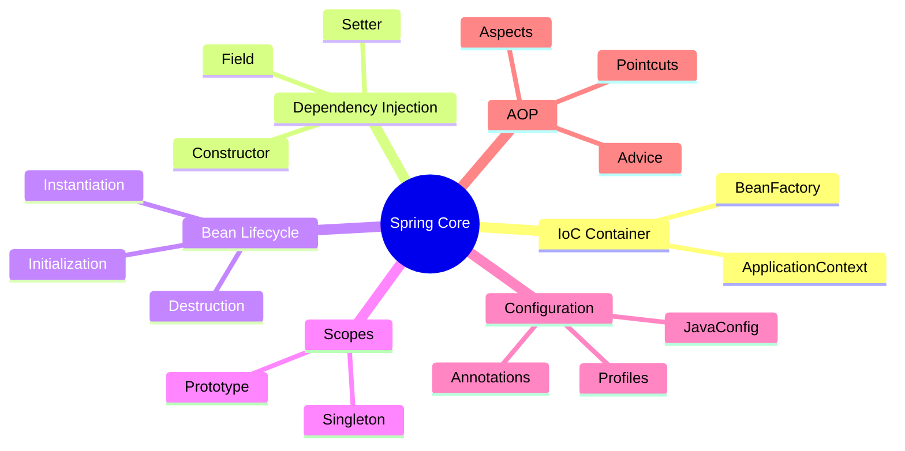

---

# 📦 SECȚIUNEA 1: IoC & DEPENDENCY INJECTION

## Q341-342: Inversion of Control

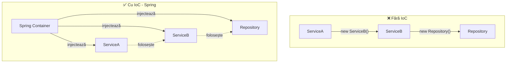

**IoC** = Inversiunea Controlului. În loc ca obiectele să-și creeze singure dependențele, un container extern (Spring) le creează și le furnizează.

**Beneficii:**
- Decuplare între clase
- Testare ușoară (mock-uri)
- Configurare flexibilă
- Schimbare implementări fără modificare cod

---

## Q343-344: Dependency Injection - Cele 3 Tipuri

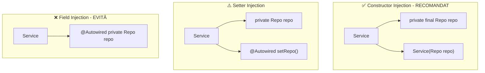

```java
// ✅ CONSTRUCTOR INJECTION - Best Practice
@Service
public class OrderService {
    
    private final OrderRepository repository;
    private final PaymentService paymentService;
    
    // @Autowired implicit din Spring 4.3+
    public OrderService(OrderRepository repository, 
                       PaymentService paymentService) {
        this.repository = repository;
        this.paymentService = paymentService;
    }
}

// Avantaje Constructor Injection:
// ✅ Imutabilitate (final)
// ✅ Dependențe explicite
// ✅ Nu poate exista obiect invalid
// ✅ Testare ușoară
// ✅ Detectează circular dependencies

// ❌ FIELD INJECTION - De evitat
@Service
public class BadService {
    @Autowired private Repository repo; // Ascuns, nu e final
}
```

---

## Q345-346: Spring Container

### BeanFactory vs ApplicationContext

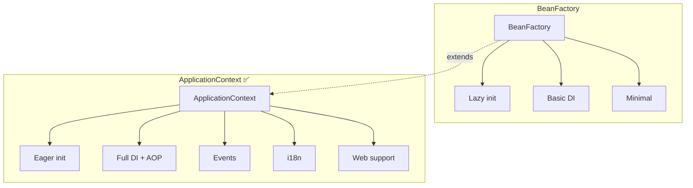

**ApplicationContext** este interfața preferată - include tot ce oferă BeanFactory plus funcționalități enterprise.

```java
// Creare context
ApplicationContext ctx = new AnnotationConfigApplicationContext(AppConfig.class);

// Obținere bean
UserService service = ctx.getBean(UserService.class);
```

---

## Q347-350: Stereotypes și Component Scanning

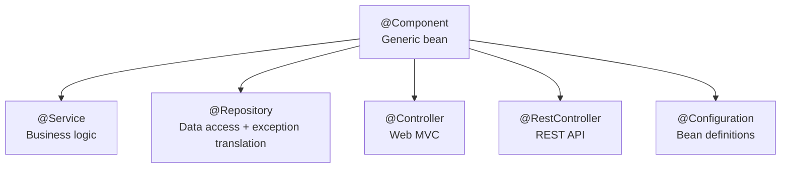

```java
@Repository
public class JpaUserRepository implements UserRepository {
    @PersistenceContext
    private EntityManager em;
    
    public Optional<User> findById(Long id) {
        return Optional.ofNullable(em.find(User.class, id));
    }
}

@Service
public class UserService {
    private final UserRepository repository;
    
    public UserService(UserRepository repository) {
        this.repository = repository;
    }
}

@RestController
@RequestMapping("/api/users")
public class UserController {
    private final UserService userService;
    
    public UserController(UserService userService) {
        this.userService = userService;
    }
}
```

---

## Q352-353: @Qualifier și @Primary

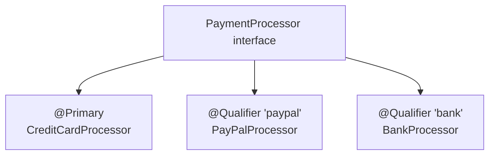

```java
@Service
@Primary  // Default când nu se specifică
public class CreditCardProcessor implements PaymentProcessor { }

@Service("paypal")
public class PayPalProcessor implements PaymentProcessor { }

@Service
public class CheckoutService {
    
    private final PaymentProcessor defaultProcessor;
    private final PaymentProcessor paypalProcessor;
    
    public CheckoutService(
            PaymentProcessor defaultProcessor,  // Primește @Primary
            @Qualifier("paypal") PaymentProcessor paypalProcessor) {
        this.defaultProcessor = defaultProcessor;
        this.paypalProcessor = paypalProcessor;
    }
}
```

---

# 📦 SECȚIUNEA 2: BEAN SCOPES & LIFECYCLE

## Q354-356: Bean Scopes

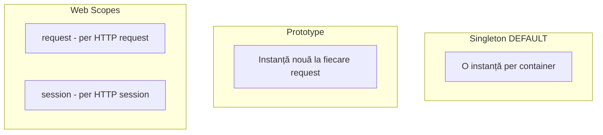

```java
@Component
@Scope("prototype")
public class PrototypeBean {
    private final UUID id = UUID.randomUUID();
}

// ⚠️ PROBLEMĂ: Prototype în Singleton
@Service
public class SingletonService {
    @Autowired
    private PrototypeBean proto; // ❌ Creat O SINGURĂ DATĂ!
}

// ✅ SOLUȚIE: ObjectProvider
@Service
public class SingletonService {
    @Autowired
    private ObjectProvider<PrototypeBean> protoProvider;
    
    public void doWork() {
        PrototypeBean fresh = protoProvider.getObject(); // Nou!
    }
}
```

---

## Q357-361: Bean Lifecycle

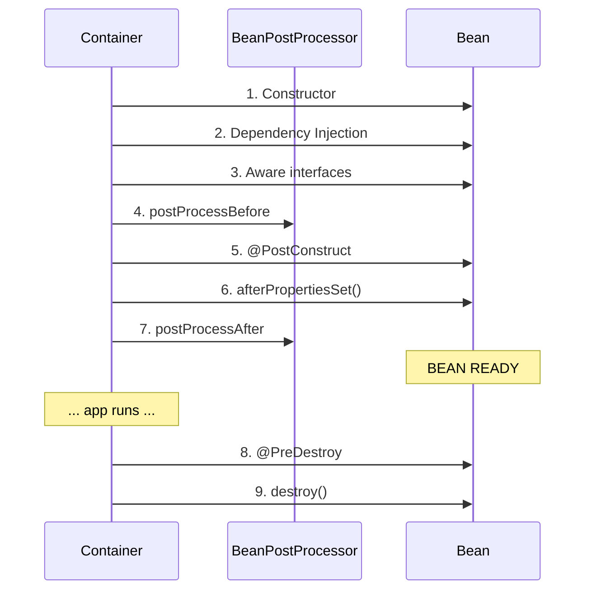

```java
@Component
public class MyBean implements InitializingBean, DisposableBean {
    
    @Autowired
    private SomeDependency dep;
    
    // 1. Constructor - dep e NULL aici!
    public MyBean() {
        System.out.println("1. Constructor");
    }
    
    // 5. @PostConstruct - RECOMANDAT pentru init
    @PostConstruct
    public void init() {
        System.out.println("5. @PostConstruct - dep available: " + dep);
    }
    
    // 6. InitializingBean
    @Override
    public void afterPropertiesSet() {
        System.out.println("6. afterPropertiesSet");
    }
    
    // 8. @PreDestroy - RECOMANDAT pentru cleanup
    @PreDestroy
    public void cleanup() {
        System.out.println("8. @PreDestroy");
    }
    
    // 9. DisposableBean
    @Override
    public void destroy() {
        System.out.println("9. destroy");
    }
}
```

---

# 📦 SECȚIUNEA 3: CONFIGURATION

## Q362-365: @Configuration și @Bean

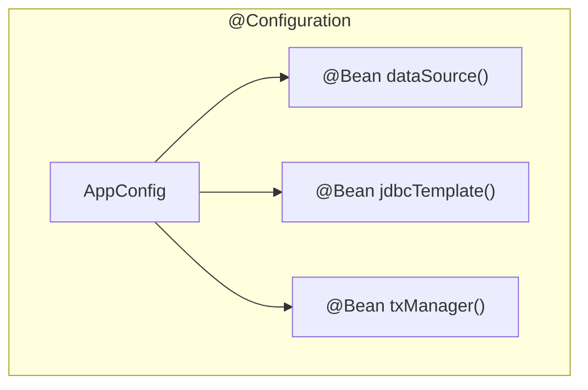

```java
@Configuration
public class DatabaseConfig {
    
    @Bean
    public DataSource dataSource() {
        HikariDataSource ds = new HikariDataSource();
        ds.setJdbcUrl("jdbc:postgresql://localhost/db");
        ds.setUsername("user");
        return ds;
    }
    
    @Bean
    public JdbcTemplate jdbcTemplate(DataSource dataSource) {
        return new JdbcTemplate(dataSource);
    }
}

// ⚠️ De ce @Configuration e PROXIAT?
@Configuration
public class ServiceConfig {
    
    @Bean
    public ServiceA serviceA() {
        return new ServiceA(serviceB()); // Apel intern
    }
    
    @Bean
    public ServiceB serviceB() {
        return new ServiceB();
    }
}
// Spring CGLIB proxy interceptează serviceB()
// și returnează ACELAȘI bean (singleton)
// Fără proxy: ar crea instanțe noi!
```

---

## Q381-386: Profiles și Properties

### Profiles

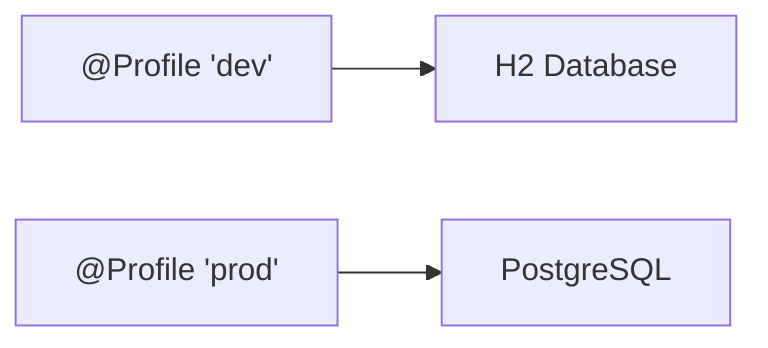

```java
@Configuration
@Profile("dev")
public class DevConfig {
    @Bean
    public DataSource dataSource() {
        return new EmbeddedDatabaseBuilder()
            .setType(EmbeddedDatabaseType.H2)
            .build();
    }
}

@Configuration
@Profile("prod")
public class ProdConfig {
    @Bean
    public DataSource dataSource() {
        HikariDataSource ds = new HikariDataSource();
        ds.setJdbcUrl("jdbc:postgresql://prod-server/db");
        return ds;
    }
}

// Activare: spring.profiles.active=dev
```

### @ConfigurationProperties

```yaml
# application.yml
app:
  mail:
    host: smtp.gmail.com
    port: 587
```

```java
@ConfigurationProperties(prefix = "app.mail")
@Validated
public class MailProperties {
    @NotBlank
    private String host;
    
    @Min(1) @Max(65535)
    private int port = 587;
    
    // getters + setters
}

@Configuration
@EnableConfigurationProperties(MailProperties.class)
public class MailConfig {
    
    @Bean
    public JavaMailSender mailSender(MailProperties props) {
        JavaMailSenderImpl sender = new JavaMailSenderImpl();
        sender.setHost(props.getHost());
        sender.setPort(props.getPort());
        return sender;
    }
}
```

---

# 📦 SECȚIUNEA 4: AOP

## Q367-374: Aspect-Oriented Programming

### Concepte AOP

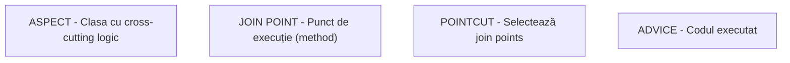

### Advice Types

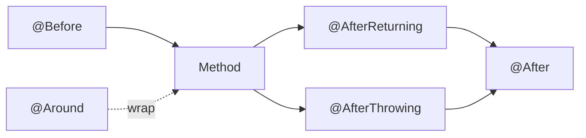

```java
@Aspect
@Component
@Slf4j
public class LoggingAspect {
    
    // Pointcut - toate metodele din service
    @Pointcut("execution(* com.example.service.*.*(..))")
    public void serviceLayer() {}
    
    // Before
    @Before("serviceLayer()")
    public void logBefore(JoinPoint jp) {
        log.info("Calling: {}", jp.getSignature().getName());
    }
    
    // Around - cel mai puternic
    @Around("serviceLayer()")
    public Object logAround(ProceedingJoinPoint pjp) throws Throwable {
        long start = System.currentTimeMillis();
        
        try {
            Object result = pjp.proceed(); // Execută metoda
            log.info("{} took {}ms", pjp.getSignature().getName(),
                System.currentTimeMillis() - start);
            return result;
        } catch (Exception e) {
            log.error("Exception in {}: {}", 
                pjp.getSignature().getName(), e.getMessage());
            throw e;
        }
    }
    
    // AfterReturning - acces la rezultat
    @AfterReturning(pointcut = "serviceLayer()", returning = "result")
    public void logResult(JoinPoint jp, Object result) {
        log.info("{} returned: {}", jp.getSignature().getName(), result);
    }
    
    // AfterThrowing - acces la excepție
    @AfterThrowing(pointcut = "serviceLayer()", throwing = "ex")
    public void logException(JoinPoint jp, Exception ex) {
        log.error("{} threw: {}", jp.getSignature().getName(), ex.getMessage());
    }
}
```

### Pointcut Expressions

```java
// Toate metodele din package
@Pointcut("execution(* com.example.service.*.*(..))")

// Metode cu anumită adnotare
@Pointcut("@annotation(Transactional)")

// Clase cu anumită adnotare
@Pointcut("@within(Service)")

// Bean după nume
@Pointcut("bean(*Service)")

// Combinații
@Pointcut("serviceLayer() && !@annotation(NoLog)")
```

### Spring AOP Proxies

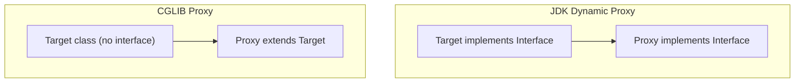

```java
// ⚠️ LIMITARE: Self-invocation NU trece prin proxy!
@Service
public class OrderService {
    
    @Transactional
    public void processOrder(Order order) {
        save(order);
        sendEmail(order); // ❌ this.sendEmail() - NO PROXY!
    }
    
    @Async
    public void sendEmail(Order order) {
        // Nu va fi async! E apel direct.
    }
}

// ✅ SOLUȚIE: Extrage în altă clasă
@Service
public class OrderService {
    private final EmailService emailService;
    
    @Transactional
    public void processOrder(Order order) {
        save(order);
        emailService.sendEmail(order); // ✅ Prin proxy!
    }
}
```

---

# 📦 SECȚIUNEA 5: ADVANCED

## Q375-377: Circular Dependencies

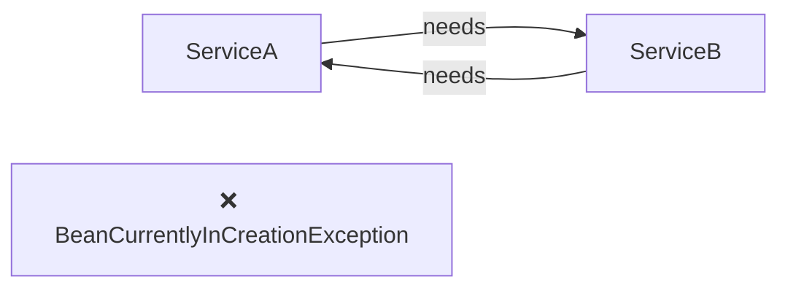

```java
// ❌ Circular dependency
@Service
public class ServiceA {
    public ServiceA(ServiceB b) { }
}

@Service
public class ServiceB {
    public ServiceB(ServiceA a) { }
}

// ✅ SOLUȚIE 1: Redesign (BEST)

// ✅ SOLUȚIE 2: @Lazy
@Service
public class ServiceA {
    public ServiceA(@Lazy ServiceB b) { }
}

// ✅ SOLUȚIE 3: ObjectProvider
@Service
public class ServiceA {
    private final ObjectProvider<ServiceB> bProvider;
    
    public ServiceA(ObjectProvider<ServiceB> bProvider) {
        this.bProvider = bProvider;
    }
}
```

## Q391-392: Application Events

```java
// Event
public class OrderCreatedEvent {
    private final Order order;
    public OrderCreatedEvent(Order order) { this.order = order; }
    public Order getOrder() { return order; }
}

// Publisher
@Service
public class OrderService {
    @Autowired
    private ApplicationEventPublisher publisher;
    
    public void createOrder(Order order) {
        orderRepo.save(order);
        publisher.publishEvent(new OrderCreatedEvent(order));
    }
}

// Listener
@Component
public class OrderListener {
    
    @EventListener
    public void onOrderCreated(OrderCreatedEvent event) {
        log.info("Order created: {}", event.getOrder().getId());
    }
    
    @Async
    @EventListener
    public void sendEmailAsync(OrderCreatedEvent event) {
        emailService.send(event.getOrder());
    }
    
    @TransactionalEventListener(phase = AFTER_COMMIT)
    public void afterCommit(OrderCreatedEvent event) {
        // După commit tranzacție
    }
}
```

## Q393-394: Conditional Beans

```java
@Bean
@ConditionalOnProperty(name = "cache.enabled", havingValue = "true")
public CacheManager cacheManager() {
    return new ConcurrentMapCacheManager();
}

@Bean
@ConditionalOnClass(DataSource.class)
public JdbcTemplate jdbcTemplate() { }

@Bean
@ConditionalOnMissingBean
public ObjectMapper objectMapper() {
    return new ObjectMapper(); // Default, poate fi suprascris
}
```

---

# 🎯 CHEAT SHEET SPRING CORE

## Injection Best Practices

| Tip | Când | Exemplu |
|-----|------|---------|
| **Constructor** ✅ | Întotdeauna (default) | `public Service(Repo repo)` |
| **Setter** | Dependențe opționale | `@Autowired(required=false)` |
| **Field** ❌ | Niciodată în producție | Doar pentru teste rapide |

## Bean Scopes

| Scope | Instanțe | Când |
|-------|----------|------|
| **singleton** | 1 per container | Default, stateless |
| **prototype** | N per request | Stateful, short-lived |
| **request** | 1 per HTTP request | Web, request data |
| **session** | 1 per HTTP session | Web, user data |

## AOP Quick Reference

| Advice | Execuție | Use Case |
|--------|----------|----------|
| `@Before` | Înainte | Logging, security |
| `@After` | După (always) | Cleanup |
| `@AfterReturning` | După succes | Audit result |
| `@AfterThrowing` | După excepție | Error logging |
| `@Around` | Wrap | Timing, transactions |

---

> 💡 **Regula de Aur Spring:**  
> *"Preferă Constructor Injection, evită Field Injection, și ține minte că self-invocation nu trece prin proxy!"*
