# Capitolul 6 – Spring Boot
## Q421–Q500 — Nivel Senior

> 📚 Scop: Interviuri Senior / Lead / Staff
> 💾 Encoding: UTF-8

---

## 🎯 HARTA MENTALĂ

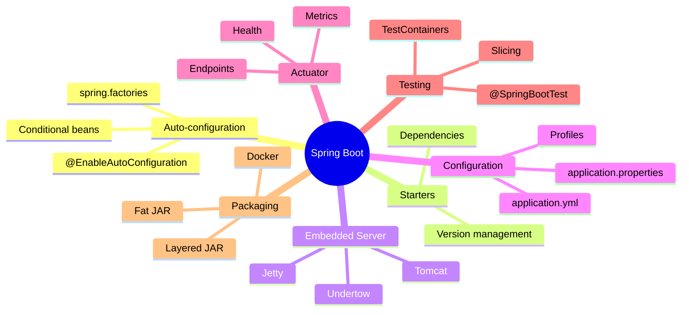

---

# 📦 SECȚIUNEA 1: SPRING BOOT FUNDAMENTALS

## Q421-422: Ce este Spring Boot?

```mermaid
graph TB
    subgraph "Spring Framework Classic"
        SF[Spring Framework]
        SF --> XML["XML Configuration"]
        SF --> MANUAL["Manual dependency management"]
        SF --> SERVER["External server deploy"]
        SF --> BOILER["Boilerplate code"]
    end
    
    subgraph "Spring Boot"
        SB[Spring Boot]
        SB --> AUTO["Auto-configuration ✅"]
        SB --> STARTER["Starter dependencies ✅"]
        SB --> EMBED["Embedded server ✅"]
        SB --> ZERO["Zero XML ✅"]
    end
    
    SF -->|"simplificat de"| SB
```

**Spring Boot** = Spring Framework + Auto-configuration + Embedded Server + Opinionated Defaults

**Problemele rezolvate:**
- ❌ Configurare excesivă XML/Java
- ❌ Dependency hell (versiuni incompatibile)
- ❌ Deploy complicat pe servere externe
- ❌ Boilerplate repetitiv

**Principiul cheie:** *Convention over Configuration*

---

## Q423-424: Auto-configuration

```mermaid
graph TB
    subgraph "Cum funcționează Auto-config"
        CP[Classpath scanning]
        CP --> COND{Conditional checks}
        COND -->|"@ConditionalOnClass"| C1[Class exists?]
        COND -->|"@ConditionalOnProperty"| C2[Property set?]
        COND -->|"@ConditionalOnMissingBean"| C3[Bean missing?]
        C1 --> AUTO[Auto-configure bean]
        C2 --> AUTO
        C3 --> AUTO
    end
```

```java
// Exemplu: DataSource Auto-configuration (simplificat)
@Configuration
@ConditionalOnClass(DataSource.class)  // Dacă DataSource e pe classpath
@ConditionalOnProperty(prefix = "spring.datasource", name = "url")
@EnableConfigurationProperties(DataSourceProperties.class)
public class DataSourceAutoConfiguration {
    
    @Bean
    @ConditionalOnMissingBean  // Doar dacă user-ul n-a definit alt DataSource
    public DataSource dataSource(DataSourceProperties props) {
        return DataSourceBuilder.create()
            .url(props.getUrl())
            .username(props.getUsername())
            .password(props.getPassword())
            .build();
    }
}

// Tu doar adaugi în application.properties:
// spring.datasource.url=jdbc:postgresql://localhost/mydb
// spring.datasource.username=user
// spring.datasource.password=pass
// ... și Spring Boot configurează TOTUL automat!
```

---

## Q425: @SpringBootApplication

```mermaid
graph TB
    SBA["@SpringBootApplication"]
    SBA --> CONF["@Configuration<br/>Clasă de configurare"]
    SBA --> EAC["@EnableAutoConfiguration<br/>Activează auto-config"]
    SBA --> CS["@ComponentScan<br/>Scanează package-ul curent"]
```

```java
@SpringBootApplication  // = @Configuration + @EnableAutoConfiguration + @ComponentScan
public class MyApplication {
    
    public static void main(String[] args) {
        // Pornește aplicația
        SpringApplication.run(MyApplication.class, args);
    }
}

// Echivalent cu:
@Configuration
@EnableAutoConfiguration
@ComponentScan(basePackages = "com.example.myapp")
public class MyApplication { }
```

---

## Q426: spring.factories și AutoConfiguration.imports

```mermaid
graph LR
    subgraph "Spring Boot 2.x"
        SF["META-INF/spring.factories"]
        SF --> LIST["Lista auto-configurations"]
    end
    
    subgraph "Spring Boot 3.x"
        AI["META-INF/spring/org.springframework.boot.autoconfigure.AutoConfiguration.imports"]
        AI --> LIST3["O clasă per linie"]
    end
```

```properties
# META-INF/spring.factories (Boot 2.x)
org.springframework.boot.autoconfigure.EnableAutoConfiguration=\
  com.example.MyAutoConfiguration,\
  com.example.AnotherAutoConfiguration

# META-INF/spring/...AutoConfiguration.imports (Boot 3.x)
com.example.MyAutoConfiguration
com.example.AnotherAutoConfiguration
```

---

## Q428-429: Starters

```mermaid
graph TB
    subgraph "Starter = Bundle de Dependențe"
        STARTER["spring-boot-starter-web"]
        STARTER --> DEP1["spring-web"]
        STARTER --> DEP2["spring-webmvc"]
        STARTER --> DEP3["jackson"]
        STARTER --> DEP4["tomcat"]
        STARTER --> DEP5["validation"]
    end
```

**Starters populare:**

| Starter | Include |
|---------|---------|
| `spring-boot-starter-web` | Spring MVC, Tomcat, Jackson |
| `spring-boot-starter-data-jpa` | Spring Data JPA, Hibernate |
| `spring-boot-starter-security` | Spring Security |
| `spring-boot-starter-test` | JUnit, Mockito, AssertJ |
| `spring-boot-starter-actuator` | Monitoring endpoints |
| `spring-boot-starter-validation` | Bean Validation (Hibernate Validator) |

```xml
<!-- pom.xml - doar adaugi starter-ul -->
<dependency>
    <groupId>org.springframework.boot</groupId>
    <artifactId>spring-boot-starter-web</artifactId>
    <!-- Versiunea vine din parent! -->
</dependency>
```

---

## Q430-431: Embedded Server

```mermaid
graph TB
    subgraph "Traditional Deployment"
        WAR[WAR file] --> EXT[External Tomcat/JBoss]
        EXT --> RUN[Application runs]
    end
    
    subgraph "Spring Boot Embedded"
        JAR[Executable JAR]
        JAR --> EMB[Embedded Tomcat]
        EMB --> APP[Application]
        RUN2["java -jar app.jar ✅"]
    end
```

```java
// Schimbă serverul embedded
// În pom.xml:

// Exclude Tomcat, adaugă Jetty
<dependency>
    <groupId>org.springframework.boot</groupId>
    <artifactId>spring-boot-starter-web</artifactId>
    <exclusions>
        <exclusion>
            <groupId>org.springframework.boot</groupId>
            <artifactId>spring-boot-starter-tomcat</artifactId>
        </exclusion>
    </exclusions>
</dependency>
<dependency>
    <groupId>org.springframework.boot</groupId>
    <artifactId>spring-boot-starter-jetty</artifactId>
</dependency>
```

```properties
# application.properties - configurare server
server.port=8080
server.servlet.context-path=/api
server.tomcat.threads.max=200
server.tomcat.connection-timeout=5s
```

---

# 📦 SECȚIUNEA 2: CONFIGURATION

## Q436-437: application.properties vs application.yml

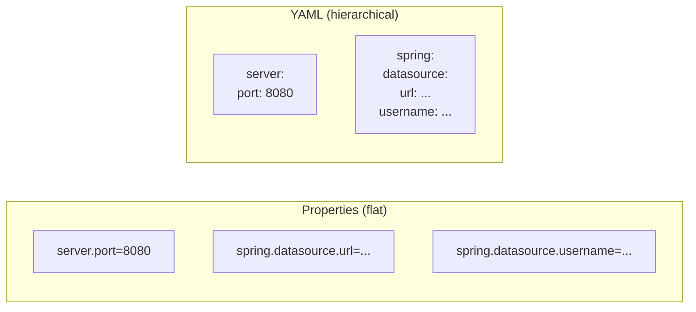

```properties
# application.properties
server.port=8080
spring.datasource.url=jdbc:postgresql://localhost/db
spring.datasource.username=user
spring.datasource.password=secret
spring.jpa.hibernate.ddl-auto=validate
spring.jpa.show-sql=true
```

```yaml
# application.yml - mai expresiv pentru structuri complexe
server:
  port: 8080

spring:
  datasource:
    url: jdbc:postgresql://localhost/db
    username: user
    password: secret
  jpa:
    hibernate:
      ddl-auto: validate
    show-sql: true
```

---

## Q437: Ordinea de Încărcare a Configurațiilor

```mermaid
graph TB
    subgraph "Prioritate (de sus în jos)"
        P1["1. Command line args<br/>--server.port=9090"]
        P2["2. SPRING_APPLICATION_JSON"]
        P3["3. ServletConfig/ServletContext params"]
        P4["4. JNDI"]
        P5["5. Java System properties<br/>-Dserver.port=9090"]
        P6["6. OS Environment variables<br/>SERVER_PORT=9090"]
        P7["7. application-{profile}.properties"]
        P8["8. application.properties"]
        P9["9. @PropertySource"]
        P10["10. Default properties"]
    end
    
    P1 --> P2 --> P3 --> P4 --> P5 --> P6 --> P7 --> P8 --> P9 --> P10
```

---

## Q438-439: Profiles

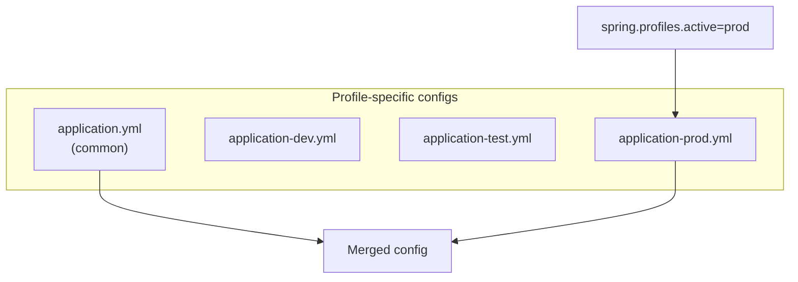

```yaml
# application.yml (common pentru toate)
spring:
  application:
    name: my-service
logging:
  level:
    root: INFO

---
# application-dev.yml
spring:
  datasource:
    url: jdbc:h2:mem:testdb
  jpa:
    show-sql: true
logging:
  level:
    com.example: DEBUG

---
# application-prod.yml
spring:
  datasource:
    url: jdbc:postgresql://prod-server/db
    hikari:
      maximum-pool-size: 20
logging:
  level:
    com.example: WARN
```

```bash
# Activare profile
java -jar app.jar --spring.profiles.active=prod

# Sau environment variable
export SPRING_PROFILES_ACTIVE=prod

# Sau în application.properties
spring.profiles.active=prod
```

---

## Q440: @ConfigurationProperties (Type-Safe)

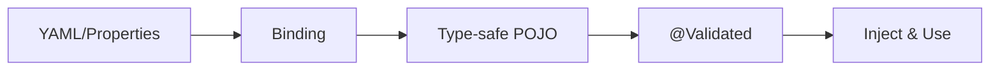

```yaml
# application.yml
app:
  security:
    jwt:
      secret: mySecretKey123
      expiration: 3600
      issuer: my-app
    cors:
      allowed-origins:
        - http://localhost:3000
        - https://myapp.com
      allowed-methods:
        - GET
        - POST
        - PUT
```

```java
@ConfigurationProperties(prefix = "app.security")
@Validated
public class SecurityProperties {
    
    @Valid
    private Jwt jwt = new Jwt();
    
    @Valid
    private Cors cors = new Cors();
    
    public static class Jwt {
        @NotBlank
        private String secret;
        
        @Min(60)
        private int expiration = 3600;
        
        private String issuer;
        
        // getters + setters
    }
    
    public static class Cors {
        private List<String> allowedOrigins = new ArrayList<>();
        private List<String> allowedMethods = new ArrayList<>();
        
        // getters + setters
    }
    
    // getters + setters
}

// Activare
@Configuration
@EnableConfigurationProperties(SecurityProperties.class)
public class SecurityConfig {
    
    @Bean
    public JwtService jwtService(SecurityProperties props) {
        return new JwtService(
            props.getJwt().getSecret(),
            props.getJwt().getExpiration()
        );
    }
}
```

---

# 📦 SECȚIUNEA 3: ACTUATOR

## Q441-444: Spring Boot Actuator

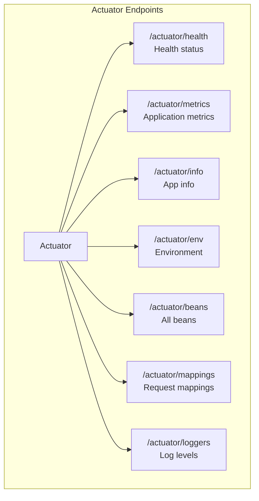

```xml
<!-- Adaugă actuator -->
<dependency>
    <groupId>org.springframework.boot</groupId>
    <artifactId>spring-boot-starter-actuator</artifactId>
</dependency>
```

```yaml
# application.yml
management:
  endpoints:
    web:
      exposure:
        include: health,metrics,info,env,loggers  # sau "*" pentru toate
      base-path: /actuator
  endpoint:
    health:
      show-details: when_authorized  # always, never, when_authorized
      show-components: always
  info:
    env:
      enabled: true

# Info endpoint content
info:
  app:
    name: ${spring.application.name}
    version: 1.0.0
    description: My awesome service
```

---

## Q443-444: Health Indicators

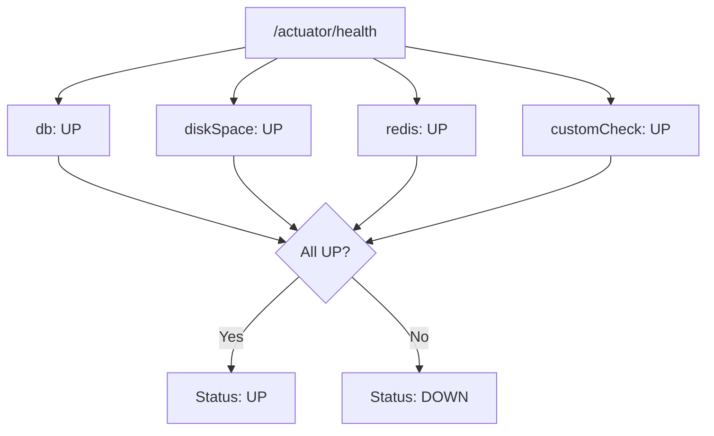

```java
// Custom Health Indicator
@Component
public class ExternalServiceHealthIndicator implements HealthIndicator {
    
    private final ExternalServiceClient client;
    
    public ExternalServiceHealthIndicator(ExternalServiceClient client) {
        this.client = client;
    }
    
    @Override
    public Health health() {
        try {
            boolean isHealthy = client.ping();
            if (isHealthy) {
                return Health.up()
                    .withDetail("service", "external-api")
                    .withDetail("status", "reachable")
                    .build();
            } else {
                return Health.down()
                    .withDetail("service", "external-api")
                    .withDetail("error", "not responding")
                    .build();
            }
        } catch (Exception e) {
            return Health.down(e)
                .withDetail("service", "external-api")
                .build();
        }
    }
}
```

### Readiness vs Liveness

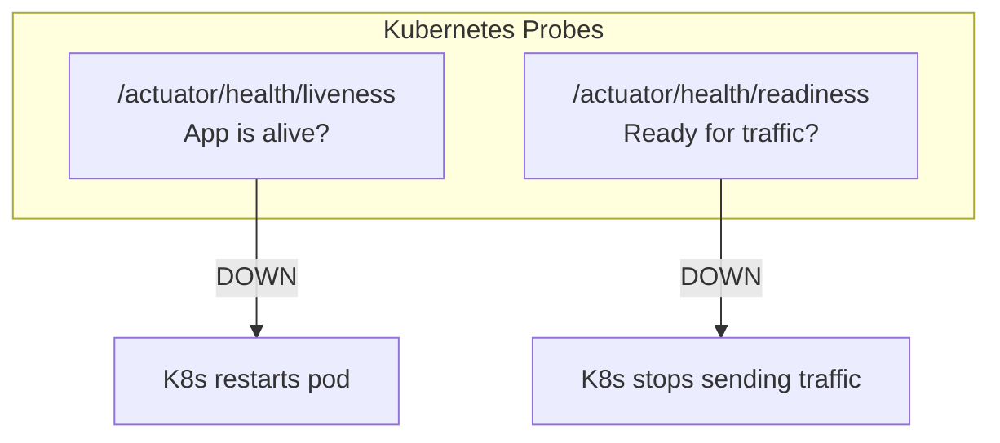

```yaml
# Kubernetes probes config
management:
  endpoint:
    health:
      probes:
        enabled: true
  health:
    livenessstate:
      enabled: true
    readinessstate:
      enabled: true
```

---

## Q445: Micrometer Metrics

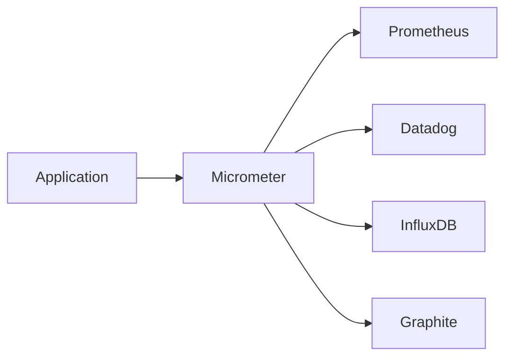

```java
// Custom metrics
@Service
public class OrderService {
    
    private final Counter orderCounter;
    private final Timer orderTimer;
    
    public OrderService(MeterRegistry registry) {
        this.orderCounter = Counter.builder("orders.created")
            .description("Number of orders created")
            .tag("type", "total")
            .register(registry);
            
        this.orderTimer = Timer.builder("orders.processing.time")
            .description("Order processing time")
            .register(registry);
    }
    
    public Order createOrder(OrderRequest request) {
        return orderTimer.record(() -> {
            Order order = processOrder(request);
            orderCounter.increment();
            return order;
        });
    }
}
```

```yaml
# Prometheus export
management:
  metrics:
    export:
      prometheus:
        enabled: true
    tags:
      application: ${spring.application.name}
      environment: ${spring.profiles.active:default}
```

---

# 📦 SECȚIUNEA 4: TESTING

## Q469-473: Spring Boot Testing

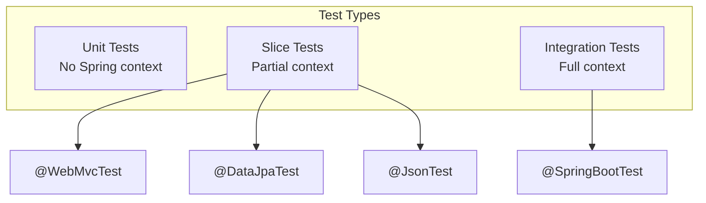

### @SpringBootTest

```java
@SpringBootTest  // Încarcă contextul complet
@AutoConfigureMockMvc
class OrderControllerIntegrationTest {
    
    @Autowired
    private MockMvc mockMvc;
    
    @Autowired
    private OrderRepository orderRepository;
    
    @Test
    void shouldCreateOrder() throws Exception {
        String json = """
            {
                "customerId": 1,
                "items": [{"productId": 100, "quantity": 2}]
            }
            """;
        
        mockMvc.perform(post("/api/orders")
                .contentType(MediaType.APPLICATION_JSON)
                .content(json))
            .andExpect(status().isCreated())
            .andExpect(jsonPath("$.id").exists())
            .andExpect(jsonPath("$.status").value("PENDING"));
    }
}
```

### @WebMvcTest (Slice Test)

```java
@WebMvcTest(OrderController.class)  // Doar web layer
class OrderControllerTest {
    
    @Autowired
    private MockMvc mockMvc;
    
    @MockBean  // Mock dependencies
    private OrderService orderService;
    
    @Test
    void shouldReturnOrder() throws Exception {
        Order order = new Order(1L, "COMPLETED");
        when(orderService.findById(1L)).thenReturn(Optional.of(order));
        
        mockMvc.perform(get("/api/orders/1"))
            .andExpect(status().isOk())
            .andExpect(jsonPath("$.id").value(1))
            .andExpect(jsonPath("$.status").value("COMPLETED"));
    }
}
```

### @DataJpaTest (Slice Test)

```java
@DataJpaTest  // Doar JPA layer, H2 by default
class OrderRepositoryTest {
    
    @Autowired
    private OrderRepository orderRepository;
    
    @Autowired
    private TestEntityManager entityManager;
    
    @Test
    void shouldFindOrdersByStatus() {
        Order order1 = new Order("PENDING");
        Order order2 = new Order("COMPLETED");
        entityManager.persist(order1);
        entityManager.persist(order2);
        entityManager.flush();
        
        List<Order> pending = orderRepository.findByStatus("PENDING");
        
        assertThat(pending).hasSize(1);
        assertThat(pending.get(0).getStatus()).isEqualTo("PENDING");
    }
}
```

### @MockBean vs @SpyBean

```java
@SpringBootTest
class ServiceTest {
    
    @MockBean  // Înlocuiește complet bean-ul
    private ExternalApiClient apiClient;
    
    @SpyBean  // Păstrează implementarea, dar permite stubbing
    private OrderService orderService;
    
    @Test
    void testWithMock() {
        when(apiClient.call()).thenReturn("mocked");
        // apiClient e complet mock-uit
    }
    
    @Test
    void testWithSpy() {
        doReturn("stubbed").when(orderService).specialMethod();
        // Restul metodelor funcționează normal
    }
}
```

### Testcontainers

```java
@SpringBootTest
@Testcontainers
class OrderRepositoryIntegrationTest {
    
    @Container
    static PostgreSQLContainer<?> postgres = new PostgreSQLContainer<>("postgres:15")
        .withDatabaseName("testdb")
        .withUsername("test")
        .withPassword("test");
    
    @DynamicPropertySource
    static void configureProperties(DynamicPropertyRegistry registry) {
        registry.add("spring.datasource.url", postgres::getJdbcUrl);
        registry.add("spring.datasource.username", postgres::getUsername);
        registry.add("spring.datasource.password", postgres::getPassword);
    }
    
    @Autowired
    private OrderRepository orderRepository;
    
    @Test
    void shouldPersistOrder() {
        Order order = new Order("NEW");
        Order saved = orderRepository.save(order);
        
        assertThat(saved.getId()).isNotNull();
    }
}
```

---

# 📦 SECȚIUNEA 5: PACKAGING & DEPLOYMENT

## Q449-451: Fat JAR

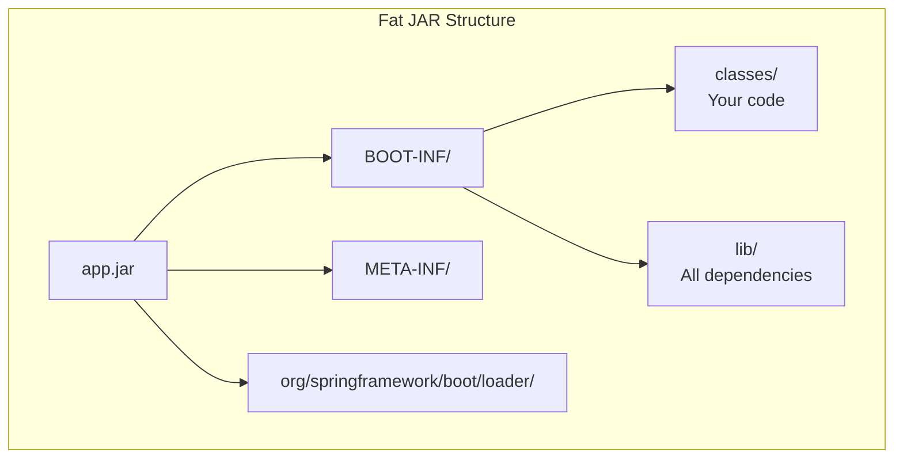

```bash
# Build
./mvnw clean package

# Run
java -jar target/myapp-1.0.0.jar

# Run with profile
java -jar target/myapp-1.0.0.jar --spring.profiles.active=prod

# Run with custom port
java -jar target/myapp-1.0.0.jar --server.port=9090
```

---

## Q463-464: Layered JARs & Docker

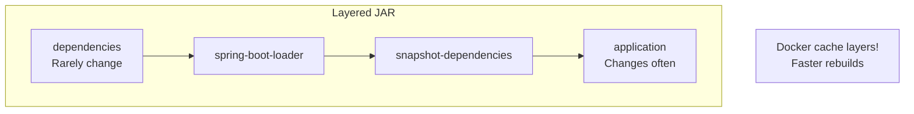

```dockerfile
# Dockerfile optimizat cu layered JAR
FROM eclipse-temurin:17-jre as builder
WORKDIR /app
COPY target/*.jar app.jar
RUN java -Djarmode=layertools -jar app.jar extract

FROM eclipse-temurin:17-jre
WORKDIR /app
COPY --from=builder /app/dependencies/ ./
COPY --from=builder /app/spring-boot-loader/ ./
COPY --from=builder /app/snapshot-dependencies/ ./
COPY --from=builder /app/application/ ./

EXPOSE 8080
ENTRYPOINT ["java", "org.springframework.boot.loader.JarLauncher"]
```

```yaml
# docker-compose.yml
version: '3.8'
services:
  app:
    build: .
    ports:
      - "8080:8080"
    environment:
      - SPRING_PROFILES_ACTIVE=prod
      - SPRING_DATASOURCE_URL=jdbc:postgresql://db:5432/mydb
    depends_on:
      - db
  
  db:
    image: postgres:15
    environment:
      POSTGRES_DB: mydb
      POSTGRES_USER: user
      POSTGRES_PASSWORD: pass
```

---

## Q492-493: Buildpacks (Fără Dockerfile!)

```bash
# Cu Maven
./mvnw spring-boot:build-image -Dspring-boot.build-image.imageName=myapp:latest

# Cu Gradle
./gradlew bootBuildImage --imageName=myapp:latest

# Rezultat: Container image gata de folosit!
docker run -p 8080:8080 myapp:latest
```

---

## Q460-461: Graceful Shutdown

```yaml
# application.yml
server:
  shutdown: graceful  # Așteaptă request-urile în curs

spring:
  lifecycle:
    timeout-per-shutdown-phase: 30s  # Max 30s pentru shutdown
```

```java
@Component
public class GracefulShutdownHandler implements DisposableBean {
    
    private final ExecutorService executor;
    
    @Override
    public void destroy() throws Exception {
        log.info("Shutting down gracefully...");
        executor.shutdown();
        if (!executor.awaitTermination(30, TimeUnit.SECONDS)) {
            executor.shutdownNow();
        }
        log.info("Shutdown complete");
    }
}
```

---

## Q448: Dezactivare Auto-configuration

```java
// În @SpringBootApplication
@SpringBootApplication(exclude = {
    DataSourceAutoConfiguration.class,
    SecurityAutoConfiguration.class
})
public class MyApplication { }

// Sau în properties
spring.autoconfigure.exclude=\
  org.springframework.boot.autoconfigure.jdbc.DataSourceAutoConfiguration,\
  org.springframework.boot.autoconfigure.security.servlet.SecurityAutoConfiguration
```

---

# 🎯 CHEAT SHEET SPRING BOOT

## Comenzi Utile

```bash
# Run cu DevTools (hot reload)
./mvnw spring-boot:run

# Build JAR
./mvnw clean package -DskipTests

# Run JAR
java -jar target/app.jar --spring.profiles.active=prod

# Debug mode
java -jar app.jar --debug

# Actuator info
curl localhost:8080/actuator/health
curl localhost:8080/actuator/info
curl localhost:8080/actuator/metrics
```

## Properties Frecvente

```properties
# Server
server.port=8080
server.servlet.context-path=/api

# Database
spring.datasource.url=jdbc:postgresql://localhost/db
spring.datasource.username=user
spring.datasource.password=pass
spring.jpa.hibernate.ddl-auto=validate

# Logging
logging.level.root=INFO
logging.level.com.example=DEBUG
logging.file.name=app.log

# Actuator
management.endpoints.web.exposure.include=health,info,metrics
management.endpoint.health.show-details=always
```

## Test Annotations

| Annotation | Context | Use Case |
|------------|---------|----------|
| `@SpringBootTest` | Full | Integration tests |
| `@WebMvcTest` | Web only | Controller tests |
| `@DataJpaTest` | JPA only | Repository tests |
| `@JsonTest` | JSON only | Serialization tests |
| `@MockBean` | N/A | Replace bean with mock |
| `@SpyBean` | N/A | Partial mock |

## Conditional Annotations

| Annotation | Condition |
|------------|-----------|
| `@ConditionalOnProperty` | Property exists/matches |
| `@ConditionalOnClass` | Class on classpath |
| `@ConditionalOnMissingBean` | Bean doesn't exist |
| `@ConditionalOnBean` | Bean exists |
| `@ConditionalOnWebApplication` | Is web app |
| `@ConditionalOnExpression` | SpEL expression |

---

> 💡 **Regula de Aur Spring Boot:**  
> *"Înțelege ce face auto-configuration înainte să o suprascrii. Folosește --debug pentru a vedea ce s-a configurat și ce nu."*
